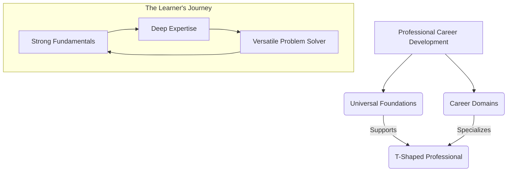
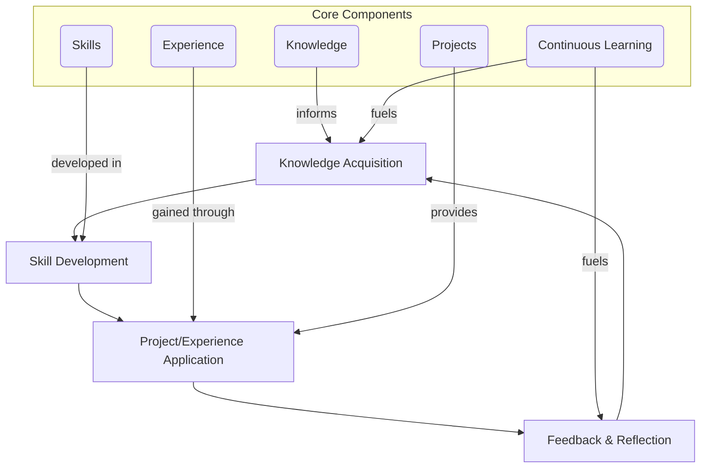

# Professional Career Development

# Professional Career Development

Welcome to KnowHub's Professional Career Development pathway – your master orientation page for lifelong learning and growth. In an ever-evolving world, static careers are a relic of the past. This page serves as your starting point, guiding you through the fundamental principles and structure of our comprehensive learning system designed to transform you from a beginner to a leading professional in your chosen field and beyond.

## Introduction

Professional Career Development is not merely about landing a job; it's a continuous journey of skill acquisition, knowledge enrichment, and strategic advancement. This KnowHub root page lays the groundwork for understanding how to navigate the complexities of modern professional life. It provides the architectural blueprint for our entire learning system, emphasizing the synergy between foundational capabilities and specialized expertise, and outlining a philosophy of growth that lasts a lifetime.

## Why Professional Career Development Matters

The pace of change in today's professional landscape is unprecedented. Industries are disrupted, technologies emerge, and job roles transform with increasing frequency. In this dynamic environment, relying solely on initial qualifications is a path to obsolescence. Professional career development ensures:

*   **Relevance:** Staying current with industry trends and technological advancements.
*   **Resilience:** Adapting to change and navigating career shifts with confidence.
*   **Opportunity:** Unlocking new possibilities for advancement, innovation, and leadership.
*   **Fulfillment:** Pursuing intellectual curiosity and personal growth throughout your working life.

It's an investment in your future, securing your position as a valuable asset in any organization or entrepreneurial venture.

## The Modern Learning Landscape

Today's professional world demands more than just rote knowledge; it requires agility, critical thinking, problem-solving, and continuous learning. The traditional model of education (learn once, work forever) has been superseded by a dynamic paradigm where learning is integrated into daily life and work.

Key characteristics of the modern learning landscape include:

*   **Rapid Obsolescence:** Skills acquired yesterday may be outdated tomorrow.
*   **Interdisciplinary Demands:** Complex problems often require solutions that span multiple domains.
*   **Global Connectivity:** Collaboration and competition transcend geographical boundaries.
*   **Data-Driven Decision Making:** Proficiency in data interpretation and application is crucial.
*   **Human-AI Collaboration:** The ability to work effectively alongside artificial intelligence is becoming a core competency.

Success in this landscape hinges on a proactive approach to skill development and knowledge acquisition.

## Universal Foundations Overview

Universal Foundations represent the bedrock of all professional success, regardless of industry or role. These are the evergreen skills, mindsets, and core knowledge areas that provide stability and adaptability throughout your career. They are **transferable** and amplify the impact of any specialized knowledge you acquire.

Think of them as the operating system for your professional brain.

Our Universal Foundations module covers critical areas such as:

*   **Critical Thinking & Problem Solving:** Deconstructing complex issues and devising effective solutions.
*   **Communication & Collaboration:** Articulating ideas clearly and working effectively with diverse teams.
*   **Digital Literacy:** Proficiency with essential tools and understanding digital ethics.
*   **Emotional Intelligence:** Managing emotions, empathizing with others, and building strong relationships.
*   **Continuous Learning & Adaptability:** Cultivating a growth mindset and embracing new challenges.

Mastering these foundations equips you with the cognitive tools to excel in any domain and forms the essential platform for deeper specialization.

## Career Domains Overview

Career Domains represent the specialized knowledge, skills, and practices unique to specific industries, professions, or functional areas. While Universal Foundations provide the width, Career Domains provide the depth that defines your specific expertise and market value within a niche.

Examples of Career Domains might include:

*   Software Engineering
*   Digital Marketing
*   Financial Analysis
*   Project Management
*   Biotechnology Research
*   Supply Chain Logistics

Each domain has its own set of technical skills, industry-specific jargon, best practices, and evolving trends. Deep dives into these areas allow you to become an expert, contribute meaningfully to specific challenges, and command respect in your chosen field.

## Relationship Between Foundations and Specialization

The true power of this learning system lies in the symbiotic relationship between Universal Foundations and Career Domains. Neither is sufficient on its own for sustained professional excellence.

*   **Foundations as the Base:** Your Universal Foundations provide the mental infrastructure. Without strong critical thinking, communication, or adaptability, even the most profound specialized knowledge may be ineffective or quickly outdated.
*   **Specialization as the Edge:** Career Domains allow you to apply those foundational skills to specific problems, creating tangible value. They give you a competitive edge and define your professional identity.
*   **The T-Shaped Professional:** The ideal outcome is a "T-shaped" professional – broad in foundational skills (the horizontal bar of the T) and deep in one or more specialized areas (the vertical bar). This blend makes you both adaptable and highly valuable.

## Beginner-to-Professional Journey

The journey from a novice to an expert is iterative and continuous. It involves a dynamic interplay of acquiring knowledge, developing skills, gaining experience, executing projects, and engaging in perpetual learning.

1.  **Knowledge Acquisition:** Start by learning fundamental theories, concepts, and best practices. This is often through formal courses, reading, and structured learning paths.
2.  **Skill Development:** Translate knowledge into practical abilities through practice, exercises, and deliberate application.
3.  **Project/Experience Application:** Apply developed skills and knowledge to real-world problems through projects, internships, or job roles. This is where theory meets reality.
4.  **Feedback & Reflection:** Analyze outcomes, seek feedback, identify areas for improvement, and understand failures as learning opportunities.
5.  **Continuous Learning:** Use insights from reflection to refine existing knowledge, acquire new knowledge, and further develop skills, restarting the cycle.

This cyclical process ensures that learning is not just theoretical but deeply embedded in practical application and continuous improvement.

## Lifelong Learning Philosophy

Lifelong learning is not an obligation; it's a strategic imperative and a mindset. It's the commitment to actively and voluntarily pursue knowledge, skills, and personal growth throughout your entire life.

Key tenets of this philosophy include:

*   **Curiosity:** Maintaining an inquisitive mind, always asking "why?" and "how can I improve?"
*   **Adaptability:** Embracing change as an opportunity, rather than a threat.
*   **Growth Mindset:** Believing that your abilities and intelligence can be developed through dedication and hard work.
*   **Proactivity:** Taking initiative in your learning, rather than waiting for opportunities to arise.
*   **Humility:** Recognizing that there is always more to learn, regardless of your current expertise.

Adopting this philosophy transforms career development from a series of tasks into an enriching, continuous journey of self-mastery and contribution.

## Knowledge Compounding

One of the most powerful aspects of continuous learning is the principle of knowledge compounding. Just like financial investments, consistent and incremental learning efforts accumulate and grow exponentially over time.

*   **Building Blocks:** Each new piece of knowledge or skill builds upon previous ones, making it easier to grasp complex concepts and integrate new information.
*   **Cross-Pollination:** Learning in one domain can often provide unexpected insights or solutions in another, creating innovative connections.
*   **Accelerated Learning:** As your foundational knowledge expands, your ability to learn new things rapidly improves, creating a virtuous cycle.
*   **Network Effects:** Deeper knowledge and broader skills enhance your ability to connect with others, share insights, and collaborate on more complex projects, further amplifying your learning.

The initial stages of learning might feel slow, but with consistent effort, the returns on your intellectual investment become increasingly significant, leading to exponential growth in competence and impact.

## AI-Assisted Learning

Artificial Intelligence (AI) is rapidly transforming how we learn and develop professionally. When leveraged effectively, AI can significantly accelerate your learning journey and personalize your development path.

*   **Personalized Learning Paths:** AI algorithms can analyze your strengths, weaknesses, and learning style to recommend tailored content and exercises.
*   **Instant Information Retrieval:** AI-powered tools (like large language models) can quickly summarize complex topics, answer specific questions, and provide concise explanations, saving valuable research time.
*   **Skill Practice & Feedback:** AI tutors and simulators can offer real-time feedback on coding, writing, language acquisition, and even soft skills practice through role-playing.
*   **Content Curation:** AI can help filter the vast amount of online information, highlighting the most relevant and high-quality resources for your specific learning goals.
*   **Automation of Mundane Tasks:** By offloading repetitive tasks to AI, you free up more time for higher-order thinking, creative problem-solving, and deeper learning.

Embracing AI as a learning partner, rather than a replacement, is a key strategy for professional acceleration in the modern era.

## Measuring Growth

Measuring your professional growth is crucial for staying motivated, making informed decisions about your career path, and demonstrating your value. While some aspects are qualitative, many can be tracked effectively.

*   **Skill Inventories:** Regularly assess your proficiency levels across a range of skills (e.g., beginner, intermediate, advanced, expert).
*   **Project Success & Impact:** Document the outcomes and contributions of projects you've completed.
*   **Feedback & Reviews:** Solicit and analyze feedback from managers, peers, and mentors.
*   **Certifications & Credentials:** Track formal achievements and qualifications.
*   **Mentorship & Leadership:** Note instances where you've mentored others or led initiatives.
*   **Problem-Solving Speed & Quality:** Observe improvements in how quickly and effectively you resolve challenges.
*   **Personal Learning Log:** Keep a journal of new knowledge acquired, insights gained, and reflections on your learning journey.
*   **Salary & Promotions:** While not the sole indicator, these often reflect increased responsibility and value.

Regular self-assessment and objective measurement help you identify progress, pinpoint areas for further development, and articulate your achievements clearly.

## Common Mistakes

Navigating career development can be challenging, and certain pitfalls can hinder progress. Being aware of these common mistakes can help you avoid them:

*   **Complacency:** Believing that once you've achieved a certain level, further learning isn't necessary.
*   **Ignoring Soft Skills:** Focusing exclusively on technical skills while neglecting critical communication, teamwork, or leadership abilities.
*   **Lack of Direction:** Learning without clear goals or a strategic understanding of how new skills align with your career aspirations.
*   **Fear of Failure:** Avoiding new challenges or projects that push you outside your comfort zone due to a fear of making mistakes.
*   **Information Overload without Application:** Consuming vast amounts of content without actively practicing, applying, or reflecting on the knowledge.
*   **Neglecting Feedback:** Dismissing constructive criticism instead of using it as a catalyst for growth.
*   **Isolated Learning:** Not engaging with mentors, peers, or communities to share knowledge and gain diverse perspectives.
*   **Waiting for Permission:** Expecting your employer or manager to dictate your entire learning path, rather than taking personal ownership.

## How This Learning System Should Be Used

This KnowHub system is designed for active, self-directed learners. To maximize your professional development, we recommend the following approach:

1.  **Start with Universal Foundations:** Before diving deep into any specific career path, dedicate time to strengthening your core capabilities. These foundations will enhance your learning and effectiveness in any specialized domain.
2.  **Explore Career Domains:** Once you have a solid foundation, navigate to the Career Domains that align with your interests, current role, or aspirational path. Use the introductory pages of each domain to understand its scope and requirements.
3.  **Iterate and Balance:** Don't view Foundations and Domains as one-time accomplishments. Regularly revisit foundational concepts to refresh your skills, and continuously delve deeper into your chosen domains as they evolve. The T-shaped professional is built through ongoing refinement of both.
4.  **Hands-On Application:** Always strive to apply what you learn through projects, case studies, or real-world tasks. Learning is solidified through doing.
5.  **Utilize AI Wisely:** Integrate AI tools as study aids, research assistants, and practice partners, but never solely rely on them for critical thinking or core skill development.
6.  **Engage and Reflect:** Join discussions, seek mentorship, and regularly reflect on your progress, challenges, and insights. Your learning journey is unique, and consistent self-assessment is key.

## Summary

Professional Career Development is a dynamic and continuous process, essential for thriving in the modern world. It requires a commitment to lifelong learning, built upon strong Universal Foundations and specialized Career Domain expertise. By understanding the interplay of knowledge, skills, experience, and projects, embracing AI, and consistently measuring your growth, you can navigate your career path with confidence and achieve enduring professional success. This KnowHub system provides the structured framework; your proactive engagement fuels the journey.

## Key Takeaways

*   Professional growth is a **continuous, lifelong journey** crucial for relevance and success in a rapidly changing world.
*   **Universal Foundations** provide essential, transferable skills (e.g., critical thinking, communication) that underpin all professional endeavors.
*   **Career Domains** offer specialized knowledge and skills for specific industries or roles, providing depth and expertise.
*   The ideal professional is **T-shaped**: broad in foundations, deep in specialization.
*   Professional development is an **iterative cycle** of Knowledge, Skills, Experience, Projects, and Continuous Learning.
*   **Knowledge compounds** over time, leading to exponential growth in competence and capability.
*   **AI can accelerate learning** through personalization, instant information, and skill practice.
*   **Measure your growth** through diverse metrics, including skill inventories, project impact, and feedback.
*   Avoid common pitfalls like complacency, neglecting soft skills, or learning without clear direction.
*   Use this KnowHub system by **starting with Universal Foundations, then specializing in Career Domains, and continuously iterating** between the two with active application and reflection.

## Related KnowHub Pages

*   [Universal Foundations](./Universal%20Foundations.md)
*   [Career Domains](./Career%20Domains.md)