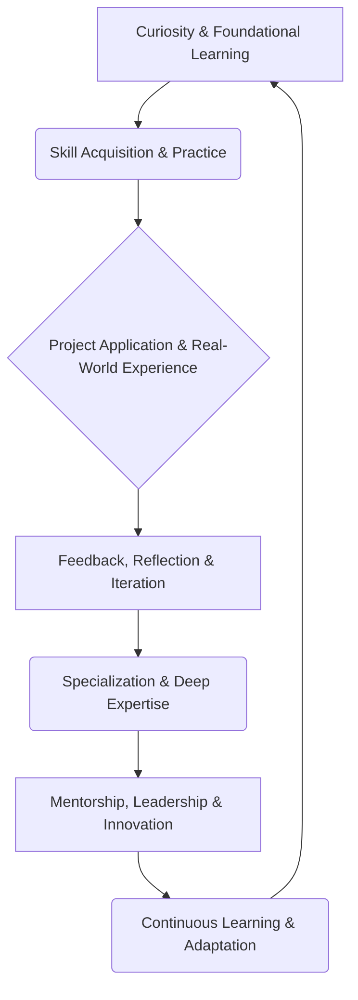
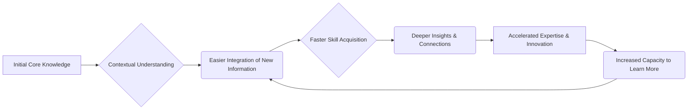

# Professional Career Development

# Professional Career Development

Welcome to KnowHub's foundational page on Professional Career Development – your comprehensive guide to mastering the art and science of lifelong professional growth. In today's rapidly evolving world, continuous learning isn't just an advantage; it's a necessity. This page serves as your orientation to our entire learning system, designed to empower you from beginner to seasoned professional.

## Why Professional Career Development Matters

The modern professional landscape is characterized by constant change. Technological advancements, shifting market demands, and global connectivity mean that skills acquired today can become obsolete tomorrow. Professional career development is about proactively navigating this dynamism, ensuring your relevance, expanding your opportunities, and ultimately, achieving your full potential. It's an investment in yourself that yields continuous returns, fostering adaptability, resilience, and sustained success.

## The Modern Learning Landscape

The traditional career path of a single profession for life is largely a relic of the past. Today's professionals often pivot careers, upskill, reskill, and embrace hybrid roles. This necessitates a flexible, self-directed approach to learning. The internet offers an unprecedented wealth of information, but also demands the ability to curate, critically evaluate, and apply knowledge effectively. Success in this landscape hinges on not just what you know, but your capacity to learn, unlearn, and relearn.

## Universal Foundations Overview

At the heart of any successful professional journey lie **Universal Foundations**. These are the core, transferable skills and knowledge that underpin excellence in virtually *any* role or industry. They are not tied to specific technologies or job titles but are timeless capabilities that enhance problem-solving, decision-making, and collaboration.

Examples include critical thinking, effective communication, emotional intelligence, project management principles, and ethical reasoning. Mastering these foundations provides a robust intellectual toolkit, enabling you to adapt to new challenges and accelerate your learning in specialized domains. They are the bedrock upon which all other professional skills are built.

To explore these essential building blocks, visit: [Universal Foundations](?topic=Universal%20Foundations)

## Career Domains Overview

While Universal Foundations provide the essential base, **Career Domains** represent the specialized knowledge, technical skills, and industry-specific expertise required for particular fields. These domains could range from software engineering, digital marketing, and data science to healthcare management, creative arts, or financial analysis.

Career Domains build upon your foundational strengths, allowing you to deep-dive into areas of interest and become an expert in a chosen profession. They often involve learning specific tools, methodologies, and best practices relevant to that field, leading to specialized roles and opportunities.

To begin exploring various specialized paths, visit: [Career Domains](?topic=Career%20Domains)

## Beginner-to-Professional Journey

The path from beginner to professional is a dynamic cycle of learning, application, and refinement. It's not a linear progression but an iterative journey where each stage reinforces the next.

*   **Knowledge:** You acquire facts, concepts, theories, and methodologies. This forms the "what" and "why."
*   **Skills:** You translate knowledge into practical abilities through practice and repetition. This is the "how to."
*   **Experience:** You gain insights and understanding by applying skills in real-world contexts, facing challenges, and observing outcomes. This teaches you "what works."
*   **Projects:** These are the crucible where knowledge, skills, and experience converge. Projects allow you to apply learning, build a portfolio, and demonstrate competence.
*   **Continuous Learning:** The commitment to regularly update knowledge, refine skills, and seek new experiences keeps you relevant and innovative throughout your career.

These elements are interconnected and mutually reinforcing. Knowledge informs skills, skills enable experience through projects, and experience refines both knowledge and skills, prompting further continuous learning.

## Lifelong Learning Philosophy

The core of professional career development is embracing a **lifelong learning philosophy**. This means cultivating an insatiable curiosity, maintaining an open mindset to new ideas, and viewing every challenge as an opportunity to learn and grow. It's about taking ownership of your development, actively seeking out new information, and committing to mastering new skills throughout your entire professional life, not just at the beginning. This philosophy transforms learning from a chore into an integral, enjoyable part of your career journey.

## Knowledge Compounding

One of the most powerful principles in lifelong learning is **knowledge compounding**. Just like financial investments, initial learning efforts, when consistently applied and built upon, yield exponentially greater returns over time.

Each new piece of knowledge or skill you acquire doesn't just add to your existing capabilities; it enhances your ability to understand and absorb *future* knowledge. A strong foundation makes it easier to grasp complex concepts, identify patterns, and make connections between disparate ideas. This creates a virtuous cycle, accelerating your growth and enabling you to tackle increasingly sophisticated challenges with greater ease and confidence.

## AI-Assisted Learning

Artificial Intelligence (AI) is rapidly transforming the landscape of professional development. It can serve as a powerful accelerator for your learning journey:

*   **Personalized Learning Paths:** AI can analyze your current skills and career goals to recommend tailored resources and learning modules.
*   **Rapid Information Retrieval:** AI-powered search engines and chatbots can provide instant access to explanations, definitions, and code examples, significantly reducing research time.
*   **Practice & Feedback:** AI tools can offer interactive exercises, simulated environments, and immediate feedback on your performance, helping you refine skills faster.
*   **Content Summarization:** AI can quickly condense lengthy articles, reports, or videos, allowing you to grasp key concepts efficiently.
*   **Skill Gap Identification:** AI can help assess your proficiency and pinpoint areas where further development is needed.

Leveraging AI effectively means viewing it as a powerful co-pilot, enhancing your human capacity for critical thinking, creativity, and application.

## Measuring Growth

Measuring your professional growth isn't always about formal certifications or promotions, though these are certainly indicators. It's also about tangible progress and qualitative improvements:

*   **Skill Proficiency:** Can you now perform tasks you couldn't before? Are you more efficient or effective?
*   **Project Outcomes:** Have your projects achieved better results, or have you taken on more complex projects?
*   **Feedback:** Are you receiving positive feedback from peers, managers, or clients regarding your contributions and improvements?
*   **Problem-Solving Ability:** Do you approach challenges with greater clarity, confidence, and a wider range of solutions?
*   **Mentorship & Leadership:** Are you now in a position to mentor others or lead initiatives?
*   **New Opportunities:** Are you being offered new responsibilities, roles, or speaking engagements?
*   **Self-Reflection:** Regularly assess your strengths, weaknesses, and progress against your personal and professional goals.

## Common Mistakes

Avoid these pitfalls that can hinder your professional development:

*   **Passive Learning:** Simply consuming content without active engagement, practice, or application.
*   **Lack of Focus:** Jumping between too many topics without building depth in any area.
*   **Ignoring Foundations:** Rushing to specialized skills without a strong understanding of underlying principles.
*   **Fear of Failure:** Avoiding new challenges or projects that stretch your capabilities.
*   **Isolation:** Not seeking feedback, mentorship, or collaboration with others.
*   **Underestimating Soft Skills:** Neglecting communication, teamwork, and emotional intelligence in favor of purely technical skills.
*   **Waiting for Permission:** Expecting your employer to dictate your entire learning path instead of taking proactive ownership.

## Summary

Professional Career Development is a dynamic, lifelong journey of learning, applying, and refining your capabilities. It requires a commitment to continuous growth, built upon Universal Foundations and specialized within Career Domains. By embracing a lifelong learning philosophy, understanding how knowledge compounds, leveraging AI, and actively measuring your progress, you can navigate the modern professional landscape with confidence and achieve sustained success. This KnowHub system is designed to be your comprehensive companion on that journey.

## Key Takeaways

*   **Lifelong learning is crucial:** The modern world demands continuous skill development and adaptability.
*   **Foundations first:** Master universal skills (critical thinking, communication) before specializing.
*   **Specialization builds on foundations:** Career domains provide depth in specific fields.
*   **Knowledge compounds:** Initial learning accelerates future learning, creating exponential growth.
*   **Active learning is key:** Combine knowledge, skills, experience, and projects for true development.
*   **Leverage AI:** Use AI tools to personalize, accelerate, and enhance your learning process.
*   **Measure your growth:** Regularly assess progress through projects, feedback, and self-reflection.
*   **Take ownership:** Your professional development is your responsibility.

## Related KnowHub Pages

*   [Universal Foundations](?topic=Universal%20Foundations)
*   [Career Domains](?topic=Career%20Domains)