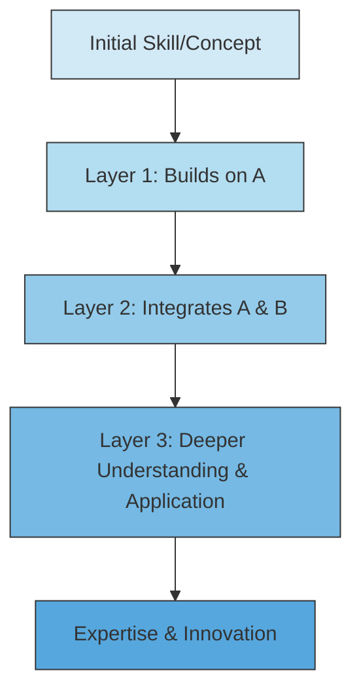
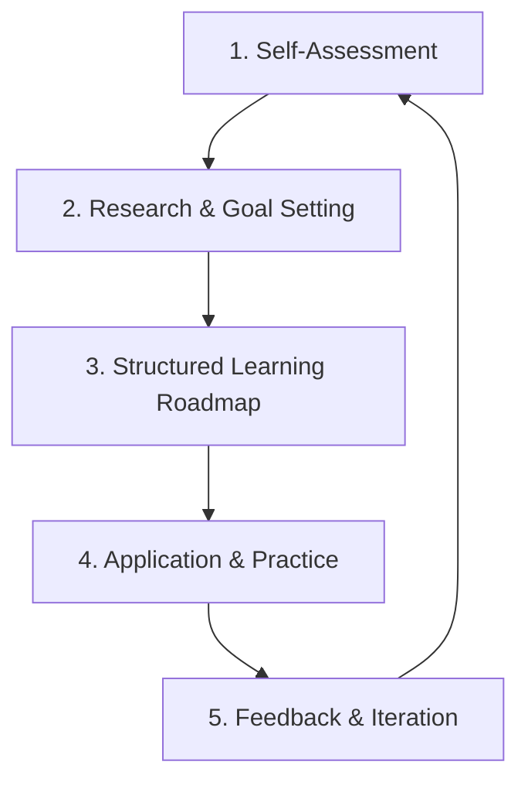

# mqcx246qfph2da

# Professional Career Development

Welcome to the root page of your lifelong learning journey with KnowHub. This page provides a comprehensive overview of Professional Career Development, outlining its core principles, benefits, and practical strategies to navigate the modern professional landscape. Whether you're just starting out or looking to advance in your field, understanding these concepts is crucial for sustained growth and success.

## Introduction

Professional Career Development is the intentional and continuous process of enhancing your skills, knowledge, and experiences to achieve your career aspirations. It's more than just climbing the corporate ladder; it's about staying relevant, increasing your impact, fostering personal growth, and adapting to an ever-evolving world. This journey is proactive, strategic, and deeply personal, focusing on building a robust foundation and continually refining specialized expertise throughout your working life.

## Why Professional Development Matters

In today's dynamic professional world, standing still means falling behind. Continuous professional development is not a luxury but a necessity for several compelling reasons:

*   **Rapid Change**: Industries, technologies, and market demands are evolving at an unprecedented pace. What was cutting-edge yesterday might be obsolete tomorrow.
*   **Enhanced Employability**: Continuously updated skills make you more valuable to current and future employers, opening doors to new opportunities and roles.
*   **Increased Earning Potential**: Specialized and in-demand skills often correlate with higher salaries and better benefits.
*   **Adaptability & Resilience**: Developing new competencies builds your capacity to adapt to unforeseen challenges and pivot your career when necessary.
*   **Personal Fulfillment**: Learning new things and mastering challenges contributes to greater job satisfaction, confidence, and a sense of purpose.
*   **Innovation & Problem Solving**: A broader and deeper knowledge base allows you to approach problems from multiple angles and contribute innovative solutions.

## The Modern Career Landscape

Modern careers are rarely linear or confined to a single domain. They are increasingly interdisciplinary, demanding a blend of technical expertise and versatile human skills. Success often hinges on understanding how various disciplines interact:

*   **Technology**: The omnipresent force driving innovation. From AI and automation to data science and cybersecurity, technological literacy is fundamental across almost all roles.
*   **Business Acumen**: Understanding market dynamics, organizational strategy, financial principles, and customer needs. This context ensures your technical skills are applied effectively.
*   **Design Thinking**: A human-centered approach to problem-solving, focusing on empathy, ideation, prototyping, and testing. It's about creating user-friendly, effective solutions, whether for a product, service, or process.
*   **Leadership**: The ability to inspire, motivate, guide teams, make decisions, and drive initiatives. This isn't limited to managerial roles but applies to individual contributors influencing outcomes.
*   **Communication**: Articulating complex ideas clearly, listening actively, negotiating effectively, and collaborating seamlessly across diverse teams and stakeholders.

These pillars are interconnected, creating a holistic skill set that defines the modern professional. Excelling in one area often amplifies your effectiveness in others.

## Universal Foundations vs Career Domains

A successful career development strategy balances broad, evergreen skills with deep, specialized knowledge.

*   **Universal Foundations**: These are the bedrock skills applicable across virtually all industries and roles. They are often referred to as "soft skills" or "21st-century skills," but their impact is hard and tangible. Examples include:
    *   Critical Thinking & Problem-Solving
    *   Effective Communication (written & verbal)
    *   Collaboration & Teamwork
    *   Adaptability & Flexibility
    *   Digital Literacy (basic computer skills, data privacy awareness)
    *   Emotional Intelligence & Empathy
    *   Time Management & Organization
    *   Curiosity & A Growth Mindset
    These foundations are essential for learning, applying, and continuously updating your specialized skills.

*   **Career Domains**: These are the specialized knowledge, tools, and techniques required for a particular profession or industry. They are often technical or highly specific. Examples include:
    *   Software Development (e.g., Python, JavaScript, cloud platforms)
    *   Data Science (e.g., statistical modeling, machine learning, data visualization)
    *   Digital Marketing (e.g., SEO, content strategy, analytics)
    *   Financial Analysis (e.g., valuation, risk management, regulatory compliance)
    *   UX/UI Design (e.g., wireframing, user research, prototyping tools)

The relationship is symbiotic: strong universal foundations enable you to acquire and apply domain-specific knowledge more effectively and adapt to changes within your domain. Without a solid foundation, deep specialization can become brittle and limit your long-term adaptability.

## The Beginner-to-Professional Journey

The path from novice to expert is a continuous cycle of learning, application, and refinement, not a fixed ladder.

1.  **Beginner**: Focus on acquiring foundational knowledge and basic skills. Understand core concepts, terminology, and simple procedures. Often involves structured learning, tutorials, and supervised practice.
2.  **Intermediate**: Start applying foundational knowledge to solve more complex problems. Begin specializing in a chosen domain. Develop independence in tasks, seeking feedback and actively experimenting.
3.  **Advanced**: Master your specialized domain. You can tackle complex, ambiguous problems, innovate solutions, and mentor others. Your contributions move beyond execution to strategy and impact.
4.  **Professional/Expert**: You are a recognized leader in your field, shaping industry standards, driving strategic initiatives, and influencing the future direction of your domain. You contribute thought leadership and continuous learning remains paramount.

This journey is iterative. Even as an expert, you return to a "beginner" mindset when learning a new technology or paradigm, leveraging your existing foundations to accelerate the process.

## Lifelong Learning Philosophy

Adopting a lifelong learning philosophy is the cornerstone of professional career development. It's a mindset characterized by:

*   **Innate Curiosity**: A genuine desire to understand how things work and explore new ideas.
*   **Growth Mindset**: Believing your abilities can be developed through dedication and hard work, rather than being fixed.
*   **Proactive Engagement**: Actively seeking out learning opportunities, rather than waiting for them to be presented.
*   **Learning from Failure**: Viewing mistakes as valuable learning experiences that provide insights for improvement.
*   **Adaptive Strategies**: Being open to different learning methods, from formal courses to informal exploration.
*   **Knowledge Sharing**: Understanding that teaching others solidifies your own understanding and contributes to collective growth.

## Knowledge Compounding

Just like compound interest in finance, knowledge compounds over time. Each new piece of information or skill you acquire doesn't just add to your existing knowledge; it multiplies its value by creating new connections and insights.

*   **Interconnectedness**: When you learn a new concept, it hooks into your existing mental models, strengthening them and making them more robust. For example, learning basic algebra makes calculus easier to grasp, which in turn simplifies understanding machine learning algorithms.
*   **Accelerated Learning**: The more you know, the faster and easier it becomes to acquire new knowledge, as you have more existing frameworks to connect new information to.
*   **Deeper Insights**: Compounded knowledge allows you to see patterns, make novel connections, and generate innovative solutions that wouldn't be possible with isolated pieces of information.
*   **Enhanced Problem-Solving**: A rich, interconnected knowledge base equips you with a wider array of tools and perspectives to tackle complex problems.

## Career Growth Framework

A structured approach is essential for effective career development. This framework provides a cyclical process for continuous growth:

1.  **Self-Assessment**:
    *   **Strengths & Weaknesses**: Identify your current competencies, areas for improvement, and natural talents.
    *   **Interests & Values**: What genuinely excites you? What principles guide your work and life?
    *   **Career Aspirations**: Where do you envision yourself in 1, 5, or 10 years? What kind of impact do you want to make?

2.  **Research & Goal Setting**:
    *   **Industry Trends**: Understand what skills are in demand, emerging technologies, and future directions of your field.
    *   **Role Requirements**: Analyze job descriptions for your target roles to identify required skills and experience.
    *   **SMART Goals**: Set Specific, Measurable, Achievable, Relevant, and Time-bound learning and career goals.

3.  **Structured Learning Roadmap**:
    *   **Break Down & Prioritize**: Divide large learning goals into smaller, manageable modules. Prioritize foundational knowledge before diving into advanced topics.
    *   **Diverse Resources**: Utilize a blend of online courses, books, workshops, conferences, mentorships, and peer learning.
    *   **Deliberate Practice**: Integrate active exercises, projects, and challenges to solidify understanding and build proficiency.

4.  **Application & Practice**:
    *   **Implement Skills**: Apply what you've learned in real-world scenarios – at work, on side projects, or through volunteer opportunities.
    *   **Build a Portfolio**: Create tangible evidence of your skills and accomplishments.
    *   **Experiment**: Try new approaches and don't be afraid to take calculated risks.

5.  **Feedback & Iteration**:
    *   **Seek Feedback**: Proactively ask for constructive criticism from managers, peers, and mentors.
    *   **Reflect & Adjust**: Regularly review your progress, assess what's working and what isn't, and adjust your roadmap accordingly.
    *   **Document Learning**: Keep a learning journal or log to track new insights and skills acquired.

## AI-Assisted Learning

Artificial Intelligence is revolutionizing how we learn and develop professionally. AI tools can significantly accelerate your learning journey:

*   **Personalized Learning Paths**: AI algorithms can analyze your current skills, learning style, and career goals to recommend tailored courses, articles, and exercises.
*   **Intelligent Tutors & Chatbots**: AI-powered conversational agents can provide instant explanations, answer questions, offer practice problems, and clarify complex concepts 24/7.
*   **Content Curation & Summarization**: AI can quickly scan vast amounts of information, identify key insights, and summarize lengthy articles or videos, saving you time.
*   **Skill Gap Analysis**: AI tools can assess your proficiency in various skills and pinpoint specific areas where further development is needed.
*   **Language Learning**: AI offers interactive practice, pronunciation feedback, and contextual translation for mastering new languages.
*   **Coding Assistants**: Tools like GitHub Copilot can suggest code, automate repetitive tasks, and help debug, allowing developers to learn best practices and focus on higher-level problem-solving.
*   **Automated Feedback**: AI can analyze your writing, presentations, or even code, providing immediate, objective feedback for improvement.

## Measuring Progress

Tracking your progress is vital for staying motivated and ensuring your development efforts are effective.

*   **Skill Acquisition**:
    *   **Checklists**: Maintain a list of specific skills or topics to learn and mark them off as you gain proficiency.
    *   **Project Completion**: Successfully finishing personal or professional projects that utilize new skills.
    *   **Competency Frameworks**: Assess yourself against defined industry or organizational competency models.
*   **Performance Metrics**:
    *   **Key Performance Indicators (KPIs)**: Observe improvements in work quality, efficiency, output, or contribution to team goals.
    *   **Reduced Errors**: A decrease in mistakes related to newly acquired skills.
*   **Feedback**:
    *   **360-Degree Feedback**: Solicit input from managers, peers, and direct reports regarding your growth and impact.
    *   **Mentorship Reviews**: Regular discussions with mentors about your development trajectory.
*   **Formal Recognition**:
    *   **Certifications & Qualifications**: Earning industry-recognized certifications or academic degrees.
    *   **Awards & Promotions**: Receiving formal recognition for your contributions and advancement.
*   **Tangible Outputs**:
    *   **Portfolio Updates**: Regularly adding new projects or case studies that showcase your enhanced abilities.
    *   **Publications/Presentations**: Sharing your knowledge through articles, blog posts, or conference presentations.
*   **Mentoring Others**: The ability to effectively teach and guide others is a strong indicator of your own mastery.
*   **Self-Reflection**: Regularly journaling about your learning journey, challenges, and breakthroughs helps internalize growth.

## Common Mistakes

Avoiding these pitfalls can make your career development journey more effective and enjoyable:

*   **Passive Learning**: Simply consuming content (watching videos, reading articles) without active engagement, practice, or application.
*   **Lack of Clear Goals**: Learning aimlessly without a specific purpose or connection to career aspirations leads to wasted effort.
*   **Ignoring Foundational Skills**: Rushing to advanced topics or trendy technologies before mastering the underlying principles creates knowledge gaps.
*   **Fear of Failure**: Being unwilling to experiment, take on challenging projects, or step outside your comfort zone stifles growth.
*   **Isolating Learning**: Not seeking feedback, collaborating with others, or leveraging mentors limits perspective and accountability.
*   **Chasing Hype**: Focusing solely on the latest buzzwords or tools without assessing their strategic relevance to your career path.
*   **Not Documenting Progress**: Forgetting achievements, lessons learned, or the path taken can make it difficult to see how far you've come.
*   **Burnout**: Overloading yourself with too much learning without adequate rest or application can lead to exhaustion and demotivation.

## Key Takeaways

*   **Professional Development is Continuous**: It's a lifelong process, not a one-time event, essential for relevance and growth.
*   **Modern Careers are Interdisciplinary**: Success requires a blend of technology, business, design, leadership, and communication skills.
*   **Foundations Precede Specialization**: Strong universal skills underpin and enhance domain-specific expertise.
*   **Knowledge Compounds**: Each new piece of learning adds multiplicative value, making future learning easier and deeper.
*   **Structured Approach is Key**: Use a framework of self-assessment, goal-setting, learning roadmaps, application, and feedback.
*   **AI is Your Learning Ally**: Leverage AI for personalized, accelerated, and efficient learning experiences.
*   **Measure What Matters**: Track progress through skill acquisition, performance, feedback, and tangible outputs to stay on course.
*   **Avoid Common Pitfalls**: Be active, intentional, build strong foundations, embrace failure, and seek collaboration.

## Knowledge Check

Test your understanding of Professional Career Development with these multiple-choice questions.

1.  What is the primary goal of Professional Career Development?
    a) To secure a promotion within a year
    b) To intentionally enhance skills, knowledge, and experience for career goals
    c) To only learn new technical skills
    d) To solely earn higher salaries

2.  Why is continuous learning considered a necessity in modern careers?
    a) Because it makes you popular with colleagues
    b) Industries, technologies, and market demands are constantly evolving
    c) To avoid having too much free time
    d) Only for entry-level positions

3.  Which of the following is NOT typically considered a Universal Foundation skill?
    a) Critical Thinking
    b) Communication
    c) Python Programming
    d) Adaptability

4.  The relationship between Universal Foundations and Career Domains is best described as:
    a) Separate and unrelated
    b) Foundations replace the need for domains
    c) Foundations enable and enhance domain specialization
    d) Domains are always learned before foundations

5.  What concept describes new knowledge building on existing knowledge to create multiplicative value?
    a) Knowledge Depreciation
    b) Knowledge Stagnation
    c) Knowledge Compounding
    d) Knowledge Isolation

6.  In the Modern Career Landscape, which discipline focuses on human-centered problem-solving and user experience?
    a) Technology
    b) Business Acumen
    c) Design Thinking
    d) Leadership

7.  Which stage of the Beginner-to-Professional Journey involves mastering a specialized domain and mentoring others?
    a) Beginner
    b) Intermediate
    c) Advanced
    d) Professional/Expert

8.  A key characteristic of a Lifelong Learning Philosophy is:
    a) Learning only when required by your employer
    b) Believing your abilities are fixed
    c) Embracing curiosity and a growth mindset
    d) Avoiding feedback to prevent criticism

9.  Which step in the Career Growth Framework involves identifying your current competencies and aspirations?
    a) Research & Goal Setting
    b) Structured Learning Roadmap
    c) Self-Assessment
    d) Application & Practice

10. How can AI assist in personalized learning paths?
    a) By forcing you to learn specific topics
    b) By recommending tailored resources based on your profile
    c) By replacing human instructors entirely
    d) By only providing generic content

11. Which of these is a tangible way to measure professional progress?
    a) How many books you own
    b) The number of unread articles in your queue
    c) A portfolio showcasing completed projects
    d) Your opinion of yourself

12. What is a common mistake in career development related to the application of learning?
    a) Actively seeking feedback
    b) Integrating deliberate practice
    c) Passive learning without application
    d) Building a portfolio

13. The ability to inspire and guide teams is primarily associated with which pillar of the modern career landscape?
    a) Technology
    b) Communication
    c) Leadership
    d) Design Thinking

14. What does the "T" stand for in SMART goals?
    a) Technical
    b) Teamwork
    c) Timeless
    d) Time-bound

15. Why is documentation of progress important in career development?
    a) To brag about your achievements
    b) To easily see your growth and lessons learned
    c) To avoid learning new things
    d) It is not important

16. Which AI tool can help developers by suggesting code and debugging?
    a) An intelligent chatbot
    b) A content summarizer
    c) A coding assistant (e.g., GitHub Copilot)
    d) A skill gap analyzer

17. What distinguishes an "Expert" from an "Advanced" professional in the journey framework?
    a) Experts only learn, while advanced professionals apply.
    b) Experts shape industry standards and provide thought leadership.
    c) Advanced professionals know more technical skills.
    d) Experts always work alone.

18. What is a potential negative consequence of ignoring foundational skills?
    a) You might learn advanced topics faster.
    b) Your specialized knowledge might become brittle and less adaptable.
    c) You will become a better communicator.
    d) It will make your career path more linear.

19. Seeking constructive criticism from managers and peers falls under which step of the Career Growth Framework?
    a) Self-Assessment
    b) Structured Learning Roadmap
    c) Feedback & Iteration
    d) Research & Goal Setting

20. How does a growth mindset contribute to lifelong learning?
    a) It makes you resistant to new ideas.
    b) It encourages belief that abilities can be developed through effort.
    c) It focuses on inherent talent over hard work.
    d) It leads to avoiding difficult challenges.

---
**Answer Key:** 1. b, 2. b, 3. c, 4. c, 5. c, 6. c, 7. d, 8. c, 9. c, 10. b, 11. c, 12. c, 13. c, 14. d, 15. b, 16. c, 17. b, 18. b, 19. c, 20. b

## Next Pages

To continue your journey of professional development, explore these foundational topics:

*   **Universal Foundations**: Dive deeper into the core, transferable skills essential for every modern professional.
*   **Career Domains**: Discover how to identify, choose, and master specialized knowledge relevant to your chosen career path.