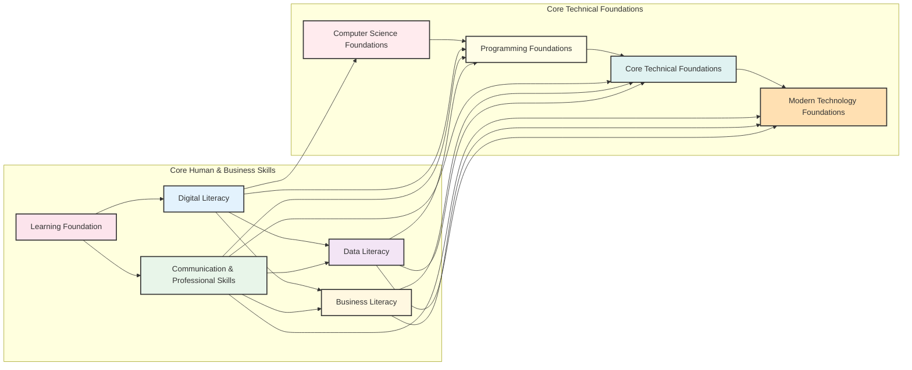
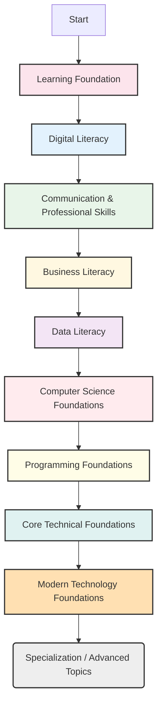

# mqcycltc9ua5so

# Universal Foundations

Welcome to "Universal Foundations," your starting point for building a robust and future-proof professional career. In today's rapidly evolving world, particularly in technology-driven fields, foundational knowledge isn't just an advantage—it's a necessity. This page serves as your roadmap, guiding you through the essential building blocks that underpin all professional specializations and career paths.

## Why Foundations Matter

Imagine constructing a skyscraper. Without deep, stable foundations, even the most impressive upper floors are destined to crumble. Your professional career is no different. Universal Foundations provide:

*   **Resilience & Adaptability:** Core principles rarely change, even as technologies do. A strong foundation equips you to understand new tools and trends quickly, adapt to shifting industry demands, and remain relevant throughout your career.
*   **Deeper Problem-Solving:** Foundations help you see beyond superficial symptoms to diagnose root causes. This enables more effective, innovative, and sustainable solutions to complex challenges.
*   **Accelerated Learning:** With a solid grasp of fundamentals, you can connect new information to existing knowledge, making learning specialized topics faster and more profound.
*   **Career Longevity:** Professionals with strong foundational skills are more valued by employers, often leading to greater opportunities for growth, leadership, and long-term career success.
*   **Reduced Knowledge Gaps:** Skipping foundations often leads to "patchwork" understanding, where you can perform specific tasks but lack the context or conceptual understanding to innovate or troubleshoot effectively.

Every career path, from software development to project management, data analysis to digital marketing, relies on a combination of these foundational elements. They are the common language and essential toolkit for modern professionals.

## Foundation Areas Overview

The Universal Foundations curriculum is structured around several critical areas, each contributing unique competencies vital for professional success:

*   ### [Learning Foundation](?topic=Learning%20Foundation)
    *   **What it is:** The meta-skill of learning how to learn effectively. A "meta-skill" is a skill that helps you acquire other skills. It covers methodologies for acquiring, processing, and retaining knowledge efficiently.
    *   **Competencies Developed:** Critical thinking, self-directed learning, active listening, research skills, effective note-taking, metacognition.
*   ### [Digital Literacy](?topic=Digital%20Literacy)
    *   **What it is:** The ability to find, evaluate, create, and communicate information using digital technologies, as well as an understanding of digital ethics and safety.
    *   **Competencies Developed:** Navigating digital environments, using productivity tools, information discernment, digital citizenship, cybersecurity awareness.
*   ### [Business Literacy](?topic=Business%20Literacy)
    *   **What it is:** A fundamental understanding of how businesses operate, including key concepts like strategy, finance, operations, marketing, and organizational structures.
    *   **Competencies Developed:** Business acumen, strategic thinking, understanding market dynamics, financial literacy, project management basics, organizational awareness.
*   ### [Data Literacy](?topic=Data%20Literacy)
    *   **What it is:** The ability to read, work with, analyze, and communicate with data effectively. It involves understanding data sources, interpretation, and ethical use.
    *   **Competencies Developed:** Data interpretation, basic statistical understanding, data visualization, critical evaluation of data-driven insights, ethical data handling.
*   ### [Communication & Professional Skills](?topic=Communication%20%26%20Professional%20Skills)
    *   **What it is:** The essential soft skills required for effective interaction in a professional setting, including verbal, written, and non-verbal communication, teamwork, and professionalism.
    *   **Competencies Developed:** Presentation skills, technical writing, active listening, conflict resolution, teamwork, negotiation, emotional intelligence, leadership basics.
*   ### [Computer Science Foundations](?topic=Computer%20Science%20Foundations)
    *   **What it is:** The theoretical and mathematical underpinnings of computation, covering topics like algorithms, data structures, computational thinking, and the architecture of computers.
    *   **Competencies Developed:** Algorithmic thinking, problem decomposition, logical reasoning, abstract thinking, understanding system constraints, efficiency analysis.
*   ### [Programming Foundations](?topic=Programming%20Foundations)
    *   **What it is:** The practical application of computer science principles through coding. It covers basic syntax, control structures, debugging, and software development methodologies.
    *   **Competencies Developed:** Coding proficiency, debugging skills, understanding programming paradigms, software design principles, version control basics.
*   ### [Core Technical Foundations](?topic=Core%20Technical%20Foundations)
    *   **What it is:** Broad technical concepts critical across many IT disciplines, such as networking fundamentals, operating systems, databases, and cybersecurity basics.
    *   **Competencies Developed:** System architecture understanding, network troubleshooting, database querying, information security principles, command-line proficiency.
*   ### [Modern Technology Foundations](?topic=Modern%20Technology%20Foundations)
    *   **What it is:** An introduction to emerging and prevalent technologies shaping the current landscape, including cloud computing, AI/ML concepts, blockchain, and the Internet of Things (IoT).
    *   **Competencies Developed:** Awareness of technology trends, understanding of cloud principles, basic AI concepts, appreciation for distributed systems, identifying innovation opportunities.

## Relationships Between Foundation Areas

These foundational areas are not isolated silos; they are deeply interconnected, forming a cohesive web of knowledge and skills. Mastery in one area often strengthens understanding and performance in others.

*   **Learning Foundation** acts as the bedrock, enhancing your ability to grasp all other subjects.
*   **Digital Literacy** provides the practical interaction skills necessary for almost all modern professional work, including technical roles.
*   **Communication & Professional Skills** are vital for collaborating, presenting ideas, and managing projects across all domains.
*   **Business Literacy** offers the real-world context for applying technical skills, ensuring solutions are relevant and impactful.
*   **Data Literacy** informs strategic decisions, often leveraging both business context and technical tools.
*   **Computer Science Foundations** lay the theoretical groundwork for **Programming Foundations**, which then enables practical application and deeper understanding of **Core Technical Foundations** like operating systems or networks.
*   **Modern Technology Foundations** builds upon all prior technical areas, allowing you to understand the "why" and "how" of current and future tech trends.

## Recommended Learning Sequence

While individual learning paths may vary, a logical progression can maximize your learning efficiency and ensure concepts build naturally upon one another.

1.  **[Learning Foundation](?topic=Learning%20Foundation):** Start here. Mastering how to learn will accelerate your progress through all subsequent topics.
2.  **[Digital Literacy](?topic=Digital%20Literacy):** Establish basic competency with digital tools and environments, which you'll use throughout your learning journey.
3.  **[Communication & Professional Skills](?topic=Communication%20%26%20Professional%20Skills):** These "soft" skills are fundamental for collaboration and effective work, regardless of technical depth.
4.  **[Business Literacy](?topic=Business%20Literacy):** Understand the context in which technology and data are applied.
5.  **[Data Literacy](?topic=Data%20Literacy):** Learn to understand and interpret data, a skill crucial for informed decision-making in any field.
6.  **[Computer Science Foundations](?topic=Computer%20Science%20Foundations):** Delve into the abstract, theoretical side of computing.
7.  **[Programming Foundations](?topic=Programming%20Foundations):** Apply the theoretical concepts learned in Computer Science to write actual code.
8.  **[Core Technical Foundations](?topic=Core%20Technical%20Foundations):** Broaden your technical understanding beyond pure programming to encompass systems, networks, and databases.
9.  **[Modern Technology Foundations](?topic=Modern%20Technology%20Foundations):** Explore current and emerging technologies, building on your established technical base.
10. **Specialization:** With these foundations, you are well-prepared to dive into specific career specializations like AI/ML, Cybersecurity, Cloud Engineering, Software Development, etc.

## Foundation-to-Specialization Progression

The Universal Foundations serve as the springboards for virtually any specialized career path. They don't just teach you isolated facts; they cultivate a mindset and toolkit that allows you to confidently tackle advanced topics.

*   A strong grasp of **Computer Science** and **Programming Foundations** directly leads into roles like Software Engineer, Data Scientist, or Machine Learning Engineer.
*   **Data Literacy** combined with **Business Literacy** and **Core Technical Foundations** can set you on a path to Data Analyst, Business Intelligence Developer, or Product Manager.
*   **Digital Literacy**, **Communication & Professional Skills**, and **Modern Technology Foundations** are crucial for roles in Digital Marketing, IT Project Management, or Technology Consulting.
*   For cybersecurity, **Core Technical Foundations**, **Computer Science**, and **Modern Technology Foundations** provide essential context.

No matter your ultimate career goal, these foundations provide a common language and a shared understanding, making it easier to collaborate across disciplines and transition between roles.

## Common Mistakes

Many aspiring professionals make avoidable errors that hinder their long-term growth:

*   **Skipping Foundations for "Hot" Technologies:** Directly jumping into learning the latest trendy framework or tool without understanding the underlying principles (e.g., trying to learn a specific AI library without understanding basic algorithms or data structures). This leads to fragile knowledge and difficulty adapting.
*   **Underestimating "Soft" Skills:** Believing that technical prowess alone is sufficient. Poor communication, teamwork, or professional etiquette can severely limit career progression, even for highly skilled individuals.
*   **Viewing Foundations as "Beginner Only":** Dismissing foundational knowledge once you've gained some experience. Experienced professionals often revisit fundamentals to deepen their understanding, troubleshoot complex issues, or pivot to new domains.
*   **Focusing Only on Theory or Only on Practice:** An effective foundation combines both conceptual understanding (e.g., Computer Science) and practical application (e.g., Programming). Neglecting one side leads to either abstract knowledge without application or rote memorization without true understanding.
*   **Lack of Continuous Learning:** Believing that once foundations are learned, the learning journey ends. The "Learning Foundation" principle applies throughout your entire career.

## Industry Relevance

Employers across all industries increasingly seek candidates with a strong blend of foundational knowledge and specialized skills—often referred to as "T-shaped professionals."

*   The vertical bar of the 'T' represents deep expertise in a specific area (your specialization).
*   The horizontal bar represents broad foundational knowledge and skills that allow you to collaborate effectively across different domains.

This means companies value individuals who can not only perform their specific job functions but also understand the broader business context, communicate effectively with diverse teams, interpret data, and adapt to new technologies. Universal Foundations directly cultivates this "horizontal bar," making you a more versatile, valuable, and future-proof asset in any organization.

## Summary

Universal Foundations are the indispensable bedrock for any successful professional journey. They equip you with the fundamental knowledge, critical thinking abilities, and practical skills needed to navigate the complexities of modern careers, especially in technology. By systematically building competencies in learning, digital literacy, business acumen, data understanding, communication, and core technical principles, you create a robust platform for continuous growth, innovation, and specialization.

## Key Takeaways

*   **Foundations are essential for long-term career success and adaptability.** They provide the underlying principles that make specialized learning faster and more robust.
*   **Universal Foundations interlink and build upon each other.** A holistic approach is crucial.
*   **Don't skip or underestimate any foundation area.** Even "soft" skills like communication are critical for professional impact.
*   **A structured learning sequence is recommended** to ensure concepts build naturally and efficiently.
*   **Foundations prepare you for any specialization,** enabling you to become a valuable "T-shaped professional."
*   **Continuous learning** is itself a foundational skill that must be practiced throughout your career.

## Related KnowHub Pages

*   [Learning Foundation](?topic=Learning%20Foundation)
*   [Digital Literacy](?topic=Digital%20Literacy)
*   [Business Literacy](?topic=Business%20Literacy)
*   [Data Literacy](?topic=Data%20Literacy)
*   [Communication & Professional Skills](?topic=Communication%20%26%20Professional%20Skills)
*   [Computer Science Foundations](?topic=Computer%20Science%20Foundations)
*   [Programming Foundations](?topic=Programming%20Foundations)
*   [Core Technical Foundations](?topic=Core%20Technical%20Foundations)
*   [Modern Technology Foundations](?topic=Modern%20Technology%20Foundations)