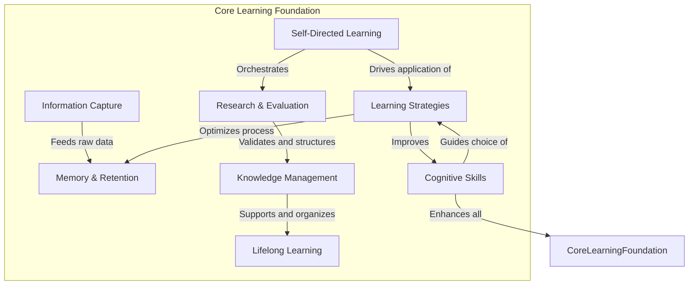
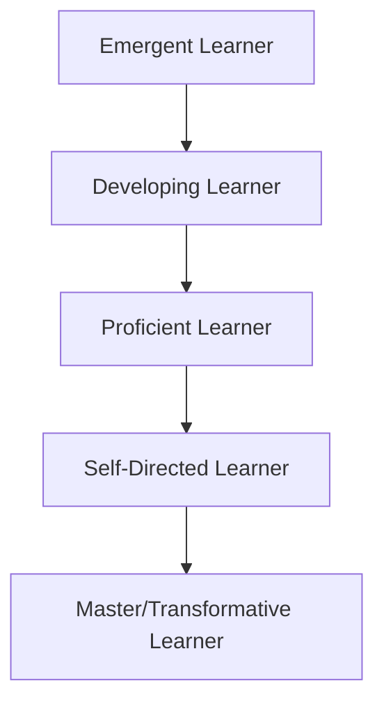

# Learning Foundation

# Learning Foundation

In an ever-evolving world, the ability to learn is not merely a skill among others; it is the **fundamental meta-skill** that underpins all professional and personal growth. The "Learning Foundation" is your bedrock – a robust system of interconnected capabilities that empowers you to acquire, process, retain, and apply knowledge effectively. This page serves as a roadmap to understanding why mastering learning itself is crucial, how its components interact, and how you can evolve into an expert, self-sustaining learner.

## Learning As A Meta-Skill

Imagine a skill that enhances every other skill you possess or wish to acquire. That's learning. It's the engine that drives mastery, innovation, and adaptability. Without effective learning abilities, even the most brilliant minds can struggle to keep pace with new demands or capitalize on emerging opportunities.

Why is it a meta-skill? Because:
*   **It enables all other skills:** To become proficient in coding, leadership, a new language, or critical thinking, you must first learn how to learn them.
*   **It amplifies your potential:** A strong learning foundation allows you to absorb complex information faster, solve novel problems more creatively, and make better decisions.
*   **It ensures future relevance:** Industries change, technologies advance, and job roles transform. The capacity to continuously learn and unlearn is your ultimate safeguard against obsolescence. Your ability to navigate future challenges and opportunities hinges directly on your proficiency as a learner.

## Components Of Learning Foundation

The Learning Foundation is built upon several interconnected pillars, each contributing unique capabilities to your overall learning prowess. Understanding these components and how they interact is key to developing a holistic and effective learning approach.

Here are the core components:

*   ### [Learning Strategies](?topic=Learning%20Strategies)
    This component focuses on *how* you approach learning tasks. It involves choosing and applying effective techniques like active recall, spaced repetition, elaboration, and interleaving to optimize comprehension and memory.
    **Capabilities developed:** Efficiency, effectiveness, adaptability in learning contexts.

*   ### [Memory & Retention](?topic=Memory%20%26%20Retention)
    This pillar is about understanding how your brain stores and retrieves information. It involves techniques to improve long-term memory formation, reduce forgetting, and enhance recall efficiency.
    **Capabilities developed:** Knowledge accumulation, quick recall, deep understanding, reduced re-learning time.

*   ### [Information Capture](?topic=Information%20Capture)
    This component addresses the initial phase of engaging with new data. It covers methods for effectively taking notes, highlighting, summarizing, and organizing incoming information in a way that facilitates later processing and retrieval.
    **Capabilities developed:** Organized thinking, focused attention, accurate record-keeping, readiness for processing.

*   ### [Cognitive Skills](?topic=Cognitive%20Skills)
    These are the mental processes that enable learning, reasoning, problem-solving, and decision-making. Key cognitive skills include critical thinking, logical reasoning, problem-solving, creativity, and metacognition (thinking about thinking).
    **Capabilities developed:** Analytical prowess, innovative solutions, improved decision-making, self-awareness in learning.

*   ### [Research & Evaluation](?topic=Research%20%26%20Evaluation)
    This pillar focuses on the ability to locate, assess, and synthesize information from various sources. It involves discerning credible sources, understanding biases, and effectively integrating new findings into existing knowledge.
    **Capabilities developed:** Information literacy, critical appraisal, evidence-based reasoning, robust knowledge acquisition.

*   ### [Self-Directed Learning](?topic=Self-Directed%20Learning)
    This is the ability to take initiative and responsibility for your own learning journey. It involves setting goals, identifying resources, managing time, monitoring progress, and evaluating outcomes without constant external guidance.
    **Capabilities developed:** Autonomy, motivation, goal attainment, continuous personal growth.

*   ### [Knowledge Management](?topic=Knowledge%20Management)
    This component is about systematically organizing, storing, and retrieving the knowledge you've acquired. It involves creating personal knowledge bases, using tools to link concepts, and ensuring information is accessible when needed.
    **Capabilities developed:** Organized knowledge, efficient retrieval, synthesis of complex information, long-term retention.

*   ### [Lifelong Learning](?topic=Lifelong%20Learning)
    This encompasses the continuous, voluntary, and self-motivated pursuit of knowledge for personal or professional reasons. It's the mindset of continuous growth and adaptation in an ever-changing world.
    **Capabilities developed:** Adaptability, resilience, sustained relevance, personal fulfillment, future-proofing.

## Learning Ecosystem

These components don't operate in isolation; they form a dynamic ecosystem where each part supports and influences the others. For instance, strong [Information Capture](?topic=Information%20Capture) directly feeds into effective [Memory & Retention](?topic=Memory%20%26%20Retention). Your [Cognitive Skills](?topic=Cognitive%20Skills) inform your choice of [Learning Strategies](?topic=Learning%20Strategies), while [Research & Evaluation](?topic=Research%20%26%20Evaluation) is a critical precursor to building a robust [Knowledge Management](?topic=Knowledge%20Management) system. The overarching goal of this interconnected system is to foster [Lifelong Learning](?topic=Lifelong%20Learning) and [Self-Directed Learning](?topic=Self-Directed%20Learning).

## How Effective Learners Think

Effective learners don't just passively consume information; they actively engage with it. They possess a distinct mindset and employ specific approaches:

*   **Curiosity-Driven:** They ask "why" and "how," exploring the root causes and underlying mechanisms of concepts.
*   **Critical Inquiry:** They question assumptions, evaluate evidence, and seek diverse perspectives rather than accepting information at face value.
*   **Metacognitive Awareness:** They understand their own learning process, recognizing their strengths, weaknesses, and preferred strategies. They "think about their thinking."
*   **Iterative & Reflective:** They view learning as an ongoing cycle of trying, failing, reflecting, and refining their approach. They regularly assess what works and what doesn't.
*   **Connection Builders:** They actively seek to link new information with existing knowledge, building robust mental models rather than isolated facts.
*   **Proactive & Goal-Oriented:** They set clear learning objectives and actively seek out resources and opportunities to achieve them.
*   **Embrace Discomfort:** They understand that true growth often happens outside their comfort zone and are willing to tackle challenging material.

## Learning Maturity Model

Learning is a journey, not a destination. Your proficiency as a learner evolves through distinct stages. Understanding this progression can help you identify where you are and what steps you need to take to advance.

*   **Emergent Learner:** Characterized by a passive approach. Relies heavily on external instruction, often resorting to rote memorization without deep comprehension. Learning feels like a chore.
*   **Developing Learner:** Starts to actively engage with material, recognizing the need for more effective strategies. Begins to ask questions and seek clarification, but still requires significant guidance.
*   **Proficient Learner:** Demonstrates strategic thinking, actively employing various [Learning Strategies](?topic=Learning%20Strategies) and [Cognitive Skills](?topic=Cognitive%20Skills). Can critically analyze information, make connections, and self-correct their understanding.
*   **Self-Directed Learner:** Takes full ownership of their learning journey. Sets clear goals, identifies resources, manages time, and consistently applies effective methods for [Information Capture](?topic=Information%20Capture) and [Knowledge Management](?topic=Knowledge%20Management).
*   **Master/Transformative Learner:** Not only learns effectively but also innovates, synthesizes complex knowledge, mentors others, and contributes new understanding to their field. Embraces [Lifelong Learning](?topic=Lifelong%20Learning) as a core aspect of identity.

## Common Learning Mistakes

Even with good intentions, learners often fall into common traps that hinder their progress:

*   **Passive Consumption:** Simply reading or listening without active engagement (e.g., highlighting everything, re-reading notes without processing).
*   **Lack of Practice & Application:** Not actively testing knowledge or applying concepts to real-world scenarios.
*   **Ignoring Feedback:** Failing to reflect on mistakes or seek constructive criticism to refine understanding.
*   **Poor Information Organization:** Haphazardly taking notes or saving resources without a systematic approach, leading to lost or inaccessible knowledge.
*   **Over-reliance on Rote Memorization:** Attempting to memorize facts without understanding underlying concepts or how they connect.
*   **Multitasking:** Fragmenting attention, which severely impairs deep learning and [Memory & Retention](?topic=Memory%20%26%20Retention).
*   **Lack of Reflection:** Not taking time to consolidate learning, evaluate strategies, or identify areas for improvement.

## Building A Personal Learning System

Developing a robust Learning Foundation requires intentional effort to integrate these components into a personal, ongoing system.

1.  **Assess Your Current State:** Reflect on your existing [Learning Strategies](?topic=Learning%20Strategies), [Memory & Retention](?topic=Memory%20%26%20Retention) habits, and how you manage information. Identify strengths and areas for improvement.
2.  **Set Clear Goals:** Define what you want to learn and why. This clarity drives motivation and helps you choose appropriate methods.
3.  **Experiment with Strategies:** Don't stick to one method. Try different [Learning Strategies](?topic=Learning%20Strategies) (e.g., active recall, spaced repetition, Feynman technique) and [Information Capture](?topic=Information%20Capture) tools (e.g., digital notes, mind maps) to find what works best for you.
4.  **Practice [Cognitive Skills](?topic=Cognitive%20Skills):** Actively engage in critical thinking, problem-solving, and creative exercises.
5.  **Develop a [Knowledge Management](?topic=Knowledge%20Management) System:** Create a structured way to store, organize, and retrieve your acquired knowledge. This could be a digital note-taking app, a personal wiki, or a physical filing system.
6.  **Embrace [Self-Directed Learning](?topic=Self-Directed%20Learning):** Take initiative. Seek out resources, create your own learning projects, and build accountability into your routine.
7.  **Regularly Reflect and Iterate:** Periodically review your learning process. Ask: "What went well? What could be improved? Am I retaining what I'm learning? What adjustments do I need to make?"
8.  **Commit to [Lifelong Learning](?topic=Lifelong%20Learning):** Cultivate a mindset of continuous growth, curiosity, and adaptation. View every new challenge as an opportunity to learn.

## Summary

The Learning Foundation is your ultimate investment in yourself. By deliberately developing your capacity to learn, you build the essential meta-skill that will propel your professional career and personal development. It’s a dynamic ecosystem of [Learning Strategies](?topic=Learning%20Strategies), [Memory & Retention](?topic=Memory%20%26%20Retention), [Information Capture](?topic=Information%20Capture), [Cognitive Skills](?topic=Cognitive%20Skills), [Research & Evaluation](?topic=Research%20%26%20Evaluation), [Self-Directed Learning](?topic=Self-Directed%20Learning), [Knowledge Management](?topic=Knowledge%20Management), and [Lifelong Learning](?topic=Lifelong%20Learning). Mastering these components transforms you from a passive receiver of information into a proactive, adaptable, and innovative force capable of thriving in any environment.

## Key Takeaways

*   **Learning is the ultimate meta-skill:** It unlocks and amplifies all other skills, driving personal and professional success.
*   **A strong Learning Foundation is essential for adaptability:** It ensures you can continuously acquire new knowledge and skills, remaining relevant in a changing world.
*   **The Learning Foundation is an ecosystem:** Its components (strategies, memory, capture, cognitive skills, research, self-direction, knowledge management, lifelong learning) are interconnected and mutually reinforcing.
*   **Effective learners are active and metacognitive:** They question, connect, reflect, and take ownership of their learning process.
*   **Learning maturity is a journey:** Progress from an emergent to a master learner through intentional practice and refinement.
*   **Build a personal learning system:** Integrate these principles into your daily habits for sustained growth and mastery.

## Related KnowHub Pages

*   [Learning Strategies](?topic=Learning%20Strategies)
*   [Memory & Retention](?topic=Memory%20%26%20Retention)
*   [Information Capture](?topic=Information%20Capture)
*   [Cognitive Skills](?topic=Cognitive%20Skills)
*   [Research & Evaluation](?topic=Research%20%26%20Evaluation)
*   [Self-Directed Learning](?topic=Self-Directed%20Learning)
*   [Knowledge Management](?topic=Knowledge%20Management)
*   [Lifelong Learning](?topic=Lifelong%20Learning)