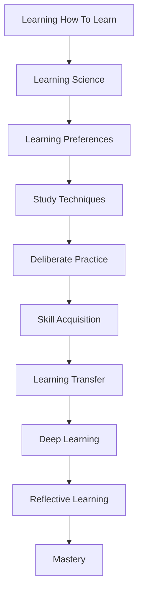

# mqd0mlvpcv8194

# Learning Strategies

## Introduction  
Learning strategies are systematic approaches to acquiring, retaining, and applying knowledge and skills. They are essential for personal and professional growth, enabling individuals to navigate complex information and challenges effectively. This page serves as a roadmap to understanding and mastering learning strategies, connecting foundational concepts to advanced techniques.

## What Are Learning Strategies?  
Learning strategies are methods and techniques used to optimize the learning process. They encompass cognitive, behavioral, and emotional approaches tailored to individual needs and goals. These strategies are not one-size-fits-all but are adaptable to different contexts and learning styles.

## Components of Learning Strategies  
Learning strategies are built on several key components:  
- **Learning How To Learn**: Foundational skills for effective learning.  
- **Learning Science**: The study of how people learn.  
- **Learning Preferences**: Understanding individual learning styles.  
- **Study Techniques**: Practical methods for retaining information.  
- **Deliberate Practice**: Focused, intentional practice to improve skills.  
- **Skill Acquisition**: The process of developing new abilities.  
- **Learning Transfer**: Applying knowledge across different contexts.  
- **Deep Learning**: Mastering complex concepts and connections.  
- **Reflective Learning**: Self-assessment and improvement.  
- **Mastery**: Achieving expertise in a specific area.  

## How Learning Strategies Work Together  
These components are interconnected, forming a holistic learning ecosystem. For example, understanding **Learning Science** informs **Study Techniques**, while **Deliberate Practice** enhances **Skill Acquisition**. **Reflective Learning** ties everything together by fostering continuous improvement.  

## Roadmap to Effective Learning  
1. **Start with Foundations**: Begin with [Learning How To Learn](?topic=Learning%20How%20To%20Learn) and [Learning Science](?topic=Learning%20Science).  
2. **Personalize Your Approach**: Explore [Learning Preferences](?topic=Learning%20Preferences) and [Study Techniques](?topic=Study%20Techniques).  
3. **Build Skills**: Apply [Deliberate Practice](?topic=Deliberate%20Practice) and [Skill Acquisition](?topic=Skill%20Acquisition).  
4. **Apply and Deepen**: Focus on [Learning Transfer](?topic=Learning%20Transfer) and [Deep Learning](?topic=Deep%20Learning).  
5. **Reflect and Master**: Use [Reflective Learning](?topic=Reflective%20Learning) to achieve [Mastery](?topic=Mastery).  

## Learning Strategy Ecosystem  
Learning strategies are universal, applicable across domains and professions. Whether you're a student, professional, or lifelong learner, these strategies enhance problem-solving, creativity, and adaptability.  

## Common Mistakes  
- **Overloading Information**: Trying to learn too much at once without [Study Techniques](?topic=Study%20Techniques).  
- **Lack of Reflection**: Skipping [Reflective Learning](?topic=Reflective%20Learning) leads to missed growth opportunities.  
- **Inconsistent Practice**: Not applying [Deliberate Practice](?topic=Deliberate%20Practice) regularly.  

## Summary  
Learning strategies are the backbone of effective learning, combining science, personalization, and practice. By mastering these strategies, you can achieve expertise in any field and adapt to lifelong learning challenges.  

## Key Takeaways  
- Learning strategies are systematic approaches to optimize learning.  
- They are interconnected and adaptable to individual needs.  
- A structured roadmap ensures consistent progress.  
- These strategies are universal, benefiting all domains and professions.  

## Related KnowHub Pages  
- [Learning How To Learn](?topic=Learning%20How%20To%20Learn)  
- [Learning Science](?topic=Learning%20Science)  
- [Learning Preferences](?topic=Learning%20Preferences)  
- [Study Techniques](?topic=Study%20Techniques)  
- [Deliberate Practice](?topic=Deliberate%20Practice)  
- [Skill Acquisition](?topic=Skill%20Acquisition)  
- [Learning Transfer](?topic=Learning%20Transfer)  
- [Deep Learning](?topic=Deep%20Learning)  
- [Reflective Learning](?topic=Reflective%20Learning)  
- [Mastery](?topic=Mastery)