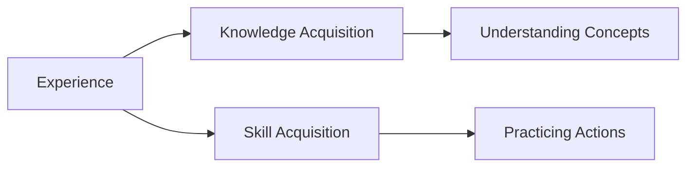

# Learning How to Learn

# Learning How to Learn

## Introduction

**Learning How to Learn** is the process of understanding and mastering the mechanisms of effective learning. It’s about becoming aware of how you learn best and applying proven strategies to acquire knowledge and skills efficiently. This skill is one of the highest-leverage abilities you can develop because it amplifies your capacity to grow in every area of life—career, personal development, and problem-solving.

Despite its importance, most people are never taught how learning actually works. Traditional education often focuses on *what* to learn rather than *how* to learn. This gap leaves many relying on inefficient methods like rote memorization or passive reading. By mastering learning itself, you can accelerate skill acquisition, adapt to new challenges, and stay relevant in a rapidly changing world.

## Why Learning Matters

Learning is a **force multiplier**—it enhances every other skill you develop. In a competitive world, the ability to learn faster and deeper than others is a significant advantage. With the rise of **AI**, routine tasks are increasingly automated, making human adaptability and continuous learning essential.

Learning is not a one-time event but a **lifelong process**. It enables you to navigate uncertainty, solve complex problems, and seize opportunities. In a world where industries evolve rapidly, the ability to learn new skills is the ultimate career insurance.

## The Nature of Learning

Learning is the process of acquiring **knowledge** or **skills** through study, experience, or teaching. It involves creating neural connections in the brain that allow you to recognize patterns, solve problems, and perform tasks.

**Knowledge acquisition** is about understanding concepts, while **skill acquisition** involves practicing actions until they become automatic. For example, learning about photosynthesis (knowledge) is different from learning to play a musical instrument (skill). Both rely on **experience**, but the nature of the experience differs.

## Learning vs Memorization

**Learning** and **memorization** are often confused but serve different purposes. Memorization is the act of retaining information for recall, while learning involves understanding and applying that information.

- **Strengths of Memorization**: Useful for quick recall (e.g., phone numbers, formulas).
- **Weaknesses of Memorization**: Information is easily forgotten without context or application.

**Example**: Memorizing the definition of photosynthesis vs. understanding how it works in a plant’s life cycle.

## Learning vs Understanding

**Surface learning** focuses on superficial details, while **deep learning** involves grasping underlying principles. **Conceptual understanding** allows you to explain ideas in your own words, while **transferable understanding** enables you to apply knowledge in new contexts.

**Example**: Surface learning might involve memorizing historical dates, while deep learning involves understanding the causes and consequences of events.

## Learning vs Skill Development

Learning and skill development are interconnected but distinct:

- **Knowledge acquisition**: Gaining theoretical understanding.
- **Skill acquisition**: Developing the ability to perform tasks.
- **Competency development**: Applying knowledge and skills effectively.
- **Expertise development**: Achieving mastery through deliberate practice.

**Example**: Learning about cooking (knowledge) vs. practicing cooking techniques (skill) vs. becoming a chef (expertise).

## Foundations of Effective Learning

Effective learning relies on several key elements:

- **Attention**: Focusing on relevant information.
- **Curiosity**: Driving intrinsic motivation to explore.
- **Motivation**: Sustaining effort toward goals.
- **Practice**: Reinforcing knowledge through repetition.
- **Reflection**: Evaluating progress and adjusting strategies.
- **Feedback**: Identifying strengths and weaknesses.

Each of these elements plays a critical role in the learning process.

## Learning From First Principles

**First-principles thinking** involves breaking down complex problems into fundamental truths and rebuilding solutions from the ground up. **Mental models** are frameworks for understanding how things work. Together, they enable deeper learning and problem-solving.

**Example**: Understanding the physics of motion (first principle) to design a better car.

## Metacognition

**Metacognition** is "thinking about thinking." It involves monitoring your understanding, identifying knowledge gaps, and adjusting your learning strategies. It’s the self-awareness that transforms passive learning into active engagement.

**Example**: Realizing you don’t fully understand a concept and revisiting it with a different approach.

## Self-Regulated Learning

Self-regulated learning is a cyclical process of **goal setting**, **planning**, **monitoring**, **reflection**, and **continuous improvement**. It empowers you to take control of your learning journey.

**Framework**:
1. Set specific learning goals.
2. Plan how to achieve them.
3. Monitor progress regularly.
4. Reflect on what worked and what didn’t.
5. Adjust strategies for improvement.

## Learning Obstacles

Common obstacles include:

- **Passive learning**: Absorbing information without engagement.
- **Information overload**: Consuming more than you can process.
- **Cognitive overload**: Trying to learn too much at once.
- **Illusion of competence**: Mistaking familiarity for understanding.
- **Procrastination**: Delaying learning due to fear or lack of motivation.

**Solutions**: Active engagement, spaced repetition, and breaking tasks into manageable chunks.

## Evidence-Based Learning Principles

Proven techniques include:

- **Active Recall**: Testing yourself to reinforce memory.
- **Spaced Repetition**: Reviewing material at increasing intervals.
- **Interleaving**: Mixing topics to enhance retention.
- **Elaboration**: Explaining concepts in your own words.
- **Dual Coding**: Combining visuals and text for better understanding.
- **Deliberate Practice**: Focusing on weaknesses with feedback.

These methods work because they engage your brain actively and promote long-term retention.

## Building a Personal Learning System

A sustainable learning system includes:

- **Learning goals**: Clear objectives to guide your efforts.
- **Note-taking**: Capturing key insights for review.
- **Knowledge management**: Organizing information for easy access.
- **Reflection**: Evaluating progress and adjusting strategies.
- **Progress tracking**: Measuring growth over time.

Together, these elements create a feedback loop for continuous improvement.

## Learning in the AI Era

AI tools can enhance learning by:

- **Tutoring**: Providing personalized explanations.
- **Brainstorming**: Generating ideas and insights.
- **Feedback**: Identifying errors and suggesting improvements.

However, it’s crucial to **verify AI-generated information** and avoid overdependence on these tools. Use AI as a supplement, not a replacement, for human thinking.

## Practical Action Plan

### Beginner
1. Set one specific learning goal.
2. Use active recall to test your understanding.
3. Start a simple note-taking system.

### Intermediate
1. Incorporate spaced repetition into your routine.
2. Practice interleaving by mixing topics.
3. Reflect weekly on your progress.

### Advanced
1. Build a knowledge management system (e.g., digital notes).
2. Use AI tools for brainstorming and feedback.
3. Teach others what you’ve learned to reinforce understanding.

## Summary

Learning how to learn is a meta-skill that amplifies your ability to acquire knowledge and skills. By understanding the principles of effective learning, overcoming obstacles, and building a personal learning system, you can become a lifelong learner equipped to thrive in any field.

## Key Takeaways

- Learning is a force multiplier that enhances every other skill.
- Effective learning requires active engagement, reflection, and practice.
- Evidence-based techniques like active recall and spaced repetition maximize retention.
- Metacognition and self-regulated learning empower you to take control of your growth.
- AI tools can enhance learning but should be used thoughtfully.

## Further Reading

- [What Learning Is](?topic=What%20Learning%20Is)
- [How Knowledge Is Built](?topic=How%20Knowledge%20Is%20Built)
- [Learning Science](?topic=Learning%20Science)

## Related KnowHub Pages

- [How Skills Are Developed](?topic=How%20Skills%20Are%20Developed)
- [Metacognition](?topic=Metacognition)
- [Self-Regulated Learning](?topic=Self-Regulated%20Learning)
- [Study Techniques](?topic=Study%20Techniques)
- [Deliberate Practice](?topic=Deliberate%20Practice)
- [Skill Acquisition](?topic=Skill%20Acquisition)