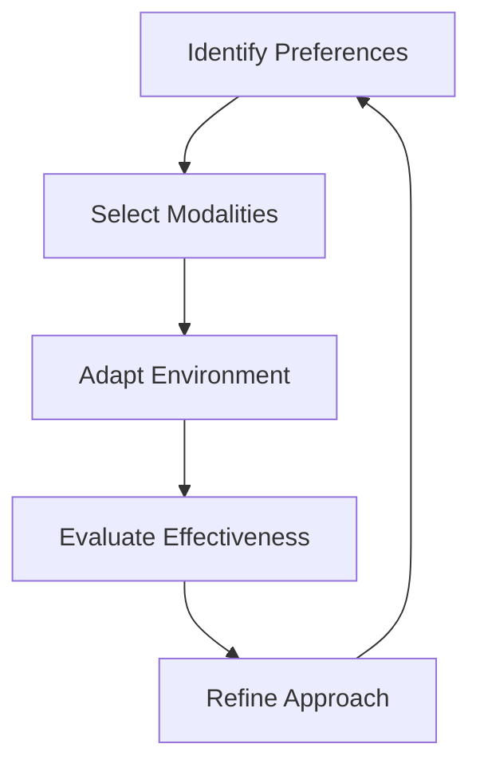

# Learning Preferences

# PAGE: Learning Preferences

# Introduction

Learning preferences refer to the unique ways individuals absorb, process, and retain information. Understanding these preferences is crucial for optimizing learning experiences, whether in academic, professional, or personal contexts. This page explores the various aspects of learning preferences, providing actionable insights to enhance your learning journey.

# Why This Topic Matters

Recognizing and adapting to learning preferences can significantly improve efficiency, engagement, and retention. By aligning learning methods with individual needs, learners can overcome barriers and achieve better outcomes. This knowledge is essential for educators, trainers, and self-directed learners alike.

# Core Concepts

- **Learning Modalities**: Visual, auditory, kinesthetic, and reading/writing styles.  
- **Learning Environment Preferences**: Solo vs. group, structured vs. flexible settings.  
- **Learning Resource Preferences**: Textbooks, videos, interactive tools, etc.  
- **Personalization Strategies**: Tailoring content and methods to individual needs.  
- **Adapting Study Methods**: Flexibility in approach based on preferences and context.  

# Fundamental Principles

1. **Individuality**: Each learner is unique, with distinct preferences and strengths.  
2. **Flexibility**: Effective learning often requires combining multiple modalities.  
3. **Self-Awareness**: Understanding one’s preferences is the first step to optimization.  
4. **Adaptability**: Preferences may evolve over time or with different subjects.  

# Mental Models

# Frameworks and Methodologies

- **VARK Model**: Categorizes learners into Visual, Auditory, Reading/Writing, and Kinesthetic types.  
- **Multiple Intelligences Theory**: Identifies linguistic, logical-mathematical, spatial, etc., intelligences.  
- **Universal Design for Learning (UDL)**: Provides flexible learning options to accommodate diverse needs.  

# Practical Examples

1. **Visual Learner**: Uses diagrams, charts, and videos to grasp concepts.  
2. **Auditory Learner**: Benefits from lectures, podcasts, and group discussions.  
3. **Kinesthetic Learner**: Learns best through hands-on activities and experiments.  

# Real-World Applications

- **Education**: Teachers design lessons to cater to diverse learning styles.  
- **Workplace Training**: Trainers use varied resources to engage employees.  
- **Self-Directed Learning**: Individuals choose tools and environments that suit their preferences.  

# Common Mistakes

1. **One-Size-Fits-All Approach**: Ignoring individual preferences leads to disengagement.  
2. **Over-Reliance on One Modality**: Limiting learning methods reduces effectiveness.  
3. **Lack of Self-Assessment**: Failing to identify personal preferences hinders progress.  

# Best Practices

1. **Assess Preferences**: Use tools like the VARK questionnaire to identify styles.  
2. **Experiment**: Try different modalities to discover what works best.  
3. **Combine Methods**: Integrate visual, auditory, and kinesthetic elements for comprehensive learning.  

# AI-Assisted Learning

AI tools can personalize learning experiences by:  
- Recommending resources based on preferences.  
- Adapting content delivery in real-time.  
- Providing feedback to refine learning strategies.  

# Practical Action Plan

1. **Identify Your Preferences**: Take a learning style assessment.  
2. **Create a Plan**: Choose resources and environments that align with your style.  
3. **Monitor Progress**: Track effectiveness and adjust as needed.  
4. **Seek Feedback**: Consult mentors or peers for insights.  

# Summary

Learning preferences are the cornerstone of effective learning. By understanding and adapting to individual needs, learners can maximize engagement, retention, and success. This knowledge empowers both learners and educators to create tailored, impactful learning experiences.

# Key Takeaways

- Learning preferences encompass modalities, environments, and resource choices.  
- Personalization and adaptability are key to optimizing learning.  
- Assessing and experimenting with different methods enhances effectiveness.  

# Further Reading

- [Learning How To Learn](?topic=Learning%20How%20To%20Learn)  
- [Learning Science](?topic=Learning%20Science)  

# Related KnowHub Pages

- [Metacognition](?topic=Metacognition)  
- [Self-Regulated Learning](?topic=Self-Regulated%20Learning)  
- [Evidence-Based Learning](?topic=Evidence-Based%20Learning)