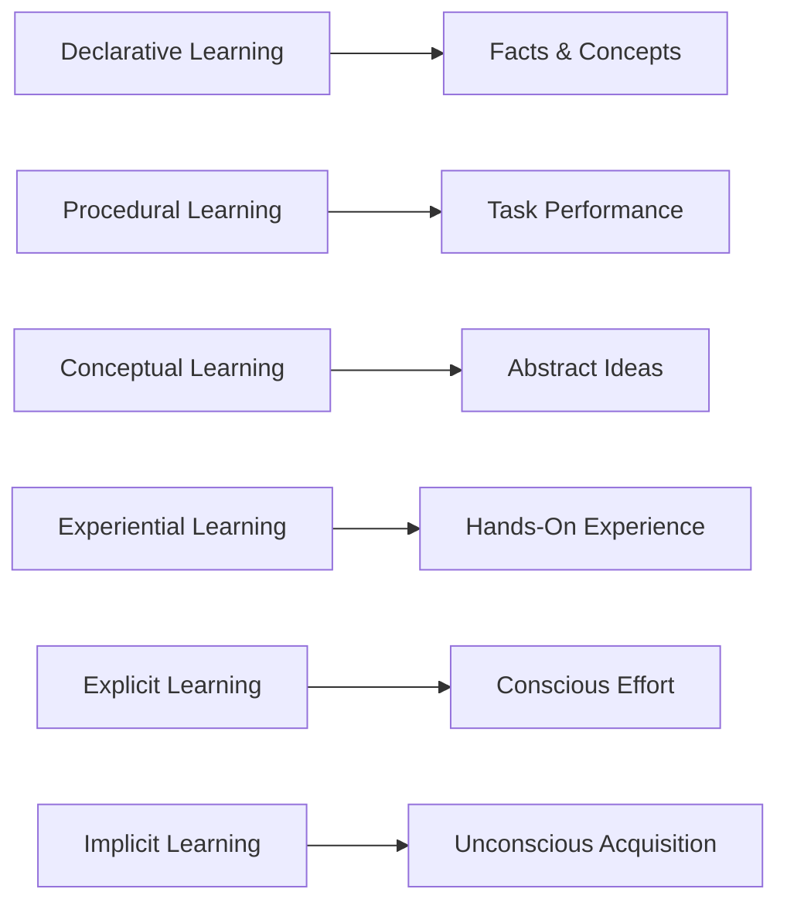

# mqd14kvk9b1cn8

# What Learning Is

## Introduction  
Learning is a fundamental process that shapes our lives, careers, and societies. It is the cornerstone of personal growth, professional development, and innovation. This page explores what learning truly means, how it differs from related concepts, and its various forms and processes. Whether you're a beginner or an advanced learner, this guide will deepen your understanding of learning itself.

## Defining Learning  
Learning is the acquisition of knowledge, skills, behaviors, values, or preferences through study, experience, or being taught. It is a lifelong process that occurs consciously and unconsciously, formally and informally. At its core, learning involves change—a transformation in how we think, act, or perceive the world.

## Why Learning Matters  
Learning is essential for:  
- **Personal Growth**: Expands your knowledge and capabilities.  
- **Career Advancement**: Enhances your skills and employability.  
- **Problem-Solving**: Equips you to tackle challenges effectively.  
- **Adaptation**: Helps you navigate an ever-changing world.  

## Learning vs Memorization  
**Learning** involves understanding and applying knowledge, while **memorization** focuses on retaining information without necessarily comprehending it. For example, learning how to solve equations is different from memorizing the multiplication table.

## Learning vs Understanding  
**Learning** is the process of acquiring knowledge, whereas **understanding** is the ability to interpret and apply that knowledge meaningfully. Learning lays the foundation, while understanding builds upon it.

## Learning vs Skill Development  
**Learning** is broader and includes acquiring knowledge, attitudes, and behaviors. **Skill development** is a subset of learning, focusing specifically on the ability to perform tasks effectively.

## Types of Learning  

### Declarative Learning  
Involves learning facts and concepts. Example: Memorizing the capital of France.  

### Procedural Learning  
Focuses on learning how to perform tasks. Example: Learning to ride a bike.  

### Conceptual Learning  
Involves understanding abstract ideas and relationships. Example: Grasping the concept of gravity.  

### Experiential Learning  
Learning through hands-on experience. Example: Conducting a science experiment.  

### Explicit Learning  
Conscious and intentional learning. Example: Studying for an exam.  

### Implicit Learning  
Unconscious and unintentional learning. Example: Picking up a language by immersion.  

## The Learning Process  
The learning process typically involves:  
1. **Exposure**: Encountering new information.  
2. **Engagement**: Actively interacting with the material.  
3. **Reflection**: Thinking critically about what was learned.  
4. **Application**: Using the knowledge in real-world contexts.  

## How Humans Learn  
Humans learn through:  
- **Observation**: Watching and imitating others.  
- **Practice**: Repeating tasks to build mastery.  
- **Feedback**: Receiving input to improve performance.  
- **Association**: Connecting new information to existing knowledge.  

## Learning Across Different Domains  
Learning occurs in various domains:  
- **Cognitive**: Intellectual learning (e.g., solving puzzles).  
- **Affective**: Emotional learning (e.g., developing empathy).  
- **Psychomotor**: Physical learning (e.g., playing a sport).  

## Common Misconceptions About Learning  
- **Misconception**: Learning is only for children.  
  **Reality**: Learning is a lifelong process.  
- **Misconception**: Intelligence is fixed.  
  **Reality**: Intelligence can be developed through learning.  
- **Misconception**: Failure is bad for learning.  
  **Reality**: Failure is a critical part of the learning process.  

## Real-World Examples  
- **Language Learning**: Acquiring a new language through immersion.  
- **Professional Training**: Mastering a software tool for work.  
- **Personal Development**: Learning mindfulness techniques for stress reduction.  

## AI-Assisted Learning  
AI enhances learning through:  
- **Personalized Content**: Tailoring material to individual needs.  
- **Interactive Tools**: Providing real-time feedback and practice.  
- **Data Analysis**: Identifying learning gaps and strengths.  

## Practical Action Plan  
1. **Set Clear Goals**: Define what you want to learn.  
2. **Choose Effective Methods**: Use techniques like spaced repetition or active recall.  
3. **Practice Regularly**: Consistency is key to mastery.  
4. **Seek Feedback**: Continuously improve through constructive input.  

## Summary  
Learning is a multifaceted process that involves acquiring knowledge, skills, and behaviors. It differs from memorization, understanding, and skill development but is interconnected with them. By understanding the types, processes, and misconceptions of learning, you can become a more effective learner.

## Key Takeaways  
- Learning is a lifelong, transformative process.  
- It involves both conscious and unconscious acquisition of knowledge.  
- Different types of learning cater to various needs and contexts.  
- Effective learning requires active engagement, practice, and reflection.  

## Further Reading  
- [How Knowledge Is Built](?topic=How%20Knowledge%20Is%20Built)  
- [Learning Science](?topic=Learning%20Science)  

## Related KnowHub Pages  
- [How Skills Are Developed](?topic=How%20Skills%20Are%20Developed)  
- [Metacognition](?topic=Metacognition)