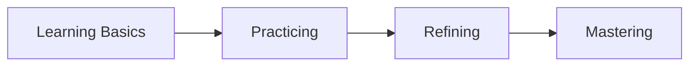

# How Skills Are Developed

# How Skills Are Developed

## Introduction  
Skill development is a lifelong journey that empowers individuals to grow personally and professionally. Whether you’re learning to code, write, or play an instrument, understanding how skills are developed is key to mastering any domain. This page breaks down the process, from foundational concepts to advanced strategies, ensuring you can apply these principles to any skill.

## What Is a Skill?  
A skill is the ability to perform a task or activity with proficiency, often acquired through practice and experience. Skills can be cognitive (e.g., problem-solving), technical (e.g., programming), or physical (e.g., playing a sport). They are distinct from innate talents, as they require effort and learning.

## Knowledge vs Skills  
**Knowledge** is theoretical understanding, while **skills** are practical applications of that knowledge. For example, knowing how to write code (knowledge) is different from being able to build a functional app (skill). Both are essential, but skills focus on execution.

## The Skill Acquisition Process  
Skill development follows a structured process:  
1. **Learning the Basics**: Understanding core concepts.  
2. **Practicing**: Applying knowledge through repetition.  
3. **Refining**: Improving through feedback and error correction.  
4. **Mastering**: Achieving expertise and consistency.  

## Stages of Skill Development  
Skill development progresses through distinct stages:  

### 1. **Novice**  
- Relies on rules and step-by-step instructions.  
- Example: A beginner programmer copying code snippets without understanding.  

### 2. **Advanced Beginner**  
- Begins to recognize patterns and apply knowledge in simple scenarios.  
- Example: A writer structuring essays with basic frameworks.  

### 3. **Competent**  
- Works more independently but still relies on conscious effort.  
- Example: A musician playing a piece with minimal errors but lacking fluidity.  

### 4. **Proficient**  
- Performs tasks with ease and adapts to new challenges.  
- Example: A public speaker engaging an audience without relying on notes.  

### 5. **Expert**  
- Demonstrates mastery, intuition, and creativity.  
- Example: A sports athlete making split-second decisions under pressure.  

## Deliberate Practice  
[Deliberate Practice](?topic=Deliberate%20Practice) is focused, intentional training aimed at improving specific weaknesses. It involves:  
- Setting clear goals.  
- Pushing beyond comfort zones.  
- Receiving feedback.  

## Feedback Loops  
Feedback is essential for growth. It helps identify mistakes and areas for improvement. Effective feedback loops include:  
1. **Self-Assessment**: Reflecting on performance.  
2. **Peer Review**: Input from others.  
3. **Mentor Guidance**: Expert advice.  

## Error Correction  
Mistakes are opportunities to learn. Error correction involves:  
- Analyzing errors.  
- Adjusting strategies.  
- Practicing corrected techniques.  

## Building Expertise  
Expertise requires:  
- **Consistency**: Regular practice over time.  
- **Depth**: Focusing on specific areas.  
- **Reflection**: Continuously evaluating progress.  

## Skill Transfer  
Skill transfer is applying knowledge from one domain to another. For example, problem-solving skills in programming can enhance logical thinking in writing.  

## Common Mistakes in Skill Development  
1. **Lack of Focus**: Spreading efforts too thin.  
2. **Avoiding Challenges**: Staying in the comfort zone.  
3. **Ignoring Feedback**: Failing to learn from mistakes.  

## Real-World Examples  
- **Programming**: Moving from copying code to building original projects.  
- **Writing**: Transitioning from basic essays to complex narratives.  
- **Public Speaking**: Progressing from scripted speeches to impromptu talks.  
- **Sports**: Advancing from drills to competitive play.  
- **Music**: Shifting from reading sheet music to improvising.  

## AI-Assisted Learning  
AI tools can enhance skill development by:  
- Providing personalized feedback.  
- Offering adaptive learning paths.  
- Simulating real-world scenarios.  

## Practical Action Plan  
1. **Identify a Skill**: Choose what you want to develop.  
2. **Set Goals**: Define specific, measurable objectives.  
3. **Practice Deliberately**: Focus on improvement, not just repetition.  
4. **Seek Feedback**: Regularly assess your progress.  
5. **Reflect and Adjust**: Continuously refine your approach.  

## Summary  
Skill development is a structured process involving learning, practice, feedback, and refinement. By understanding the stages of skill acquisition and applying strategies like deliberate practice, anyone can progress from novice to expert.

## Key Takeaways  
- Skills are learned abilities, distinct from knowledge.  
- Skill development progresses through novice, advanced beginner, competent, proficient, and expert stages.  
- Deliberate practice and feedback loops are critical for growth.  
- Expertise requires consistency, depth, and reflection.  

## Further Reading  
- [Skill Acquisition](?topic=Skill%20Acquisition)  
- [Learning Transfer](?topic=Learning%20Transfer)  

## Related KnowHub Pages  
- [Deliberate Practice](?topic=Deliberate%20Practice)  
- [Skill Acquisition](?topic=Skill%20Acquisition)  
- [Learning Transfer](?topic=Learning%20Transfer)  
- [Mastery](?topic=Mastery)