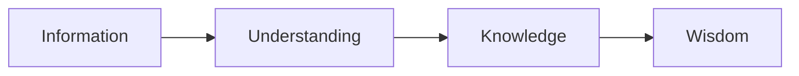

# mqd14kvl2cv1ej

# How Knowledge Is Built

## Introduction  
Knowledge is the foundation of human progress, yet understanding how it is built remains a complex and fascinating topic. This page explores the processes, mechanisms, and strategies behind knowledge construction, from foundational concepts to advanced techniques. Whether you're a beginner or an advanced learner, this guide will equip you with the tools to build and apply knowledge effectively.

## What Is Knowledge?  
Knowledge is the practical and theoretical understanding of a subject, acquired through experience, education, or study. It goes beyond mere information, encompassing the ability to apply insights to solve problems or make decisions.

## Information vs Understanding vs Knowledge vs Wisdom  
- **Information**: Raw data or facts (e.g., "The sky is blue").  
- **Understanding**: Comprehension of relationships between facts (e.g., "The sky is blue because of Rayleigh scattering").  
- **Knowledge**: Structured understanding applied in context (e.g., using weather patterns to predict storms).  
- **Wisdom**: The ability to apply knowledge judiciously (e.g., balancing short-term gains with long-term sustainability).  

## Knowledge Construction  
Knowledge is built through active processes like learning, reasoning, and experience. It involves connecting new information to existing mental frameworks, a process known as **knowledge construction**.

## Mental Models  
Mental models are internal representations of how things work. They simplify complexity and guide decision-making. For example, a mental model of a car includes its components and how they interact.

## Schema Formation  
Schemas are mental structures that organize knowledge. They develop through repeated exposure and help us interpret new information. For instance, a schema for "restaurant" includes expectations about menus, seating, and service.

## Knowledge Networks  
Knowledge is interconnected. **Knowledge networks** are webs of related concepts. Strengthening these connections enhances understanding and recall. For example, linking "photosynthesis" to "chlorophyll," "sunlight," and "carbon dioxide."

## Knowledge Integration  
Integration involves combining disparate pieces of knowledge into a cohesive whole. It requires synthesizing information from multiple sources and disciplines. For example, integrating biology, chemistry, and physics to understand climate change.

## Building Accurate Understanding  
Accurate understanding requires critical thinking, verification, and updating knowledge based on new evidence. Avoid cognitive biases like confirmation bias and rely on credible sources.

## Common Sources of Misunderstanding  
- **Overgeneralization**: Applying specific knowledge too broadly.  
- **Misinterpretation**: Misreading context or intent.  
- **Cognitive Load**: Overwhelming the mind with too much information at once.  

## Knowledge Transfer  
Knowledge transfer is the process of sharing knowledge between individuals or groups. Effective methods include teaching, mentoring, and documentation. For example, a mentor transferring coding skills to a junior developer.

## Knowledge Compounding  
Knowledge compounds over time as new insights build on existing foundations. Consistent learning and practice accelerate this process. For example, mastering algebra before tackling calculus.

## Real-World Examples  
1. **Medical Diagnosis**: Doctors integrate symptoms, test results, and patient history to diagnose illnesses.  
2. **Engineering Design**: Engineers combine physics, materials science, and practical experience to create structures.  

## AI-Assisted Learning  
AI tools like chatbots, adaptive learning platforms, and knowledge graphs enhance learning by personalizing content, providing instant feedback, and organizing information.

## Practical Action Plan  
1. **Identify Gaps**: Assess your current knowledge and identify areas for improvement.  
2. **Active Learning**: Engage with material through note-taking, teaching others, and applying concepts.  
3. **Build Networks**: Connect with experts and peers to expand your knowledge base.  
4. **Reflect and Review**: Regularly revisit and update your understanding.  

## Summary  
Knowledge is built through active processes like learning, reasoning, and integration. It relies on mental models, schemas, and networks, and is enhanced by critical thinking and consistent practice. Understanding these mechanisms empowers you to learn more effectively and apply knowledge in real-world contexts.

## Key Takeaways  
- Knowledge is structured, applied understanding, distinct from information and wisdom.  
- Mental models and schemas organize and simplify complex information.  
- Knowledge networks and integration are essential for deep understanding.  
- Accurate knowledge requires critical thinking and avoiding common pitfalls.  
- AI tools and practical strategies accelerate knowledge building.  

## Further Reading  
- *The Art of Learning* by Josh Waitzkin  
- *Make It Stick: The Science of Successful Learning* by Peter C. Brown  

## Related KnowHub Pages  
- [What Learning Is](?topic=What%20Learning%20Is)  
- [Learning Science](?topic=Learning%20Science)  
- [Metacognition](?topic=Metacognition)  
- [Knowledge Management](?topic=Knowledge%20Management)