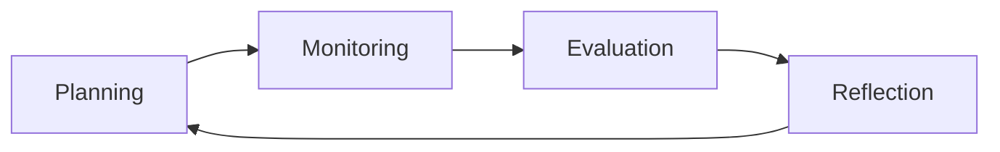

# Metacognition

# Metacognition

## Introduction
Metacognition, often referred to as "thinking about thinking," is a powerful tool for enhancing learning, problem-solving, and decision-making. This page provides a comprehensive guide to understanding and applying metacognition across various domains, from education to professional development.

## What Is Metacognition

### Definition
Metacognition is the awareness and understanding of one's own thought processes and learning strategies. It involves actively managing how you learn, solve problems, and make decisions.

### Origins of the Concept
The term was coined by John Flavell in the 1970s, building on earlier psychological theories about self-awareness and cognitive processes.

### Why It Matters
Metacognition improves learning efficiency, fosters critical thinking, and enhances problem-solving skills. It’s essential for lifelong learning and professional growth.

### The Role of Self-Awareness in Learning
Self-awareness is the foundation of metacognition. It enables you to recognize your strengths, weaknesses, and thought patterns, allowing for targeted improvement.

## Thinking About Thinking

### Awareness of Thought Processes
Metacognition involves observing how you think, learn, and solve problems. This awareness helps identify inefficiencies and areas for improvement.

### Monitoring Understanding
Regularly assess your comprehension of a topic. Ask yourself, "Do I truly understand this?"

### Monitoring Performance
Track your progress and performance in tasks. This helps in identifying what works and what doesn’t.

### Identifying Misconceptions
Recognize and correct misunderstandings early to prevent knowledge gaps.

## Components of Metacognition

### Metacognitive Knowledge
Awareness of yourself, tasks, and strategies.

### Metacognitive Monitoring
Assessing your understanding and performance.

### Metacognitive Control
Adjusting strategies and resources to optimize learning and problem-solving.

## Metacognitive Knowledge

### Knowledge of Self
Understand your learning style, strengths, and weaknesses.

### Knowledge of Tasks
Recognize the demands and requirements of a task.

### Knowledge of Strategies
Be aware of effective learning and problem-solving strategies.

## Metacognitive Monitoring

### Self-Questioning
Ask yourself questions to gauge understanding, e.g., "What does this mean?" or "How does this relate to what I already know?"

### Progress Monitoring
Regularly check your progress toward goals.

### Understanding Checks
Use quizzes, summaries, or explanations to test comprehension.

### Learning Diagnostics
Identify areas where learning is weak and address them proactively.

## Metacognitive Control

### Strategy Selection
Choose the most effective strategies for a given task.

### Strategy Adjustment
Modify strategies based on feedback and progress.

### Resource Allocation
Manage time, effort, and tools efficiently.

### Course Correction
Make necessary adjustments to stay on track.

## Metacognition During Learning

### Planning
Set clear goals and plan how to achieve them.

### Monitoring
Continuously assess your understanding and progress.

### Evaluation
Reflect on what worked and what didn’t.

### Reflection
Analyze your learning process to improve future performance.

## Metacognition During Problem Solving

### Identifying Assumptions
Question underlying assumptions to ensure they are valid.

### Evaluating Approaches
Assess the effectiveness of different problem-solving methods.

### Error Detection
Identify and correct mistakes early.

### Decision-Making
Use metacognition to make informed, thoughtful decisions.

## Common Cognitive Biases

### Illusion of Competence
Overestimating your understanding or ability.

### Overconfidence
Excessive confidence in incorrect beliefs or decisions.

### Confirmation Bias
Favoring information that confirms preexisting beliefs.

### Dunning-Kruger Effect
Low-ability individuals overestimating their ability due to lack of self-awareness.

## Improving Metacognition

### Reflection
Regularly reflect on your learning and problem-solving processes.

### Learning Journals
Document your thoughts, progress, and insights.

### Self-Testing
Use quizzes, flashcards, or practice problems to assess understanding.

### Peer Feedback
Seek input from others to gain new perspectives.

### Teaching Others
Explaining concepts to others reinforces your own understanding.

## Metacognition and AI

### Using AI for Self-Evaluation
Leverage AI tools to assess your knowledge and identify gaps.

### Verifying AI Responses
Critically evaluate AI-generated content for accuracy and relevance.

### Avoiding Blind Trust
Don’t rely solely on AI; use it as a supplement to your own thinking.

### Developing Critical Thinking
Use AI interactions to sharpen your analytical skills.

## Real-World Applications

### Education
Students use metacognition to improve study habits and exam performance.

### Programming
Developers reflect on coding strategies to write efficient, bug-free code.

### Business
Leaders use metacognition for strategic planning and decision-making.

### Leadership
Effective leaders monitor their decision-making processes and adjust as needed.

### Research
Researchers reflect on methodologies to ensure robust and reliable findings.

## Practical Action Plan

### Beginner Practices
- Start a learning journal.
- Use self-questioning during study sessions.

### Intermediate Practices
- Incorporate peer feedback into your learning process.
- Experiment with different learning strategies.

### Advanced Practices
- Teach others to reinforce your understanding.
- Use AI tools for self-evaluation and critical thinking.

## Summary
Metacognition is a transformative skill that enhances learning, problem-solving, and decision-making. By developing metacognitive awareness, monitoring, and control, you can optimize your cognitive processes and achieve greater success in both personal and professional domains.

## Key Takeaways
- Metacognition involves thinking about your thinking.
- It consists of metacognitive knowledge, monitoring, and control.
- Practical strategies include reflection, self-testing, and peer feedback.
- Metacognition is applicable across education, business, and beyond.

## Further Reading
- [Exact Topic Title](?topic=Exact%20Topic%20Title)

## Related KnowHub Pages
- [What Learning Is](?topic=What%20Learning%20Is)
- [How Knowledge Is Built](?topic=How%20Knowledge%20Is%20Built)
- [Self-Regulated Learning](?topic=Self-Regulated%20Learning)
- [Learning Science](?topic=Learning%20Science)
- [Reflective Learning](?topic=Reflective%20Learning)