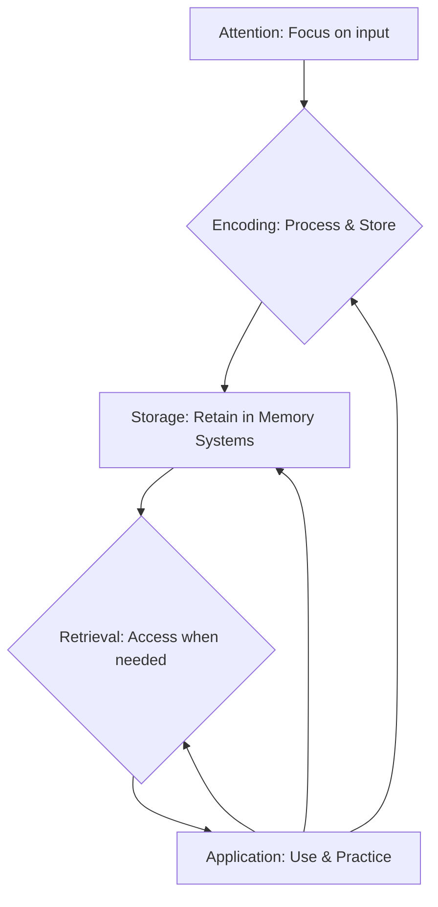
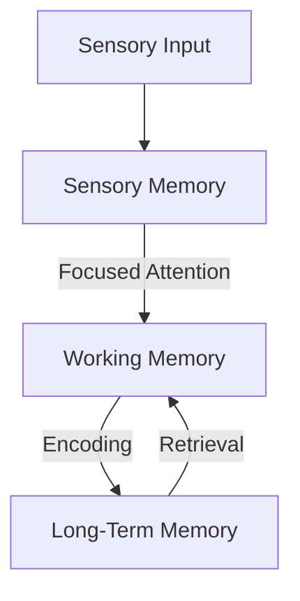

# mqd14kvmzmbc2c

# Learning Science

## Introduction

Welcome to the foundational guide on **Learning Science** – an essential topic for anyone seeking to master the art and science of effective learning. Whether you're a student, an educator, a professional aiming for career growth, or simply curious about how your brain works, understanding the principles of learning science will unlock your full potential.

### What Learning Science Is

Learning Science is an interdisciplinary field dedicated to understanding how humans learn. It leverages scientific research from diverse disciplines to uncover the mechanisms behind knowledge acquisition, skill development, retention, and transfer. Instead of relying on intuition or tradition, learning science employs rigorous empirical methods to identify what truly works in learning.

### Why Learning Science Matters

In a world brimming with information and rapidly evolving skill demands, the ability to learn effectively is paramount. Learning science provides evidence-based strategies that enable us to:
*   **Learn more efficiently:** Reduce wasted effort and time.
*   **Retain information longer:** Combat forgetting and build durable knowledge.
*   **Understand deeply:** Move beyond superficial memorization to true comprehension.
*   **Apply knowledge effectively:** Transfer what's learned to real-world situations.
*   **Develop expertise faster:** Build complex skills systematically.

### The Relationship Between Psychology, Neuroscience, Education, and Learning

Learning science sits at the intersection of several critical fields:
*   **Cognitive Psychology:** Explores mental processes such as memory, attention, problem-solving, and language. It provides frameworks for understanding how information is processed and stored.
*   **Neuroscience:** Investigates the biological basis of learning, examining how the brain's structure and function change during learning, particularly through concepts like neuroplasticity.
*   **Education:** Focuses on the practical application of learning principles in instructional design, curriculum development, and teaching methodologies.

Together, these fields form a powerful synergy, informing how we design learning experiences, develop study strategies, and assess comprehension.

### Why Understanding Learning Science Improves Learning Outcomes

By understanding the scientific principles of learning, you move from passive consumption to active engagement. You gain the power to choose and implement strategies that are scientifically proven to be effective, rather than relying on outdated or ineffective methods. This leads to higher achievement, deeper understanding, and greater confidence in your learning journey.

## The Science of Learning

Learning isn't merely about absorbing information; it's an active, dynamic process that fundamentally alters your brain.

### What Happens When Learning Occurs

At its core, learning involves forming and strengthening connections within the brain. When you encounter new information or practice a skill, specific neural pathways are activated. The more consistently these pathways are used, the stronger and more efficient they become.

### How the Brain Changes During Learning

The brain is remarkably adaptable, a property known as [Neuroplasticity](?topic=Neuroplasticity). During learning:
*   **Synaptic Strengthening:** The junctions (synapses) between neurons become more efficient at transmitting signals. This is often summarized as "neurons that fire together, wire together."
*   **Formation of New Connections:** New synaptic connections can form, creating novel pathways for information flow.
*   **Structural Changes:** Over time, learning can lead to changes in the size and organization of specific brain regions.

### How Knowledge and Skills Are Formed

Knowledge and skills are formed through a continuous cycle of encoding, consolidation, and retrieval:
1.  **Encoding:** Transforming sensory input into a format the brain can store.
2.  **Consolidation:** Stabilizing these encoded memories over time, moving them from temporary to more durable storage, often involving sleep.
3.  **Retrieval:** Accessing and reactivating stored knowledge or skills when needed. Each successful retrieval strengthens the memory trace.

### Why Learning Is An Active Process

Unlike a computer downloading data, human learning requires active engagement. You cannot simply "upload" knowledge. Your brain must actively work to make sense of new information, connect it to what you already know, and practice retrieving it. Passive activities like listening to lectures or rereading notes without deeper processing are significantly less effective.

## The Learning Process

The journey from encountering new information to mastery can be broken down into several interconnected stages.

### The Learning Process Stages



1.  **Attention:** This is the gatekeeper of learning. We are constantly bombarded with sensory information, but only a fraction of it receives our attention. Focused attention is crucial for information to even begin the journey into our memory systems. Without attention, encoding cannot occur effectively.
2.  **Encoding:** Once attention is focused, the brain transforms incoming information into a mental representation that can be stored. The depth of encoding matters:
    *   **Shallow Encoding:** Focusing on surface features (e.g., memorizing words by sound).
    *   **Deep Encoding:** Connecting new information to existing knowledge, understanding its meaning, and relating it to personal experiences (e.g., explaining a concept in your own words). Deeper encoding leads to more robust and retrievable memories.
3.  **Storage:** This refers to the retention of encoded information over time within various memory systems. How long and how well information is stored depends heavily on the effectiveness of encoding and subsequent consolidation processes.
4.  **Retrieval:** The act of accessing and bringing stored information back into conscious awareness. Retrieval is not just recalling; it's a powerful learning event itself. Each successful retrieval strengthens the memory trace, making it easier to access in the future. Difficult but successful retrieval is particularly potent.
5.  **Application:** The ultimate goal of learning is to use knowledge and skills in real-world contexts. Applying what you've learned through problem-solving, creating, or teaching others reinforces understanding, reveals gaps in knowledge, and solidifies the learning process. Repeated application is critical for developing expertise.

## Memory Systems

Our ability to learn and remember relies on the intricate interplay of different memory systems, each with distinct characteristics and functions.



### Sensory Memory

*   **Definition:** The initial, fleeting stage of memory that briefly holds raw sensory information (sights, sounds, smells, etc.) for a fraction of a second to a few seconds.
*   **Characteristics:** High capacity but very short duration. It acts as a buffer, allowing the brain a moment to select what to pay attention to.
*   **Example:** The brief afterimage of a flash of light, or the echo of a sound immediately after it ceases.

### Working Memory

*   **Definition:** A temporary storage system that actively processes and manipulates information from sensory memory or retrieved from long-term memory. It's often thought of as the "mental workspace" of the brain.
*   **Characteristics:** Limited capacity (typically around 4-7 chunks of information) and short duration (around 15-30 seconds without rehearsal).
*   **Interaction:** Information must pass through working memory to be consciously processed and encoded into long-term memory. Conversely, information retrieved from long-term memory is brought back into working memory for use.

### Long-Term Memory

*   **Definition:** A vast and relatively permanent storage system for knowledge, skills, and experiences.
*   **Characteristics:** Potentially limitless capacity and duration. It's where all our accumulated learning resides.
*   **Interaction:** Long-term memory is the repository from which we retrieve information into working memory for active use, and it's where new, deeply encoded information is consolidated for lasting retention.

These three systems work in concert to allow us to perceive, process, understand, and remember the world around us.

## Cognitive Architecture

The term "cognitive architecture" refers to the fundamental structure and organization of the human mind that supports its various cognitive processes, including learning, memory, and problem-solving.

### Human Cognitive Architecture

Imagine the brain as a complex processing unit with specific mechanisms for handling information. Cognitive architecture describes how these mechanisms are arranged and how they interact to give rise to intelligent behavior. It's a conceptual model of how our minds are built to process information.

### Information Processing

Our cognitive architecture is designed for information processing. This involves:
1.  **Input:** Receiving sensory data from the environment.
2.  **Processing:** Transforming, interpreting, and integrating this data.
3.  **Storage:** Placing processed information into memory.
4.  **Retrieval:** Accessing stored information.
5.  **Output:** Generating responses (thoughts, actions, speech).
Learning science helps us understand how to optimize each step in this information flow.

```mermaid
graph TD
    A[Sensory Input] --> B[Perception & Attention]
    B --> C[Working Memory (Active Processing)]
    C -- Encoding & Consolidation --> D[Long-Term Memory (Stored Knowledge)]
    D -- Retrieval --> C
    C --> E[Problem Solving & Decision Making]
    E --> F[Behavioral Output]
```

### Mental Representations

For our brains to process and store information, it must be represented in some form. **Mental representations** are the internal symbols or models we create to stand for external objects, events, or abstract concepts. These can be:
*   **Images:** Visual representations.
*   **Propositions:** Abstract statements of facts (e.g., "Paris is the capital of France").
*   **Schemas:** Organized knowledge structures (see below).
*   **Scripts:** Mental models for sequences of events.

Effective learning involves forming rich, accurate, and interconnected mental representations.

### Knowledge Structures

Knowledge is not stored randomly; it's highly organized into **knowledge structures**. These are frameworks that link related pieces of information, allowing for efficient retrieval and application. The most prominent example is the [Schema Formation](?topic=Schema%20Formation). Other structures include semantic networks (webs of interconnected concepts) and mental models (internal simulations of how something works). The better organized your knowledge structures, the more effectively you can learn new information and solve problems.

## Working Memory

Working memory is a cornerstone of conscious thought and learning.

### Definition

[Working Memory](?topic=Working%20Memory) refers to the cognitive system responsible for temporarily holding and manipulating information needed to carry out complex cognitive tasks such as learning, reasoning, and comprehension. It's where conscious processing happens.

### Characteristics

*   **Active Processing:** It's not just storage; it's active manipulation of information.
*   **Limited Capacity:** It can only hold a small amount of information at any given time.
*   **Limited Duration:** Information fades quickly if not actively rehearsed or encoded.

### Capacity Limitations

A classic estimate by George Miller suggests that working memory can typically hold about "seven plus or minus two" chunks of information. More recent research often places this number closer to four chunks. A "chunk" is a meaningful unit of information, which can be a single letter, a word, or even a complex concept if it's familiar. This limitation highlights why breaking down complex topics into smaller, manageable parts is crucial for learning.

### Importance During Learning

Working memory is vital for:
*   **Comprehension:** Understanding sentences, paragraphs, or spoken instructions.
*   **Problem-solving:** Holding elements of a problem in mind while considering solutions.
*   **Planning:** Juggling multiple steps or considerations for a task.
*   **Encoding:** Processing new information before it moves to long-term memory.

Overloading working memory ([Cognitive Load](?topic=Cognitive%20Load)) is a common barrier to effective learning.

For a deeper dive into this critical cognitive system, please refer to the dedicated page on [Working Memory](?topic=Working%20Memory).

## Long-Term Memory

While working memory handles immediate processing, [Long-Term Memory](?topic=Long-Term%20Memory) is the vast repository of all our lasting knowledge and skills.

### Definition

[Long-Term Memory](?topic=Long-Term%20Memory) is the memory system responsible for the permanent or semi-permanent storage of information, experiences, and skills. It has an essentially unlimited capacity and duration.

### Knowledge Storage

Long-term memory stores different types of knowledge:
*   **Declarative Memory (Explicit):** Knowledge that can be consciously recalled and verbalized.
    *   **Semantic Memory:** General knowledge about the world (facts, concepts, language).
    *   **Episodic Memory:** Memories of specific events and experiences, often tied to a time and place.
*   **Procedural Memory (Implicit):** Knowledge of how to do things (skills, habits), often without conscious recall.

### Expertise Development

Expertise is largely a function of a highly developed and richly interconnected long-term memory. Experts possess:
*   **Vast Stores of Domain-Specific Knowledge:** They have more facts and concepts stored.
*   **Organized Knowledge Structures (Schemas):** Their knowledge is organized into efficient, accessible schemas that allow for faster retrieval and deeper understanding.
*   **Highly Developed Procedural Memory:** They can execute complex skills automatically and effortlessly.

### Memory Organization

Information in long-term memory is not just a random collection of items. It's highly organized into complex networks, schemas, and mental models. New information is most effectively learned when it can be integrated into existing structures, making connections that facilitate later retrieval.

To explore the intricacies of durable knowledge storage, visit the dedicated page on [Long-Term Memory](?topic=Long-Term%20Memory).

## Schema Formation

[Schema Formation](?topic=Schema%20Formation) is a fundamental concept in cognitive science that explains how we organize and make sense of the world.

### What Schemas Are

Schemas (plural: schemata) are mental frameworks or organized patterns of thought and behavior that categorize and interpret information. They are like mental blueprints or folders in your brain, each containing related concepts, facts, and experiences about a particular topic, object, person, or situation.

### Why Schemas Matter

Schemas are crucial because they:
*   **Increase Processing Efficiency:** They allow us to quickly process new information by fitting it into pre-existing categories, reducing cognitive load.
*   **Aid Comprehension:** They help us understand new information by providing a context and a framework for interpretation.
*   **Guide Expectation and Prediction:** They allow us to make predictions about what will happen in a given situation.
*   **Facilitate Retrieval:** Information organized into schemas is easier to access and recall from long-term memory.

### How Schemas Develop

Schemas develop through experience. Each new encounter with a concept, person, or situation refines and expands our existing schemas or leads to the creation of new ones. This process involves:
*   **Assimilation:** Fitting new information into an existing schema.
*   **Accommodation:** Modifying an existing schema or creating a new one to incorporate information that doesn't fit.

### Expertise and Schemas

Experts are distinguished by their highly developed, elaborate, and interconnected schemas within their domain. These rich schemas allow them to:
*   **Perceive deeper patterns:** See underlying structures rather than just surface features.
*   **Solve problems more efficiently:** Apply relevant knowledge quickly.
*   **Notice anomalies:** Identify deviations from expected patterns.
*   **Form new connections easily:** Integrate new information into their existing knowledge base with greater ease.

For a comprehensive understanding of how these mental frameworks shape our learning, consult the [Schema Formation](?topic=Schema%20Formation) page.

## Cognitive Load Theory

[Cognitive Load Theory](?topic=Cognitive%20Load) is a widely influential framework in learning science that addresses the limitations of working memory and how they impact instructional design.

### Definition

Cognitive Load Theory (CLT) posits that working memory has a finite capacity, and instructional methods should be designed to optimize its use. The theory identifies three types of cognitive load that contribute to the overall demands placed on working memory during learning.

### Intrinsic Load

*   **Definition:** The inherent difficulty of the material itself. This load is determined by the number of interacting elements that must be processed simultaneously in working memory for comprehension.
*   **Example:** Learning to play chess has a high intrinsic load because many pieces, rules, and potential moves must be considered at once. Understanding a simple vocabulary word has low intrinsic load.
*   **Implication:** Intrinsic load cannot be reduced by instructional design; it must be managed. Instruction should break down complex tasks into smaller, manageable components.

### Extraneous Load

*   **Definition:** Cognitive load imposed by the design of instructional materials or the learning environment, which does not contribute to learning. This is "bad" load that distracts or confuses.
*   **Example:** Poorly organized slides, unnecessary animations, confusing jargon, or irrelevant information.
*   **Implication:** Extraneous load should be minimized as much as possible through good instructional design to free up working memory for actual learning.

### Germane Load

*   **Definition:** The "good" cognitive load that contributes directly to learning by encouraging the construction of schemas in long-term memory. It involves deep processing and integrating new information with existing knowledge.
*   **Example:** Activities like active recall, explaining concepts in one's own words, or solving challenging problems that require linking different ideas.
*   **Implication:** Instructional design should aim to maximize germane load once intrinsic and extraneous loads are appropriately managed.

Understanding and managing these three types of load is crucial for creating effective learning experiences. Dive deeper into optimizing your learning environment on the [Cognitive Load](?topic=Cognitive%20Load) page.

## Neuroplasticity

[Neuroplasticity](?topic=Neuroplasticity) is one of the most exciting discoveries in modern neuroscience, profoundly impacting our understanding of learning.

### Brain Adaptation

[Neuroplasticity](?topic=Neuroplasticity), also known as brain plasticity, refers to the brain's remarkable ability to change and adapt its structure and function throughout life in response to experience, learning, injury, or environmental changes. It fundamentally means that your brain is not fixed; it's constantly rewiring itself.

### Neural Pathways

All learning, memory, and skill acquisition involve changes in **neural pathways** – the connections between neurons. When you learn something new or practice a skill, the specific neurons involved in that process fire together, strengthening the synaptic connections between them. These strengthened connections form the physical basis of memory and skill.

### Practice and Learning

The phrase "practice makes perfect" has a strong neuroscientific basis. Each time you engage in a learning activity:
*   You activate specific neural pathways.
*   Repeated activation strengthens these pathways, making them more efficient.
*   This makes it easier and faster to retrieve information or perform a skill in the future.
This process is a prime example of neuroplasticity in action.

### Skill Development

From learning to ride a bike to mastering a complex programming language, skill development is a direct result of neuroplasticity. As you practice, your brain reorganizes itself to perform the task more effectively. This can involve:
*   **Pruning:** Eliminating weak or unused neural connections.
*   **Myelination:** Coating neural axons with myelin, which speeds up signal transmission.
*   **Functional Specialization:** Specific brain regions becoming more adept at particular tasks.

To understand how your brain continually reshapes itself through experience, explore the dedicated page on [Neuroplasticity](?topic=Neuroplasticity).

## Evidence-Based Learning Principles

Based on decades of research in cognitive psychology and neuroscience, specific learning strategies have consistently proven to be highly effective. These are the tools of learning science.

### Active Recall

*   **What it is:** The act of retrieving information from memory without looking at your notes or textbook. Examples include self-quizzing, flashcards, or writing down everything you remember about a topic.
*   **Why it works:** Every time you successfully recall information, you strengthen the neural pathways associated with that memory, making it easier to retrieve next time. It also highlights gaps in your knowledge, guiding further study. It's a "desirable difficulty."

### Retrieval Practice

*   **What it is:** A broader term encompassing active recall. It refers to any method that requires you to actively pull information out of your long-term memory.
*   **Why it works:** Beyond strengthening memory, retrieval practice improves understanding, helps you organize your knowledge, and enhances the transfer of learning to new contexts. It's not just an assessment tool; it's a powerful learning tool.

### Spaced Repetition

*   **What it is:** Reviewing information at increasing intervals over time. Instead of cramming, you revisit material just as you're about to forget it.
*   **Why it works:** This strategy leverages the "spacing effect." It's more effective than massed practice (cramming) because it forces your brain to work harder to retrieve the information each time, leading to stronger, more durable memories and combating the [Forgetting Curve](#forgetting-and-retention).

### Interleaving

*   **What it is:** Mixing different types of problems or topics within a single study session, rather than blocking (focusing on one topic completely before moving to the next).
*   **Why it works:** Interleaving helps the brain learn to discriminate between concepts, identify patterns, and choose the correct strategy for different problem types. It improves long-term retention and the ability to apply knowledge flexibly.

### Elaboration

*   **What it is:** The process of connecting new information to existing knowledge in meaningful ways. This involves explaining concepts in your own words, finding analogies, asking "how" and "why" questions, and relating the material to personal experiences.
*   **Why it works:** Elaboration creates richer, more interconnected mental representations ([Schemas](#schema-formation)) in long-term memory. The more connections a piece of information has, the more pathways there are for retrieval, making it easier to remember and understand.

### Dual Coding

*   **What it is:** Combining verbal and visual representations of information. This could mean drawing diagrams, creating infographics, using visual metaphors, or translating text into images.
*   **Why it works:** Dual coding leverages two distinct cognitive channels (one for verbal, one for visual information). When both channels are engaged, learning is enhanced because the information is encoded in two different ways, providing redundant pathways for retrieval.

### Deliberate Practice

*   **What it is:** Highly structured, intentional practice aimed at improving specific aspects of performance. It involves setting clear goals, focusing on areas of weakness, receiving immediate and accurate feedback, and repeatedly refining performance.
*   **Why it works:** [Deliberate Practice](?topic=Deliberate%20Practice) is essential for developing expertise. It pushes learners beyond their comfort zone, strengthens critical neural pathways ([Neuroplasticity](?topic=Neuroplasticity)), and systematically builds complex skills by targeting specific improvements.

These principles, when applied consistently, transform learning from a struggle into an efficient and effective process.

## Forgetting and Retention

Forgetting is a natural and often frustrating part of the learning process. Understanding why it happens is the first step to combating it.

### Why People Forget

*   **Decay:** Memories naturally fade over time if not revisited or reinforced.
*   **Interference:** New learning can interfere with old memories, or old memories can interfere with new learning.
*   **Retrieval Failure:** The information might be stored in long-term memory, but we lack the necessary cues to retrieve it at a given moment.
*   **Lack of Consolidation:** Memories might not have been fully consolidated into long-term memory, especially if learning occurred under stress or insufficient sleep.

### Forgetting Curves

The **Forgetting Curve**, famously described by Hermann Ebbinghaus, illustrates that forgetting is rapid at first and then gradually slows down. We forget a significant portion of newly learned information within hours or days if it's not reinforced.

```mermaid
lineChart
    title "Ebbinghaus Forgetting Curve"
    x-axis "Time Since Learning"
    y-axis "Percentage Retained"
    series "Initial Learning"
        0, 100
        1, 75
        2, 50
        3, 40
        4, 35
        7, 25
        30, 20
```

This curve highlights the importance of timely review to counteract the natural decay of memory.

### Retention Strategies

To move information from fleeting working memory to durable long-term memory and to combat forgetting, employ the evidence-based principles:
*   **Active Recall/Retrieval Practice:** Regularly testing yourself.
*   **Spaced Repetition:** Reviewing material at increasing intervals.
*   **Elaboration:** Connecting new information to what you already know.
*   **Dual Coding:** Using both verbal and visual representations.
*   **Sleep:** Crucial for memory consolidation, transforming fragile new memories into more stable ones.

### Memory Strengthening

Each time you retrieve a memory, especially if it's challenging, you strengthen the neural connections associated with it. This process makes the memory more robust and easier to access in the future. The effort involved in retrieval is a "desirable difficulty" that enhances long-term retention.

For more on building a robust memory, see [Memory & Retention](?topic=Memory%20%26%20Retention).

## Knowledge Transfer

The ultimate goal of learning is not just to acquire knowledge, but to be able to apply it effectively in new situations. This is known as knowledge transfer.

### Near Transfer

*   **Definition:** Applying knowledge or skills to situations that are very similar to the context in which they were learned. The cues and demands of the new situation closely resemble the original learning environment.
*   **Example:** Learning a new coding syntax in Python and then applying it to write a slightly different program in Python. Or, practicing a specific surgical technique on a simulator and then performing it on a patient in a similar scenario.
*   **Characteristics:** Relatively straightforward, often occurring with sufficient practice and understanding of the core skill.

### Far Transfer

*   **Definition:** Applying knowledge or skills to situations that are significantly different from the context in which they were learned, often requiring adaptation, abstraction, or creative problem-solving.
*   **Example:** Learning problem-solving strategies in a math class and then using those same abstract strategies to troubleshoot an engineering problem or analyze a business case.
*   **Characteristics:** More challenging to achieve, requiring deeper understanding, the ability to recognize underlying principles, and often conscious effort to generalize knowledge.

### Application of Knowledge

To foster both near and far transfer:
*   **Deep Understanding:** Focus on understanding the "why" and "how," not just the "what." This involves [Elaboration](#elaboration) and building robust [Schemas](#schema-formation).
*   **Varied Practice:** Practice applying knowledge in diverse contexts and problem types ([Interleaving](#interleaving)) to generalize concepts.
*   **Problem-Solving Emphasis:** Engage in problem-solving that requires adapting learned concepts, rather than just recalling facts.
*   **Metacognition:** Reflect on your learning process and how you might apply what you've learned in different situations.

Knowledge transfer is the true measure of mastery and the bridge between academic learning and real-world competence.

## Common Learning Myths

Many popular beliefs about learning are not supported by scientific evidence and can actually hinder effective study. Learning science helps us debunk these myths.

### Learning Styles Myth

*   **Myth:** People learn best when instruction matches their preferred "learning style" (e.g., visual, auditory, kinesthetic).
*   **Reality:** Extensive research has shown no scientific evidence that tailoring instruction to an individual's self-reported learning style improves learning outcomes. While people may have preferences, these preferences do not dictate how they learn most effectively. Effective learning strategies ([Evidence-Based Learning Principles](#evidence-based-learning-principles)) benefit all learners, regardless of their preferred style.
*   **What to do instead:** Focus on using multi-modal instruction (e.g., [Dual Coding](#dual-coding)) and varied evidence-based strategies, as this benefits everyone by engaging multiple cognitive pathways.

### Passive Rereading

*   **Myth:** Rereading notes or textbooks multiple times is an effective way to learn and remember.
*   **Reality:** Rereading is generally a low-efficiency strategy. It creates an illusion of knowing because the material feels familiar, but it doesn't require deep processing or retrieval effort. It's often mistaken for effective studying.
*   **What to do instead:** Replace passive rereading with active strategies like [Active Recall](#active-recall), [Retrieval Practice](#retrieval-practice), and [Elaboration](#elaboration).

### Highlighting as Primary Study Method

*   **Myth:** Highlighting or underlining key passages is an effective way to identify and learn important information.
*   **Reality:** Highlighting alone is largely ineffective for deep learning and retention. It's a passive activity that doesn't require cognitive effort to process or retrieve information. It can even be detrimental if done indiscriminately, as it doesn't help you distinguish between main ideas and supporting details.
*   **What to do instead:** Use highlighting sparingly to identify potential active recall prompts. Immediately after highlighting, transform the highlighted text into a question or summarize it in your own words.

### Multitasking Myth

*   **Myth:** You can effectively juggle multiple learning tasks or switch between them quickly without loss of performance.
*   **Reality:** The human brain is not designed for true multitasking. What we perceive as multitasking is actually rapid task-switching, which incurs a "switching cost." This cost leads to decreased focus, reduced comprehension, more errors, and significantly longer task completion times. It also overloads [Working Memory](?topic=Working%20Memory).
*   **What to do instead:** Focus on one task at a time. Create a dedicated learning environment free from distractions. Use techniques like the Pomodoro Technique to allocate focused work blocks.

### Cramming

*   **Myth:** Intensive, last-minute study sessions (cramming) are an efficient way to prepare for exams.
*   **Reality:** While cramming can lead to short-term recall, it is highly ineffective for long-term retention and deep understanding. The information is typically held in fragile working memory or shallowly encoded, making it prone to rapid forgetting, as shown by the [Forgetting Curve](#forgetting-and-retention).
*   **What to do instead:** Employ [Spaced Repetition](#spaced-repetition) by distributing your study over longer periods, allowing for better consolidation and durable memory formation.

## Learning Science in the AI Era

The rise of Artificial Intelligence is reshaping many domains, and learning is no exception. Understanding learning science helps us leverage AI tools wisely.

### AI-Assisted Learning

AI can personalize learning experiences at scale, adapting to individual paces and preferences. It can analyze performance data to identify specific areas of weakness and suggest targeted resources or exercises.

### AI as a Tutor

Intelligent tutoring systems powered by AI can provide immediate, specific feedback, answer questions, and generate explanations tailored to a learner's current understanding. This can simulate a personalized one-on-one tutoring experience, augmenting the learning process.

### AI-Generated Explanations

AI models can synthesize complex information and generate simplified explanations, summaries, or analogies, making challenging concepts more accessible. This is particularly useful for breaking down [Cognitive Load](?topic=Cognitive%20Load).

### Verification and Critical Thinking

While AI offers powerful tools, it's crucial for learners to develop strong critical thinking skills. AI-generated content should always be viewed as a starting point, requiring human verification, cross-referencing, and thoughtful analysis. Learners must understand the limitations of AI and not blindly accept its output. This active engagement enhances [Elaboration](#elaboration) and deepens understanding.

### Avoiding Dependency

The goal is to use AI as a tool to enhance learning, not to replace the cognitive effort required for true understanding. Over-reliance on AI to generate answers or complete tasks can bypass the active processing and retrieval practice necessary for forming durable memories and developing critical skills. The human learner must remain the active agent in the learning process.

## Real-World Applications

The principles of learning science are universally applicable, offering significant benefits across diverse professional fields.

### Education

*   **Curriculum Design:** Designing courses that chunk information to manage [Cognitive Load](?topic=Cognitive%20Load) and incorporate [Spaced Repetition](#spaced-repetition) for long-term retention.
*   **Pedagogy:** Teachers use [Active Recall](#active-recall) (e.g., exit tickets, low-stakes quizzes) and [Elaboration](#elaboration) (e.g., student-led discussions, explaining concepts to peers) in classrooms.
*   **Assessment:** Designing assessments that serve as powerful [Retrieval Practice](#retrieval-practice) opportunities, not just evaluations.

### Software Engineering

*   **Onboarding & Training:** Structuring new hire training to use [Interleaving](#interleaving) for different coding modules and [Deliberate Practice](#deliberate-practice) for mastering specific languages or frameworks.
*   **Code Reviews:** Using code reviews as an opportunity for [Retrieval Practice](#retrieval-practice) and [Elaboration](#elaboration) on best practices and design patterns.
*   **Skill Upgrades:** Applying [Spaced Repetition](#spaced-repetition) to remember new APIs or language features.

### Medicine

*   **Diagnostic Reasoning:** Developing clinical expertise through schema refinement ([Schema Formation](?topic=Schema%20Formation)) and vast stores of [Long-Term Memory](?topic=Long-Term%20Memory) built via case studies and [Deliberate Practice](#deliberate-practice).
*   **Procedural Training:** Using simulation and [Deliberate Practice](#deliberate-practice) with immediate feedback to master surgical techniques or medical procedures.
*   **Continuing Medical Education:** Designing CME to incorporate [Active Recall](#active-recall) and [Spaced Repetition](#spaced-repetition) to ensure vital knowledge is retained.

### Business

*   **Employee Training:** Creating corporate training programs that integrate [Retrieval Practice](#retrieval-practice) and [Spaced Repetition](#spaced-repetition) for compliance, product knowledge, or sales skills.
*   **Leadership Development:** Applying [Deliberate Practice](#deliberate-practice) to refine soft skills like negotiation or public speaking.
*   **Decision Making:** Utilizing robust [Schemas](#schema-formation) and deep knowledge structures for strategic planning and problem-solving.

### Research

*   **Methodology:** Understanding how cognitive biases impact research design and interpretation.
*   **Literature Review:** Effectively synthesizing vast amounts of information by using [Elaboration](#elaboration) to connect disparate findings and build comprehensive [Schemas](#schema-formation).
*   **Data Interpretation:** Applying pattern recognition skills honed through [Deliberate Practice](#deliberate-practice) to analyze complex datasets.

### Professional Development

*   **Lifelong Learning:** Empowering individuals to take ownership of their learning by providing them with evidence-based strategies for continuous skill acquisition and knowledge retention.
*   **Coaching:** Guiding learners to identify their learning gaps and apply effective strategies like [Active Recall](#active-recall) and [Spaced Repetition](#spaced-repetition) to achieve their goals.

## Practical Action Plan

Transforming your learning habits begins with small, consistent steps.

### Beginner Implementation Plan

1.  **Start with Active Recall:** Instead of just rereading, close your notes and try to recall everything you can about a topic. Write it down or speak it aloud.
2.  **Use Flashcards:** Create physical or digital flashcards for key terms, definitions, or concepts. Use them regularly, practicing retrieval.
3.  **Space Out Your Study:** Don't cram. Break your study sessions into shorter, more frequent blocks spread across days or weeks. Even 15-20 minutes daily is better than one long session.
4.  **Explain It Simply:** Try to explain a concept in your own words, as if to a child. If you can't, you don't fully understand it yet.

### Intermediate Implementation Plan

1.  **Integrate Interleaving:** Mix different subjects or types of problems within a single study session. For example, instead of doing all math problems, then all science, alternate between them.
2.  **Elaborate & Connect:** Actively ask "how" and "why" questions about the material. Relate new information to what you already know. Create analogies or metaphors.
3.  **Self-Explanation:** As you work through problems or read new material, stop periodically and explain to yourself what you're doing or understanding.
4.  **Dual Coding:** When learning complex information, try to represent it visually. Draw diagrams, flowcharts, or sketches to accompany your notes.

### Advanced Implementation Plan

1.  **Deliberate Practice:** Identify specific areas of weakness in your skills. Design targeted practice sessions with clear goals for improvement. Seek out and incorporate feedback on your performance.
2.  **Refine Schemas:** Actively work to build and refine your mental models and knowledge structures. After learning a new topic, spend time consciously mapping out how it connects to other areas of your expertise.
3.  **Metacognitive Awareness:** Regularly reflect on your learning process. Ask yourself: What strategies am I using? Are they effective? What adjustments could I make? How am I managing my [Cognitive Load](?topic=Cognitive%20Load)?
4.  **Teach Others:** Explaining complex concepts to others is one of the most powerful forms of [Elaboration](#elaboration) and [Retrieval Practice](#retrieval-practice). It forces you to organize your thoughts and identify gaps in your understanding.

## Summary

Learning science is an invaluable field that provides evidence-based strategies for effective learning. It integrates insights from psychology, neuroscience, and education to reveal how our brains acquire, store, and apply knowledge and skills. By understanding the active nature of the learning process, the functions of our memory systems, and principles like [Neuroplasticity](?topic=Neuroplasticity) and [Cognitive Load Theory](?topic=Cognitive%20Load), we can adopt highly effective techniques such as [Active Recall](#active-recall), [Spaced Repetition](#spaced-repetition), and [Elaboration](#elaboration). Dispelling common myths and embracing these scientific principles empowers us to learn more efficiently, retain information longer, and transfer our knowledge to diverse real-world contexts, thriving even in the evolving AI era.

## Key Takeaways

*   **Learning is Active:** Your brain actively constructs knowledge; it doesn't passively absorb it.
*   **Memory Systems Interact:** Sensory, working, and long-term memory work together to process and store information.
*   **Cognitive Load Matters:** Manage the amount of information in working memory to optimize learning.
*   **Neuroplasticity is Key:** Your brain constantly rewires itself through experience and practice.
*   **Evidence-Based Strategies Work:** Active Recall, Spaced Repetition, Interleaving, Elaboration, Dual Coding, and Deliberate Practice are scientifically proven methods.
*   **Forgetting is Natural:** Combat the Forgetting Curve with consistent retrieval practice and spaced review.
*   **Transfer is the Goal:** Aim to apply knowledge in varied contexts, not just recall it in the original learning setting.
*   **Challenge Learning Myths:** Discard ineffective strategies like passive rereading and the learning styles myth.
*   **Leverage AI Wisely:** Use AI as a learning aid, but prioritize critical thinking and active human effort.

## Further Reading

To deepen your understanding of the scientific foundations of learning and explore advanced concepts, continue your journey within KnowHub. The interconnected nature of these topics means that each page offers a richer context for the others.

## Related KnowHub Pages

*   [Cognitive Load](?topic=Cognitive%20Load)
*   [Working Memory](?topic=Working%20Memory)
*   [Long-Term Memory](?topic=Long-Term%20Memory)
*   [Schema Formation](?topic=Schema%20Formation)
*   [Neuroplasticity](?topic=Neuroplasticity)
*   [Study Techniques](?topic=Study%20Techniques)
*   [Learning How To Learn](?topic=Learning%20How%20To%20Learn)
*   [Deliberate Practice](?topic=Deliberate%20Practice)
*   [Memory & Retention](?topic=Memory%20%26%20Retention)