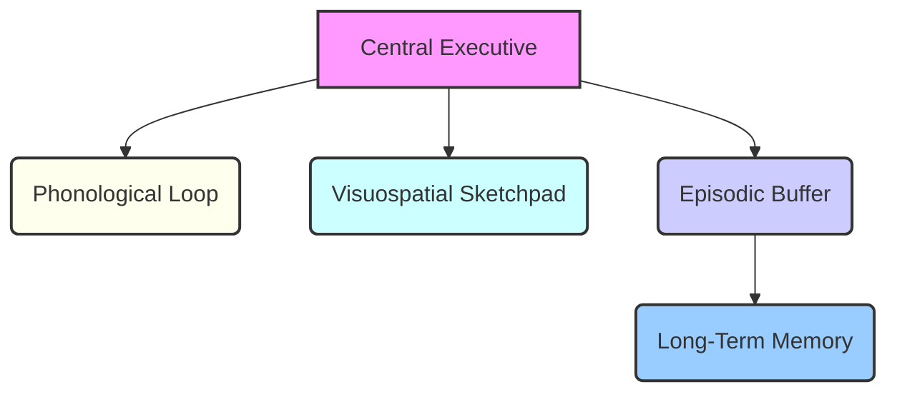

# mqd14kvnetb82z

# Working Memory

Working Memory is the brain's "mental workspace" – a vital cognitive system responsible for temporarily holding and manipulating information needed to perform complex tasks. It's not just a storage bin; it's an active processing arena that underpins thinking, learning, problem-solving, and decision-making.

## Introduction

Imagine trying to follow a recipe, solve a math problem, or understand a complex sentence. In each scenario, your brain isn't just passively receiving information; it's actively holding multiple pieces of data, processing them, and making connections. This dynamic mental activity is driven by Working Memory.

-   **What Working Memory is**: Working Memory is a limited-capacity system that temporarily stores and processes information, making it available for conscious thought and immediate cognitive tasks.
-   **Why Working Memory matters**: It is the bottleneck for conscious thought and the gateway to long-term learning. Its efficiency directly impacts your ability to learn, reason, and perform.
-   **Why Working Memory is central to learning**: To understand new concepts, connect them to existing knowledge, or apply them in new situations, information must be held and manipulated in Working Memory. Without it, new information struggles to be integrated or understood.
-   **The relationship between Working Memory and intelligence, learning, and performance**: Individuals with more efficient Working Memory tend to exhibit better problem-solving skills, higher reading comprehension, and a greater capacity for learning complex subjects. It's not intelligence itself, but a core component that influences how intelligence is expressed and applied.

## What Is Working Memory

### Definition

Working Memory is a cognitive system that allows us to temporarily hold and manipulate information relevant to the task at hand. It's often conceptualized as the "workbench" or "scratchpad" of the mind, where current thoughts, perceptions, and memories are actively processed.

### Historical Development of the Concept

The concept of Working Memory evolved from earlier ideas of "short-term memory." Psychologists Alan Baddeley and Graham Hitch introduced the multi-component model of Working Memory in 1974, challenging the view of short-term memory as a single, passive store. They proposed it as a dynamic system with multiple interacting components.

### How Working Memory Differs from Simple Memory Storage

Simple memory storage, like a temporary note, just holds information. Working Memory goes further: it actively *processes* that information. It's the difference between merely remembering a phone number and mentally rehearsing it while simultaneously looking for a pen to write it down.

### Why it is Considered the Brain's Mental Workspace

Just as a physical workspace allows you to arrange tools and materials to complete a task, Working Memory allows you to bring together disparate pieces of information – a new idea, an instruction, a retrieved fact from [Long-Term Memory](?topic=Long-Term%20Memory) – and mentally manipulate them to achieve a cognitive goal.

## Working Memory In Human Cognition

Working Memory is fundamental to virtually every conscious cognitive activity.

-   **Thinking**: When you deliberate over a choice or brainstorm ideas, you're holding different options and implications in your Working Memory.
-   **Learning**: To grasp a new concept, you must hold its definition, examples, and context in Working Memory to integrate it with what you already know.
    -   *Example*: Understanding a complex sentence requires holding the beginning of the sentence in mind while you read the end, linking clauses and phrases to build meaning.
-   **Problem Solving**: Solving a puzzle or debugging code involves holding the problem statement, potential solutions, and intermediate steps in Working Memory.
    -   *Example*: Calculating a mental tip for a restaurant bill: you hold the total, the tip percentage, and the result of the multiplication in your Working Memory.
-   **Reasoning**: Drawing conclusions from premises requires keeping those premises active while you logically connect them.
-   **Decision Making**: Weighing pros and cons of different options necessitates holding each option and its consequences in mind simultaneously.
-   **Comprehension**: Whether reading a book or listening to a lecture, Working Memory integrates new information with existing knowledge to build a coherent understanding.
    -   *Example*: Listening to a new speaker in a foreign language. You hold the words you just heard while trying to predict the next words, using context and grammar rules.

## Human Memory Architecture

Our memory system isn't a single entity but a complex interplay of different components, each with unique roles.

### Sensory Memory

-   **Role**: Briefly holds incoming sensory information from the environment (sights, sounds, smells, tastes, touches) in its original form. It has a very large capacity but an extremely short duration (fractions of a second to a few seconds).
-   **Function**: Acts as a buffer, allowing the brain a moment to decide which information warrants further attention.

### Working Memory

-   **Role**: Selects, processes, and manipulates a small amount of information from sensory memory or retrieved from Long-Term Memory.
-   **Function**: The "conscious workspace" where active thinking and processing occur.

### Long-Term Memory

-   **Role**: Stores information relatively permanently, with a vast, potentially unlimited capacity and duration (from minutes to a lifetime).
-   **Function**: The repository of all our knowledge, experiences, skills, and facts.

### How Information Flows Through These Systems

Information typically flows sequentially, though there's constant interaction.

1.  **Sensory Input**: Information from the environment first enters **Sensory Memory**.
2.  **Attention & Selection**: If attended to, specific information is transferred from Sensory Memory to **Working Memory**.
3.  **Active Processing**: In **Working Memory**, this information is actively processed, combined with prior knowledge retrieved from **Long-Term Memory**, and manipulated.
4.  **Encoding & Retrieval**: If processed deeply enough in Working Memory, information can be *encoded* and stored in **Long-Term Memory**. Conversely, information from Long-Term Memory can be *retrieved* back into Working Memory for use in current tasks.

```mermaid
graph LR
    A[Sensory Input] --> B(Sensory Memory);
    B -- Attended To --> C(Working Memory);
    C -- Encodes & Stores --> D(Long-Term Memory);
    D -- Retrieves --> C;
    C -- Active Processing --> E[Behavior / Output];

    style A fill:#f9f,stroke:#333,stroke-width:2px;
    style B fill:#ffe,stroke:#333,stroke-width:2px;
    style C fill:#ccf,stroke:#333,stroke-width:2px;
    style D fill:#cff,stroke:#333,stroke-width:2px;
    style E fill:#f9f,stroke:#333,stroke-width:2px;

    linkStyle 1 stroke-width:2px,fill:none,stroke:black;
    linkStyle 2 stroke-width:2px,fill:none,stroke:black;
    linkStyle 3 stroke-width:2px,fill:none,stroke:black;
    linkStyle 4 stroke-width:2px,fill:none,stroke:black;
    linkStyle 5 stroke-width:2px,fill:none,stroke:black;
```

## Characteristics Of Working Memory

Working Memory operates under specific constraints that define its nature:

-   **Limited capacity**: It can only hold a small number of "items" or "chunks" of information at any given time. George Miller famously suggested "the magical number seven, plus or minus two," though more recent research points to an even smaller capacity (around 3-5 items for complex information).
    -   *Example*: Trying to remember a list of 10 unrelated words after hearing them once is challenging because it exceeds your typical capacity.
-   **Limited duration**: Information in Working Memory fades quickly, typically within 15-30 seconds, unless it is actively rehearsed or processed.
    -   *Example*: You look up a phone number, but if you don't dial it immediately or repeat it to yourself, you'll likely forget it within half a minute.
-   **Active processing**: It's not just a passive holding space. Working Memory is where information is actively manipulated, compared, combined, and transformed to solve problems or understand new concepts.
    -   *Example*: Mentally rearranging letters to form an anagram requires active processing, not just holding the letters.
-   **Temporary information holding**: The information is held "online" only for as long as it's needed for the current task. Once the task is complete, or attention shifts, the information is usually discarded unless specifically encoded into Long-Term Memory.
    -   *Example*: After you successfully complete a multi-step instruction, you don't consciously retain each step in detail; only the outcome matters.

## The Components Of Working Memory

Baddeley and Hitch's model proposed several distinct but interacting components, each specialized for different types of information.



### Central Executive

The "boss" of the Working Memory system.

-   **Role**: It's an attentional control system, not a storage system. It supervises and coordinates the activity of the other slave systems.
-   **Attention control**: Directs and allocates attentional resources, deciding what information to focus on and what to ignore.
-   **Resource allocation**: Manages the flow of information between sensory, Working, and Long-Term Memory.
-   **Decision making**: Involved in planning, problem-solving, and making judgments based on information held in the other components.

### Phonological Loop

The "inner voice."

-   **Verbal information**: Primarily handles auditory and verbal information, including spoken language, numbers, and sounds.
-   **Language processing**: Crucial for understanding speech, learning new words, and performing mental arithmetic involving numbers.
-   **Internal speech**: Consists of two sub-components: a phonological store (for holding auditory information) and an articulatory rehearsal process (for mentally "speaking" information to keep it active).
    -   *Example*: Mentally repeating a phone number to remember it uses the articulatory rehearsal process.

### Visuospatial Sketchpad

The "inner eye."

-   **Visual information**: Deals with visual data, such as shapes, colors, objects, and scenes.
-   **Spatial reasoning**: Processes spatial relationships, directions, and the layout of the environment.
-   **Mental imagery**: Allows us to mentally manipulate images, visualize objects, or navigate mentally.
    -   *Example*: Mentally rotating an object to see if it fits into a specific space relies on the visuospatial sketchpad.

### Episodic Buffer

The "integrator."

-   **Information integration**: A limited-capacity temporary storage system that integrates information from the phonological loop, visuospatial sketchpad, and Long-Term Memory.
-   **Connecting experiences**: Creates a coherent, multi-modal representation of an experience, linking visual, spatial, and verbal elements with existing knowledge.
-   **Linking Working Memory and Long-Term Memory**: Acts as a bridge, allowing information from Working Memory to be easily passed to Long-Term Memory and vice-versa, facilitating conscious awareness.
    -   *Example*: Remembering a complex story, including characters, plot, and setting, requires integrating information from all components and tying it to your existing knowledge of storytelling.

## Capacity Limitations

The limited capacity of Working Memory is a fundamental constraint on human cognition.

-   **Why Working Memory is limited**: It's believed to be a trade-off. A highly flexible, active processing system needs to be fast, and a smaller active set of information allows for quicker manipulation. It's akin to a computer's RAM – limited, but essential for active tasks.
-   **Cognitive bottlenecks**: When the demands of a task exceed Working Memory's capacity, a bottleneck occurs. New information cannot be processed efficiently, or existing information is lost.
    -   *Example*: Trying to follow complex instructions while simultaneously navigating an unfamiliar route and listening to a podcast.
-   **Information overload**: When too much information is presented too quickly, or too many tasks demand attention simultaneously, Working Memory gets overwhelmed. This leads to reduced comprehension, increased errors, and frustration.
    -   *Example*: A novice trying to learn a new software program by watching a fast-paced tutorial that introduces many new concepts and actions without pauses.
-   **Mental fatigue**: Constantly pushing Working Memory to its limits, especially on complex or prolonged tasks, leads to mental exhaustion. This impairs focus and performance over time.
    -   *Example*: Spending hours on an intellectually demanding task without breaks can lead to a significant drop in productivity and an increase in mistakes.

## Working Memory And Learning

Working Memory is indispensable for effective learning.

-   **Reading comprehension**: To understand a sentence, paragraph, or chapter, you must hold the previous words/sentences in mind while processing new ones, integrating them into a coherent meaning. Weak Working Memory can lead to rereading or losing the plot.
-   **Studying**: When studying, you use Working Memory to compare new concepts with existing ones, summarize information, and solve practice problems.
-   **Skill acquisition**: Learning new skills (e.g., playing an instrument, coding, driving) involves holding instructions, practicing movements, and receiving feedback, all within Working Memory.
-   **Problem solving**: From simple arithmetic to complex engineering challenges, problem-solving requires holding the problem, intermediate steps, and potential solutions in Working Memory.
-   **Knowledge construction**: New knowledge isn't simply absorbed; it's constructed. This involves actively manipulating new information, connecting it to prior knowledge, and reorganizing mental structures – all Working Memory-intensive activities.

## Working Memory And Cognitive Load

The relationship between Working Memory and [Cognitive Load](?topic=Cognitive%20Load) is foundational to instructional design.

-   **Relationship with Cognitive Load Theory**: [Cognitive Load Theory](?topic=Cognitive%20Load) posits that effective instruction manages the demands on Working Memory. Learning is optimized when instructional materials minimize extraneous cognitive load (unnecessary mental effort) and maximize germane cognitive load (effort dedicated to schema construction).
-   **Information processing limitations**: Since Working Memory has limited capacity, instructional designers must present information in ways that do not overload it. Too much information at once, or information presented in a disorganized manner, creates excessive cognitive load.
-   **Learning efficiency**: By understanding Working Memory's limitations, we can design learning experiences that are more efficient. For example, breaking down complex tasks into smaller steps, providing clear examples, and allowing for practice reduces the burden on Working Memory, freeing up resources for deeper processing and [Schema Formation](?topic=Schema%20Formation).

## Working Memory And Attention

Attention is the gatekeeper to Working Memory.

-   **Focus**: Working Memory relies heavily on focused attention to select relevant information from sensory input and sustain its presence for processing.
-   **Concentration**: Maintaining concentration over time directly translates to sustaining information within Working Memory, allowing for prolonged engagement with a task.
-   **Distraction**: External (e.g., notifications) and internal (e.g., mind-wandering) distractions pull attention away from the task, causing information in Working Memory to degrade or be lost.
-   **Multitasking**: True multitasking (performing two Working Memory-intensive tasks simultaneously) is largely a myth. What we call multitasking is usually rapid task-switching, which incurs a "switching cost" – attention must be redirected, and the Working Memory for the previous task often has to be rebuilt. This reduces efficiency and increases errors.

## Working Memory And Expertise

Experts often *appear* to have superior Working Memory, but it's more nuanced.

-   **Why experts appear to have greater Working Memory**: Experts don't necessarily have a larger fundamental Working Memory capacity. Instead, they have developed highly organized and accessible [Schema Formation](?topic=Schema%20Formation) in their [Long-Term Memory](?topic=Long-Term%20Memory).
-   **Role of schemas**: Schemas are structured knowledge networks. When an expert encounters a problem, they retrieve relevant, pre-organized schemas from Long-Term Memory. These schemas act as powerful mental shortcuts.
-   **Chunking**: Experts can "chunk" information into larger, more meaningful units. A chess grandmaster sees a board position as a few strategic patterns (chunks) rather than 32 individual pieces. A novice sees 32 pieces, overwhelming their Working Memory.
-   **Pattern recognition**: Experts quickly recognize patterns, allowing them to process vast amounts of information as single, coherent units, reducing the load on their Working Memory. This frees up Working Memory capacity for higher-level strategic thinking.

## Chunking

Chunking is one of the most powerful strategies to overcome Working Memory limitations.

-   **What chunking is**: Chunking is the process of grouping individual pieces of information into larger, more meaningful units (chunks).
-   **Why it works**: By organizing disparate items into a single, cohesive unit, you effectively reduce the number of "slots" or "items" Working Memory needs to hold, thereby increasing its effective capacity.
-   **Examples**:
    -   **Phone numbers**: Instead of remembering "5-5-5-1-2-3-4," you remember "555-123-4." Three chunks instead of seven.
    -   **Acronyms**: NATO (North Atlantic Treaty Organization) reduces 5 words to 1 chunk.
    -   **Chess**: A grandmaster sees "King's Indian Attack formation" as one chunk, not individual piece positions.
-   **Applications**: Chunking is widely used in learning and daily life, from remembering lists to understanding complex diagrams. It's a key component of [Schema Formation](?topic=Schema%20Formation).

## Working Memory In Learning Different Subjects

The demands on Working Memory vary across subjects:

-   **Programming**: Requires holding multiple variables, function calls, logical conditions, and data structures in mind to trace program execution or write new code. Debugging is particularly Working Memory intensive.
    -   *Example*: Understanding a loop where an array is iterated, and an `if` condition within it modifies a variable. You hold the current iteration, the array element, the condition, and the variable's state.
-   **Mathematics**: Solving complex equations or proofs involves holding numbers, symbols, rules, and intermediate calculations in Working Memory.
    -   *Example*: Mental arithmetic for `(15 * 3) + 7 / 2`. You hold `45`, then `3.5`, then `48.5`.
-   **Science (e.g., Chemistry)**: Understanding chemical reactions involves holding reactants, products, states, and conditions simultaneously to predict outcomes or balance equations.
    -   *Example*: Balancing a chemical equation like `C2H5OH + O2 → CO2 + H2O` requires tracking the count of each atom on both sides.
-   **Language Learning**: Requires holding new vocabulary, grammatical rules, and sentence structures in Working Memory to construct or comprehend sentences in real-time.
    -   *Example*: Forming a sentence in a new language, you retrieve vocabulary, apply conjugation rules, and arrange word order simultaneously.
-   **Business Learning**: Analyzing market trends or strategic planning involves holding various data points, financial metrics, competitor actions, and potential scenarios in Working Memory.
    -   *Example*: Evaluating a business case by considering sales data, production costs, marketing spend, and competitive landscape.

## Common Working Memory Problems

When Working Memory is overwhelmed or under-resourced, several common issues arise:

-   **Forgetting instructions**: You're told a multi-step process, but by the third step, you've forgotten the first.
-   **Losing focus**: Your mind wanders mid-task, and you forget what you were doing or why.
-   **Information overload**: Feeling overwhelmed when trying to process too much information at once, leading to a mental "freeze" or inability to proceed.
-   **Context switching**: The mental toll of shifting rapidly between different tasks, where each switch requires rebuilding the Working Memory context for the new task.
-   **Multitasking**: The illusion of doing multiple things well simultaneously, often resulting in poorer performance on all tasks due to constant attention shifting.

## Improving Working Memory Performance

While core Working Memory capacity is relatively stable, its *performance* can be significantly enhanced through strategic practices.

-   **Chunking**: Group related information into meaningful units.
    -   *Example*: Instead of remembering individual items on a grocery list (milk, eggs, bread, cheese, apples, bananas), group them by category (dairy: milk, eggs, cheese; produce: apples, bananas; bakery: bread).
-   **External memory systems**: Don't rely solely on your brain. Offload information using tools.
    -   *Example*: Use [Note-taking](?topic=Note-taking) apps, physical notebooks, to-do lists, reminders, calendars, or even dictation.
-   **Visualization**: Create mental images or diagrams to represent information, engaging the visuospatial sketchpad.
    -   *Example*: When trying to remember a process, imagine it as a flowchart or a sequence of actions.
-   **Spaced practice**: Distribute learning sessions over time rather than cramming. This allows for better encoding into [Long-Term Memory](?topic=Long-Term%20Memory) and reduces the immediate load on Working Memory during intense study. Learn more in [Study Techniques](?topic=Study%20Techniques).
-   **Focused attention**: Minimize distractions and dedicate your full attention to one task at a time.
    -   *Example*: Turn off notifications, close unnecessary tabs, and find a quiet environment for deep work.
-   **Reducing distractions**: Create an environment conducive to concentration.
    -   *Example*: Use noise-canceling headphones, inform colleagues you're focusing, or use website blockers.
-   **Breaks**: Regular short breaks can help refresh Working Memory and prevent mental fatigue.
-   **Mindfulness and Meditation**: Can improve attention control, a key component of the Central Executive.

## Working Memory And AI-Assisted Learning

AI offers powerful tools that can both support and potentially hinder Working Memory.

-   **Benefits of AI support**: AI tools can act as "cognitive offloaders," handling repetitive tasks, information retrieval, or complex calculations.
    -   *Example*: AI can summarize long documents, generate code snippets, or suggest next steps in a problem, reducing the amount of raw information a learner needs to hold in Working Memory.
-   **Risks of cognitive offloading**: Over-reliance on AI can lead to "cognitive atrophy." If AI consistently performs tasks that would otherwise engage Working Memory, the learner might not develop the necessary cognitive skills or deepen their understanding.
    -   *Example*: Always using an AI code generator without understanding the underlying logic could prevent a programmer from truly grasping programming concepts.
-   **Maintaining active thinking**: The goal should be to use AI to *enhance* Working Memory, not replace it. Engage with AI outputs critically, modify them, and use them as starting points for deeper thought.
-   **Effective AI usage**: Use AI for tasks that would otherwise overwhelm Working Memory (e.g., managing vast datasets), but actively engage in tasks that build understanding (e.g., explaining AI's output in your own words, critiquing its suggestions).

## Common Myths

Several misconceptions about Working Memory persist:

-   **Working Memory equals intelligence**: While there's a correlation, Working Memory is a component of intelligence, not its entirety. Someone with strong Working Memory might still lack creativity, emotional intelligence, or domain-specific knowledge.
-   **Multitasking improves productivity**: True multitasking is largely impossible for complex cognitive tasks. What appears as multitasking is rapid task-switching, which often *reduces* productivity and increases errors due to switching costs.
-   **Memory training solves everything**: "Brain training" games often improve performance only on the specific tasks trained, with limited transfer to general Working Memory capacity or real-world cognitive abilities. Strategic approaches like chunking and reducing distractions are generally more effective.

## Real-World Applications

Understanding Working Memory has broad implications:

-   **Education**: Designing curricula and teaching methods that respect Working Memory limits. Breaking down complex topics, providing clear examples, and encouraging active learning.
    -   *Example*: Using interactive whiteboards to illustrate concepts dynamically, rather than presenting static, dense information.
-   **Software Engineering**: Designing user interfaces that minimize cognitive load, understanding how developers debug, and structuring code for readability.
    -   *Example*: Code refactoring to create smaller, more manageable functions that fit better into a developer's Working Memory.
-   **Medicine**: Doctors need robust Working Memory to hold patient symptoms, medical history, differential diagnoses, and treatment protocols simultaneously.
    -   *Example*: A surgeon mentally rehearsing the steps of a complex operation, anticipating potential complications.
-   **Business**: Effective strategic planning, project management, and negotiation all rely on managing multiple pieces of information in Working Memory.
    -   *Example*: A project manager holding various dependencies, resource allocations, and deadlines in mind to adjust schedules.
-   **Research**: Conducting experiments, analyzing data, and synthesizing findings require constant manipulation of complex information.
-   **Professional Development**: Any complex learning or problem-solving task benefits from an awareness of Working Memory limitations and strategies to optimize it.

## Practical Framework For Managing Working Memory

Here's a framework to proactively manage your Working Memory:

1.  **Assess the Cognitive Load**: Before starting a task, estimate how much information you'll need to hold and manipulate. Is it simple, moderate, or highly complex?
2.  **Externalize Everything Possible**: Don't rely on your brain for storage. Write it down, type it out, record it. Use [Information Capture](?topic=Information%20Capture) tools.
    -   *Example*: For a multi-step process, write down each step before you begin.
3.  **Chunk Information**: Break down large pieces of information or tasks into smaller, more digestible chunks.
    -   *Example*: If reading a complex article, identify the main points of each paragraph or section.
4.  **Prioritize & Focus**: Identify the most critical information or step, and give it your full, undivided attention. Minimize distractions.
    -   *Example*: When debugging code, focus on one variable or one section of the logic at a time.
5.  **Visualize & Connect**: Actively try to visualize concepts or connect new information to what you already know (schemas from Long-Term Memory).
    -   *Example*: Create a mental map or draw a quick sketch to understand relationships.
6.  **Review & Rehearse**: Periodically revisit information to refresh it in Working Memory and aid encoding into Long-Term Memory.
    -   *Example*: After learning a new concept, quickly explain it aloud or to someone else.
7.  **Take Breaks**: Regularly step away from demanding tasks to allow your Working Memory to reset and prevent fatigue.

## Practical Action Plan

### Beginner Implementation Plan

1.  **Start with Externalization**: For the next week, write down *all* your to-do lists, grocery lists, and simple instructions. Don't rely on remembering them mentally.
2.  **Single-Tasking**: For 30-minute blocks, commit to doing only one task. Close all other tabs/apps. Notice the difference.
3.  **Simple Chunking**: Try to remember phone numbers or short lists by grouping numbers (e.g., 123-4567) or items (e.g., fruits, vegetables, dairy).

### Intermediate Implementation Plan

1.  **Strategic Note-taking**: Learn to take structured notes (e.g., Cornell method, mind maps) for lectures or meetings, focusing on capturing main points and relationships, not just transcribing.
2.  **Visualize Complex Ideas**: For a new concept in your field, draw a simple diagram, flowchart, or sketch to represent it instead of just reading text.
3.  **Active Review**: After a learning session, spend 5-10 minutes actively recalling what you learned without looking at your notes. Try to explain it to an imaginary person.

### Advanced Implementation Plan

1.  **"Think Aloud" During Problem Solving**: When tackling a complex problem (e.g., coding, strategic planning), verbally narrate your thought process. This forces information into the phonological loop and makes your Working Memory load explicit.
2.  **Schema Building**: Deliberately identify key concepts in your domain and actively connect them, forming mental models or "super-chunks." Use tools for [Knowledge Management](?topic=Knowledge%20Management).
3.  **Teach It**: The ultimate test of understanding and a powerful way to manage Working Memory. Explaining a complex topic to someone else forces you to retrieve, organize, and articulate information coherently.

## Summary

Working Memory is the active, limited-capacity mental workspace where we temporarily hold and manipulate information for conscious thought. It comprises a Central Executive that directs attention, a Phonological Loop for verbal information, a Visuospatial Sketchpad for visual/spatial data, and an Episodic Buffer for integrating information. Its limitations in capacity and duration mean it's easily overloaded, leading to cognitive bottlenecks and fatigue.

However, its performance can be significantly enhanced through strategies like chunking, external memory systems, visualization, and focused attention. Understanding Working Memory is crucial for effective learning, problem-solving, and optimizing performance across all professional domains, helping us manage cognitive load and build expertise.

## Key Takeaways

-   **Working Memory is your mental workbench**: It's where active thinking, learning, and problem-solving happen.
-   **It's limited**: You can only hold and process a small amount of information (around 3-5 "chunks") for a short time (15-30 seconds).
-   **It has components**: The Central Executive manages attention, the Phonological Loop handles sounds/words, the Visuospatial Sketchpad handles images/space, and the Episodic Buffer integrates them.
-   **It's crucial for learning**: All new learning relies on Working Memory to process and connect information to [Long-Term Memory](?topic=Long-Term%20Memory).
-   **Cognitive Load matters**: Overloading Working Memory leads to ineffective learning.
-   **Experts use chunking**: They group information into meaningful units, making their Working Memory *appear* larger.
-   **You can improve its *performance***: Use strategies like chunking, externalization (notes), visualization, reducing distractions, and spaced practice.
-   **Beware of multitasking**: It's usually task-switching, which degrades Working Memory efficiency.
-   **Use AI wisely**: Leverage AI to offload repetitive tasks, but ensure you maintain active cognitive engagement to build your own understanding.

## Further Reading

-   Baddeley, A. D. (2012). Working memory: Theories, models, and controversies. *Annual Review of Psychology*, *63*, 1-29.
-   Miller, G. A. (1956). The magical number seven, plus or minus two: Some limits on our capacity for processing information. *Psychological Review*, *63*(2), 81–97.
-   Sweller, J. (1988). Cognitive load theory. *Educational Psychologist*, *23*(3), 257-285.

## Related KnowHub Pages

-   [Learning Science](?topic=Learning%20Science)
-   [Cognitive Load](?topic=Cognitive%20Load)
-   [Long-Term Memory](?topic=Long-Term%20Memory)
-   [Schema Formation](?topic=Schema%20Formation)
-   [Neuroplasticity](?topic=Neuroplasticity)
-   [Study Techniques](?topic=Study%20Techniques)
-   [Information Capture](?topic=Information%20Capture)
-   [Knowledge Management](?topic=Knowledge%20Management)