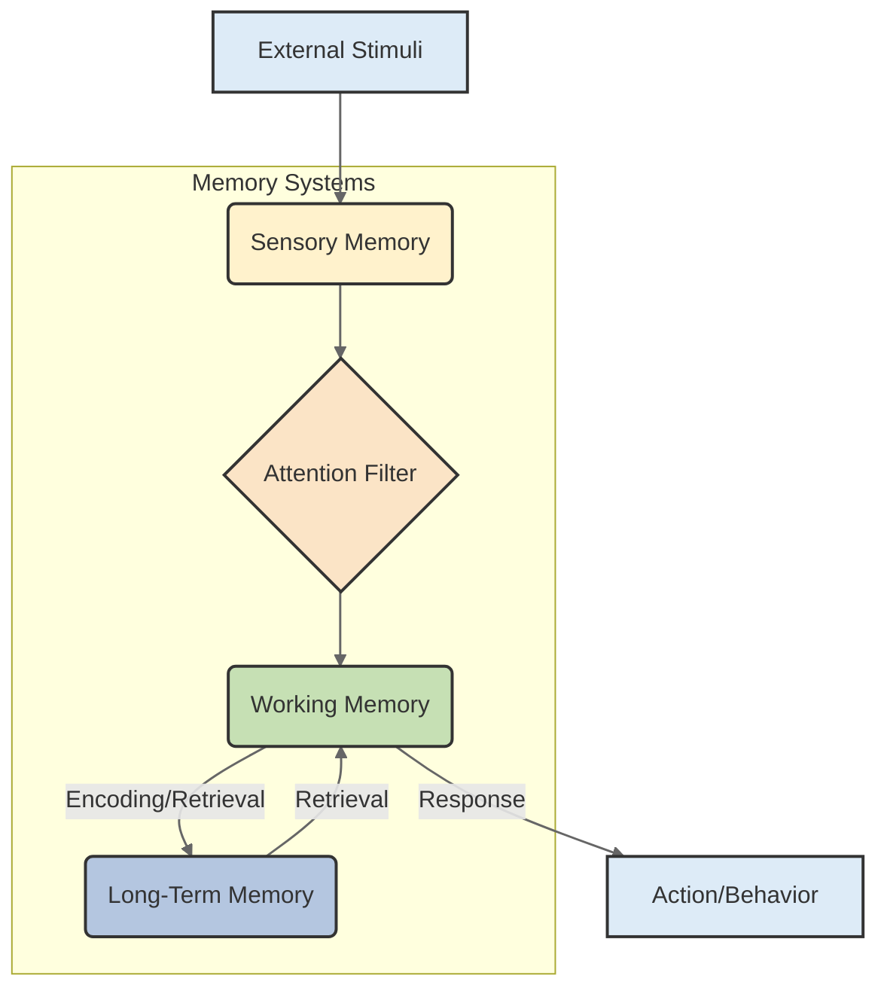
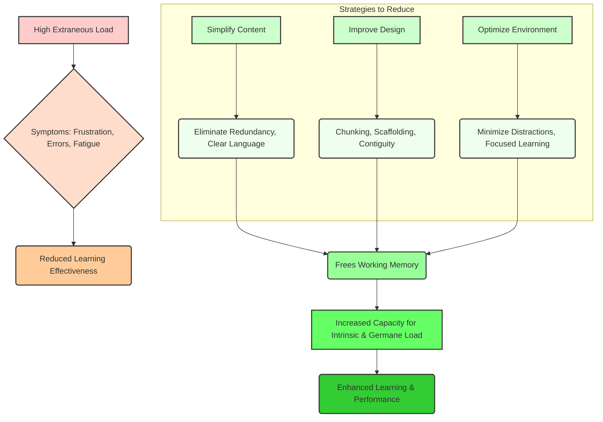

# Cognitive Load

# Cognitive Load

## Introduction

Have you ever felt overwhelmed trying to learn something new? Struggled to grasp a complex concept, not because it was inherently difficult, but because the explanation was confusing? Or perhaps you've felt mentally exhausted after a day of switching between many different tasks? If so, you've experienced **Cognitive Load**.

Cognitive Load refers to the total amount of mental effort being used in your [Working Memory](?topic=Working%20Memory) at any given time. It's a critical concept in [Learning Science](?topic=Learning%20Science) that helps us understand the limits of human cognition and how information is processed.

Understanding Cognitive Load is fundamental because:
*   **It explains why some learning experiences are more effective than others.** Good instructional design actively manages cognitive load.
*   **It impacts productivity and problem-solving.** Overloading your mind leads to errors, frustration, and slower progress.
*   **It is key to skill acquisition and expertise development.** Managing load allows for deeper learning and the formation of robust mental models.

By understanding how cognitive load affects learning, you can dramatically improve your ability to acquire new skills, solve complex problems, and design more effective learning experiences for yourself and others.

## What Is Cognitive Load

**Cognitive Load** is the amount of mental effort imposed on an individual's working memory during a specific task. It's not about how hard you're *trying*, but about how much mental processing capacity is being *demanded* by the task and its presentation.

The concept originated from **Cognitive Load Theory (CLT)**, developed by educational psychologist John Sweller in the late 1980s. Sweller and his colleagues recognized that the human mind has inherent cognitive limitations, particularly in its [Working Memory](?topic=Working%20Memory). Our ability to process new information, solve problems, and make decisions is constrained by the limited capacity and duration of this critical memory system.

These information processing constraints mean that if too much information or too many processing demands are placed on working memory simultaneously, learning effectiveness decreases, errors increase, and frustration sets in. Understanding and managing this load is therefore essential for effective learning and performance.

## Human Cognitive Architecture

To understand Cognitive Load, we must first appreciate the basic architecture of human cognition, which dictates how we acquire, process, and store information. This model typically describes three main memory systems:

### 1. Sensory Memory
This is the initial stage, briefly holding sensory information (sights, sounds, smells, etc.) from the environment for a fraction of a second to a few seconds. It has a very large capacity but a very short duration. Most information here is lost unless attention is paid to it.

### 2. Working Memory
Often considered the "desktop" of the mind, [Working Memory](?topic=Working%20Memory) is where conscious mental processing occurs. It temporarily holds and manipulates information from sensory memory or retrieved from long-term memory. It has a **very limited capacity and duration**. This is the primary system affected by cognitive load.

### 3. Long-Term Memory
This is the mind's vast "hard drive," storing information for extended periods, from minutes to a lifetime. It has an effectively **unlimited capacity**. It contains all our knowledge, skills, experiences, and schemas (organized structures of knowledge). Effective learning aims to transfer information from working memory into long-term memory by building and refining these schemas.

### Interaction During Learning
During learning, information flows from sensory memory, through working memory, and ideally, into long-term memory.
*   **Sensory input** (e.g., reading text, hearing a lecture) is briefly registered in sensory memory.
*   **Attention** selects relevant information for transfer to working memory.
*   In **working memory**, this information is processed, combined with existing knowledge retrieved from long-term memory, and manipulated (e.g., analyzed, synthesized, rehearsed).
*   If processed effectively, new or refined information is then encoded into **long-term memory** as schemas.

## Why Working Memory Is Limited

Working memory is the bottleneck of our cognitive system. Its limitations are precisely why cognitive load is such a critical factor in learning.

### Capacity Limitations
Working memory can only hold a small number of "chunks" of information at any one time. Psychologist George A. Miller famously proposed the "Magical Number Seven, Plus or Minus Two" (7 ± 2 items) as the capacity limit. Modern research suggests it might be even lower, closer to 3-5 chunks, especially for novel information. A "chunk" is a meaningful unit of information that has been organized and encoded. For example, "1-7-7-6" is four digits, but for an American, it might be one chunk representing "the year of independence."

### Duration Limitations
Information in working memory fades quickly if not actively rehearsed or processed. Without conscious attention or repetition, information can be lost within approximately 15-30 seconds. This is why you might forget a phone number someone tells you if you don't immediately dial it or write it down.

### Processing Limitations
Working memory isn't just a storage buffer; it's also a processing space. When you are actively manipulating information (e.g., solving a math problem, analyzing a complex sentence, comparing different concepts), these operations consume working memory resources. If the processing demands are too high, there's less space left for storing the information, leading to reduced efficiency or even failure to process.

**Examples:**
*   **Capacity:** Trying to remember a shopping list of 15 items without writing them down (too many chunks).
*   **Duration:** Being told directions to a new place, then immediately getting distracted by a phone call and forgetting part of them (information faded).
*   **Processing:** Attempting to simultaneously listen to a complex podcast, respond to emails, and debug a piece of code (processing demands exceed capacity).

These limitations highlight the need to manage cognitive load to ensure effective learning and task performance.

## Cognitive Load Theory

**Cognitive Load Theory (CLT)**, developed by John Sweller and his colleagues, is a highly influential framework in educational psychology. It posits that learning is most effective when instructional materials are designed to minimize extraneous cognitive load and optimize intrinsic and germane cognitive load, thereby working within the constraints of human working memory.

### History
The theory emerged from research into problem-solving in the late 1980s. Sweller observed that conventional problem-solving methods often imposed a high extraneous load on learners, distracting them from building useful [Schema Formation](?topic=Schema%20Formation) in [Long-Term Memory](?topic=Long-Term%20Memory). He proposed that by redesigning instruction, we could make learning more efficient.

### Core Principles
1.  **Working Memory Limitations:** Learning depends on working memory, which has severe capacity and duration limits.
2.  **Schema Formation:** The goal of learning is to construct schemas in long-term memory. Schemas are organized knowledge structures that allow us to treat multiple pieces of information as a single unit ("chunking"), effectively bypassing working memory limitations when expertise is developed.
3.  **Three Types of Cognitive Load:** Cognitive load is not monolithic but can be categorized into three distinct types: intrinsic, extraneous, and germane. Each type impacts learning differently.

### Educational Significance
CLT provides a theoretical basis for effective instructional design. It helps educators and content creators understand *why* certain teaching methods work better than others and *how* to optimize learning environments. It shifts the focus from merely presenting information to presenting it in a way that respects cognitive architecture.

### Learning Implications
*   **Minimize Extraneous Load:** Design lessons to be clear, concise, and free of distractions.
*   **Manage Intrinsic Load:** Break down complex topics into manageable parts, building prerequisite knowledge.
*   **Optimize Germane Load:** Encourage deep processing, reflection, and the formation of connections to foster lasting learning.

## Types Of Cognitive Load

Cognitive Load Theory distinguishes three types of cognitive load, each with a different impact on learning: intrinsic, extraneous, and germane.

### Intrinsic Cognitive Load

*   **Definition:** This is the load imposed by the inherent complexity of the material itself. It's determined by the nature of the topic and cannot be eliminated, only managed.
*   **Task Complexity:** Some tasks are simply more complex than others due to the number of elements that must be processed simultaneously and the way these elements interact.
*   **Element Interactivity:** A key concept within intrinsic load. It refers to how interdependent the elements of a task are. If learning one element requires understanding several others simultaneously, element interactivity (and thus intrinsic load) is high. (More on this below).
*   **Examples:**
    *   Learning basic arithmetic (e.g., 2+2) has low intrinsic load.
    *   Learning advanced calculus (e.g., differential equations) has high intrinsic load because it requires understanding many interconnected concepts (variables, functions, limits, derivatives, integrals) all at once.
    *   Learning to drive a car initially has high intrinsic load because you must simultaneously manage steering, acceleration, braking, mirrors, and traffic rules.

### Extraneous Cognitive Load

*   **Definition:** This is the load imposed by the way information is presented or by external distractions. It does *not* contribute to learning and should be minimized. Extraneous load consumes valuable working memory resources that could otherwise be used for learning.
*   **Poor Instructional Design:** Unclear instructions, irrelevant information, disorganized layouts, unnecessary visuals, or fragmented presentations directly contribute to extraneous load.
*   **Distractions:** Internal (e.g., worrying, hunger) or external (e.g., notifications, noisy environment) distractions can pull attention away from the learning material.
*   **Information Overload:** Being presented with too much information at once, without clear guidance or structure.
*   **Examples:**
    *   A PowerPoint presentation with dense paragraphs of text, flashing animations, and irrelevant background music.
    *   A textbook with confusing jargon, no clear headings, and important information buried in lengthy sentences.
    *   Trying to study for an exam in a noisy coffee shop while constantly checking social media notifications.

### Germane Cognitive Load

*   **Definition:** This is the load imposed by cognitive processes that contribute directly to learning and schema construction. It is desirable and should be optimized or increased, as it involves the effort to understand, elaborate, and integrate new information into [Long-Term Memory](?topic=Long-Term%20Memory).
*   **Schema Construction:** Germane load represents the effort expended in building mental models or schemas, which are organized structures of knowledge.
*   **Meaningful Learning:** It involves activities like making connections between new and old information, elaborating on concepts, summarizing, or critically evaluating content.
*   **Expertise Development:** As learners build more sophisticated schemas, their capacity to process complex information efficiently increases.
*   **Examples:**
    *   Pausing during a lecture to connect a new concept to something you already know.
    *   Actively trying to solve a practice problem and explaining your reasoning.
    *   Reflecting on why a particular solution worked or failed, leading to deeper understanding.
    *   Creating a mind map to organize and relate different topics within a subject.

## Element Interactivity

Element interactivity is a crucial concept, particularly for understanding **intrinsic cognitive load**.

*   **What it is:** Element interactivity refers to the degree to which individual elements of information within a learning task must be processed simultaneously in working memory for the material to be understood. If understanding element 'A' requires simultaneous comprehension of element 'B' and 'C', then the interactivity is high. If elements can be understood in isolation, interactivity is low.

*   **Why it matters:** High element interactivity places a significant demand on working memory because multiple elements must be held and processed together. This increases intrinsic cognitive load, making the task inherently more difficult. Low interactivity, conversely, means elements can be learned more sequentially, reducing the simultaneous working memory burden.

*   **Impact on Difficulty:**
    *   **High Interactivity:** Tasks like solving complex equations, understanding a new programming language's syntax *and* logic simultaneously, or diagnosing a car engine fault (requiring knowledge of many interconnected parts and their functions). These tasks are intrinsically difficult.
    *   **Low Interactivity:** Tasks like memorizing a list of unrelated facts, learning individual vocabulary words, or identifying single objects. These tasks have low intrinsic difficulty.

*   **Real-world Examples:**
    *   **Learning a foreign language:** Memorizing individual vocabulary words has low element interactivity. However, constructing a grammatically correct sentence with those words, conjugating verbs, and ensuring proper word order has high element interactivity, as all these elements must be considered simultaneously.
    *   **Programming:** Learning the syntax of a new loop construct (e.g., `for` loop) has moderate interactivity (syntax, condition, iteration). However, designing an algorithm that uses multiple data structures, functions, and control flows to solve a complex problem has very high element interactivity.
    *   **Chess:** Understanding the movement rules of individual pieces has low interactivity. Planning a strategy several moves ahead, considering all possible opponent responses, and evaluating board state involves extremely high element interactivity.

Recognizing high element interactivity is key to managing intrinsic cognitive load, often by breaking down complex tasks into smaller, less interactive components or ensuring learners have strong prerequisite knowledge.

## Cognitive Load During Learning

Cognitive load is omnipresent in any learning activity. Its impact varies greatly depending on the nature of the task.

### Reading
*   **High Load:** Reading dense, jargon-filled text with complex sentence structures, especially on an unfamiliar topic. Trying to follow multiple arguments simultaneously without clear transitions.
*   **Low Load:** Reading a well-structured, clear narrative on a familiar topic.
*   **Strategies:** Break text into digestible chunks, use headings, bold key terms, provide clear examples, and actively summarize.

### Problem Solving
*   **High Load:** Solving a novel problem with many interacting variables and no clear solution path. "Means-ends analysis" (constantly comparing current state to goal state) can be very demanding.
*   **Low Load:** Solving routine problems where established procedures (schemas) can be applied.
*   **Strategies:** Work through examples, break problems into sub-problems, use diagrams, and provide scaffolds (hints, templates).

### Programming
*   **High Load:** Debugging unfamiliar code with many dependencies, understanding complex algorithms, designing system architecture from scratch, or learning a new language with a different paradigm (e.g., moving from imperative to functional).
*   **Low Load:** Writing simple scripts using familiar constructs, understanding isolated functions.
*   **Strategies:** Use clear variable names, comment code, modularize, use IDEs with helpful features (syntax highlighting, auto-completion), and work through small, focused examples.

### Mathematics
*   **High Load:** Deriving complex proofs, solving multi-step equations that require recalling multiple formulas and applying them in a specific sequence, understanding abstract concepts like set theory or topology.
*   **Low Load:** Practicing basic arithmetic operations, applying a known formula directly.
*   **Strategies:** Teach prerequisite concepts thoroughly, show step-by-step solutions, explain the *why* behind formulas, use visual aids, and provide ample practice.

### Language Learning
*   **High Load:** Simultaneously trying to understand new vocabulary, grammar rules, pronunciation, and cultural context while having a real-time conversation.
*   **Low Load:** Memorizing individual words, practicing isolated grammar drills.
*   **Strategies:** Focus on one aspect at a time, use spaced repetition for vocabulary, practice with simpler sentences, and use immersion environments gradually.

### Technical Learning
*   **High Load:** Learning to operate a complex new software application with many features and an unintuitive interface, or understanding a detailed technical specification with numerous interconnected components.
*   **Low Load:** Following a simple step-by-step tutorial for a single feature.
*   **Strategies:** Provide clear documentation, offer interactive tutorials, use analogies, break down complex systems into modules, and provide hands-on practice with guided exercises.

## Cognitive Load During Skill Development

The experience of cognitive load changes dramatically as a learner progresses from novice to expert. The "same" task imposes very different cognitive demands at different skill levels.

### Novice Learners
*   **High Intrinsic Load:** Because they lack established schemas, novices must process every individual element of a task consciously in working memory. Element interactivity feels very high.
*   **High Sensitivity to Extraneous Load:** Novices have little working memory capacity to spare. Poor instructions, distractions, or irrelevant information quickly lead to overload.
*   **Germane Load Focus:** The focus is on forming initial, basic schemas. This often involves effortful attention to details and simple connections.
*   **Example:** A beginner programmer trying to write their first "Hello World" program. They might struggle with syntax, the concept of a compiler/interpreter, saving files, and running the program – each element consuming precious working memory.

### Intermediate Learners
*   **Moderate Intrinsic Load:** They have started to form basic schemas, allowing them to chunk some information. Some aspects of the task are becoming semi-automatic.
*   **Moderate Sensitivity to Extraneous Load:** While better than novices, they can still be easily distracted or confused by suboptimal instruction when tackling more complex aspects.
*   **Germane Load Focus:** They are actively refining existing schemas and building more complex, interconnected ones. This involves making deeper connections, comparing different approaches, and solving moderately challenging problems.
*   **Example:** An intermediate programmer can write "Hello World" effortlessly, but struggles with understanding how different modules in a larger project interact or optimizing a complex algorithm. They are now working on building schemas for patterns and structures.

### Experts
*   **Low Intrinsic Load:** Due to extensive and highly interconnected schemas in long-term memory, experts can process large amounts of information as single "chunks." Many complex sub-tasks are automated. Element interactivity is bypassed by rich schemas.
*   **Low Sensitivity to Extraneous Load:** Experts have ample working memory capacity available for novel challenges, making them less affected by minor distractions or suboptimal presentation.
*   **Germane Load Focus:** Their germane load is often directed towards innovation, abstract problem-solving, identifying new patterns, and further refining highly sophisticated schemas. They can critically evaluate and generate new knowledge.
*   **Example:** An expert programmer can quickly grasp the architecture of a new system, debug complex issues by pattern recognition, and propose elegant solutions, leveraging vast knowledge networks without conscious effort for basic tasks.

The "same task feels different" because experts can offload much of the processing from working memory to their highly efficient long-term memory schemas, freeing up working memory for higher-level thinking and novel challenges. This is the essence of [Expertise Development](?topic=Skill%20Acquisition).

## Cognitive Load And Expertise

Expertise isn't just about knowing more; it's fundamentally about how efficiently and effectively you manage cognitive load. Experts have developed sophisticated mechanisms that reduce their intrinsic load and allow for deeper processing.

### Schema Formation
The cornerstone of expertise. [Schema Formation](?topic=Schema%20Formation) involves organizing individual pieces of information into coherent, meaningful structures in [Long-Term Memory](?topic=Long%20Term%20Memory).
*   **Chunking:** Experts can group many individual pieces of information into a single "chunk." For example, a chess grandmaster sees complex board positions as single patterns (chunks), while a novice sees individual pieces and their movements. This effectively expands working memory capacity.
*   **Interconnectedness:** Expert schemas are not isolated but highly interconnected, allowing for rapid retrieval and flexible application of knowledge.

### Pattern Recognition
A direct result of robust schema formation. Experts quickly recognize patterns, situations, and problems that novices would see as novel or chaotic. This automatic recognition reduces the need for conscious, step-by-step processing in working memory.
*   **Example:** A doctor can recognize disease patterns from a few symptoms, while a medical student needs to meticulously go through a checklist.

### Automation
With extensive practice, many cognitive processes that were once effortful and working-memory-intensive become automatic.
*   **Example:** Driving a car. For a beginner, every action (steering, braking, signaling) is conscious. For an experienced driver, these actions are automatic, freeing up working memory for navigation, conversation, or listening to music. In programming, writing boilerplate code becomes automatic, allowing focus on logic.

### Expertise Development
The entire process of [Skill Acquisition](?topic=Skill%20Acquisition) can be viewed through the lens of cognitive load management. It's about:
1.  **Reducing Intrinsic Load:** Through schema development and chunking.
2.  **Minimizing Extraneous Load:** By learning in effective ways and environments.
3.  **Optimizing Germane Load:** By engaging in deliberate practice, reflection, and continuous knowledge integration, which builds stronger, more elaborate schemas.

Ultimately, expertise is the ability to perform complex tasks with low intrinsic cognitive load because the necessary knowledge is efficiently stored and retrieved from long-term memory, bypassing the working memory bottleneck.

## Cognitive Overload

While cognitive load is a normal and necessary part of learning, **cognitive overload** occurs when the total cognitive load (intrinsic + extraneous + germane) exceeds the capacity of an individual's working memory. This is detrimental to learning, problem-solving, and overall well-being.

### Symptoms
*   **Frustration and Anxiety:** Feeling stressed, irritated, or hopeless about the task.
*   **Reduced Comprehension:** Difficulty understanding or remembering new information.
*   **Increased Errors:** Making more mistakes than usual, even on simple tasks.
*   **Slower Processing:** Taking significantly longer to complete tasks.
*   **Decision Paralysis:** Inability to make choices due to too many options or too much information.
*   **Mental Fatigue:** Feeling drained, exhausted, or "fried" mentally.
*   **Procrastination/Avoidance:** Tendency to put off or avoid the overwhelming task.

### Causes
*   **Too Much Information at Once:** Being presented with an excessive amount of new content without proper structuring or pacing.
*   **Poorly Designed Materials:** Instructions that are unclear, disorganized, contain irrelevant details, or present information in conflicting formats (e.g., text and audio repeating the same information).
*   **Excessive Element Interactivity:** Tackling a highly complex topic without sufficient prerequisite knowledge or scaffolding.
*   **Multitasking:** Attempting to perform multiple cognitively demanding tasks simultaneously, forcing constant context switching.
*   **Distractions:** High levels of internal (e.g., worry) or external (e.g., notifications, noise) distractions.
*   **Lack of Prior Knowledge:** When learners have insufficient foundational knowledge, even moderately complex tasks can cause overload.

### Warning Signs
*   Feeling "stuck" or unable to move forward.
*   Repeatedly rereading the same paragraph without understanding.
*   Losing your train of thought frequently.
*   Feeling mentally exhausted despite not having achieved much.
*   Increased irritability or short temper.

### Consequences
*   **Ineffective Learning:** Information is not encoded into long-term memory, leading to superficial understanding or no learning at all.
*   **Poor Performance:** Reduced accuracy, increased time to completion, and suboptimal outcomes on tasks.
*   **Burnout:** Chronic cognitive overload can lead to significant stress, decreased motivation, and professional burnout.
*   **Reduced Creativity:** Overloaded working memory has fewer resources for novel connections and innovative thinking.

Recognizing the signs and causes of cognitive overload is the first step toward effectively managing it.

## Reducing Extraneous Load

Reducing extraneous cognitive load is often the quickest and most impactful way to improve learning effectiveness, especially for novice learners. It frees up working memory for intrinsic processing and germane schema construction.

Here are practical strategies:

1.  **Simplification:**
    *   **Eliminate Redundancy:** Avoid presenting the same information in multiple formats if one format suffices (e.g., don't read verbatim from slides). This is the "redundancy effect."
    *   **Remove Irrelevant Information:** Cut out anecdotes, unnecessary details, or visuals that do not contribute directly to the learning goal.
    *   **Clear Language:** Use plain language, avoid jargon where possible, or clearly define terms when necessary.

2.  **Chunking:**
    *   Break down large blocks of information into smaller, digestible units.
    *   Use headings, subheadings, bullet points, and short paragraphs.
    *   Present information sequentially, allowing learners to master one chunk before moving to the next.

3.  **Scaffolding:**
    *   Provide temporary support structures to help learners complete tasks that would otherwise be too difficult.
    *   Examples: templates, checklists, step-by-step guides, partially solved problems, sentence starters. Gradually remove scaffolds as expertise grows.

4.  **Better Instructional Design:**
    *   **Coherence Principle:** Organize material logically, ensuring smooth transitions between topics.
    *   **Signaling:** Use cues like bold text, arrows, highlights, or introductory overviews to draw attention to important information and show relationships.
    *   **Spatial Contiguity:** Place related text and visuals close together on a page or screen to avoid learners splitting their attention (e.g., description next to the diagram it explains).
    *   **Temporal Contiguity:** Present corresponding audio and visual information simultaneously rather than sequentially.
    *   **Modality Principle:** Present visuals with *spoken* narration rather than on-screen text, especially for complex diagrams, to distribute load across auditory and visual working memory channels.

5.  **Focused Learning Environment:**
    *   Minimize external distractions: Turn off notifications, close irrelevant browser tabs, find a quiet space.
    *   Manage internal distractions: Practice mindfulness, take short breaks, address urgent personal issues before learning.

6.  **Progressive Complexity:**
    *   Introduce concepts gradually, building from simple to complex. Don't jump into advanced topics without laying a solid foundation.
    *   Start with simpler versions of a problem or task before introducing all variables.

## Managing Intrinsic Load

Intrinsic cognitive load is inherent to the material and cannot be eliminated, but it can be effectively managed to prevent working memory overload. The goal is to present complex information in a way that respects working memory limits and facilitates schema development.

Here's how to manage intrinsic load:

1.  **Sequencing:**
    *   **Order of Presentation:** Arrange learning materials in a logical sequence, building from simpler concepts to more complex ones. Ensure prerequisite knowledge is covered before introducing concepts that depend on it.
    *   **Serial vs. Parallel:** Present highly interactive elements serially (one after another) rather than in parallel (all at once), where feasible.

2.  **Decomposition (Task Analysis):**
    *   Break down complex tasks or concepts into smaller, more manageable sub-components.
    *   Teach each sub-component individually before attempting to integrate them.
    *   **Example:** Learning to program a complex application. Start with variables, then control flow, then functions, then classes, then object-oriented design patterns, rather than trying to grasp the entire system at once.

3.  **Prerequisite Knowledge Activation & Development:**
    *   Ensure learners have the necessary foundational knowledge before tackling high-interactivity content.
    *   Assess prior knowledge and provide remedial instruction or reviews if needed.
    *   **Example:** Before teaching differential calculus, ensure students have a strong grasp of algebra and functions.

4.  **Gradual Complexity Increase (Fading):**
    *   Start with fully worked examples, where the solution is provided step-by-step. This dramatically reduces the initial load.
    *   Gradually "fade" out parts of the solution, asking the learner to complete steps themselves.
    *   Progress to practice problems and eventually novel problem-solving. This approach helps learners build schemas incrementally.
    *   **Example:** For learning a new software feature, first watch a demo, then follow a step-by-step guide, then try it with minimal prompts, and finally use it independently in a new context.

5.  **Analogies and Metaphors:**
    *   Use familiar concepts to explain new, complex ones. This connects new information to existing schemas in long-term memory, making it easier to grasp.
    *   **Example:** Explaining how a computer's CPU, RAM, and hard drive work by comparing them to a chef, their countertop, and a pantry.

6.  **Visualization and Concrete Examples:**
    *   Represent abstract concepts visually (diagrams, flowcharts, simulations).
    *   Provide concrete, relatable examples that illustrate the concept in action. This grounds the abstract in the familiar.

By managing intrinsic load, we guide learners through complex material efficiently, allowing them to build robust schemas without being overwhelmed.

## Increasing Germane Load

Unlike intrinsic and extraneous load, germane load is desirable. It represents the mental effort that directly contributes to the construction of meaningful schemas and the development of expertise. Our goal is to create conditions that *encourage* or *require* learners to engage in these deeper processing activities.

Here are strategies to increase germane load:

1.  **Active Learning:**
    *   **Beyond Passive Consumption:** Move beyond simply reading or listening. Engage in activities that require manipulation, analysis, or synthesis of information.
    *   **Self-Explanation:** Encourage learners to explain new concepts in their own words, justify steps in a problem, or describe how different ideas relate. This forces deeper processing and helps identify gaps in understanding.
    *   **Retrieval Practice:** Regularly test yourself or others on learned material (e.g., flashcards, quizzes, explaining concepts from memory). This strengthens memory traces and clarifies understanding.

2.  **Reflection:**
    *   **Metacognition:** Encourage learners to think about their own thinking and learning processes. "What worked? What didn't? Why?"
    *   **Journaling:** Regularly write down insights, questions, and connections made during learning.
    *   **Debriefing:** After completing a task or project, reflect on the process and outcomes to extract lessons learned.

3.  **Practice (Deliberate Practice):**
    *   **Varied Practice:** Don't just repeat the same problem. Practice different types of problems that require applying the concept in varied contexts.
    *   **Interleaving:** Mix different types of problems or concepts within a single practice session. This helps learners discriminate between problem types and select appropriate strategies.
    *   **Spaced Repetition:** Review material at increasing intervals over time to reinforce memory and allow for repeated schema activation and refinement.
    *   **Problem-Solving with Support:** Provide challenging problems that require effort but offer hints or partial solutions as needed to prevent overload, guiding learners towards deeper understanding rather than just rote memorization.

4.  **Knowledge Integration:**
    *   **Connect New to Old:** Explicitly ask learners to relate new information to existing knowledge or previously learned concepts. "How does X relate to Y?"
    *   **Concept Mapping:** Create visual representations of how concepts are connected, showing hierarchies and relationships.
    *   **Synthesis Tasks:** Assign projects or activities that require learners to combine multiple concepts or skills to create something new.
    *   **Critical Evaluation:** Encourage learners to question, analyze, and critically evaluate information, leading to a more nuanced and integrated understanding.

By fostering these germane activities, we shift cognitive effort from simply taking in information to actively building and strengthening robust, interconnected schemas in long-term memory, which is the hallmark of effective learning and expertise.

## Cognitive Load In Digital Learning

Digital learning environments offer immense potential but also introduce unique challenges related to cognitive load. The design of online courses, documentation, and interactive platforms must be carefully considered.

### Online Courses
*   **Challenges:** Many online courses pack too much information into single video lectures or text blocks, leading to information overload. Poor navigation or inconsistent presentation styles increase extraneous load.
*   **Strategies:** Modularize content (short videos, focused text units), use clear navigation, provide interactive elements that encourage active learning, and follow multimedia design principles (e.g., modality principle, contiguity principle).

### Documentation
*   **Challenges:** Technical documentation can be dense, poorly organized, lack examples, or assume too much prior knowledge, creating high intrinsic and extraneous load.
*   **Strategies:** Use clear headings and subheadings, provide a logical structure (e.g., "getting started," "how-to," "reference"), include code examples, diagrams, and a search function. Offer beginner and advanced versions of documentation.

### Tutorials
*   **Challenges:** Overly long tutorials, those that move too fast, or those that don't explain the "why" behind the steps can overwhelm learners.
*   **Strategies:** Keep tutorials concise and focused on one task, break steps down clearly, use visual aids (screenshots, GIFs), provide context and explanations, and allow learners to pause and practice.

### Videos
*   **Challenges:** Videos often suffer from redundancy (text on screen repeating narration), coherence issues (irrelevant visuals), or too much information presented too quickly.
*   **Strategies:**
    *   **Keep it Short:** Break long videos into shorter, focused segments.
    *   **Script Carefully:** Ensure narration is concise and complements visuals without being redundant.
    *   **Visual Cues:** Use highlights, arrows, or zooms to direct attention to key parts of the visual.
    *   **Avoid Distractions:** Use clean backgrounds, minimal animations.

### Interactive Learning Platforms
*   **Challenges:** Overly complex interfaces, too many features, or poorly designed interactions can increase extraneous load, hindering the core learning task.
*   **Strategies:**
    *   **Intuitive UI/UX:** Design simple, consistent interfaces.
    *   **Guided Discovery:** Offer interactive exercises that provide immediate feedback and scaffold learners through complex tasks.
    *   **Personalization:** Adapt content and pace based on learner performance to manage intrinsic load.

In digital learning, the responsibility to manage cognitive load often falls more heavily on the instructional designer and platform creator, as the learner has less direct interaction for clarification.

## Cognitive Load In Software Engineering

Software engineering is inherently a cognitively demanding field. Managing cognitive load is crucial for learning new technologies, debugging, designing systems, and maintaining productivity.

### Learning Programming
*   **Challenge:** New syntax, paradigms, data structures, algorithms, and development tools all at once can be overwhelming (high intrinsic load). Poor tutorials or documentation add to extraneous load.
*   **Management:** Start with small, focused problems. Use interactive coding environments. Leverage good quality, clear tutorials that demonstrate concepts with simple, working examples. Practice regularly to build schemas for common patterns.

### Debugging
*   **Challenge:** Debugging requires holding multiple pieces of information in working memory simultaneously: understanding the code's intended logic, tracing execution flow, analyzing variable states, and correlating them with unexpected behavior. This is extremely high element interactivity and intrinsic load.
*   **Management:** Use systematic debugging techniques (e.g., rubber ducking, bisecting). Leverage IDE debuggers to inspect variables and step through code. Modularize code to reduce the scope of potential errors. Take breaks when overloaded.

### System Design
*   **Challenge:** Designing a complex software system involves considering numerous components, their interactions, dependencies, constraints, and potential failure points. This demands high cognitive resources to synthesize disparate information.
*   **Management:** Break down the system into smaller, manageable microservices or modules. Use diagrams (UML, architecture diagrams) to offload mental modeling to external representations. Document design decisions. Collaborate and discuss with peers to distribute the cognitive burden.

### Architecture Learning
*   **Challenge:** Understanding an existing, large, and complex software architecture often means grappling with years of accumulated design decisions, unknown dependencies, and implicit knowledge (high intrinsic load).
*   **Management:** Start with high-level overviews and gradually dive into details. Use tools that visualize dependencies. Seek out "architectural decision records" or design documents. Ask experienced team members to explain key components and their interactions, drawing on their rich schemas. Onboarding programs should be designed to progressively introduce complexity.

In software engineering, the constant need to adapt to new technologies, solve intricate problems, and collaborate on complex systems makes cognitive load management a continuous and vital skill.

## Cognitive Load In AI-Assisted Learning

AI-assisted learning tools offer transformative potential but also introduce new considerations for cognitive load.

### Benefits
*   **Personalization:** AI can adapt content difficulty and pace based on a learner's performance, effectively managing intrinsic load by ensuring the "Goldilocks zone" (not too easy, not too hard).
*   **Scaffolding & Explanations:** AI chatbots or tutors can provide immediate explanations, hints, or step-by-step guidance, reducing extraneous load and helping manage intrinsic load on demand.
*   **Feedback:** AI can offer immediate, targeted feedback on practice problems, allowing learners to correct misconceptions quickly and engage in effective [Deliberate Practice](?topic=Deliberate%20Practice).
*   **Content Generation:** AI can generate tailored practice problems, summaries, or analogies, supporting germane load by providing varied opportunities for schema construction.

### Risks
*   **AI-Generated Overload:** If AI generates overly verbose explanations, too many options, or presents information without structure, it can *increase* extraneous load. "Information dumping" by an LLM is a prime example.
*   **Over-reliance:** Learners might become passive, relying on AI to do the thinking for them, which hinders germane load activities like self-explanation and independent problem-solving.
*   **Hallucinations/Inaccuracies:** If AI provides incorrect information, learners might internalize errors, leading to faulty schemas and requiring significant cognitive effort to unlearn.
*   **Lack of Context:** AI may lack the broader pedagogical context of human instructors, sometimes failing to anticipate learner difficulties or make appropriate connections.

### Effective AI Usage
*   **Prompt Engineering:** Learn to craft clear, concise prompts that guide the AI to provide focused, relevant information. Specify desired format (e.g., "explain X in 3 bullet points, using a simple analogy").
*   **Iterative Interaction:** Treat AI as a dialogue partner. Ask follow-up questions to clarify, simplify, or elaborate, gradually building understanding.
*   **Focused Tasks:** Use AI for specific tasks like generating examples, explaining a single concept, or summarizing a short text, rather than as a general information firehose.

### Verification Strategies
*   **Critical Evaluation:** Always critically evaluate AI-generated content. Does it make sense? Does it align with other sources?
*   **Cross-Referencing:** Verify key information with reliable sources (textbooks, reputable websites, human experts).
*   **Experimentation:** For technical topics, test AI-generated code or solutions to confirm their correctness.

Used judiciously, AI can be a powerful tool for optimizing cognitive load, but learners must actively manage their interaction to harness its benefits and mitigate its risks.

## Common Mistakes

Several common habits and misconceptions can inadvertently increase cognitive load and hinder effective learning and productivity.

1.  **Multitasking:**
    *   **Mistake:** Believing you can effectively do two or more cognitively demanding tasks at once (e.g., writing an email while on a complex video call).
    *   **Impact:** Working memory constantly switches context, incurring a "switching cost" that is a form of extraneous load. Neither task gets full attention, leading to errors and slower progress.
    *   **Correction:** Focus on one deep-work task at a time. Batch similar tasks.

2.  **Information Hoarding:**
    *   **Mistake:** Collecting vast amounts of resources (books, articles, videos) without actively processing or organizing them. "I'll read it later."
    *   **Impact:** Creates a feeling of overwhelmingness and often leads to decision paralysis about where to start. The sheer volume adds extraneous load before learning even begins.
    *   **Correction:** Be selective. Curate resources. Process information as you acquire it, summarizing or taking notes.

3.  **Consuming Without Understanding:**
    *   **Mistake:** Speed-reading through content or watching videos passively without pausing to reflect, question, or connect ideas.
    *   **Impact:** Superficial learning occurs, with little to no schema construction. This often feels like learning but results in poor retention. It's low germane load.
    *   **Correction:** Engage in active learning strategies: self-explanation, summarizing, asking "why," relating new information to old.

4.  **Learning Too Many Things Simultaneously:**
    *   **Mistake:** Trying to master multiple complex, unrelated subjects at the same time (e.g., a new programming language, a new natural language, and a new musical instrument within the same week).
    *   **Impact:** Each new subject places high intrinsic load, and the constant switching between domains incurs high context-switching costs, leading to fragmentation and slow progress in all areas.
    *   **Correction:** Focus on mastering one or two highly prioritized skills/topics at a time. Create clear boundaries between learning sessions.

5.  **Excessive Context Switching:**
    *   **Mistake:** Constantly jumping between different projects, tasks, or communication channels (e.g., email, Slack, coding, meetings) throughout the day.
    *   **Impact:** Each switch requires working memory to load a new set of relevant information and mental models, leading to significant extraneous load and reduced flow state.
    *   **Correction:** Schedule dedicated blocks for specific types of work. Use "deep work" principles. Batch communication.

Avoiding these common pitfalls can significantly free up cognitive resources, allowing for more effective and less frustrating learning and work.

## Practical Framework For Managing Cognitive Load

Here's a step-by-step framework you can apply to manage cognitive load in any learning or work situation:

### Step 1: Assess the Current Situation
*   **Identify the Task/Goal:** What are you trying to learn or accomplish?
*   **Recognize Overwhelm:** Are you feeling frustrated, confused, or exhausted? These are signs of high cognitive load.
*   **Note the Environment:** Are there many distractions (physical or digital)?

### Step 2: Diagnose the Type of Load
Ask yourself:
*   **Is it Intrinsic Load?** "Is the material *inherently* complex for my current skill level? Do many elements interact? Am I lacking prerequisite knowledge?"
    *   *Example:* Learning quantum physics without understanding classical mechanics.
*   **Is it Extraneous Load?** "Is the way this information presented confusing? Is there irrelevant information or too much jargon? Am I distracted by my surroundings or tools?"
    *   *Example:* A poorly designed slide deck or constant email notifications.
*   **Is Germane Load Missing?** "Am I just passively consuming? Am I making connections? Am I actively trying to understand and integrate this information?"
    *   *Example:* Mindlessly highlighting a textbook without engaging with the content.

### Step 3: Apply Targeted Strategies

Based on your diagnosis, implement specific strategies:

*   **If Intrinsic Load is too high:**
    *   **Pre-learn:** Acquire necessary prerequisite knowledge first.
    *   **Decompose:** Break the task/concept into smaller, simpler parts.
    *   **Sequence:** Learn elements in a logical order (simple to complex).
    *   **Scaffold:** Seek or create simple examples, templates, or step-by-step guides.
    *   **Analogies:** Look for ways to relate new concepts to familiar ones.

*   **If Extraneous Load is too high:**
    *   **Simplify:** Filter out irrelevant information. Ask for clearer instructions.
    *   **Optimize Environment:** Eliminate distractions (turn off notifications, find a quiet space).
    *   **Improve Design:** If you're designing material, use chunking, clear headings, spatial/temporal contiguity.
    *   **Focus:** Use techniques like the Pomodoro Technique to maintain concentration.

*   **To Boost Germane Load:**
    *   **Actively Engage:** Ask questions, summarize in your own words, teach someone else.
    *   **Reflect:** Pause to think about what you've learned and how it connects to other knowledge.
    *   **Practice:** Engage in [Deliberate Practice](?topic=Deliberate%20Practice), varied problems, spaced repetition.
    *   **Integrate:** Create concept maps, draw diagrams showing relationships, write explanations.

### Step 4: Reflect and Adjust
*   **Monitor Progress:** Are you feeling less overwhelmed? Is your understanding improving?
*   **Seek Feedback:** If possible, get feedback on your understanding or your work.
*   **Iterate:** Cognitive load management is an ongoing process. Continuously adjust your strategies based on effectiveness. What works for one topic or day might not work for another.

By systematically applying this framework, you can consciously manage your cognitive resources for more efficient and enjoyable learning and work.

## Real-World Examples

Understanding cognitive load isn't just theoretical; it has profound implications across various professional and educational settings.

### Education
*   **Problem:** A science textbook explains a complex biological process with a dense paragraph of text and a separate, unlabeled diagram on another page. Students struggle to connect the two.
*   **Cognitive Load:** High extraneous load (split attention effect) and high intrinsic load (complex process).
*   **Solution:** Redesign the textbook page to place the diagram directly next to the relevant text, with labels clearly integrated into both. Use a simpler language and break down the process into sequential steps. This reduces extraneous load and manages intrinsic load.

### Software Engineering
*   **Problem:** A new developer joins a team and is immediately tasked with fixing a bug in a large, undocumented legacy codebase.
*   **Cognitive Load:** Extremely high intrinsic load (unfamiliar complex code, many interacting modules) and high extraneous load (lack of documentation, no clear onboarding path, pressure).
*   **Solution:** Provide a structured onboarding plan. Start with small, isolated tasks. Pair the new developer with a mentor. Provide clear documentation or walkthroughs of core modules. Break down the bug into smaller, reproducible steps.

### Business
*   **Problem:** A manager gives a presentation with 50 slides, each packed with bullet points and technical jargon, to a diverse audience.
*   **Cognitive Load:** Very high extraneous load (information overload, redundancy, lack of focus) and potential intrinsic load (if audience is unfamiliar with the jargon).
*   **Solution:** Follow presentation best practices: fewer slides, one core idea per slide, clear visuals, speak to key points rather than reading text, use analogies, and tailor language to the audience. Distribute a detailed handout for those who want more depth (reducing live extraneous load).

### Research
*   **Problem:** A researcher is trying to synthesize findings from dozens of complex academic papers on a novel topic.
*   **Cognitive Load:** Very high intrinsic load (complex, interconnected ideas from multiple sources) and potential extraneous load (disorganized notes, overwhelming number of tabs).
*   **Solution:** Use tools for literature review (e.g., reference managers, note-taking apps that link ideas). Create concept maps or matrices to organize and compare findings. Focus on one paper at a time, summarizing and extracting key arguments before moving to the next.

### Professional Development
*   **Problem:** An individual enrolls in an intensive, week-long boot camp to learn a completely new skill (e.g., data science) with minimal prior experience.
*   **Cognitive Load:** Extremely high intrinsic load (many new complex concepts daily) and potentially high extraneous load (fast pace, dense lectures, overwhelming amount of new software tools).
*   **Solution:** Prioritize key concepts. Focus on understanding rather than memorizing everything. Engage in active learning (practice, group discussions). Take frequent breaks. Recognize that full mastery won't happen in a week; focus on building a foundational schema and identify areas for further post-boot camp [Deliberate Practice](?topic=Deliberate%20Practice).

These examples illustrate that cognitive load is a pervasive challenge, and intentionally managing it is a critical skill for both learners and educators/designers across all domains.

## Practical Action Plan

Applying cognitive load management effectively requires different approaches depending on your current level of understanding and expertise.

### Beginner Implementation Plan
*   **Focus:** Recognize and reduce extraneous load, understand the three types of load.
*   **Actions:**
    1.  **Eliminate Distractions:** Before starting any learning task, close all unnecessary browser tabs, turn off notifications, and find a quiet space.
    2.  **Seek Clear Materials:** When choosing resources (books, videos, courses), prioritize those with clear explanations, good structure, and minimal "fluff." Look for guides that break down complex topics into simple steps.
    3.  **Active Reading/Listening (Simple):** After reading a paragraph or watching a short video segment, pause and briefly summarize it in your head or in one sentence.
    4.  **One Thing at a Time:** Resist the urge to multitask. Focus solely on the learning material.
    5.  **Take Breaks:** If you feel overwhelmed, step away for 5-10 minutes.

### Intermediate Implementation Plan
*   **Focus:** Actively manage intrinsic load, optimize germane load, and refine strategies.
*   **Actions:**
    1.  **Pre-requisite Check:** Before diving into a complex topic, identify and review any foundational knowledge you might need. Don't skip steps.
    2.  **Decompose Complexity:** When faced with a challenging problem or concept, consciously break it down into smaller, interconnected parts. Tackle one part at a time.
    3.  **Self-Explanation:** As you learn, explain concepts aloud or in writing in your own words. Ask yourself "why" things work the way they do.
    4.  **Concept Mapping/Diagramming:** Create visual representations to connect new ideas and see their relationships, actively building schemas.
    5.  **Varied Practice & Reflection:** Don't just redo examples. Seek out different types of problems. After solving, reflect on *how* you solved it and what you learned.
    6.  **Use Analogies:** Actively try to find or create analogies to relate new, abstract concepts to things you already understand.

### Advanced Implementation Plan
*   **Focus:** Proactively design learning/work environments, teach others, and leverage expertise for continuous growth.
*   **Actions:**
    1.  **Instructional Design for Self/Others:** When creating documentation, presentations, or tutorials, consciously apply principles of reducing extraneous load (e.g., contiguity, coherence, redundancy principles) and managing intrinsic load.
    2.  **Schema Refinement:** Engage in [Deliberate Practice](?topic=Deliberate%20Practice) that pushes the boundaries of your current schemas, identifying gaps and integrating new, nuanced information.
    3.  **Mentoring/Teaching:** Actively teach complex concepts to others. This forces deep understanding, identification of knowledge gaps, and clarification of your own schemas (high germane load).
    4.  **Identify Bottlenecks:** Regularly analyze your workflow or learning process to identify sources of cognitive overload (e.g., excessive context switching, poorly organized information) and proactively implement solutions.
    5.  **Leverage External Tools:** Strategically use external tools (e.g., project management software, note-taking systems, visualization tools) to offload working memory and organize complex information.
    6.  **Seek Novel Challenges:** Deliberately expose yourself to problems that require combining your existing knowledge in new ways, promoting higher-level schema construction.

By following these plans, you can progressively master the art and science of cognitive load management, transforming your learning and professional output.

## Summary

Cognitive Load is the mental effort imposed on your working memory during a task. It's a critical factor in learning, problem-solving, and skill acquisition, rooted in the limited capacity of human working memory.

We distinguish three types of cognitive load:
*   **Intrinsic Load:** The inherent difficulty of the material itself, determined by its element interactivity. It cannot be eliminated but must be managed.
*   **Extraneous Load:** Imposed by poor instructional design or distractions, consuming working memory without contributing to learning. It should be minimized.
*   **Germane Load:** The desirable mental effort devoted to constructing and refining schemas in long-term memory, leading to deep understanding and expertise. It should be optimized or increased.

Understanding these types allows us to strategically design learning experiences and personal learning habits. Reducing extraneous load and managing intrinsic load frees up cognitive resources for germane processing, which is crucial for building robust schemas and developing expertise. Cognitive overload, a state where total load exceeds working memory capacity, is detrimental and leads to frustration, errors, and ineffective learning.

By applying practical strategies such as simplification, chunking, scaffolding, active learning, and focused environments, individuals can effectively manage cognitive load to enhance their learning, productivity, and journey towards expertise.

## Key Takeaways

*   **Cognitive Load** is the mental effort on working memory, a limited resource.
*   **Working Memory** has severe limitations in capacity and duration.
*   **Three Types of Load:** Intrinsic (inherent difficulty), Extraneous (poor design/distractions), and Germane (schema construction).
*   **Minimize Extraneous Load:** Eliminate redundancy, distractions, and poor instruction.
*   **Manage Intrinsic Load:** Break down complex tasks, ensure prerequisites, and sequence learning.
*   **Optimize Germane Load:** Engage in active learning, reflection, and [Deliberate Practice](?topic=Deliberate%20Practice) to build strong schemas.
*   **Experts** manage load by leveraging sophisticated schemas and automated processes, making complex tasks feel simpler.
*   **Cognitive Overload** leads to frustration, errors, and ineffective learning; it must be avoided.
*   **Practical Application** involves assessing load, diagnosing its type, and applying targeted strategies.
*   **Digital Learning** and **AI-Assisted Learning** present unique opportunities and challenges for cognitive load management.

## Further Reading

*   **"Cognitive Load Theory"** by John Sweller, Paul Ayres, and Slava Kalyuga
*   **"Why Don't Students Like School?"** by Daniel T. Willingham (accessible overview of cognitive science principles)
*   **"Make It Stick: The Science of Successful Learning"** by Peter C. Brown, Henry L. Roediger III, and Mark A. McDaniel

## Related KnowHub Pages

*   [Learning Science](?topic=Learning%20Science)
*   [Working Memory](?topic=Working%20Memory)
*   [Long-Term Memory](?topic=Long-Term%20Memory)
*   [Schema Formation](?topic=Schema%20Formation)
*   [Neuroplasticity](?topic=Neuroplasticity)
*   [Study Techniques](?topic=Study%20Techniques)
*   [Deliberate Practice](?topic=Deliberate%20Practice)
*   [Skill Acquisition](?topic=Skill%20Acquisition)