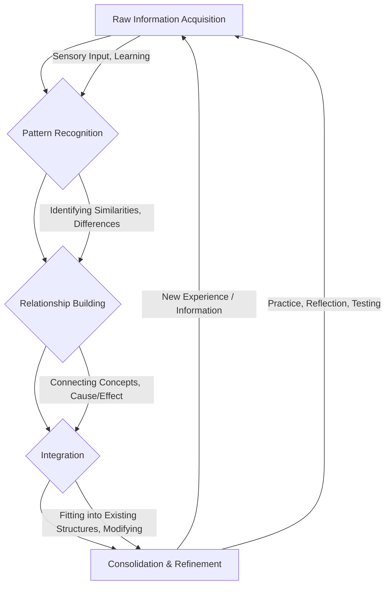
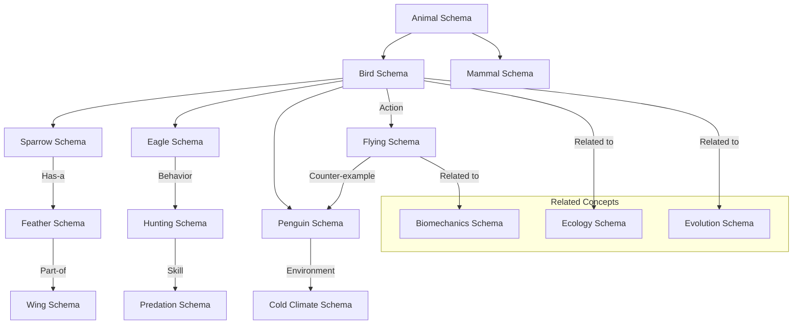

# mqd14kvochn01r

# Schema Formation

**Hierarchy:** Professional Career Development → Universal Foundations → Learning Foundation → Learning Strategies → Learning Science → Schema Formation

## Introduction

Imagine trying to understand a complex machine, like a car engine, by looking at every single bolt, wire, and piston in isolation, without any idea of how they fit together or what their purpose is. You'd quickly become overwhelmed and frustrated. Now imagine an experienced mechanic. They don't see isolated parts; they see systems, functions, and relationships. They immediately recognize patterns, diagnose problems, and know exactly what actions to take. This profound difference in understanding and capability is largely due to **Schema Formation**.

Schema Formation is the fundamental cognitive process through which humans organize, interpret, and make sense of information. It's how we build mental frameworks or blueprints that represent our knowledge about concepts, events, people, objects, and situations. These mental structures, known as **schemas**, are not just collections of facts; they are interconnected networks of knowledge that include relationships, expectations, and implications.

Why does Schema Formation matter? Because schemas are central to virtually every cognitive function that defines learning and expertise. They allow us to:

*   **Understand new information:** By fitting it into existing frameworks.
*   **Learn faster:** By providing a structure to attach new knowledge.
*   **Solve problems efficiently:** By recognizing patterns and applying appropriate strategies.
*   **Make decisions quickly:** By reducing cognitive load and focusing on relevant details.
*   **Develop true expertise:** By evolving from isolated facts to interconnected, actionable understanding.

In essence, schemas are the scaffolding upon which all knowledge and intelligence are built. They are what allow us to move beyond simple memorization to deep understanding, insightful thinking, and high-level performance.

## What Is A Schema?

At its core, a **schema** (plural: schemas or schemata) is a mental structure that represents a collection of knowledge about a specific concept or type of stimulus. Think of it as a pre-existing template or blueprint in your mind that helps you organize and interpret new information.

The concept of schemas has deep roots in psychology, notably popularized by **Frederic Bartlett** in the 1930s, who observed how people used prior knowledge to reconstruct memories, often distorting details to fit their expectations. Later, **Jean Piaget** integrated the idea into his theories of cognitive development, describing schemas as basic building blocks of intelligent behavior, ways of organizing knowledge.

Key characteristics of schemas:

*   **Mental Representations:** They are not physical objects but internal, abstract representations of the world.
*   **Cognitive Structures:** They are organized frameworks within our minds, not just random facts.
*   **Knowledge Organization Systems:** They dictate how we categorize information, link ideas, and retrieve memories.

**Intuitive Examples:**

*   **"Chair" Schema:** When you hear the word "chair," you don't just think of a specific chair you've seen. Your "chair" schema activates, bringing to mind common features: legs, a seat, a backrest, used for sitting. This schema allows you to instantly recognize new chairs, even if they look different from any you've seen before (e.g., a beanbag chair, a rocking chair).
*   **"Restaurant" Schema:** When you go to a restaurant, you have an expectation of the sequence of events: being seated, ordering, eating, paying, leaving. This "restaurant" schema helps you navigate the situation, understand roles (waiter, chef, customer), and predict what will happen next. If something deviates (e.g., you have to cook your own food), it triggers a different schema (e.g., "BBQ" or "Hotpot" restaurant).
*   **"Problem-Solving Strategy" Schema:** For a programmer, a "debugging" schema might involve specific steps: isolate the problem, check recent changes, use a debugger, read logs, test assumptions.

Schemas are dynamic; they are constantly being formed, updated, and revised as we encounter new information and experiences.

## Why Schemas Matter

The significance of schemas extends across virtually all cognitive functions. They are not merely an interesting psychological concept; they are the bedrock of effective learning and performance.

*   **Efficient Thinking:** Schemas allow us to process information quickly by providing a context. Instead of analyzing every piece of data from scratch, we can slot it into an existing schema, reducing the mental effort required.
*   **Faster Learning:** When you encounter new information, schemas act as a scaffold. You don't have to build understanding from the ground up; you can connect new concepts to existing frameworks, accelerating integration and comprehension. For instance, learning about a new programming language is easier if you already have schemas for programming concepts like variables, loops, and functions.
*   **Better Problem Solving:** Schemas help us recognize patterns in problems. An expert doesn't solve a new problem from first principles every time; they recognize it as a variation of a problem they've solved before and apply a relevant problem-solving schema. This allows for rapid diagnosis and effective strategy selection.
*   **Pattern Recognition:** This is a core function of schemas. They enable us to identify similarities and relationships between seemingly disparate pieces of information, allowing us to generalize from specific instances. This is crucial in fields from medical diagnosis to chess.
*   **Reduced Cognitive Effort (Cognitive Load Reduction):** By organizing information into coherent units, schemas reduce the burden on our [Working Memory](?topic=Working%20Memory). Instead of holding many individual facts in mind, we can retrieve a single schema that encapsulates a vast amount of related information, freeing up mental resources for higher-level thinking. This is directly related to the concept of [Cognitive Load](?topic=Cognitive%20Load).
*   **Memory Retrieval:** Schemas provide a structured way to store and retrieve memories. When you recall an event, you don't just pull up a raw recording; you reconstruct it using your schemas for the people, places, and actions involved.

Without schemas, every new experience would be entirely novel, every piece of information disconnected, and learning would be an impossibly slow and frustrating process of memorizing isolated facts.

## Human Cognitive Architecture

To understand where schemas fit, it's helpful to review the basic model of human cognitive architecture:

1.  **Sensory Memory:** This is our initial, very brief (milliseconds to a few seconds) storage for sensory information (sights, sounds, smells, etc.). It acts as a buffer, holding raw data before it's processed further. Most information here is discarded.
2.  **Working Memory (Short-Term Memory):** This is where conscious thought and active processing occur. It has a limited capacity (roughly 4-7 items or "chunks" of information) and a short duration (around 15-30 seconds without rehearsal). It's where we manipulate information, solve problems, and make decisions. This is where we "think." For more, see [Working Memory](?topic=Working%20Memory).
3.  **Long-Term Memory:** This is our vast, permanent storehouse of knowledge, skills, and experiences. It has virtually unlimited capacity and duration. Information is transferred here from working memory through processes like rehearsal, elaboration, and organization. For more, see [Long-Term Memory](?topic=Long-Term%20Memory).

**Where Schemas Fit:**

Schemas reside primarily in **Long-Term Memory**. They are the organized structures of knowledge stored there. When new information enters **Working Memory** from our senses or is retrieved from Long-Term Memory, schemas are actively used to interpret, organize, and integrate this information.

**The Learning Process with Schemas:**

```mermaid
graph TD
    A[Sensory Input] --> B{Sensory Memory}
    B --> C{Attention & Perception}
    C --> D[Working Memory]
    D -- New Information --> E[Long-Term Memory (LTM)]
    E -- Existing Schemas --> D
    D -- Elaboration & Integration --> E
    E -- Retrieval & Application --> D
    D -- Action / Response --> F[Output]

    subgraph Schema Role
        direction LR
        LTM_Schemas[LTM: Schemas]
        LTM_Schemas --> D
        D --> LTM_Schemas
    end
```

*   New sensory input is briefly held in **Sensory Memory**.
*   **Attention** brings relevant information into **Working Memory**.
*   In **Working Memory**, this new information interacts with **existing schemas** retrieved from **Long-Term Memory**.
*   These schemas help interpret the new information, making it more meaningful and easier to process.
*   Through processes like **elaboration** (connecting new info to existing schemas) and **integration** (modifying existing schemas or creating new ones), the processed information is then stored back into **Long-Term Memory**, strengthening or forming new schemas.
*   When we need to think, solve problems, or act, relevant schemas are retrieved from **Long-Term Memory** into **Working Memory** to guide our actions.

This interplay highlights that schemas aren't just passive storage; they are active tools that facilitate efficient processing and learning within our cognitive system.

## How Schemas Are Formed

Schema formation is a continuous and dynamic process that begins in infancy and continues throughout life. It's not a single event but a gradual construction and refinement of knowledge structures.

Here are the primary mechanisms through which schemas are formed and strengthened:

*   **Observation:** We constantly observe the world around us, noticing patterns, regularities, and relationships. For instance, observing that most objects released from a height fall downwards helps form a basic schema for gravity. Observing people's reactions in certain social situations helps form social schemas.
*   **Experience:** Direct engagement and interaction with the world are powerful schema builders. Learning to ride a bike forms a motor schema, integrating balance, coordination, and motion. Repeated experiences with a particular type of problem (e.g., debugging code) help consolidate a problem-solving schema.
*   **Learning (Instruction):** Formal education and intentional study are critical for schema formation. Reading textbooks, attending lectures, and participating in discussions provide structured information that helps us build schemas for complex concepts (e.g., the water cycle, economic principles, historical events).
*   **Practice:** Repeated application of knowledge and skills reinforces and refines schemas. Practicing a musical instrument, solving math problems, or writing code helps automate processes and solidify the underlying conceptual schemas. Practice moves knowledge from declarative ("knowing that") to procedural ("knowing how").
*   **Reflection:** Actively thinking about experiences, analyzing successes and failures, and synthesizing information are crucial for consolidating and improving schemas. Reflection allows us to identify gaps in our understanding, correct misconceptions, and generalize lessons learned from specific instances. It’s how we turn raw experience into structured knowledge.

**Examples:**

*   **Child learning "dog" schema:**
    *   **Observation:** Sees various dogs (big, small, furry, short-haired).
    *   **Experience:** Petting a dog, hearing it bark, playing fetch.
    *   **Learning (from parent):** Parent points and says, "That's a dog!"
    *   **Practice:** Identifying dogs in books, distinguishing them from cats.
    *   **Reflection:** Realizing that a dog might not have four legs (if it lost one), or that not all four-legged animals are dogs (a horse is not a dog). This refines the schema.

*   **Programmer forming "design pattern" schema:**
    *   **Learning:** Reading about the "Factory Method" design pattern in a book or online.
    *   **Observation:** Seeing examples of "Factory Method" in open-source projects or company codebases.
    *   **Practice:** Implementing the "Factory Method" in several different projects, making mistakes and correcting them.
    *   **Reflection:** Understanding *why* the Factory Method is useful in certain contexts, realizing its pros and cons, and when to choose it over other patterns. This deepens the schema from mere definition to contextual application.

## Schema Construction Process

Schema formation isn't just about passively absorbing information; it's an active process of construction and organization.



1.  **Information Acquisition:** This is the initial stage where we encounter new data through observation, reading, listening, or direct experience. The information is held in working memory.
2.  **Pattern Recognition:** Our brains naturally seek patterns, regularities, and recurring features within the acquired information. We look for what is similar, what is different, and what seems to go together. This is often an unconscious process.
3.  **Relationship Building:** Once patterns are identified, we start to build relationships between different pieces of information. This might involve identifying cause-and-effect, categorizing items, understanding hierarchies, or seeing analogies. We connect the dots.
4.  **Integration (Assimilation & Accommodation):** This is a critical step, often described by Piaget:
    *   **Assimilation:** Incorporating new information into an *existing* schema without changing the schema itself. (e.g., seeing a new breed of dog and fitting it into your existing "dog" schema).
    *   **Accommodation:** Modifying an *existing* schema, or creating a *new* schema, to account for new information that doesn't fit neatly into existing structures. (e.g., seeing a wolf and initially calling it a dog, then learning it's a different animal, requiring a refinement of the "dog" schema and potentially the creation of a "canid" schema).
5.  **Consolidation & Refinement:** Through repeated exposure, practice, and reflection, the newly formed or modified schema becomes more robust, stable, and accessible. Connections within the schema strengthen, irrelevant details are pruned, and the schema becomes more generalizable and useful. This process is heavily supported by sleep and repeated retrieval.

This cyclical process means that schemas are never truly "finished." They are always subject to revision and elaboration as we gain new experiences and knowledge.

## Schema Formation And Learning

Schemas are the bedrock of effective learning. Understanding their role explains why some learning strategies are far more effective than others.

*   **Why beginners struggle:** Beginners lack well-developed schemas in a new domain. Every piece of information feels novel and disconnected. They have to process each detail individually, which quickly overwhelms their limited [Working Memory](?topic=Working%20Memory). They don't have existing mental hooks to hang new information on. Learning feels like memorizing disparate facts.
*   **Why experts learn faster:** Experts possess rich, interconnected, and highly organized schemas. When they encounter new information, they don't see isolated facts; they immediately recognize how it relates to their existing mental frameworks. They can quickly assimilate new information, identify its significance, and integrate it, often with minimal conscious effort. Their schemas act as powerful filters and organizers.
*   **Building mental frameworks:** Effective learning is not about accumulating facts, but about building robust mental frameworks (schemas). This involves:
    *   **Connecting new information to old:** Actively looking for relationships and analogies.
    *   **Organizing knowledge hierarchically:** Understanding big-picture concepts and how details fit within them.
    *   **Identifying core principles:** Extracting the fundamental rules and relationships.
*   **Knowledge organization:** Schemas provide an organizational structure for all the information in your [Long-Term Memory](?topic=Long%20Term%20Memory). This organization is what allows for efficient retrieval and application of knowledge. Disorganized knowledge is hard to access and use effectively.

Learning, at its deepest level, is the process of forming, refining, and expanding our internal schemas.

## Schema Formation And Working Memory

The interaction between schema formation and [Working Memory](?topic=Working%20Memory) is crucial for understanding cognitive efficiency and expertise.

*   **Cognitive limitations:** Working Memory has a very limited capacity, typically able to hold only about 4-7 chunks of information at a time. This limitation makes it easy to experience [Cognitive Load](?topic=Cognitive%20Load) overload, especially for beginners.
*   **Chunking:** Schemas enable **chunking**. A "chunk" is a collection of related individual pieces of information that has been organized and stored as a single unit in Long-Term Memory. When a schema is well-formed, it allows a vast amount of information to be represented by a single "chunk" in Working Memory.
    *   **Example:** For a beginner chess player, each piece and its movement might be a separate item in Working Memory. For a grandmaster, an entire board position or a common opening sequence can be perceived as a single "chunk" or schema, freeing up Working Memory for strategic planning.
*   **Cognitive efficiency:** By chunking information, schemas dramatically increase the effective capacity of Working Memory. Instead of struggling to hold many individual facts, an expert can activate a few relevant schemas, each representing a complex body of knowledge. This allows for more sophisticated processing and problem-solving.
*   **Reduced mental load:** The ability of schemas to organize and compress information reduces the mental effort required to understand and process new data. This lowers cognitive load, making learning and problem-solving less strenuous and more effective.

In essence, schemas act as powerful compression algorithms for our minds, allowing us to manage the inherent limitations of Working Memory and perform complex tasks.

## Schema Formation And Long-Term Memory

[Long-Term Memory](?topic=Long%20Term%20Memory) is the home of schemas. The quality and organization of our schemas in Long-Term Memory directly determine our capacity for knowledge, retrieval, and expertise.

*   **Knowledge storage:** Schemas are the primary way knowledge is stored in Long-Term Memory. They aren't just lists of facts; they are interconnected networks that include declarative knowledge (facts, concepts), procedural knowledge (how-to skills), and episodic knowledge (personal experiences).
*   **Retrieval:** Well-formed schemas facilitate efficient memory retrieval. When you recall information, you don't typically search for individual facts. Instead, you activate a relevant schema, which then helps you access the associated information. The richer the connections within a schema, the more retrieval paths exist, making recall easier and faster.
*   **Memory organization:** Schemas provide a hierarchical and networked organization for all our stored knowledge. This structure prevents our Long-Term Memory from becoming a chaotic jumble of unrelated facts. It allows us to see how different pieces of information relate to each other and fit into a larger context.
*   **Expertise development:** The development of expertise is fundamentally the development of sophisticated, highly interconnected, and readily accessible schemas in Long-Term Memory. Experts have spent years building, refining, and automating these schemas through deliberate practice and extensive experience. This enables them to instantly recognize patterns, predict outcomes, and apply optimal solutions in their domain.

The strength of our Long-Term Memory isn't just about how much we can store, but *how well* that information is organized into functional schemas.

## Types Of Schemas

Schemas manifest in various forms, each specialized for organizing different kinds of information or guiding specific types of behavior.

### Concept Schemas

These represent general knowledge about objects, ideas, or categories. They define what something is.

*   **Definition:** Mental frameworks for understanding a specific concept, including its properties, attributes, and relationships to other concepts.
*   **Example:**
    *   **"Tree" Schema:** Includes attributes like "has a trunk," "has branches," "has leaves," "is alive," "produces oxygen," "is usually tall." It allows you to recognize different types of trees (oak, pine, palm) as fitting within the general "tree" category.
    *   **"Democracy" Schema:** Encompasses ideas like "rule by the people," "elections," "individual rights," "separation of powers," "freedom of speech."

### Process Schemas

These represent knowledge about sequences of events, steps, or actions. They define how something works or how to do something.

*   **Definition:** Mental models of procedures, algorithms, or causal sequences. They outline the steps involved in a process.
*   **Example:**
    *   **"Cooking an Egg" Schema:** Involves steps like "get egg," "heat pan," "add oil/butter," "crack egg," "cook until desired doneness," "serve."
    *   **"Software Development Lifecycle" Schema:** Includes stages like "requirements gathering," "design," "implementation," "testing," "deployment," "maintenance."

### Problem-Solving Schemas

These are specialized process schemas that apply to specific types of problems. They define how to approach and resolve a challenge.

*   **Definition:** Mental templates for identifying a problem type, selecting appropriate strategies, and executing a solution.
*   **Example:**
    *   **"Debugging Code" Schema:** Might involve steps like "check error message," "isolate problematic code section," "use a debugger to step through," "print intermediate values," "test edge cases," "consult documentation/peers."
    *   **"Sudoku Solving" Schema:** Involves strategies like "single candidate," "hidden single," "naked pair," "X-wing."

### Domain Schemas

These are large, overarching schemas that encompass a vast amount of knowledge within a specific field or area of expertise. They are rich networks of interconnected concept, process, and problem-solving schemas.

*   **Definition:** Comprehensive organizational frameworks for an entire body of knowledge, allowing for deep understanding and integration within a specialized area.
*   **Example:**
    *   **"Physics" Schema:** Integrates concept schemas (gravity, electromagnetism, quantum mechanics), process schemas (experimental design, mathematical modeling), and problem-solving schemas (deriving equations, analyzing forces).
    *   **"Marketing" Schema:** Combines understanding of customer behavior, market research techniques, branding principles, advertising strategies, and sales funnels.

### Mental Models

While often used interchangeably with schemas, mental models can be considered a specific, highly functional type of schema focused on explaining how something works in the real world. They are operational, predictive, and often involve cause-and-effect relationships.

*   **Definition:** Simplified representations of how systems or phenomena function. They allow us to predict behavior, diagnose problems, and design interventions.
*   **Example:**
    *   **"Internal Combustion Engine" Mental Model:** Understanding that fuel mixes with air, is compressed, ignited, and pushes a piston, which turns a crankshaft. This model allows a mechanic to diagnose engine problems without seeing inside.
    *   **"Market Supply and Demand" Mental Model:** Understanding that if supply exceeds demand, prices fall, and vice-versa. This model helps business professionals predict market changes.

These various types of schemas are not isolated but interconnected, forming a complex web of knowledge that enables us to navigate and interact with the world effectively.

## Schema Formation And Expertise

The journey from novice to expert is largely a story of schema formation, refinement, and organization.

*   **Novice thinking:**
    *   **Fragmented schemas:** Knowledge exists as isolated facts or small, disconnected schemas.
    *   **Surface-level understanding:** Focus on superficial features rather than underlying principles.
    *   **High cognitive load:** Every problem is new, requiring extensive working memory resources.
    *   **Slow problem-solving:** Relies on general-purpose, inefficient strategies (e.g., trial and error).
*   **Intermediate thinking:**
    *   **Developing schemas:** Some connections are made, and broader schemas begin to form.
    *   **Deeper understanding in specific areas:** Can solve more complex problems but may struggle with novel variations.
    *   **Reduced cognitive load:** Can chunk some information but still needs conscious effort for many tasks.
    *   **More systematic problem-solving:** Begins to apply domain-specific strategies.
*   **Expert thinking:**
    *   **Rich, interconnected schemas:** Vast, hierarchical, and flexible schemas that cover their domain comprehensively.
    *   **Deep structural understanding:** Focus on underlying principles, relationships, and invariants, rather than surface features.
    *   **Automated processing (chunking):** Can process complex information as single chunks, dramatically reducing cognitive load in [Working Memory](?topic=Working%20Memory).
    *   **Rapid pattern recognition:** Instantly recognizes problem types and retrieves appropriate solutions.
    *   **Intuition development:** Through extensive experience, experts can make fast, accurate judgments that appear intuitive but are based on highly developed schemas and implicit pattern matching. This "intuition" is essentially rapid, unconscious schema activation.

The development of expertise is not just about accumulating more facts; it's about transforming those facts into organized, actionable, and highly interconnected schemas that allow for efficient perception, thinking, and performance.

## Chunking And Schemas

**Chunking** is a powerful cognitive mechanism directly supported by schemas, essential for managing the limitations of [Working Memory](?topic=Working%20Memory).

*   **What chunking is:** Chunking is the process of grouping discrete pieces of information into larger, meaningful units or "chunks." These chunks are then treated as single items in working memory.
*   **Why chunking works:**
    *   **Overcomes Working Memory limits:** While Working Memory can only hold about 4-7 individual items, it can hold 4-7 *chunks*, regardless of how much information each chunk contains.
    *   **Reduces cognitive load:** By consolidating multiple pieces of information into one chunk, it frees up Working Memory capacity for other tasks, leading to greater cognitive efficiency.
    *   **Facilitates processing:** Organized chunks of information are easier to retrieve, manipulate, and integrate with other knowledge.
*   **Relationship between chunking and schemas:** Schemas *are* the structured knowledge that allows for chunking. When you have a well-formed schema for a concept (e.g., "recursive function" in programming, "supply and demand" in economics, "photosynthesis" in biology), you can treat that entire concept as a single chunk.

**Examples:**

*   **Phone Number:** A novice might see 1-800-555-1234 as ten separate digits. Someone familiar with phone numbers chunks it into three units: (1-800) (555) (1234), making it easier to remember and process. The "phone number" schema guides this chunking.
*   **Chess Positions:** As mentioned earlier, a chess grandmaster sees a complex board arrangement not as 32 individual pieces, but as a few large, meaningful chunks representing attacking positions, defensive formations, or strategic openings, all thanks to their deep chess schemas.
*   **Medical Diagnosis:** A doctor doesn't just see a list of symptoms. Their "pneumonia" schema allows them to chunk a collection of symptoms (fever, cough, shortness of breath, chest X-ray findings) into a single diagnostic chunk, rapidly suggesting a specific illness and treatment path.

Chunking is the practical manifestation of schemas in action within Working Memory, enabling us to handle complexity and develop expertise.

## Knowledge Networks

Schemas don't exist in isolation; they are deeply interconnected, forming vast and intricate **knowledge networks** within our [Long-Term Memory](?topic=Long%20Term%20Memory).

*   **Connected knowledge:** Think of your knowledge as a massive web or graph, where each schema is a node, and the relationships between them are the links. For example, your "bird" schema is connected to "feather" (component), "flying" (behavior), "nest" (habitat), "egg" (reproduction), "sparrow" (example), and "dinosaur" (evolutionary link).
*   **Interdisciplinary thinking:** The strength and density of these connections allow for interdisciplinary thinking. When you have a strong schema for "systems thinking" from engineering, you can apply it to business strategy, ecological problems, or even personal finance because the underlying principles are connected across domains.
*   **Knowledge webs:** These webs aren't just hierarchical; they're often semantic, associative, and causal. The more connections a piece of information has to other schemas, the more deeply it's understood, the easier it is to retrieve, and the more flexibly it can be applied.
*   **Concept relationships:** Schemas explicitly encode concept relationships:
    *   **Hierarchical:** Is-a (e.g., Sparrow IS A Bird)
    *   **Part-of:** Has-a (e.g., Bird HAS A Wing)
    *   **Causal:** Leads-to (e.g., Gravity LEADS TO objects falling)
    *   **Associative:** Often-found-with (e.g., Beach IS OFTEN FOUND WITH sand)



This diagram illustrates how a "Bird Schema" isn't isolated but part of a larger "Animal Schema," with sub-schemas for specific birds, and connections to various attributes, behaviors, environments, and even broader scientific concepts. The richness of these connections defines the depth of one's knowledge.

## Schema Formation In Different Domains

While the underlying cognitive process of schema formation is universal, its manifestation and specific content vary widely across different domains.

### Programming

*   **Novice:** Isolated schemas for syntax (e.g., `for` loop, `if` statement), individual data structures (e.g., array, list), or specific algorithms (e.g., bubble sort). Struggles to combine them.
*   **Expert:** Rich domain schemas for design patterns (e.g., Factory, Singleton, Observer), architectural styles (e.g., Microservices, Monolith), problem types (e.g., concurrency, data transformation), and best practices. They can see an entire system's structure, predict failure points, and select optimal solutions. Their "debugging" schema is highly refined.

### Mathematics

*   **Novice:** Schemas for individual formulas or specific problem-solving steps (e.g., "how to solve a quadratic equation").
*   **Expert:** Deep schemas for mathematical concepts (e.g., linearity, symmetry, convergence), proof techniques (e.g., induction, contradiction), and the underlying structure of mathematical reasoning. They recognize problem types and quickly identify the most elegant and efficient solution strategy, often seeing the 'why' behind formulas.

### Science

*   **Novice:** Schemas for facts (e.g., "photosynthesis equation," "stages of mitosis").
*   **Expert:** Integrated schemas for scientific principles (e.g., conservation of energy, natural selection), experimental design methodologies, critical evaluation of evidence, and the interconnections between different scientific disciplines. They can form hypotheses, design experiments, and interpret complex data within a broader theoretical framework.

### Business

*   **Novice:** Schemas for individual business functions (e.g., "marketing campaign steps," "basic accounting entries").
*   **Expert:** Holistic domain schemas for strategic frameworks (e.g., SWOT, Porter's Five Forces), market dynamics, organizational behavior, risk assessment, and decision-making models. They understand how different functions interact to achieve business goals and can navigate complex, ambiguous situations.

### Engineering

*   **Novice:** Schemas for individual components or equations (e.g., "beam deflection formula," "resistor color code").
*   **Expert:** Integrated schemas for system design (e.g., fluid dynamics, structural integrity, control theory), material properties, failure modes, cost-benefit analysis, and project management. They can visualize entire systems, anticipate potential issues, and optimize designs for multiple constraints.

### Language Learning

*   **Novice:** Schemas for individual vocabulary words, simple grammatical rules.
*   **Expert:** Complex schemas for sentence structures, idiomatic expressions, cultural nuances, conversational flow, and pronunciation patterns. They don't translate word-by-word but process entire phrases and meanings, often thinking directly in the target language.

### Research

*   **Novice:** Schemas for basic research steps (e.g., "literature search," "data collection").
*   **Expert:** Sophisticated schemas for formulating research questions, selecting appropriate methodologies, data analysis techniques, ethical considerations, peer review processes, and synthesizing findings into broader theoretical contributions. They understand the entire research ecosystem and can identify gaps in current knowledge.

The critical aspect across all domains is that expertise isn't just about accumulating more facts; it's about forming *better organized, more interconnected, and more flexible schemas* that allow for deeper understanding, faster processing, and more effective problem-solving within that specific domain.

## Common Obstacles To Schema Formation

Building robust schemas isn't always straightforward. Several common pitfalls can hinder effective schema formation:

*   **Memorization without understanding:** Rote memorization focuses on storing isolated facts without building connections or context. This leads to fragile knowledge that is easily forgotten and difficult to apply. Information isn't integrated into a meaningful schema.
*   **Fragmented knowledge:** When learning is disjointed, and concepts are presented in isolation, learners struggle to see how different pieces of information relate. This results in many small, unconnected schemas rather than a coherent network.
*   **Information overload:** Being bombarded with too much new information at once, especially without adequate time for processing and reflection, overwhelms [Working Memory](?topic=Working%20Memory) and prevents the brain from identifying patterns and building relationships. This leads to superficial processing and weak schema formation.
*   **Lack of practice:** Schemas are strengthened through repeated activation and application. Without practice, the neural pathways associated with a schema weaken, and the knowledge remains fragile and inaccessible.
*   **Lack of reflection:** Reflection is crucial for integrating new information, identifying misconceptions, and consolidating learning. Without actively thinking about what was learned, why it matters, and how it connects, schemas remain underdeveloped.
*   **Passive learning:** Merely listening to a lecture or reading a book without active engagement (e.g., asking questions, summarizing, applying concepts) doesn't encourage the brain to actively construct and link schemas.
*   **Misconceptions:** If initial schemas are flawed or based on incorrect assumptions, new information might be assimilated incorrectly, reinforcing errors rather than correcting them. This can be harder to undo later.

Overcoming these obstacles requires a proactive and intentional approach to learning that prioritizes understanding, connection-building, and active engagement.

## Building Strong Schemas

Fortunately, there are proven strategies to actively promote the formation and strengthening of robust schemas. These strategies focus on deep processing, connection-making, and active engagement.

*   **Active Recall (Retrieval Practice):** Regularly testing yourself on what you've learned. This forces your brain to retrieve information, strengthening the neural pathways and making connections within your schemas more robust.
    *   **Example:** After reading a chapter, close the book and write down everything you remember. Create flashcards and test yourself daily.
*   **Elaboration:** Connecting new information to what you already know, explaining concepts in your own words, and thinking about "how" and "why." This creates more pathways to and from a schema.
    *   **Example:** When learning a new concept, ask yourself: "How does this relate to X?" "What are the implications of this?" "Can I think of an analogy?"
*   **Concept Mapping:** Visually representing relationships between concepts. This explicitly forces you to identify nodes (concepts) and links (relationships), revealing the structure of your understanding and identifying gaps.
    *   **Example:** Draw a diagram with central ideas, branching out to sub-ideas, and drawing arrows to show connections and causal links.
*   **Teaching Others:** Explaining a concept to someone else forces you to organize your thoughts, identify key principles, simplify complex ideas, and address potential questions. This solidifies your schemas.
    *   **Example:** Volunteer to tutor a peer, explain a complex topic to a friend, or even "teach" an imaginary audience.
*   **Deliberate Practice:** Focused, intentional practice that pushes you beyond your comfort zone, targets specific weaknesses, and provides immediate feedback. This refines procedural schemas and deepens conceptual understanding. (See [Deliberate Practice](?topic=Deliberate%20Practice))
    *   **Example:** In programming, instead of just solving simple problems, work on a project that requires learning a new framework or algorithm, actively seeking feedback on your approach.
*   **Reflection:** Regularly taking time to review what you've learned, how it connects to other knowledge, and what challenges you faced. This helps consolidate understanding and update schemas.
    *   **Example:** Keep a learning journal, periodically review your notes, and ask yourself: "What was the most important idea?" "What was confusing?" "How can I apply this?"
*   **Real-World Application:** Applying knowledge in practical situations helps bridge the gap between abstract understanding and functional competence. This shows your brain the utility of the schema and integrates it more deeply.
    *   **Example:** If learning about project management, volunteer to lead a small project. If learning a new language, try to have a conversation with a native speaker.

These strategies, when consistently applied, actively engage the processes of information acquisition, pattern recognition, relationship building, and integration, leading to stronger and more flexible schemas.

## Schema Revision And Updating

Schemas are not static; they are dynamic and constantly evolving. The ability to revise and update schemas is a hallmark of intelligent and adaptive learning.

*   **Correcting misconceptions:** As we encounter new evidence or gain deeper understanding, we may realize that parts of our existing schemas are incorrect or incomplete. Schema revision allows us to correct these misconceptions.
    *   **Example:** A child's initial "bird" schema might include "all birds fly." Upon seeing a penguin, they must revise their schema to include "some birds do not fly" or create a new sub-schema for "flightless birds."
*   **Updating beliefs:** Our schemas also encompass our beliefs about the world. New experiences or information can lead us to update these beliefs.
    *   **Example:** A schema about a particular industry might initially include the belief that "Company X is the market leader." New market research might require updating this belief if another company has overtaken them.
*   **Integrating new information:** As we learn, we constantly integrate new information. This might involve elaborating on an existing schema, creating new sub-schemas, or connecting an existing schema to previously unrelated ones.
    *   **Example:** Learning about object-oriented programming might cause a programmer to integrate existing schemas for "functions" and "data structures" into a new "class" schema, connecting them in a new way.
*   **Continuous learning:** Schema revision is fundamental to continuous learning and growth. It allows us to remain open to new ideas, adapt to changing environments, and evolve our understanding over time. Without this ability, learning would stagnate, and our knowledge would quickly become outdated.

This dynamic process of assimilation and accommodation (as described by Piaget) ensures that our internal representations of the world remain accurate, useful, and adaptable.

## Schema Formation And Critical Thinking

Strong schema formation is inextricably linked to critical thinking. Critical thinking relies on well-structured knowledge and the ability to evaluate, analyze, and synthesize information effectively.

*   **Identifying assumptions:** Our schemas contain implicit assumptions. Critical thinking involves recognizing these assumptions and evaluating whether they are valid. A well-developed schema allows us to quickly identify when information *doesn't* fit our expectations, prompting us to question the underlying assumptions of that schema.
*   **Evaluating evidence:** With robust schemas, we can better contextualize and evaluate new evidence. We can discern whether new information supports, contradicts, or modifies our existing understanding. Fragmented knowledge makes it difficult to assess the relevance or validity of evidence.
*   **Building accurate mental models:** Critical thinking aims to build mental models (a type of schema) that accurately reflect reality. This involves testing these models against new information, identifying inconsistencies, and refining them. For example, a critical thinker will not simply accept a news report but will assess its sources, compare it with other information, and integrate it into a broader schema of geopolitical events.
*   **Recognizing bias:** Our schemas can also contain biases, formed through limited experience or cultural influences. Critical thinking helps us to identify these biases within our own schemas and in the information presented by others, leading to more objective and nuanced understanding.

In essence, schema formation provides the organized knowledge base, and critical thinking provides the tools to interrogate, refine, and apply that knowledge effectively and responsibly.

## Schema Formation In The AI Era

The rise of Artificial Intelligence (AI) and readily available information fundamentally changes the landscape of learning and the importance of schema formation. While AI can augment learning, it also poses new challenges.

*   **AI-assisted learning:** AI tools (like large language models) can provide vast amounts of information, generate summaries, answer questions, and even personalize learning paths. This can accelerate the initial stages of information acquisition.
*   **Knowledge synthesis:** AI can help synthesize information from diverse sources, presenting it in a structured way that *could* facilitate schema formation by showing connections. However, the learner still needs to actively process and integrate this.
*   **Risks of shallow understanding:** Over-reliance on AI to provide answers or explanations without active mental effort can lead to "cognitive offloading." Learners might absorb information passively without truly integrating it into their own schemas. This results in fragile knowledge that isn't deeply understood or readily applicable. The "why" and "how" are missed.
*   **Preventing cognitive dependency:** If we always turn to AI for answers, we risk atrophying our own schema-building capabilities. We might develop an external dependency rather than strengthening our internal knowledge structures.
*   **Building personal understanding despite AI assistance:** The goal in the AI era is not to compete with AI's ability to store or retrieve facts, but to develop superior human abilities to integrate, critically evaluate, innovate, and apply knowledge in complex, ambiguous contexts. This requires robust personal schemas that AI cannot fully replicate.

**The imperative in the AI era:** Focus on using AI as a tool for *active schema formation*. Instead of asking AI for the answer, ask it to:
    *   Explain a concept in different ways.
    *   Generate examples that test your understanding.
    *   Identify counter-arguments or alternative perspectives.
    *   Simulate scenarios for problem-solving practice.
    *   Help you elaborate on a concept and connect it to other ideas.

The emphasis shifts from mere information acquisition to *meaning-making* and *schema construction* assisted by powerful tools.

## Common Myths

Several misconceptions about learning and expertise can hinder effective schema formation:

*   **Myth: More information automatically creates expertise.**
    *   **Reality:** Expertise isn't about the quantity of facts you can recall, but the *quality and organization* of your schemas. Simply consuming more information without active processing, integration, and reflection leads to fragmented, shallow knowledge.
*   **Myth: Memorization equals understanding.**
    *   **Reality:** Rote memorization bypasses deep schema formation. You can memorize definitions or formulas without truly understanding the underlying concepts, their relationships, or how to apply them flexibly. True understanding comes from building robust schemas.
*   **Myth: Experts know more facts rather than having better schemas.**
    *   **Reality:** While experts certainly possess a vast knowledge base, their advantage lies in how that knowledge is *organized* into highly interconnected, flexible, and accessible schemas. They don't just know *more*; they know *better*.
*   **Myth: Learning is simply storing information.**
    *   **Reality:** Learning is an active, constructive process of building, modifying, and integrating schemas. It involves making sense of information, forming connections, and organizing knowledge into coherent mental frameworks, not just passively saving data.
*   **Myth: Learning is linear.**
    *   **Reality:** Schema formation is often non-linear, involving moments of confusion, breakthroughs, and iterative refinement. It's a messy process of assimilation, accommodation, and reorganization.

Dispelling these myths is crucial for adopting effective learning strategies that genuinely foster deep understanding and expertise.

## Real-World Applications

Schema formation is not just a theoretical concept; it underpins success across diverse professional fields.

*   **Education:** Effective teaching involves helping students build strong schemas, not just memorize facts. Strategies like concept mapping, problem-based learning, and elaborative interrogation are designed to foster schema development.
*   **Software Engineering:** Experienced engineers have robust schemas for design patterns, architectural styles, debugging strategies, and domain-specific challenges. This allows them to quickly understand complex systems, write efficient code, and troubleshoot problems effectively.
*   **Medicine:** Doctors rely heavily on diagnostic schemas. Presented with a set of symptoms, an experienced physician's schemas allow them to quickly identify potential diseases, rule out others, and formulate a treatment plan.
*   **Business:** Leaders with strong business schemas can interpret market trends, identify strategic opportunities, anticipate competitive moves, and make informed decisions, often under pressure. Their mental models of the industry and economy are highly developed.
*   **Research:** Researchers constantly form and refine schemas about their field. This allows them to identify gaps in knowledge, formulate novel hypotheses, design experiments, and interpret complex results within a coherent theoretical framework.
*   **Professional Development:** Any professional seeking to advance in their career must continuously develop and refine schemas related to their domain, leadership, communication, and problem-solving skills. It's about building a richer internal model of their profession.
*   **Leadership:** Effective leaders possess sophisticated schemas for human behavior, organizational dynamics, strategic vision, and conflict resolution. These mental models allow them to understand complex situations, motivate teams, and guide organizations through change.

In every domain where knowledge is critical and decisions must be made, the quality of an individual's schemas directly correlates with their performance and success.

## Practical Framework For Building Strong Schemas

Here's a step-by-step framework to intentionally cultivate robust schemas:

1.  **Understand the Big Picture First:** Before diving into details, try to grasp the overarching concepts and purpose. Ask: "What is this about?" "Why does it matter?" "What's the main idea?" (e.g., Use an [Introduction](?topic=Introduction) to get the overview.)
2.  **Actively Connect New to Old:** For every new piece of information, consciously try to link it to something you already know. Ask: "How does this relate to X?" "Is this an example of Y?" "What's the analogy here?"
3.  **Elaborate and Explain:** Don't just read or listen passively. Paraphrase, summarize, and explain concepts in your own words. Imagine you're teaching it to someone else.
4.  **Visualize and Map:** Create concept maps, diagrams, or flowcharts to visually represent relationships, hierarchies, and processes. This externalizes your internal schemas and helps identify gaps.
5.  **Practice Retrieval Regularly (Active Recall):** Constantly test yourself. Instead of rereading, try to recall information from memory. This strengthens the connections within your schemas and makes retrieval easier. (e.g., Use flashcards, self-quizzing.)
6.  **Apply Knowledge:** Use what you've learned in practical scenarios. Solve problems, build projects, discuss ideas, or teach others. Application solidifies schemas and reveals areas for refinement.
7.  **Seek Feedback and Reflect:** Actively seek feedback on your understanding and application. Regularly reflect on what went well, what was challenging, and how your understanding has evolved. This iterative process allows for schema revision and improvement.
8.  **Embrace Discomfort and Error:** Schema formation often involves encountering information that challenges existing understanding. View errors as opportunities to refine and update your schemas, rather than as failures.
9.  **Vary Your Learning Contexts:** Learning a concept in different environments or applying it to different types of problems helps make your schemas more flexible and generalizable.

This framework moves beyond passive consumption of information to active construction of knowledge.

## Practical Action Plan

Here's how learners at different stages can implement schema-building strategies:

### Beginner Implementation Plan

*   **Focus:** Laying foundational blocks, understanding basic definitions, and making initial connections.
*   **Actions:**
    *   **Prioritize understanding over memorization:** Don't move on until you can explain basic concepts in your own words.
    *   **Use analogies:** Actively look for simple analogies to connect new concepts to familiar ideas.
    *   **Create basic concept maps:** For each new topic, draw simple diagrams showing how 2-3 main ideas are linked.
    *   **Regular self-quizzing:** After each lesson or reading, try to recall 3-5 key takeaways without looking at notes.
    *   **Seek explanations:** Don't hesitate to ask "why" questions repeatedly to understand underlying mechanisms.

### Intermediate Implementation Plan

*   **Focus:** Expanding existing schemas, building deeper connections, and starting to apply knowledge more flexibly.
*   **Actions:**
    *   **Elaborate extensively:** When learning new information, actively connect it to 3-5 existing concepts. Write down these connections.
    *   **Practice varied problems:** Don't just stick to textbook examples. Seek out novel problems that require combining multiple concepts.
    *   **Teach a peer:** Explain complex topics to someone who knows less than you. Identify areas where your explanation falters.
    *   **Create comprehensive concept maps:** Integrate entire chapters or modules into large, interconnected diagrams.
    *   **Compare and contrast:** Actively identify similarities and differences between related concepts to refine your schemas.

### Advanced Implementation Plan

*   **Focus:** Refining and integrating complex domain schemas, developing intuition, and applying knowledge to novel, ambiguous situations.
*   **Actions:**
    *   **Critique and synthesize:** Read research papers or complex articles and identify the core arguments, assumptions, and how they contribute to or challenge existing domain schemas.
    *   **Simulate real-world challenges:** Engage in complex projects, case studies, or simulations that require integrating vast amounts of knowledge and making high-stakes decisions.
    *   **Mentor others:** Guide junior colleagues or students, which forces you to articulate your schemas and adapt your explanations to different levels of understanding.
    *   **Deliberate practice with feedback:** Continuously seek out challenging tasks and expert feedback to identify subtle flaws or areas for improvement in your advanced schemas.
    *   **Cross-domain application:** Actively look for opportunities to apply schemas from one domain to solve problems in another (e.g., using systems thinking from engineering to solve an organizational challenge).

By following these plans, learners can systematically move from fragmented knowledge to a rich, interconnected web of schemas that characterizes true expertise.

## Summary

Schema Formation is the cornerstone of human learning and expertise. It's the cognitive process of organizing raw information into meaningful, interconnected mental frameworks called schemas. These schemas reside in our Long-Term Memory and are critical for efficient thinking, faster learning, effective problem-solving, and managing the limitations of Working Memory through 'chunking.'

Schemas are formed through observation, experience, learning, practice, and reflection, following a process of information acquisition, pattern recognition, relationship building, integration (assimilation and accommodation), and consolidation. They evolve from simple concept schemas to complex domain schemas and mental models.

Expertise is largely defined by the richness and interconnectedness of one's schemas, allowing for deep understanding, rapid pattern recognition, and intuitive decision-making. Overcoming obstacles like rote memorization and fragmented knowledge requires active strategies such as active recall, elaboration, concept mapping, and deliberate practice. In the AI era, focusing on building strong personal schemas is more crucial than ever to foster critical thinking and prevent cognitive dependency. By intentionally cultivating and revising our schemas, we can continuously enhance our capacity for learning and performance across all aspects of life and work.

## Key Takeaways

*   **Schemas are mental blueprints:** They are organized knowledge structures in Long-Term Memory that help us interpret, organize, and use information.
*   **Schemas enable cognitive efficiency:** They allow for faster learning, better problem-solving, reduced cognitive load, and powerful pattern recognition by 'chunking' information.
*   **Schema formation is active and continuous:** It involves observation, experience, learning, practice, and crucial reflection, constantly integrating new information into existing frameworks or creating new ones.
*   **Expertise is schema-driven:** The difference between a novice and an expert lies primarily in the quality, depth, and interconnectedness of their schemas.
*   **Intentional strategies are vital:** Active recall, elaboration, concept mapping, teaching others, deliberate practice, and reflection are powerful tools for building and refining robust schemas.
*   **Schemas are dynamic:** They must be regularly revised, updated, and connected to maintain accuracy and adapt to new information.
*   **Critical in the AI era:** Building strong personal schemas is essential for deep understanding, critical thinking, and innovation, preventing over-reliance on external AI knowledge.

## Further Reading

*   Cognitive Psychology textbooks (e.g., Daniel Kahneman, Steven Pinker, Daniel Willingham)
*   "Make It Stick: The Science of Successful Learning" by Peter C. Brown, Henry L. Roediger III, and Mark A. McDaniel
*   "Thinking, Fast and Slow" by Daniel Kahneman
*   "Peak: Secrets from the New Science of Expertise" by Anders Ericsson and Robert Pool

## Related KnowHub Pages

*   [Learning Science](?topic=Learning%20Science)
*   [Working Memory](?topic=Working%20Memory)
*   [Long-Term Memory](?topic=Long-Term%20Memory)
*   [Cognitive Load](?topic=Cognitive%20Load)
*   [Neuroplasticity](?topic=Neuroplasticity)
*   [Deep Learning](?topic=Deep%20Learning)
*   [Knowledge Management](?topic=Knowledge%20Management)
*   [Skill Acquisition](?topic=Skill%20Acquisition)
*   [Deliberate Practice](?topic=Deliberate%20Practice)