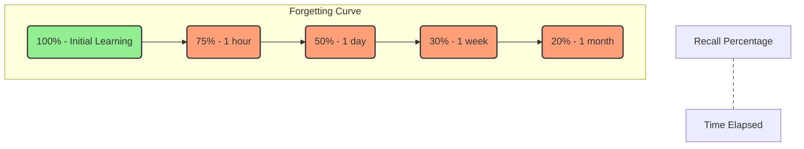

# mqd14kvoriy6hg

# Long-Term Memory

Long-Term Memory (LTM) is the vast and durable storage system in the human brain responsible for holding information, knowledge, and skills over extended periods, ranging from days to a lifetime. It is the foundation of lasting learning, expertise, and personal identity. Without effective LTM, our experiences would be fleeting, our skills wouldn't develop, and the cumulative wisdom we gain throughout life would vanish.

## Why Long-Term Memory Matters

Long-Term Memory is not just about remembering facts; it's about building a robust internal model of the world that allows us to understand, reason, solve problems, and innovate. Lasting learning critically depends on successfully transferring information into LTM and making it readily accessible. The development of expertise in any domain, from programming to medicine, is fundamentally rooted in the accumulation and efficient organization of vast amounts of knowledge and skills within LTM.

**The Relationship between Memory, Learning, and Expertise:**

*   **Learning:** The process of acquiring new knowledge, behaviors, skills, or values. For learning to be meaningful and lasting, it must result in stable changes in Long-Term Memory.
*   **Memory:** The ability to encode, store, retain, and subsequently recall information and past experiences. Long-Term Memory is the ultimate destination for learned information.
*   **Expertise:** The superior knowledge and skills developed in a particular domain. Expertise relies on a highly developed and intricately organized Long-Term Memory, enabling rapid pattern recognition, problem-solving, and decision-making.

## What Is Long-Term Memory

Long-Term Memory is the brain's system for storing information for indefinite periods. Unlike the temporary nature of sensory and working memory, LTM is designed for enduring retention.

*   **Definition:** The memory system responsible for the permanent or semi-permanent storage of information.
*   **Characteristics:**
    *   **Vast Capacity:** Potentially limitless storage.
    *   **Long Duration:** Information can be stored for days, years, or a lifetime.
    *   **Associative:** Information is interconnected, forming networks of knowledge.
    *   **Reconstructive:** Recall is often a reconstruction based on existing knowledge, rather than a perfect playback.
*   **Duration:** Can range from minutes after learning to decades.
*   **Capacity:** Often described as virtually limitless, allowing us to accumulate vast amounts of knowledge and experience throughout our lives.
*   **Importance in Learning:** It's the ultimate goal of learning; without LTM, learned material would be forgotten almost immediately, preventing skill development, understanding, and the ability to apply knowledge.

## Human Memory Architecture

Our memory system isn't a single entity but a sophisticated architecture involving several distinct but interconnected stages, often conceptualized in the Atkinson-Shiffrin model (or multi-store model).

```mermaid
graph TD
    A[Environmental Stimuli] --> B[Sensory Memory]
    B -->|Attention| C[Working Memory]
    C -->|Encoding & Consolidation| D[Long-Term Memory]
    D -->|Retrieval| C
    C -->|Response| E[Behavior/Output]
    B --x|Forgetting: Decay|
    C --x|Forgetting: Decay, Interference|
    D --x|Forgetting: Retrieval Failure, Interference|

    style A fill:#f9f,stroke:#333,stroke-width:2px
    style B fill:#add8e6,stroke:#333,stroke-width:2px
    style C fill:#90ee90,stroke:#333,stroke-width:2px
    style D fill:#ffa07a,stroke:#333,stroke-width:2px
    style E fill:#f9f,stroke:#333,stroke-width:2px
```

1.  **Sensory Memory:**
    *   **Function:** Briefly holds incoming sensory information (sights, sounds, smells, etc.) for a fraction of a second to a few seconds.
    *   **Example:** The fleeting image you retain after a lightning flash, or the echo of a sound after it has stopped. Most of this information is lost unless attention is paid to it.
2.  **Working Memory (Short-Term Memory):**
    *   **Function:** A temporary "workspace" where we actively process and manipulate information from sensory memory or retrieved from Long-Term Memory. It has limited capacity and duration (around 7±2 chunks of information for about 15-30 seconds).
    *   **Example:** Remembering a phone number just long enough to dial it, or holding instructions in mind while performing a task. This is where active thinking, problem-solving, and conscious processing occur.
    *   [Working Memory](?topic=Working%20Memory) is critical for transferring information.
3.  **Long-Term Memory:**
    *   **Function:** The vast, relatively permanent storage system for all our accumulated knowledge, skills, and experiences.
    *   **Example:** Remembering your first day of school, how to ride a bike, or the capital of France.

**How Information Moves Between These Systems:**

*   **Sensory to Working Memory:** Information moves from sensory memory to working memory when we pay **attention** to it. Without attention, it rapidly decays.
*   **Working Memory to Long-Term Memory:** For information to become part of LTM, it must be **encoded** and **consolidated**. This typically involves active processing, understanding, and making connections. Repetition, elaboration, and meaningful engagement are key here.
*   **Long-Term Memory to Working Memory:** When we need to use stored information (e.g., answer a question, apply a skill), it is **retrieved** from LTM and brought back into working memory for active use.

## How Information Enters Long-Term Memory

The journey of information from a fleeting thought to a lasting memory involves several crucial steps:

1.  **Attention:** The first filter. We must pay attention to information for it to move from sensory memory into working memory. Without attention, it won't even begin the encoding process.
    *   **Example:** If you're scrolling through social media while a lecture plays in the background, your attention is divided, and little information from the lecture will make it into your working memory, let alone LTM.
2.  **Encoding:** The process of converting information into a form that can be stored in memory. This isn't just about repetition; it's about giving meaning and structure to information.
    *   **Shallow Encoding:** Focusing on superficial features (e.g., the font of a word). Leads to weaker, less durable memories.
    *   **Deep Encoding (Elaboration):** Focusing on the meaning, connecting new information to existing knowledge, and generating examples. Leads to stronger, more interconnected memories.
    *   **Example:** Reading a definition of "photosynthesis" (shallow) vs. explaining photosynthesis in your own words, drawing a diagram, and relating it to plant growth (deep).
3.  **Consolidation:** The process by which unstable, newly encoded memories become stable and durable in LTM. This can take hours, days, or even weeks. It often involves structural changes in neural networks.
    *   **Example:** After a day of intense learning, your brain continues to strengthen the neural connections formed during learning, particularly during sleep.
4.  **Retrieval:** The act of accessing and bringing stored information from LTM back into working memory for conscious awareness. Successful retrieval strengthens the memory trace, while repeated successful retrieval makes the memory more accessible.
    *   **Example:** Recalling the capital of France (Paris) when asked, or remembering how to tie your shoelaces.

## Characteristics Of Long-Term Memory

LTM is a remarkable system with several defining features:

*   **Vast Storage Capacity:** While difficult to quantify precisely, the human brain's LTM is estimated to have a virtually limitless capacity. It can store an immense amount of information, from personal experiences to abstract concepts.
*   **Long Duration:** Information can be stored for extended periods, from days to decades, or even a lifetime. The distinction between "short-term" and "long-term" isn't strictly about time, but about the stability and capacity of the storage.
*   **Associative Organization:** LTM is highly organized, not as isolated pieces of information, but as interconnected networks. New information is integrated by linking it to existing knowledge, forming complex schemas and mental models. This is why understanding context and relationships is so powerful for memory.
    *   **Example:** Your memory of "coffee" isn't just the word; it's linked to its smell, taste, the feeling of warmth, the act of drinking it, cafes, morning routines, caffeine, and conversations you've had over coffee.
*   **Reconstruction During Recall:** Unlike a video playback, memory retrieval is often a reconstructive process. We piece together fragments of information, influenced by our current knowledge, expectations, and context. This explains why memories can sometimes be fallible or altered over time.
    *   **Example:** Recalling a past event, you might fill in gaps with plausible details or subtly alter aspects based on later information or how you've retold the story before.

## Types Of Long-Term Memory

Long-Term Memory is not monolithic; it's comprised of several distinct systems, broadly categorized into Explicit (Declarative) and Implicit (Non-Declarative) memory.

```mermaid
graph TD
    A[Long-Term Memory] --> B[Explicit (Declarative)]
    A --> C[Implicit (Non-Declarative)]

    B --> B1[Episodic Memory]
    B --> B2[Semantic Memory]

    C --> C1[Procedural Memory]
    C --> C2[Conditioning]
    C --> C3[Priming]

    subgraph Explicit Memory Examples
        B1E[First day of school]
        B2E[Capital of France]
    end

    subgraph Implicit Memory Examples
        C1E[Riding a bike]
        C2E[Salivating at food bell]
        C3E[Recognizing a word faster after seeing a related word]
    end

    B1 --> B1E
    B2 --> B2E
    C1 --> C1E
    C2 --> C2E
    C3 --> C3E
```

### Explicit (Declarative) Memory

This type of memory involves conscious recollection of facts and events. It's what we typically refer to when we talk about "remembering."

#### Episodic Memory

*   **Definition:** Memory for specific events and experiences from our lives, often including details about the time and place of the event. It's like a mental diary of our personal history.
*   **Characteristics:** Autobiographical, contextual, often recalled with a feeling of "re-experiencing."
*   **Examples:**
    *   Remembering your 10th birthday party.
    *   Recalling what you had for breakfast this morning.
    *   Remembering the conversation you had with a colleague yesterday.
    *   The feeling of accomplishment after completing a difficult project.

#### Semantic Memory

*   **Definition:** Memory for facts, concepts, general knowledge, and vocabulary. It's the knowledge about the world that isn't tied to a specific personal experience.
*   **Characteristics:** Factual, conceptual, context-independent.
*   **Examples:**
    *   Knowing that Paris is the capital of France.
    *   Understanding the concept of gravity.
    *   Knowing the formula for the area of a circle.
    *   Recalling the definition of "algorithm."
    *   Understanding the rules of chess.

### Implicit (Non-Declarative) Memory

This type of memory influences our behavior and performance without conscious awareness. We "know" how to do something, but might struggle to explain it explicitly.

#### Procedural Memory

*   **Definition:** Memory for skills, habits, and automatic behaviors. It's "knowing how" to do something.
*   **Characteristics:** Unconscious, expressed through performance, resistant to forgetting.
*   **Examples:**
    *   Riding a bicycle.
    *   Typing on a keyboard without looking at the keys.
    *   Playing a musical instrument.
    *   Driving a car.
    *   Writing code in a familiar programming language.

#### Conditioning

*   **Definition:** Learning to associate stimuli or to associate a response with a consequence. This includes classical and operant conditioning.
*   **Characteristics:** Automatic, often emotional or physiological responses.
*   **Examples:**
    *   **Classical:** Salivating at the sound of a bell (if you've been conditioned like Pavlov's dogs).
    *   **Operant:** Feeling a surge of anxiety when you hear the familiar notification sound of a demanding boss's email.

#### Priming

*   **Definition:** The phenomenon where exposure to one stimulus influences the response to a subsequent stimulus, often without conscious awareness.
*   **Characteristics:** Unconscious, affects perception and processing speed.
*   **Examples:**
    *   If you recently saw the word "doctor," you'll recognize the word "nurse" more quickly than if you hadn't seen "doctor."
    *   Seeing an image of a red car makes you more likely to spot red cars on the road shortly after.

## Knowledge Storage

Within Long-Term Memory, knowledge is not stored as isolated data points but as an intricate, interconnected web. This organization is crucial for efficient retrieval and application.

*   **Concepts:** Abstract ideas or general understandings (e.g., "justice," "democracy," "tree," "algorithm"). These are mental categories that group similar objects, events, or ideas.
*   **Facts:** Specific pieces of information (e.g., "The Earth revolves around the Sun," "2 + 2 = 4," "Python is a programming language"). Facts are often components of larger concepts.
*   **Relationships:** The connections and links between concepts and facts. Understanding relationships (e.g., cause and effect, hierarchies, analogies) is key to deep learning.
    *   **Example:** Understanding that "photosynthesis" (concept) is the process by which "plants" (concept) use "sunlight" (fact) to create "energy" (concept) and "oxygen" (fact), and that this is a "chemical reaction" (relationship).
*   **Mental Models:** Internal representations of how the world works. These are simplified frameworks that help us understand, explain, and predict phenomena.
    *   **Example:** A mental model of how a computer network operates, or how a business economy functions.
*   **Schemas:** Organized bodies of knowledge about a particular topic or event. Schemas are frameworks that help us process, store, and retrieve information more efficiently. They integrate concepts, facts, and relationships into a coherent structure.
    *   **Example:** A "restaurant schema" includes knowledge about menus, ordering food, eating, paying, and leaving, as well as the roles of waiters and chefs. When you enter a new restaurant, your schema helps you understand what to expect and how to behave.

## Schema Formation

Schemas are fundamental building blocks of knowledge in Long-Term Memory and play a critical role in how we understand, interpret, and remember information.

*   **What Schemas Are:** Schemas are cognitive frameworks or mental structures that represent a person's knowledge about a certain concept, object, event, or situation. They are organized patterns of thought or behavior that help us make sense of the world.
*   **How Schemas Develop:** Schemas develop through experience and learning. As we encounter new information, we try to fit it into existing schemas. If it doesn't fit, we might modify an existing schema or create a new one. This process of assimilation (fitting new info into existing schema) and accommodation (changing schema to fit new info) drives cognitive development.
*   **Why Schemas Improve Learning:**
    *   **Efficiency:** Schemas allow us to process information quickly by providing a framework for understanding. We don't have to analyze every detail from scratch.
    *   **Prediction:** They enable us to make predictions about what will happen in a given situation.
    *   **Organization:** They provide a structure for organizing and storing new information, making it easier to encode and retrieve.
    *   **Inference:** They allow us to infer missing information.
    *   **Example:** A programmer with a strong "object-oriented programming schema" can quickly grasp new OOP languages or frameworks because they can relate new concepts to their existing mental model.
*   **Role in Expertise:** Experts possess highly developed, complex, and interconnected schemas in their domain. These rich schemas enable them to:
    *   Recognize patterns rapidly.
    *   Chunk information into meaningful units.
    *   Formulate effective problem-solving strategies.
    *   Make quick, informed decisions.
    *   Automatically retrieve relevant information.

For a deeper dive, refer to [Schema Formation](?topic=Schema%20Formation).

## Memory Consolidation

Memory consolidation is the process by which a temporary, fragile memory trace is transformed into a more stable, long-lasting memory within Long-Term Memory. This is a crucial step in ensuring that learning endures.

*   **Short-Term to Long-Term Transfer:** When new information is initially learned, it resides in a relatively unstable state, particularly in the hippocampus. Consolidation strengthens the neural connections associated with that memory, often relocating the memory trace to more robust storage areas in the cortex.
*   **Sleep and Memory:** Sleep plays a profound role in memory consolidation. During deep sleep (slow-wave sleep) and REM sleep, the brain actively replays and reorganizes newly acquired information, strengthening neural connections and integrating new memories into existing knowledge networks.
    *   **Example:** Studying before bed and then getting adequate sleep can significantly improve recall compared to studying the same material and then staying awake for an extended period.
*   **Repetition:** While rote repetition alone isn't the most effective strategy, spaced repetition (revisiting material at increasing intervals) strengthens memory traces and aids consolidation by signaling to the brain that the information is important.
*   **Practice:** Actively engaging with the material, especially through retrieval practice and deliberate practice, reinforces the neural pathways associated with the memory, making it more robust and accessible.
*   **Meaningful Learning:** Connecting new information to existing knowledge, understanding its implications, and elaborating on it makes the memory trace richer and more interconnected, significantly aiding consolidation. The more meaning an item has, the easier it is for the brain to integrate it into its long-term stores.

## Retrieval And Recall

Retrieval is the process of accessing stored information from Long-Term Memory and bringing it into conscious awareness (working memory). It's not just about finding a memory; it's an active process that strengthens the memory itself.

*   **Retrieval Processes:** When you try to remember something, your brain searches through its vast network of interconnected memories, often using cues to guide the search. The more cues and connections a memory has, the easier it is to retrieve.
*   **Recall:**
    *   **Definition:** The ability to spontaneously retrieve information without specific cues. It's like an "open-ended" memory test.
    *   **Example:** Answering an essay question without any prompts, or remembering someone's name from scratch.
*   **Recognition:**
    *   **Definition:** The ability to identify previously learned information when encountered again. It involves matching current input to stored memory traces.
    *   **Example:** Choosing the correct answer from multiple options on a multiple-choice test, or recognizing a familiar face in a crowd. Recognition is generally easier than recall because the cue (the answer/face) is already present.
*   **Reconstruction:**
    *   **Definition:** The process of assembling memories from various stored fragments, often influenced by our expectations, current knowledge, and biases. Memories are not perfect recordings but are actively built each time they are retrieved.
    *   **Example:** When recalling a story from your childhood, you might fill in details that weren't explicitly remembered but fit the general narrative or what you've heard others say about the event. This is why eyewitness testimonies can sometimes be unreliable.

## Why We Forget

Forgetting is a natural and essential part of the memory process, but it can be frustrating. Several mechanisms contribute to forgetting:

*   **Decay:** The "use it or lose it" principle. Memory traces, if not accessed or reinforced, can weaken over time. This is more prominent in sensory and working memory but can also affect LTM, especially for weakly encoded information.
*   **Interference:** New or old information can make it harder to remember other information.
    *   **Proactive Interference:** Old memories interfere with the retrieval of new memories (e.g., trying to remember a new phone number but your old one keeps popping up).
    *   **Retroactive Interference:** New memories interfere with the retrieval of old memories (e.g., learning a new programming language makes it harder to recall details of an older, less used one).
*   **Retrieval Failure:** The information is present in LTM, but we can't access it. This is often described as "tip-of-the-tongue" phenomenon. It could be due to a lack of appropriate retrieval cues or insufficient encoding strength.
*   **Lack of Reinforcement:** Memories that are not revisited, practiced, or used frequently tend to fade in accessibility. The brain prioritizes what seems important or relevant through repeated retrieval.
*   **Misleading Information:** Post-event information can alter or distort original memories, leading to false memories or changes in recall. This is particularly relevant in eyewitness testimonies.

## The Forgetting Curve

The Forgetting Curve, first described by German psychologist Hermann Ebbinghaus in 1885, illustrates the rate at which newly learned information is lost over time if there is no attempt to retain it.

*   **Historical Background:** Ebbinghaus conducted self-experiments, memorizing nonsense syllables and then testing his recall after various intervals. He plotted his results, revealing a consistent pattern of memory loss.
*   **How Forgetting Occurs:** The curve shows that forgetting is rapid initially, soon after learning, and then gradually levels off. A significant amount of information can be forgotten within hours or days if not reinforced.



*   **Implications for Learning:** The Forgetting Curve highlights the critical need for active strategies to combat memory loss. Simply attending a lecture or reading a book once is insufficient for long-term retention. To move information from the steep initial drop-off towards stable LTM, learners must engage in spaced retrieval practice. Repeated exposure and active recall at increasing intervals can significantly flatten the curve and improve retention.

## Strengthening Long-Term Memory

Leveraging memory science, several powerful techniques can be employed to effectively combat the forgetting curve and build durable Long-Term Memories.

1.  **Active Recall / Retrieval Practice:**
    *   **Explanation:** Instead of passively re-reading or re-listening, actively try to retrieve information from memory. This could involve flashcards, self-quizzing, explaining concepts aloud, or trying to write down everything you remember about a topic.
    *   **Why it works:** The act of retrieving information strengthens the memory trace and makes it easier to recall in the future. It also highlights gaps in your understanding.
    *   **Example:** After reading a chapter, close the book and try to summarize the main points in your own words, or answer practice questions without looking at your notes.
2.  **Spaced Repetition:**
    *   **Explanation:** Reviewing learned material at increasing intervals over time. Instead of cramming, spread out your study sessions. Software like Anki or Quizlet often incorporates this algorithm.
    *   **Why it works:** It counters the forgetting curve by re-exposing you to information just before you're about to forget it, signaling to your brain that the information is important and needs to be consolidated.
    *   **Example:** Reviewing a concept one day after learning it, then three days later, then a week later, then a month later.
3.  **Elaboration:**
    *   **Explanation:** Connecting new information to existing knowledge in meaningful ways. Ask "why" and "how." Create analogies, explain concepts in your own words, and think about their implications.
    *   **Why it works:** It deepens encoding by creating more retrieval paths and integrating new information into your existing schemas, making it more robust and easier to retrieve.
    *   **Example:** When learning about a new programming pattern, think about how it relates to other patterns you know, where you might use it in a project, and what problems it solves.
4.  **Interleaving:**
    *   **Explanation:** Mixing different subjects, topics, or problem types within a single study session, rather than blocking (studying one topic extensively before moving to the next).
    *   **Why it works:** It forces your brain to discriminate between different types of problems and choose the correct strategy, enhancing problem-solving skills and flexibility in retrieval.
    *   **Example:** Instead of practicing 20 math problems of Type A, then 20 of Type B, mix them up: A, B, A, C, B, A, C...
5.  **Dual Coding:**
    *   **Explanation:** Combining verbal (words) and visual (images, diagrams, charts) representations of information.
    *   **Why it works:** It encodes information through two different channels, creating richer, more interconnected memory traces that are easier to retrieve.
    *   **Example:** Drawing a diagram to illustrate a complex system architecture while simultaneously explaining its components and their interactions verbally.
6.  **Deliberate Practice:**
    *   **Explanation:** Focused, structured practice aimed at improving specific skills. It involves setting clear goals, receiving immediate feedback, and repeatedly working on areas of weakness.
    *   **Why it works:** It refines existing knowledge and skills, builds automaticity for foundational tasks, and strengthens neural pathways for expert performance, moving skills into robust procedural memory.
    *   **Example:** A software engineer identifying a weakness in a particular algorithm design, then spending focused time practicing variations of that algorithm, getting feedback, and iterating. For more, see [Deliberate Practice](?topic=Deliberate%20Practice).

## Long-Term Memory And Expertise

Expertise in any domain is fundamentally built upon a highly developed and efficiently organized Long-Term Memory. Experts don't just "know more"; they "know differently" due to the way their LTM is structured and utilized.

*   **Pattern Recognition:** Experts develop highly refined schemas that allow them to quickly perceive and interpret complex patterns that beginners might miss. This enables rapid understanding of situations.
    *   **Example:** An experienced doctor can quickly diagnose a rare condition by recognizing a subtle combination of symptoms that an intern might overlook. A senior developer can spot an architectural flaw in code just by glancing at its structure.
*   **Schema Development:** As individuals gain experience, their schemas become more complex, detailed, and interconnected. These rich schemas provide powerful frameworks for understanding, organizing, and retrieving information.
    *   **Example:** A chess grandmaster has an intricate schema of thousands of game positions, strategies, and counter-strategies, allowing them to anticipate moves far in advance.
*   **Automaticity:** Through extensive practice (deliberate practice), many foundational skills and processes become automatic, shifting from conscious (working memory) to unconscious (procedural memory) control. This frees up working memory for higher-level thinking and problem-solving.
    *   **Example:** A proficient typist no longer thinks about individual key presses; their fingers move automatically. A seasoned programmer writes boilerplate code without conscious effort, allowing them to focus on the logical flow of their application.
*   **Expert Performance:** The combination of robust schemas, automaticity, and superior pattern recognition leads to expert performance characterized by:
    *   Faster and more accurate decision-making.
    *   More efficient problem-solving strategies.
    *   Better prediction of outcomes.
    *   The ability to adapt to novel situations by drawing on a deep well of knowledge.

## Long-Term Memory In Different Domains

The principles of LTM apply across all fields, with domain-specific applications.

*   **Programming:**
    *   **LTM Use:** Remembering syntax, API methods, design patterns, common algorithms, debugging strategies. Building mental models of system architectures.
    *   **Expertise:** Deep understanding of data structures, ability to recall and apply optimal algorithms, recognizing code smells, recalling solutions to similar problems.
*   **Mathematics:**
    *   **LTM Use:** Storing formulas, theorems, proofs, problem-solving techniques.
    *   **Expertise:** Automatic recall of foundational facts, understanding conceptual relationships, ability to identify appropriate solution methods for complex problems.
*   **Science (e.g., Biology):**
    *   **LTM Use:** Memorizing biological processes, taxonomies, experimental procedures, key theories.
    *   **Expertise:** Building detailed mental models of biological systems, understanding interdependencies, designing effective experiments based on past knowledge.
*   **Language Learning:**
    *   **LTM Use:** Vocabulary, grammar rules, idiomatic expressions, cultural context.
    *   **Expertise:** Automatic access to vast vocabulary, fluent sentence construction, understanding nuances, ability to adapt to different accents and registers.
*   **Business (e.g., Strategy):**
    *   **LTM Use:** Remembering market trends, competitor analysis, business models, negotiation tactics, case studies.
    *   **Expertise:** Developing robust mental models of market dynamics, recalling successful and failed strategies, making quick and informed strategic decisions.
*   **Medicine:**
    *   **LTM Use:** Recalling vast amounts of anatomical details, physiological processes, disease symptoms, diagnostic criteria, treatment protocols, drug interactions.
    *   **Expertise:** Rapid pattern recognition for diagnoses, accurate recall of rare conditions, extensive knowledge of patient histories, effective treatment planning.

## Common Memory Problems

Even with robust LTM, learners face common challenges that hinder effective knowledge retention and application.

*   **Forgetting Learned Material:** The most common issue, directly addressed by the Forgetting Curve. Information is learned but not adequately consolidated or retrieved, leading to decay or retrieval failure.
*   **Shallow Learning:** Focusing on surface-level memorization (e.g., rote memorization of definitions) without deep understanding, elaboration, or connecting to existing knowledge. Such knowledge is fragile and difficult to apply.
*   **Information Overload:** Being exposed to too much new information too quickly, overwhelming working memory and preventing effective encoding and consolidation into LTM. [Cognitive Load](?topic=Cognitive%20Load) is a key factor here.
*   **Poor Retrieval:** Having information stored in LTM but struggling to access it when needed (e.g., "tip-of-the-tongue" state). This often stems from weak encoding or a lack of varied retrieval practice.
*   **Rote Memorization Without Understanding:** Memorizing facts or procedures without grasping the underlying principles or context. While useful for some basic facts, it leads to inflexible knowledge that cannot be applied in new situations or adapted to solve novel problems.

## Building Durable Knowledge

Durable knowledge is knowledge that is not only retained over the long term but is also flexible, adaptable, and readily applicable in various contexts. It goes beyond mere recall.

*   **Deep Understanding:** Move beyond memorization to truly grasp the "why" and "how." Understand the underlying principles, concepts, and relationships. Ask probing questions and seek clarification until the concept makes intuitive sense.
*   **Connections:** Actively link new information to what you already know. Create mental maps, analogies, and metaphors. The more interconnected a piece of information is within your LTM, the stronger and more retrievable it becomes.
*   **Practice:** Engage in varied and challenging practice. This includes not just retrieval practice but also applying knowledge in different scenarios, solving diverse problems, and building projects. Practice should be deliberate, focusing on areas of weakness.
*   **Reflection:** Regularly reflect on what you've learned. How does it fit into your broader understanding? What implications does it have? What questions does it raise? Journaling or discussing with others can facilitate this.
*   **Real-World Application:** Actively seek opportunities to apply your knowledge in practical, real-world contexts. This moves theoretical understanding into practical skill, strengthens procedural memory, and validates your learning. Building projects, solving actual business problems, or teaching others are powerful forms of application.

## Long-Term Memory And AI-Assisted Learning

Artificial Intelligence (AI) and machine learning tools are increasingly integrated into learning environments. While they offer significant benefits, it's crucial to understand their interaction with LTM.

*   **Benefits of AI:**
    *   **Personalized Spaced Repetition:** AI algorithms can optimize review schedules based on individual forgetting curves, presenting material precisely when needed for optimal retention.
    *   **Adaptive Quizzing & Retrieval Practice:** AI can generate customized quizzes and practice problems, targeting weak areas and providing immediate, tailored feedback.
    *   **Elaboration & Concept Mapping:** AI tools can help identify connections between concepts, suggest analogies, and facilitate the creation of complex knowledge graphs.
    *   **Automated Feedback:** AI can provide instant feedback on practice exercises, allowing learners to correct misconceptions immediately, which enhances encoding.
*   **Risks of Overreliance:**
    *   **Cognitive Offloading:** Excessive reliance on AI tools can lead to "cognitive offloading," where the brain outsources mental effort. If AI consistently provides answers or solutions, learners may not engage in the deep processing, active recall, and consolidation necessary for building durable LTM.
    *   **Shallow Processing:** If learners primarily use AI to get quick answers rather than engaging in the struggle of problem-solving, their encoding will remain shallow.
    *   **Reduced Schema Formation:** Constantly being given pre-digested information or solutions by AI might hinder the organic process of building and refining one's own complex schemas and mental models.
*   **Maintaining Durable Knowledge:**
    *   **Active Engagement with AI:** Learners should use AI as a *tool for thinking*, not a replacement for it. This means using AI to generate prompts for active recall, to create varied practice problems, or to provide alternative explanations, rather than just asking for answers.
    *   **Focus on Understanding, Not Just Output:** Even when AI generates content, learners must critically evaluate, elaborate, and integrate it into their own understanding.
    *   **Strategic Use:** Integrate AI into a balanced learning strategy that still prioritizes core human cognitive processes like critical thinking, problem-solving, and independent retrieval practice.
*   **Verification and Critical Thinking:** Learners must develop strong critical thinking skills to verify information generated by AI, as models can sometimes "hallucinate" or provide inaccurate data. Relying blindly on AI can lead to the storage of incorrect information in LTM.

## Common Myths

Many misconceptions about memory can hinder effective learning. Understanding these myths is the first step toward better learning strategies.

*   **Good memory is purely genetic:** While genetics play a role in cognitive abilities, memory is highly trainable. Effective strategies and consistent practice can significantly improve anyone's Long-Term Memory capacity and retrieval speed.
*   **Re-reading is enough:** Re-reading passively gives an illusion of knowing. It's a recognition-based strategy that doesn't effectively strengthen retrieval pathways in LTM. Active recall and retrieval practice are far more effective.
*   **Memory equals intelligence:** While related, memory and intelligence are distinct. Intelligence involves reasoning, problem-solving, and adapting to new situations. A good memory can aid intelligence by providing a rich knowledge base, but it's not the sole determinant. Some highly intelligent individuals may have average or even poor memory for certain types of information.
*   **Memorization equals understanding:** You can memorize facts (e.g., definitions, formulas) without truly understanding their meaning, context, or application. True understanding involves deep encoding, elaboration, and integrating information into existing schemas, which allows for flexible application.

## Real-World Applications

The principles of Long-Term Memory are universally applicable, impacting various aspects of professional and personal life.

*   **Education:** Designing curricula that incorporate spaced repetition, retrieval practice, and elaboration to foster deep, lasting understanding rather than rote memorization for exams.
*   **Software Engineering:** Building mental models of complex systems, remembering design patterns, API structures, and optimal algorithms. Applying deliberate practice to master coding skills and debugging techniques.
*   **Business:** Developing expertise in market analysis, strategic planning, or customer relations. Retaining knowledge from past successes and failures to inform future decisions. Using analogies (elaboration) to explain complex business concepts.
*   **Research:** Building a deep, interconnected knowledge base within a field, allowing researchers to identify gaps, formulate novel hypotheses, and synthesize existing findings effectively.
*   **Professional Development:** Continuous learning and skill acquisition for career advancement. Actively using new skills, teaching others, and applying knowledge in real-world projects to ensure retention.
*   **Lifelong Learning:** Empowering individuals to continuously acquire new knowledge and skills, adapt to changing environments, and maintain cognitive agility throughout their lives.

## Practical Framework For Building Long-Term Memory

Here's a structured approach to intentionally build and strengthen your Long-Term Memory:

1.  **Understand Before Memorizing:** Don't jump to memorization. Take the time to genuinely understand new concepts. Ask "why" and "how" until it makes sense.
2.  **Make Connections (Elaborate):** Relate new information to what you already know. Create analogies, draw diagrams, explain it in your own words. The more mental hooks you create, the easier it is to retrieve.
3.  **Active Recall Regularly:** After learning, close your notes/book and actively try to retrieve the information. Quiz yourself, use flashcards, summarize aloud, or write down everything you remember. Make retrieval effortful.
4.  **Space Out Your Practice:** Don't cram. Review material at increasing intervals over time (Spaced Repetition). Use tools to manage this schedule.
5.  **Mix It Up (Interleave):** When practicing skills or solving problems, mix different types of problems or topics within a study session. This helps build flexible knowledge.
6.  **Visualize and Dual Code:** Whenever possible, combine text with relevant images, diagrams, or mental visualizations.
7.  **Teach It To Someone Else:** Explaining a concept to another person (or even an imaginary one) forces you to clarify your understanding and identify gaps in your knowledge.
8.  **Get Quality Sleep:** Prioritize sufficient, high-quality sleep. Sleep is crucial for memory consolidation.
9.  **Engage in Deliberate Practice:** For skills, set clear goals, seek immediate feedback, and focus on improving specific weaknesses through repeated, focused effort.
10. **Apply In Real-World Contexts:** The ultimate test and strengthener of LTM is applying knowledge and skills in practical situations. Build projects, solve real problems, or use what you've learned.

## Practical Action Plan

### Beginner Implementation Plan

*   **Focus:** Introduce foundational habits.
*   **Actions:**
    1.  **Daily Review (5-10 min):** At the end of each day, quickly review what you learned by trying to recall 3-5 main points for each subject/task. No notes allowed initially.
    2.  **Flashcards for Key Terms:** For new vocabulary or concepts, create simple flashcards (digital or physical) and use them daily for active recall.
    3.  **Explain It Simply:** Pick one new concept each day and try to explain it in your own words, out loud, as if to a child.
    4.  **Prioritize Sleep:** Ensure 7-9 hours of quality sleep nightly.

### Intermediate Implementation Plan

*   **Focus:** Integrate more sophisticated strategies.
*   **Actions:**
    1.  **Spaced Repetition System:** Start using an Anki-like flashcard system for complex facts, definitions, or code snippets. Stick to the review schedule.
    2.  **Mind Mapping/Diagramming:** For new topics, create a mind map or draw a diagram from memory after reading, then compare it to the source material to identify gaps.
    3.  **Problem-Solving Focus:** When learning a new skill (e.g., coding, math), immediately try to solve a basic problem related to it without looking at examples.
    4.  **Interleave Practice:** If studying multiple subjects or skills, alternate them within a single study session (e.g., 20 mins math, 20 mins science, 20 mins language).
    5.  **Identify "Why":** For every new concept, actively ask yourself "Why is this important?" and "How does this connect to what I already know?"

### Advanced Implementation Plan

*   **Focus:** Refine strategies for expertise and durable, transferable knowledge.
*   **Actions:**
    1.  **Build Projects/Solve Real Problems:** Apply your knowledge to complex, open-ended problems or personal projects. This integrates deep understanding, retrieval, and skill application.
    2.  **Teach & Mentor:** Regularly teach what you know to others. This forces deep understanding, organization, and retrieval in a flexible format.
    3.  **Seek Deliberate Practice:** Identify specific areas of weakness in your skills or knowledge. Design focused, repetitive practice sessions with immediate feedback to address these weaknesses.
    4.  **Critical Reflection & Journaling:** After major learning experiences or projects, reflect on what went well, what was challenging, and how your understanding has evolved. Document insights.
    5.  **Develop Meta-Cognition:** Regularly evaluate your own learning processes. What strategies work best for you? When do you typically forget things? How can you optimize your learning environment and techniques?
    6.  **Utilize AI Strategically:** Use AI not as an answer engine, but as a tool to generate prompts for active recall, create diverse practice scenarios, or synthesize complex information for deeper elaboration.

## Summary

Long-Term Memory is the ultimate destination for lasting learning, enabling us to store vast amounts of knowledge and skills over a lifetime. It operates through a complex interplay with Sensory and Working Memory, with attention, encoding, consolidation, and retrieval being critical processes. LTM is not a single entity but comprises explicit memories (episodic and semantic) and implicit memories (procedural, conditioning, priming), each serving distinct functions. Expertise is fundamentally built on highly organized schemas, efficient pattern recognition, and automaticity, all rooted in a well-developed LTM. While forgetting is natural, strategic techniques like active recall, spaced repetition, elaboration, interleaving, dual coding, and deliberate practice can significantly strengthen memory traces. AI offers powerful tools to enhance LTM, but learners must use them actively and critically to avoid cognitive offloading and foster true understanding for building durable, applicable knowledge.

## Key Takeaways

*   Long-Term Memory (LTM) is your brain's permanent storage for knowledge and skills, essential for lasting learning and expertise.
*   Information moves from Sensory to Working Memory (via attention) and then to LTM (via encoding and consolidation).
*   Deep encoding (elaboration, making connections) is far more effective than shallow encoding (rote memorization).
*   LTM is vast, long-lasting, associative, and reconstructive.
*   There are two main types: Explicit (conscious recall of facts/events) and Implicit (unconscious skills/habits).
*   Schemas are organized knowledge structures in LTM that are vital for understanding, efficient processing, and expert performance.
*   Memory consolidation, especially during sleep, transforms fragile new memories into stable ones.
*   Forgetting is natural, but the "Forgetting Curve" shows it's most rapid initially, emphasizing the need for timely review.
*   Actively retrieving information (active recall/retrieval practice) and spacing out reviews (spaced repetition) are the most powerful strategies to strengthen LTM.
*   Expertise is characterized by highly developed LTM structures, leading to superior pattern recognition and automaticity.
*   Use AI as a *tool* to enhance learning strategies (e.g., personalized spaced repetition, adaptive quizzes), but avoid cognitive offloading to build durable knowledge.
*   Building durable knowledge requires deep understanding, making connections, consistent practice, reflection, and real-world application.

## Further Reading

*   Make It Stick: The Science of Successful Learning by Peter C. Brown, Henry L. Roediger III, and Mark A. McDaniel
*   Ultralearning: Master Hard Skills, Outsmart the Competition, and Accelerate Your Career by Scott H. Young
*   Cognitive Psychology and Its Implications by John R. Anderson

## Related KnowHub Pages

*   [Learning Science](?topic=Learning%20Science)
*   [Working Memory](?topic=Working%20Memory)
*   [Cognitive Load](?topic=Cognitive%20Load)
*   [Schema Formation](?topic=Schema%20Formation)
*   [Neuroplasticity](?topic=Neuroplasticity)
*   [Memory & Retention](?topic=Memory%20&%20Retention)
*   [Study Techniques](?topic=Study%20Techniques)
*   [Deliberate Practice](?topic=Deliberate%20Practice)
*   [Knowledge Management](?topic=Knowledge%20Management)