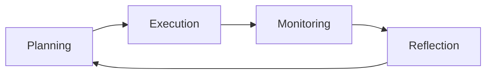

# Self-Regulated Learning

# Self-Regulated Learning

## Introduction

Self-Regulated Learning (SRL) is a powerful approach to mastering any skill or subject by taking control of your learning process. It empowers you to become an independent, efficient, and lifelong learner. This page will guide you through the principles, strategies, and practical applications of SRL, helping you transform from a beginner to a professional learner.

## What Is Self-Regulated Learning?

### Definition
Self-Regulated Learning is the process of actively managing your learning by setting goals, planning activities, monitoring progress, and reflecting on outcomes. It involves taking responsibility for your education and continuously improving your strategies.

### Importance
SRL is crucial because it:
- Enhances learning efficiency and effectiveness.
- Fosters independence and critical thinking.
- Prepares you for lifelong learning in a rapidly changing world.

### Why Top Performers Use It
Top performers across industries use SRL to stay ahead. It allows them to adapt to new challenges, master complex skills, and maintain a growth mindset.

### Relationship to Lifelong Learning
SRL is the foundation of lifelong learning. By mastering it, you can continuously acquire new knowledge and skills, ensuring long-term success and adaptability.

## The Self-Regulated Learning Cycle

The SRL cycle consists of four phases: Planning, Execution, Monitoring, and Reflection.

### Planning
- **Set Goals**: Define what you want to achieve.
- **Select Resources**: Choose the best materials and tools.
- **Allocate Time**: Schedule dedicated learning sessions.

### Execution
- **Engage Actively**: Apply strategies like spaced repetition and active recall.
- **Stay Focused**: Minimize distractions and maintain concentration.

### Monitoring
- **Track Progress**: Assess your understanding and performance.
- **Identify Weaknesses**: Pinpoint areas needing improvement.

### Reflection
- **Evaluate Outcomes**: Analyze what worked and what didn’t.
- **Adjust Strategies**: Refine your approach for future sessions.

## Goal Setting

### Learning Goals
Focus on acquiring knowledge or skills (e.g., "Learn Python basics").

### Outcome Goals
Aim for specific results (e.g., "Pass the certification exam").

### Process Goals
Target improving learning behaviors (e.g., "Spend 2 hours daily studying").

### SMART Goals
Ensure goals are Specific, Measurable, Achievable, Relevant, and Time-bound.

## Planning Learning Activities

### Resource Selection
Choose high-quality materials like books, courses, and tutorials.

### Time Allocation
Use tools like the Pomodoro Technique to schedule focused sessions.

### Prioritization
Focus on high-impact tasks first (e.g., mastering core concepts before advanced topics).

### Study Planning
Create a structured study plan with milestones and deadlines.

## Monitoring Progress

### Tracking Understanding
Use quizzes, practice problems, and self-assessments.

### Measuring Performance
Track metrics like test scores, project completion rates, or skill proficiency.

### Identifying Weaknesses
Analyze mistakes to uncover gaps in knowledge or strategy.

### Adjusting Plans
Modify your approach based on feedback and progress.

## Reflection

### What Worked
Identify effective strategies and resources.

### What Failed
Pinpoint ineffective methods or obstacles.

### Lessons Learned
Extract actionable insights for future learning.

### Continuous Improvement
Iteratively refine your learning process.

## Motivation and Self-Discipline

### Intrinsic Motivation
Cultivate a genuine interest in the subject.

### Extrinsic Motivation
Leverage external rewards like certifications or career advancement.

### Habit Formation
Build consistent learning habits using routines and triggers.

### Consistency
Maintain regular practice to reinforce learning.

## Time Management for Learners

### Scheduling
Use calendars or apps to block dedicated learning time.

### Focus Sessions
Apply techniques like time blocking to maximize concentration.

### Deep Work
Prioritize uninterrupted, high-intensity learning sessions.

### Avoiding Procrastination
Break tasks into smaller steps and use accountability partners.

## Learning Analytics

### Measuring Progress
Track key metrics like study hours, quiz scores, or skill levels.

### Tracking Milestones
Celebrate achievements to stay motivated.

### Performance Indicators
Monitor indicators like retention rates or problem-solving speed.

### Learning Dashboards
Use tools to visualize progress and identify trends.

## Common Challenges

### Procrastination
Delaying tasks due to lack of motivation or overwhelm.

### Lack of Motivation
Struggling to stay engaged with the material.

### Inconsistent Habits
Difficulty maintaining a regular learning routine.

### Unrealistic Expectations
Setting goals that are too ambitious or vague.

### Burnout
Exhaustion from overworking or poor time management.

## Overcoming Learning Challenges

- **Procrastination**: Use the "5-minute rule" to start tasks.
- **Motivation**: Break goals into smaller, achievable steps.
- **Habits**: Leverage habit-tracking apps or accountability partners.
- **Expectations**: Set SMART goals and adjust as needed.
- **Burnout**: Incorporate regular breaks and self-care.

## Self-Regulated Learning in the AI Era

### AI-Assisted Planning
Use AI tools to suggest resources or create study schedules.

### AI-Assisted Feedback
Leverage AI for instant feedback on assignments or practice.

### AI-Assisted Reflection
Use AI to analyze learning patterns and suggest improvements.

### Maintaining Independence
Balance AI assistance with self-directed learning to avoid over-reliance.

## Real-World Applications

### Academic Learning
Excelling in courses by managing study time and resources.

### Software Engineering
Mastering programming languages and frameworks through structured practice.

### Professional Certifications
Preparing for exams with goal-oriented study plans.

### Career Development
Acquiring new skills to advance in your field.

### Entrepreneurship
Learning business strategies and adapting to market changes.

## Building a Personal Learning Operating System

### Goal Setting
Regularly define and update learning objectives.

### Notes
Organize knowledge using digital tools like Notion or Obsidian.

### Reflection
Maintain a learning journal to track insights and progress.

### Reviews
Conduct periodic reviews to assess overall learning effectiveness.

### Continuous Improvement
Iterate on strategies based on reflection and feedback.

## Practical Action Plan

### Beginner Implementation Plan
1. Set one SMART goal.
2. Create a weekly study schedule.
3. Track progress using a simple journal.

### Intermediate Implementation Plan
1. Use learning analytics tools.
2. Incorporate reflection sessions weekly.
3. Experiment with different study techniques.

### Advanced Implementation Plan
1. Build a personal learning dashboard.
2. Integrate AI tools for planning and feedback.
3. Mentor others to reinforce your knowledge.

## Summary

Self-Regulated Learning is a transformative approach to mastering any skill. By systematically planning, executing, monitoring, and reflecting on your learning, you can achieve your goals efficiently and become a lifelong learner.

## Key Takeaways

- SRL involves actively managing your learning process.
- The SRL cycle includes Planning, Execution, Monitoring, and Reflection.
- Goal setting, time management, and motivation are critical components.
- AI tools can enhance but not replace self-directed learning.
- Continuous improvement is the cornerstone of SRL.

## Further Reading

- [Metacognition](?topic=Metacognition)
- [Learning Science](?topic=Learning%20Science)

## Related KnowHub Pages

- [Reflective Learning](?topic=Reflective%20Learning)
- [Study Techniques](?topic=Study%20Techniques)
- [Lifelong Learning](?topic=Lifelong%20Learning)