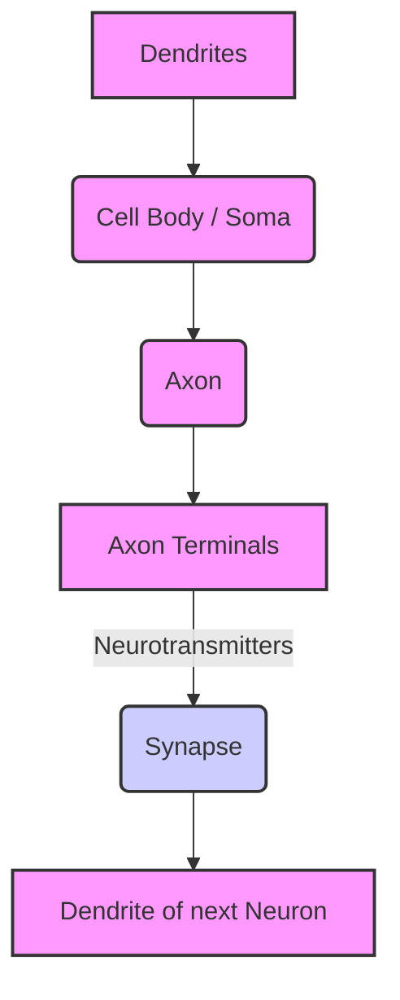

# mqd197f26yh2zo

# Neuroplasticity

## Introduction

Welcome to the definitive guide on Neuroplasticity – the brain's remarkable ability to change and adapt throughout life. This page will take you on a journey from understanding the basic biological mechanisms to leveraging this profound scientific discovery for accelerated learning, skill development, and lifelong expertise.

Neuroplasticity, often simply called "brain plasticity," is one of the most significant discoveries in modern neuroscience. It shatters the outdated belief that the adult brain is a fixed, unchanging organ. Instead, it reveals a dynamic system constantly rewiring itself in response to experiences, learning, and environmental demands.

Understanding neuroplasticity is crucial because it directly underpins:
*   **Learning:** How we acquire new information and abilities.
*   **Memory:** How we form, store, and retrieve memories.
*   **Skill Development:** How practice transforms novice attempts into expert performance.
*   **Expertise:** The very physical manifestation of deep knowledge and refined abilities in the brain.

By grasping the principles of neuroplasticity, you gain a powerful lens through which to view your own potential for growth, adaptation, and continuous improvement, regardless of age or prior experience.

## What Is Neuroplasticity?

**Neuroplasticity** refers to the brain's ability to reorganize itself by forming new neural connections throughout life. It allows neurons (nerve cells) to compensate for injury and disease and to adjust their activities in response to new situations or changes in their environment.

### Historical Understanding of the Brain

For centuries, it was widely believed that the brain's structure was largely fixed after a critical period in childhood. This "fixed brain" model suggested that once adulthood was reached, the brain's capacity for fundamental change, especially in its physical structure and functional organization, was minimal. Learning was thought to be a process of filling an existing container rather than reshaping it.

### The Modern Understanding

Pioneering research in the late 20th and early 21st centuries irrevocably changed this view. Scientists discovered that the brain is incredibly dynamic and moldable, capable of creating new neurons (neurogenesis), forming new connections (synaptogenesis), and strengthening or weakening existing ones. This capacity for change persists throughout life, allowing individuals to learn, adapt, and even recover from brain injuries.

## The Adaptive Brain

Why does the brain change? Fundamentally, the brain is an adaptive organ designed for survival and optimal functioning in a constantly changing world. Its plasticity allows us to continually refine our internal models of reality and adjust our responses.

*   **Learning-Driven Adaptation:** Every time you learn a new fact, skill, or concept, your brain physically alters itself. Neural pathways associated with that new knowledge are strengthened, and new connections might form. This is how studying for an exam or mastering a new software program literally changes your brain.
*   **Experience-Driven Adaptation:** Our daily experiences, both conscious and subconscious, continuously sculpt our neural architecture. Repeated actions, sensory inputs, and social interactions leave their mark, reinforcing certain pathways and pruning others. For example, living in a new city might enhance your spatial navigation skills.
*   **Environment-Driven Adaptation:** The external environment exerts a powerful influence. Adapting to a new culture, learning a new language, or even navigating a novel physical space can prompt significant neural reorganization. Consider how the brains of taxi drivers have been shown to have larger hippocampi, a region associated with spatial memory, due to their extensive navigation experience.

**Example:** Imagine learning to ride a bicycle. Initially, it's awkward and difficult. Your brain is struggling to coordinate balance, steering, and pedaling. As you practice, specific neural circuits involved in these actions are repeatedly activated. Over time, these circuits become more efficient and robust, leading to smooth, effortless riding. This is learning-driven adaptation in action.

## Brain Structure And Learning

To understand how the brain changes, it helps to know its fundamental components.

### Neurons

Neurons are the basic building blocks of the brain and nervous system. They are specialized cells that transmit electrical and chemical signals throughout the body. Think of them as the brain's wires.

*   **Dendrites:** Branch-like structures that receive signals from other neurons.
*   **Cell Body (Soma):** The main part of the neuron, containing the nucleus.
*   **Axon:** A long, slender projection that transmits signals away from the cell body.
*   **Axon Terminals:** The end of the axon, where signals are passed to other neurons.

### Synapses

A synapse is the tiny gap between two neurons where information is transmitted. When an electrical signal reaches the end of an axon, it triggers the release of chemical messengers called **neurotransmitters** into the synapse. These neurotransmitters then bind to receptors on the dendrite of the neighboring neuron, potentially triggering a new electrical signal.

### Neural Networks

Neurons rarely act in isolation. They form complex interconnected groups called neural networks. Learning and experience sculpt these networks, making certain pathways stronger and more efficient. Think of a network like a city's road system: frequently used roads become wider and smoother (stronger connections), while rarely used paths might become overgrown (weaker connections).

### Brain Regions

Different areas of the brain are specialized for different functions (e.g., the frontal lobe for planning, the occipital lobe for vision, the hippocampus for memory). However, these regions do not work in isolation; they communicate extensively through neural networks. Neuroplasticity allows these regions to adapt their roles and even take over functions if another region is damaged.

### Communication Between Neurons

The communication between neurons, through synapses and neurotransmitters, is the basis of all brain activity, including learning, memory, and thought. The strength and efficiency of these synaptic connections are what neuroplasticity primarily modifies.

## How Learning Changes The Brain

Learning fundamentally alters the brain's physical and functional architecture. Here's how:

*   **Neural Pathway Formation:** When you learn something new, your brain starts to forge new connections between neurons, creating novel pathways. These are like new roads being built in the brain's "city."
*   **Synaptic Strengthening (Long-Term Potentiation - LTP):** This is the hallmark of learning. When two neurons communicate repeatedly, the connection (synapse) between them becomes stronger and more efficient. The "presynaptic" neuron becomes better at sending signals, and the "postsynaptic" neuron becomes better at receiving them. This is often summarized by the phrase "neurons that fire together, wire together."
*   **Synaptic Weakening (Long-Term Depression - LTD):** Conversely, if connections are rarely used or are detrimental, they can weaken or be pruned away. This process is just as important as strengthening, as it helps the brain become more efficient by discarding irrelevant information or less useful connections. It's like unused roads slowly falling into disrepair.
*   **Repeated Activation:** The more frequently a neural circuit is activated through practice, recall, or experience, the stronger and more robust it becomes. This is why consistent practice is so vital for skill development.
*   **Network Development:** Learning doesn't just change individual synapses; it reshapes entire networks of neurons. Over time, these networks become more integrated, specialized, and efficient for specific tasks, leading to improved performance and understanding.

**Intuitive Example:** Imagine learning to play a musical instrument.
1.  **Initial Stage:** Each new note or chord feels clumsy. Your brain is trying to find the right finger movements, auditory feedback, and visual cues. This creates weak, tentative connections.
2.  **Practice:** As you practice, repeatedly playing scales or pieces, the neurons involved in coordinating your fingers, listening to the sound, and interpreting the sheet music fire together, over and over.
3.  **Strengthening:** The synapses in these circuits get stronger. Neurotransmitters are released more effectively, receptors become more sensitive, and the overall communication becomes faster and more reliable.
4.  **Mastery:** Eventually, playing complex pieces becomes automatic. Your brain has developed highly efficient and specialized neural networks for music performance, allowing you to play without conscious effort, a direct result of neuroplasticity.

## The Neuroscience Of Learning

Neuroplasticity is the underlying mechanism for the core processes of learning:

*   **Encoding:** This is the initial process of taking in new information and converting it into a form that can be stored in the brain. Attention and focus are critical here. New neural pathways begin to form.
*   **Consolidation:** This is the process where newly acquired, fragile memories are stabilized and strengthened for long-term storage. It often involves structural changes at the synaptic level and the transfer of memories between brain regions (e.g., from the hippocampus to the cortex). This process is heavily influenced by sleep.
*   **Retrieval:** The act of recalling or accessing stored information. Each successful retrieval strengthens the neural pathways associated with that memory, making it easier to recall in the future (a form of desirable difficulty).
*   **Reinforcement:** Positive experiences, rewards, or successful outcomes associated with learning can reinforce neural pathways, making them more likely to be activated again. Conversely, negative experiences can lead to synaptic weakening or pruning.

These processes work together to create durable, long-term changes in the brain's structure and function, which we experience as learning and memory.

## Types Of Neuroplasticity

Neuroplasticity is broadly categorized into two main types, though they often interact:

### Structural Plasticity

Structural plasticity refers to physical changes in the brain's anatomy.
*   **Physical Changes in the Brain:** This involves alterations to the size, shape, and number of neurons, dendrites, axons, and synapses. It can also include changes in the density of gray matter (neuron cell bodies) and white matter (myelinated axons).
*   **New Neural Connections (Synaptogenesis):** The brain can grow new synaptic connections or even entirely new neurons (neurogenesis, primarily in the hippocampus). This is critical for encoding entirely new information or skills.
*   **Network Reorganization:** Existing neural networks can be rewired. For instance, if one sensory input is lost (e.g., blindness), the brain areas previously dedicated to that sense might be recruited for other senses (e.g., touch or hearing), demonstrating profound reorganization.

### Functional Plasticity

Functional plasticity refers to changes in the strength and efficiency of existing neural connections, or in how different brain regions are recruited for specific tasks.
*   **Functional Adaptation:** The brain adapts its function without necessarily changing its physical structure significantly. This is about changes in synaptic efficiency.
*   **Brain Reallocation:** Specific brain areas can become more or less engaged in certain tasks. For example, extensive practice in a specific skill can lead to an expansion of the cortical area dedicated to that skill (e.g., musicians often have larger cortical representations for their instrument-playing fingers).
*   **Compensation Mechanisms:** After injury, undamaged parts of the brain can take over the functions of damaged areas. This is a crucial mechanism for recovery from stroke or traumatic brain injury, where healthy tissue functionally compensates for impaired regions.

**Example:**
*   **Structural:** Learning a new language over several years might lead to an increase in gray matter density in specific language-related brain regions.
*   **Functional:** Initially, learning to drive might heavily involve the prefrontal cortex (for conscious decision-making). With practice, driving becomes more automatic, and subcortical areas (e.g., basal ganglia) take over, demonstrating a functional shift and increased efficiency.

## Neuroplasticity Across The Lifespan

Neuroplasticity is not limited to childhood; it's an ongoing process throughout our entire lives.

*   **Childhood:** This is a period of immense plasticity, often called "critical periods." The brain is rapidly developing, forming billions of new connections, and actively pruning unused ones. This high plasticity allows for rapid acquisition of language, motor skills, and fundamental knowledge.
*   **Adolescence:** A second wave of significant brain reorganization occurs during adolescence. The prefrontal cortex, responsible for executive functions like planning and decision-making, continues to mature, and synaptic pruning continues to refine neural networks based on experiences and choices.
*   **Adulthood:** The brain remains highly plastic in adulthood. While the rate of new connection formation might slow compared to childhood, the ability to strengthen existing connections, reorganize networks, and even generate new neurons (neurogenesis, primarily in the hippocampus) persists. Adults can learn new languages, acquire complex skills, and adapt to new environments.
*   **Older Adulthood:** Even in older age, the brain retains a remarkable capacity for plasticity. Engaging in mentally stimulating activities, physical exercise, and social interaction can maintain cognitive function and promote new learning, challenging the myth of inevitable cognitive decline.

**Myth Debunked:** The idea that "you can't teach an old dog new tricks" or that adults cannot learn effectively is a pervasive myth. While learning might sometimes feel slower due to pre-existing knowledge structures or a slower rate of new synapse formation, the adult brain is fully capable of significant learning and adaptation. Leverage your existing knowledge and sophisticated learning strategies!

## Neuroplasticity And Skill Development

Every skill you acquire, from tying your shoes to mastering quantum physics, is a direct result of neuroplasticity.

*   **Learning a Language:** Initially, new sounds and grammatical rules are processed with effort. With practice (listening, speaking, reading, writing), specific neural circuits for language comprehension and production are strengthened, and new vocabulary becomes integrated into existing semantic networks. This involves both structural changes (e.g., increased gray matter) and functional changes (e.g., more efficient processing).
*   **Learning Programming:** Understanding new syntax, algorithms, and data structures creates new conceptual frameworks in the brain. Repeated coding, debugging, and problem-solving solidify these pathways, leading to faster recognition of patterns, improved logical thinking, and the ability to write efficient code.
*   **Learning Mathematics:** Grasping abstract concepts and problem-solving strategies forms intricate neural networks. Practice with equations and proofs strengthens these connections, allowing for quicker computation and deeper intuitive understanding.
*   **Learning Music:** As discussed earlier, practicing an instrument fundamentally rewires the brain. Motor cortices, auditory cortices, and areas for emotional processing and memory all show changes in structure and function, leading to enhanced coordination, auditory discrimination, and expressive performance.
*   **Learning Sports:** Developing athletic skills involves refining motor pathways, improving proprioception (sense of body position), and enhancing reaction times. Repetitive drills strengthen the neural circuits controlling specific movements, leading to smoother execution and better performance.

**How Practice Changes Neural Pathways:** Consistent, focused practice repeatedly activates the same neural circuits. This repeated firing strengthens synaptic connections (LTP), makes neurons more efficient at communicating, and can even lead to the growth of new connections or the pruning of less useful ones, making the skill more automatic and refined.

## Neuroplasticity And Expertise

Expertise isn't just about accumulating knowledge; it's about transforming the brain's architecture to process information and perform tasks with unparalleled efficiency and precision.

*   **[Deliberate Practice](?topic=Deliberate%20Practice):** This is the gold standard for developing expertise. It involves focused, intentional practice aimed at improving specific aspects of performance, often outside of one's comfort zone, with immediate feedback. Deliberate practice pushes the brain to continually adapt and form new, more effective neural pathways.
*   **Repetition:** While not just "mindless" repetition, focused repetition within deliberate practice is crucial for strengthening neural connections and consolidating learning. It solidifies the pathways that underpin expert performance.
*   **Feedback:** Receiving clear, immediate feedback allows the brain to adjust and refine its neural pathways. It highlights which connections need strengthening and which approaches are ineffective.
*   **Automation:** As skills become expertly practiced, they move from conscious, effortful processing to automatic, unconscious execution. This frees up cognitive resources for higher-level thinking. For example, a master chess player doesn't consciously analyze every single move; many patterns are recognized and responses are automated.
*   **Pattern Recognition:** Experts develop highly refined neural networks that allow them to quickly recognize complex patterns and anomalies within their domain, often intuitively. This is a direct outcome of extensive experience and plastic changes in sensory and cognitive processing areas.

For more on the journey to mastery, refer to [Skill Acquisition](?topic=Skill%20Acquisition).

## Neuroplasticity And Memory

Neuroplasticity is the biological basis of memory itself.

*   **Memory Formation:** The initial encoding of a memory involves creating new or strengthening existing synaptic connections. This process, known as Long-Term Potentiation (LTP), makes it easier for neurons involved in that memory to fire together again.
*   **[Long-Term Memory](?topic=Long-Term%20Memory):** The ability to retain information over extended periods is due to stable, enduring changes in neural networks. These changes can be structural (e.g., new dendritic spines) or functional (e.g., enhanced synaptic efficiency). The hippocampus plays a critical role in forming new declarative memories, which are then thought to be consolidated and stored in the cortex.
*   **Retrieval Strengthening:** Each time a memory is successfully retrieved, its associated neural pathways are reinforced, making it easier to access in the future. This is why active recall is such a powerful study technique.
*   **Memory Consolidation:** This is the process where fragile, newly formed memories are transformed into more stable, long-lasting ones. It involves the reorganization of neural circuits and often occurs during sleep.

For a deeper dive, explore [Long-Term Memory](?topic=Long-Term%20Memory).

## Neuroplasticity And Working Memory

Working memory, our mental workspace, also benefits from neuroplastic changes.

*   **Cognitive Development:** The ability to hold and manipulate information in mind (working memory) develops significantly through childhood and adolescence, partly due to the maturation and strengthening of neural connections in the prefrontal cortex.
*   **Attention:** Training attention and focus can improve working memory capacity. By intentionally directing attention, we strengthen the neural circuits responsible for filtering out distractions and maintaining focus on relevant information.
*   **Processing Efficiency:** As we become more proficient in a skill or familiar with a knowledge domain, the "chunks" of information we can hold and process in working memory become larger and more complex. This improved efficiency is a neuroplastic adaptation, allowing the brain to handle more information with less effort.

Learn more about this crucial cognitive function at [Working Memory](?topic=Working%20Memory).

## Neuroplasticity And Schema Formation

Schemas are mental frameworks or structures of organized knowledge. Neuroplasticity is the mechanism by which these fundamental cognitive structures are built and refined.

*   **Knowledge Structures:** When you learn a new concept, your brain doesn't just store isolated facts. It connects new information to existing knowledge, forming complex neural networks that represent these structured relationships. These interconnected networks are schemas.
*   **Mental Models:** Highly organized and flexible schemas constitute mental models, which allow us to understand, predict, and interact with the world efficiently. Building sophisticated mental models through learning is a profound act of neuroplasticity.
*   **Expertise Development:** Experts possess highly elaborate, interconnected schemas within their domain. These rich knowledge structures allow them to quickly categorize new information, identify patterns, and solve problems that novices find intractable. The formation and refinement of these expert schemas are driven by extensive neuroplastic changes.

Further details on how knowledge is organized can be found at [Schema Formation](?topic=Schema%20Formation).

## Neuroplasticity And Cognitive Load

The relationship between neuroplasticity and [Cognitive Load](?topic=Cognitive%20Load) explains why learning can feel difficult and how it eventually becomes easier.

*   **Why Learning Feels Difficult Initially:** When encountering new information or skills, your brain is actively building new neural pathways and strengthening nascent connections. This process demands significant mental effort, consuming a high amount of working memory resources. This leads to high intrinsic cognitive load.
*   **Why Tasks Become Easier Over Time:** As you practice and the brain undergoes plastic changes, the neural pathways associated with the task become more efficient and robust. The brain no longer needs to work as hard to execute the task or retrieve the information.
*   **Automation and Reduced Cognitive Load:** With sufficient practice, skills become automated. This means the brain can perform these tasks with minimal conscious effort, drastically reducing cognitive load. For example, once you've learned to type without looking at the keyboard, your working memory is free to focus on the content of your writing, not the mechanics of typing. This is a powerful demonstration of neuroplasticity freeing up cognitive resources.

Dive deeper into the topic with [Cognitive Load](?topic=Cognitive%20Load).

## The Role Of Sleep In Neuroplasticity

Sleep is not merely a period of rest; it's a critical active process for consolidating learning and optimizing neuroplastic changes.

*   **Memory Consolidation:** During sleep, particularly slow-wave sleep (deep sleep) and REM sleep, the brain actively reviews and strengthens the neural connections formed during wakefulness. New memories are replayed and transferred from the hippocampus to long-term storage in the cortex, becoming more stable and less prone to forgetting.
*   **Neural Strengthening:** Synaptic potentiation (strengthening) that occurs during learning is solidified during sleep. This means that the brain literally uses sleep to make newly formed knowledge and skills more robust.
*   **Recovery:** Sleep allows the brain to clear metabolic waste products that accumulate during waking hours, restoring optimal neural function and preparing for new learning.
*   **Learning Optimization:** Adequate sleep significantly enhances learning capacity the following day. It helps consolidate previous learning, thereby freeing up working memory resources for new information, and primes the brain for effective encoding.

## The Role Of Attention In Neuroplasticity

Attention is the gateway to neuroplasticity. What you pay attention to shapes your brain.

*   **Focus:** Directing focused attention to a specific task or piece of information signals to the brain that this input is important. This focused attention enhances the likelihood of synaptic strengthening in the relevant neural circuits.
*   **Deep Work:** Sustained, uninterrupted focus (often referred to as "deep work") provides the ideal conditions for robust neuroplastic changes. It allows for prolonged activation of specific neural networks, leading to more profound and lasting learning.
*   **Concentration:** The act of concentrating helps filter out irrelevant stimuli, allowing the brain to dedicate its resources to the learning task at hand. This selective attention facilitates the encoding and consolidation processes.
*   **Intentional Practice:** Deliberate attention during practice ensures that the brain is actively engaged in refining skills, identifying errors, and strengthening the correct neural pathways. Passive, unfocused repetition is far less effective at driving plastic changes.

## The Role Of Emotion In Learning

Emotions play a profound role in modulating neuroplasticity and influencing what we learn and remember.

*   **Motivation:** Positive emotions like curiosity, enthusiasm, and a sense of accomplishment release neurotransmitters (e.g., dopamine) that act as powerful learning signals, reinforcing neural pathways associated with the learning experience.
*   **Curiosity:** When we are curious, our brains are more receptive to new information. Curiosity activates reward pathways, making learning intrinsically motivating and enhancing memory encoding.
*   **Reward Systems:** The brain's reward system, involving dopamine pathways, is intimately linked with learning. When learning leads to a positive outcome or feeling, these pathways are activated, strengthening the associated neural connections and making it more likely we'll seek similar learning experiences.
*   **Emotional Significance:** Information imbued with emotional significance (positive or negative) is often remembered more vividly and for longer periods. The amygdala, a brain region involved in emotion, interacts strongly with the hippocampus, enhancing memory consolidation. For example, learning experiences that evoke joy or surprise are often well-retained.

## Habits And Neuroplasticity

Habits are essentially automated behaviors, deeply ingrained through neuroplasticity.

*   **Habit Formation:** When we repeatedly perform a sequence of actions, the neural pathways involved in that sequence become stronger and more efficient. Over time, these actions can shift from being consciously driven by the prefrontal cortex to being automatically triggered by cues and driven by the basal ganglia, a deeper brain structure.
*   **Behavioral Change:** Understanding neuroplasticity empowers us to intentionally form positive habits and break negative ones. By consistently engaging in desired behaviors and avoiding undesired ones, we can literally rewire our brains.
*   **Automatic Behaviors:** The goal of habit formation is to make behaviors automatic. This frees up cognitive resources for more complex, conscious thought. For example, once driving becomes habitual, you can focus on navigation or conversations rather than the mechanics of operating the vehicle.
*   **Habit Loops:** Habits are typically formed through a "cue-routine-reward" loop. The cue triggers the routine, which provides a reward, reinforcing the neural pathway for that habit. Leveraging this loop consciously allows us to engineer new habits by creating cues and ensuring rewards.

## Neuroplasticity And Lifelong Learning

Neuroplasticity is the fundamental biological basis for the concept of [Lifelong Learning](?topic=Lifelong%20Learning).

*   **Continuous Adaptation:** In a rapidly changing world, the ability to continually learn and adapt is paramount. Neuroplasticity ensures that our brains are equipped for this continuous evolution, allowing us to acquire new knowledge, skills, and perspectives at any age.
*   **Career Development:** As industries evolve, new technologies emerge, and job roles transform, professionals must constantly update their skill sets. Leveraging neuroplasticity through ongoing training and development is essential for career longevity and advancement.
*   **Learning New Skills:** Whether it's mastering a new software, learning a musical instrument, or picking up a new language, neuroplasticity confirms that our capacity to learn is not fixed. It's a muscle that gets stronger with use.
*   **Reinvention Throughout Life:** Neuroplasticity provides the scientific foundation for personal and professional reinvention. It demonstrates that we are not constrained by our past experiences or perceived limitations but can actively shape our future selves through intentional learning and adaptation.

## Obstacles To Neuroplasticity

While the brain is incredibly plastic, certain factors can hinder its ability to change effectively.

*   **Passive Learning:** Simply listening to lectures or reading without active engagement (e.g., summarizing, questioning, applying) results in weaker neural pathways and less durable learning.
*   **Lack of Practice:** Without repeated activation, new synaptic connections will weaken and eventually be pruned away. "Use it or lose it" applies directly to neural pathways.
*   **Multitasking:** Constantly switching between tasks prevents the brain from achieving deep focus, which is essential for strong synaptic strengthening and efficient encoding. It leads to shallow learning and inhibits robust neuroplastic changes.
*   **Chronic Stress:** Prolonged stress can impair neurogenesis (the birth of new neurons) and weaken synaptic connections, particularly in areas like the hippocampus (crucial for memory).
*   **Sleep Deprivation:** As discussed, sleep is vital for memory consolidation and neural strengthening. Chronic lack of sleep severely undermines the brain's ability to undergo positive plastic changes.
*   **Inconsistent Effort:** Sporadic, inconsistent learning efforts lead to fragile and easily forgotten knowledge. Plastic changes require sustained, focused engagement over time.

## Accelerating Positive Neuroplasticity

You can actively leverage neuroplasticity to optimize your learning and development.

*   **[Deliberate Practice](?topic=Deliberate%20Practice):** Focus on specific weaknesses, push beyond your comfort zone, and seek immediate, constructive feedback. This intense, targeted effort directly stimulates the brain to adapt and improve.
*   **[Active Recall](?topic=Active%20Recall):** Instead of passively re-reading, actively retrieve information from memory (e.g., flashcards, self-quizzing, explaining concepts aloud). Each successful retrieval strengthens the neural pathways associated with that memory.
*   **[Retrieval Practice](?topic=Retrieval%20Practice):** Similar to active recall, this involves testing yourself frequently. The "desirable difficulty" of retrieval strengthens memory and makes future recall easier.
*   **[Spaced Repetition](?topic=Spaced%20Repetition):** Reviewing information at increasing intervals over time. This technique strategically re-activates neural pathways just before they are about to weaken, optimizing consolidation and long-term retention.
*   **Reflection:** Taking time to ponder what you've learned, connect it to existing knowledge, and consider its implications helps to integrate new information into your broader schema, forming richer neural networks.
*   **Teaching Others:** Explaining a concept to someone else forces you to organize your thoughts, identify gaps in your understanding, and articulate the material clearly, which deeply reinforces your own learning.
*   **Real-world Application:** Applying what you learn in practical situations solidifies understanding and creates stronger, more relevant neural pathways. It moves knowledge from abstract theory to functional skill.
*   **Consistent Practice:** Regular, sustained engagement with the learning material or skill is paramount. Small, consistent efforts over time yield far greater neuroplastic benefits than infrequent, intense bursts.

## Neuroplasticity In The AI Era

The rise of AI presents both opportunities and challenges for how we leverage neuroplasticity.

*   **AI-Assisted Learning:** AI tools can personalize learning experiences, provide immediate feedback, identify knowledge gaps, and suggest optimal [Spaced Repetition](?topic=Spaced%20Repetition) schedules. This can accelerate the learning process and facilitate neuroplastic changes by providing targeted, efficient practice.
*   **Cognitive Offloading:** While AI can assist, there's a risk of **cognitive offloading** – relying on AI to perform mental tasks that we once did ourselves (e.g., complex calculations, remembering facts, summarizing information). If we consistently offload these tasks, the neural pathways that support those cognitive functions may weaken or fail to develop robustly.
*   **Preserving Active Thinking:** To leverage AI constructively, we must consciously engage in active thinking, critical analysis, and problem-solving *in conjunction with* AI, rather than letting AI do all the heavy lifting. Use AI to augment your thinking, not replace it.
*   **Building Durable Neural Pathways Despite AI Assistance:** Focus on using AI as a tool to *deepen* understanding, *practice* complex skills, and *generate* new ideas that you then critically evaluate and internalize. For instance, ask AI to explain a concept from different angles, then try to explain it yourself. Use AI to generate practice problems, then solve them yourself. This ensures active engagement that drives neuroplastic changes.

## Common Myths

It's important to dispel common misconceptions about the brain and learning:

*   **Adults cannot learn effectively:** False. The brain remains plastic throughout life. While the rate of some plastic changes may differ, adults are perfectly capable of acquiring new complex skills and knowledge.
*   **Intelligence is fixed:** False. While genetics play a role, intelligence is not static. Learning, experience, and effort can enhance cognitive abilities and lead to measurable changes in brain structure and function.
*   **Talent is everything:** False. While some individuals may have predispositions, sustained [Deliberate Practice](?topic=Deliberate%20Practice) and effort consistently outperform raw talent alone in achieving expertise, precisely because practice drives neuroplasticity.
*   **Learning happens instantly:** False. Meaningful learning and lasting neuroplastic changes take time, effort, and repetition. It's a gradual process of building and strengthening neural networks.
*   **Practice alone guarantees mastery:** False. While practice is essential, it must be *deliberate*, *focused*, and include *feedback*. Mindless repetition or incorrect practice can reinforce suboptimal pathways.

## Real-World Applications

Neuroplasticity is not just a scientific curiosity; it has profound implications across various domains:

*   **Education:** Designing curricula and teaching methods that promote active learning, [Retrieval Practice](?topic=Retrieval%20Practice), and [Spaced Repetition](?topic=Spaced%20Repetition) to optimize neuroplastic changes in students.
*   **Software Engineering:** Emphasizing continuous learning of new languages, frameworks, and problem-solving patterns. The ability to adapt to new technologies is a direct application of professional neuroplasticity.
*   **Business:** Fostering cultures of lifelong learning, adaptability, and resilience. Training employees in new skills and encouraging cross-functional development.
*   **Medicine:** Developing rehabilitation strategies for stroke patients or those with brain injuries to help healthy brain areas compensate for damaged ones. Research into therapies for neurological disorders.
*   **Research:** Understanding how learning and memory work at a fundamental level, leading to advancements in AI, cognitive science, and human potential.
*   **Professional Development:** Creating personalized learning paths, mentoring programs, and skill-building workshops that leverage principles of active engagement and feedback.
*   **Entrepreneurship:** The capacity to pivot, learn from failures, and constantly acquire new business acumen is a testament to entrepreneurial neuroplasticity.
*   **Leadership:** Leaders who embrace growth mindsets and encourage continuous learning in their teams are tapping into the neuroplastic potential of their organization.

## Practical Framework For Leveraging Neuroplasticity

Here's a step-by-step framework to intentionally harness your brain's adaptive power:

1.  **Define Your Learning Goal:** Be specific. What skill or knowledge do you want to acquire? (e.g., "Learn Python basics," "Improve public speaking," "Master a new software feature").
2.  **Break It Down:** Divide your goal into smaller, manageable chunks. This reduces [Cognitive Load](?topic=Cognitive%20Load) and makes the learning process less daunting.
3.  **Engage Actively:**
    *   **Focus:** Eliminate distractions. Practice [Deep Learning](?topic=Deep%20Learning) sessions.
    *   **Active Recall/Retrieval Practice:** Regularly test yourself without looking at notes. Explain concepts aloud.
    *   **Real-World Application:** Find ways to immediately apply what you learn.
4.  **Practice Deliberately:**
    *   **Push Boundaries:** Don't just do what's easy. Target your weaknesses.
    *   **Seek Feedback:** Get constructive criticism from mentors, peers, or automated tools.
    *   **Iterate:** Adjust your approach based on feedback.
5.  **Prioritize Consolidation:**
    *   **Spaced Repetition:** Review material at increasing intervals.
    *   **Sleep:** Ensure adequate, quality sleep to solidify learning and memory.
    *   **Reflection:** Regularly review and connect new information to existing knowledge.
6.  **Manage Your Environment & Well-being:**
    *   **Reduce Stress:** Chronic stress impairs learning.
    *   **Nutrition & Exercise:** Support overall brain health.
    *   **Mindfulness:** Enhance attention and focus.
7.  **Embrace a Growth Mindset:** Believe in your brain's capacity to change and grow. This belief itself can enhance your learning outcomes.

## Practical Action Plan

### Beginner Implementation Plan

*   **Choose one small skill:** Something simple like learning 5 new words in a language or understanding a basic programming concept.
*   **Dedicated 15-minute session:** Set aside 15 minutes each day, free from distractions, to focus on this skill.
*   **Active engagement:** Don't just read; try to explain the concept to an imaginary friend or write down what you remember.
*   **Review before sleep:** Briefly review what you learned that day right before bed.
*   **Track progress:** Keep a simple journal of what you practiced and how it felt.

### Intermediate Implementation Plan

*   **Identify a core skill for your role:** Pick a skill that would significantly enhance your professional output.
*   **Implement [Deliberate Practice](?topic=Deliberate%20Practice):** For 30-60 minutes daily, target specific weaknesses related to this skill. Seek feedback from a mentor or peer.
*   **Integrate [Spaced Repetition](?topic=Spaced%20Repetition):** Use flashcards (digital or physical) for key concepts and review them at increasing intervals.
*   **Teach others:** Find an opportunity to explain your new learning to a colleague or junior team member.
*   **Prioritize sleep:** Aim for 7-9 hours of quality sleep nightly, especially after intensive learning.

### Advanced Implementation Plan

*   **Strategic skill mapping:** Identify 2-3 high-impact skills crucial for your long-term career goals or personal development.
*   **Build a structured [Deep Learning](?topic=Deep%20Learning) routine:** Dedicate regular blocks of "deep work" (e.g., 2-4 hours, 3-4 times a week) to intensely focus on these skills.
*   **Automate feedback loops:** Use automated testing, code linters, or self-recording/analysis for immediate and objective feedback.
*   **Cross-domain learning:** Explore how concepts from one domain can apply to another, fostering richer [Schema Formation](?topic=Schema%20Formation).
*   **Mentorship and peer learning:** Actively seek out and engage with experts and peers to challenge your understanding and expose you to new perspectives.
*   **Mindfulness and cognitive resilience:** Practice mindfulness to enhance attention and reduce stress, optimizing the brain's environment for plasticity.
*   **Leverage AI intelligently:** Use AI tools for generating practice problems, summarizing complex texts (then verify/critique), or simulating scenarios, but always maintain active cognitive engagement.

## Summary

Neuroplasticity is the profound and lifelong ability of your brain to change, adapt, and reorganize itself in response to learning and experience. It is the fundamental mechanism behind all skill acquisition, memory formation, and the development of expertise. Far from being fixed, your brain is a dynamic organ constantly being sculpted by your thoughts, actions, and environment. By understanding its principles, you can intentionally cultivate positive habits, accelerate your learning, and unlock your full potential for growth throughout your entire life.

## Key Takeaways

*   **The brain is not fixed; it constantly changes:** This lifelong adaptability is Neuroplasticity.
*   **Every learning experience rewires your brain:** New connections form, existing ones strengthen or weaken.
*   **Practice is paramount:** Consistent, deliberate practice drives neuroplastic changes that lead to skill development and automation.
*   **Sleep is critical for consolidation:** It's when your brain solidifies what you've learned.
*   **Attention is the gateway:** What you focus on determines which neural pathways get strengthened.
*   **Adults can learn effectively:** The myth of the fixed adult brain is scientifically false.
*   **You can accelerate positive neuroplasticity:** Through strategies like [Deliberate Practice](?topic=Deliberate%20Practice), [Active Recall](?topic=Active%20Recall), and [Spaced Repetition](?topic=Spaced%20Repetition).
*   **AI can be an ally or a hindrance:** Use AI to augment your thinking and learning, not replace it, to preserve active cognitive engagement.
*   **Embrace a growth mindset:** Your belief in your ability to learn and adapt is a powerful driver of neuroplasticity.

## Further Reading

*   "The Brain That Changes Itself" by Norman Doidge
*   "Mindset: The New Psychology of Success" by Carol S. Dweck
*   "Peak: Secrets from the New Science of Expertise" by Anders Ericsson and Robert Pool

## Related KnowHub Pages

*   [Learning Science](?topic=Learning%20Science)
*   [Cognitive Load](?topic=Cognitive%20Load)
*   [Working Memory](?topic=Working%20Memory)
*   [Long-Term Memory](?topic=Long-Term%20Memory)
*   [Schema Formation](?topic=Schema%20Formation)
*   [Deliberate Practice](?topic=Deliberate%20Practice)
*   [Skill Acquisition](?topic=Skill%20Acquisition)
*   [Deep Learning](?topic=Deep%20Learning)
*   [Lifelong Learning](?topic=Lifelong%20Learning)