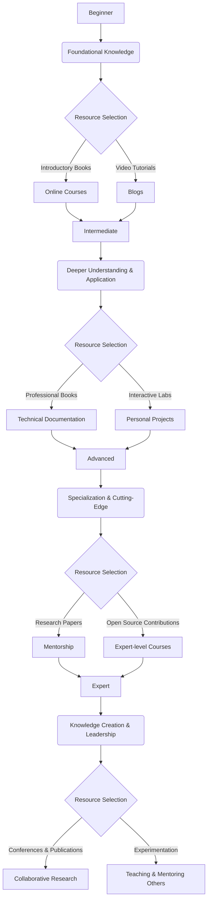
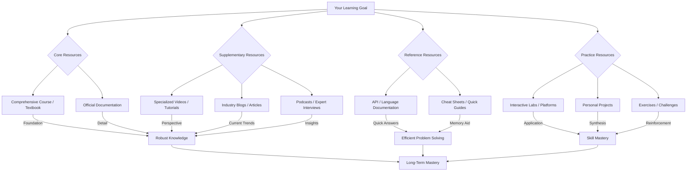
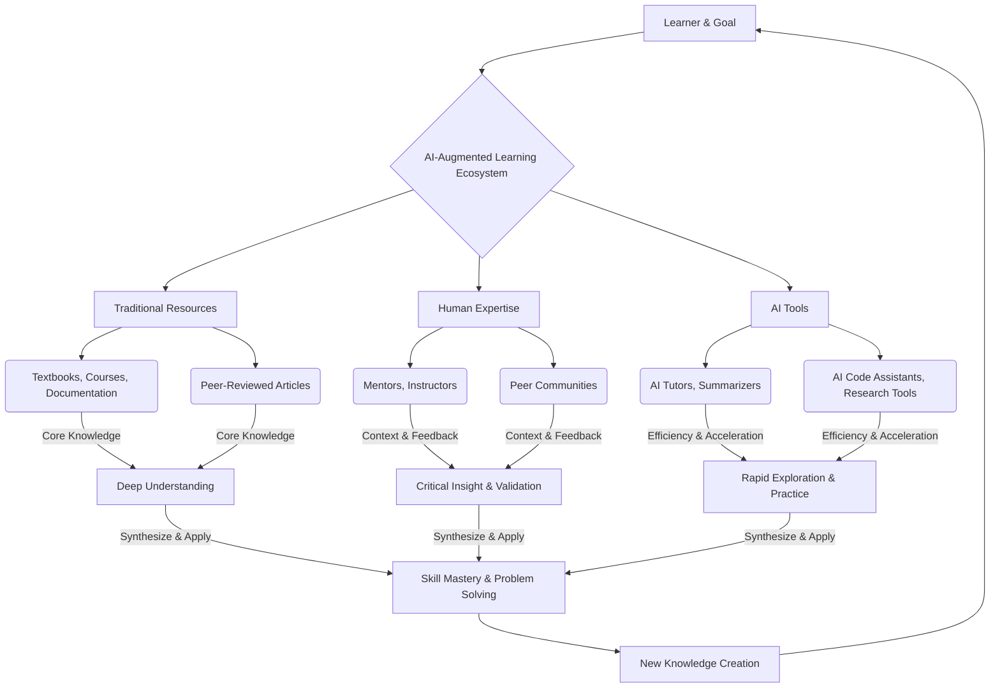

# mqd197f2hvm1v2

# Learning Resource Preferences

Learning is a journey, not a destination, and the resources we choose to navigate this journey profoundly impact our success. Just as a chef selects specific ingredients for a dish, effective learners carefully choose their learning resources to achieve their educational and professional goals. This page will guide you through understanding, evaluating, and strategically utilizing learning resources to build a powerful personal learning ecosystem.

## Introduction

**Learning Resource Preferences** refer to an individual's inclinations and choices regarding the types of materials, platforms, and environments they find most effective and engaging for acquiring knowledge and skills. It's about recognizing what kinds of resources resonate with you and best support your learning process.

Why do learning resources matter? They are the fundamental building blocks of knowledge acquisition. The quality, relevance, and accessibility of your chosen resources directly influence:

*   **Learning Efficiency:** How quickly and effectively you grasp new concepts.
*   **Knowledge Quality:** The depth, accuracy, and applicability of what you learn.
*   **Engagement:** Your motivation and sustained interest in the learning process.
*   **Retention:** How well you remember and recall information over time.
*   **Skill Development:** Your ability to translate knowledge into practical competencies.

Ultimately, the right resource selection can transform a challenging learning task into an engaging and productive experience, leading to superior learning outcomes and long-term mastery.

## What Are Learning Resources

A **learning resource** is any material, tool, or environment used to facilitate the acquisition of knowledge, skills, or abilities. They serve as conduits through which information and experiences are delivered to the learner.

Learning resources can be broadly categorized in several ways:

*   **Formal Learning Resources:** Structured and often institutionally sanctioned, designed with specific learning objectives.
    *   *Examples:* University courses, certification programs, textbooks, official training manuals.
*   **Informal Learning Resources:** Less structured, often self-directed, and encountered through daily activities or personal exploration.
    *   *Examples:* Blog posts, YouTube tutorials, podcasts, discussions with colleagues, personal projects.
*   **Digital Resources:** Accessed via electronic devices and the internet.
    *   *Examples:* Online courses, e-books, video lectures, interactive simulations, forums.
*   **Physical Resources:** Tangible materials or in-person experiences.
    *   *Examples:* Printed books, physical classrooms, in-person workshops, laboratory equipment.

**Intuitive Examples:**
*   **Learning to cook:** A cookbook (physical, formal), a cooking show on YouTube (digital, informal), a live cooking class (physical, formal), or experimenting in your kitchen (physical, informal, project-based).
*   **Learning to code:** A university computer science textbook (physical, formal), an online coding platform (digital, formal/informal), documentation for a programming language (digital, formal), or building a personal app (digital, informal, project-based).

## Why Resource Selection Matters

The careful selection of learning resources isn't just about personal preference; it's a strategic decision that profoundly influences the effectiveness of your learning journey:

*   **Learning Efficiency:** The right resource can clarify complex topics, saving time and effort compared to sifting through poorly organized or irrelevant information.
*   **Knowledge Quality:** High-quality, authoritative resources provide accurate, up-to-date, and well-contextualized information, preventing the acquisition of misinformation or outdated practices.
*   **Engagement:** Resources that align with your learning style and interests keep you motivated and actively involved, making learning less of a chore and more of a discovery.
*   **Retention:** Well-structured resources that employ effective pedagogical techniques (e.g., spaced repetition, active recall prompts) enhance memory consolidation and long-term recall.
*   **Skill Development:** Practical, hands-on resources (like interactive labs or project guides) are crucial for translating theoretical knowledge into tangible, applicable skills.
*   **Long-Term Mastery:** A diverse and complementary set of resources builds a robust understanding, allowing you to approach problems from multiple angles and adapt to new challenges.

## Major Categories Of Learning Resources

No single resource type is universally superior. Effective learners understand the strengths and weaknesses of various resources and how to combine them to achieve their learning goals.

### Books

Books remain a foundational learning resource, offering structured and comprehensive knowledge.

*   **Textbooks:** Formal, in-depth treatments of academic subjects.
*   **Professional Books:** Practical guides or theoretical insights for specific industries or roles.
*   **Reference Books:** Dictionaries, encyclopedias, or manuals for quick lookups.
*   **Practical Guides:** Step-by-step instructions for specific tasks or skills.

**Advantages:**
*   **Depth and Breadth:** Often provide comprehensive, well-researched, and detailed coverage of a topic.
*   **Structure:** Logically organized chapters build knowledge progressively.
*   **Credibility:** Typically undergo rigorous editing and peer review processes.
*   **Offline Access:** Portable and usable without an internet connection.

**Limitations:**
*   **Pace:** Can be slow to update, making them less current for rapidly evolving fields.
*   **Engagement:** Can be passive; may lack interactive elements.
*   **Cost:** Can be expensive.

**Best Use Cases:**
*   Building foundational knowledge in a new domain.
*   Deep dives into theoretical concepts.
*   Structured, sequential learning.
*   Reference for established principles.

### Documentation

Official and technical documentation provides precise, authoritative information about systems, tools, and standards.

*   **Technical Documentation:** User manuals, API references, configuration guides for software/hardware.
*   **Official References:** Standards documents (e.g., ISO, W3C), legal statutes, academic style guides.
*   **Specifications:** Detailed blueprints or requirements for systems or processes.

**Advantages:**
*   **Accuracy & Authority:** Direct from the source, highly reliable.
*   **Specificity:** Provides granular detail on functionality and implementation.
*   **Up-to-Date (often):** Especially for digital technical documentation, frequently updated.

**Limitations:**
*   **Readability:** Can be dry, dense, and difficult for beginners to parse.
*   **Context:** Often assumes prior knowledge, lacking broader explanatory context.
*   **No "Why":** Focuses on "how" rather than the underlying "why."

**Best Use Cases:**
*   Troubleshooting specific issues.
*   Implementing precise technical procedures.
*   Understanding exact syntax, parameters, or specifications.
*   Verification of information found elsewhere.

### Courses

Structured learning experiences designed to guide learners through a curriculum.

*   **Online Courses (MOOCs, platforms like Coursera/Udemy):** Flexible, self-paced or cohort-based digital programs.
*   **University Courses:** Formal, academic programs offered by educational institutions.
*   **Certification Programs:** Industry-recognized training leading to credentials.
*   **Structured Learning Programs:** Bootcamps, corporate training, workshops.

**Advantages:**
*   **Structured Learning Path:** Clear curriculum, often with quizzes and assignments.
*   **Expert Instruction:** Taught by subject matter experts.
*   **Community & Feedback:** Opportunities for interaction with instructors and peers.
*   **Credibility (especially certifications/university courses):** Provides verifiable credentials.

**Limitations:**
*   **Cost & Time Commitment:** Can be expensive and demand significant time.
*   **Pacing:** May be too fast or too slow for individual needs.
*   **Quality Variability:** Online courses vary widely in quality.

**Best Use Cases:**
*   Gaining comprehensive skills for a new role.
*   Formal validation of expertise.
*   Disciplined learning with external accountability.
*   Networking with peers and instructors.

### Video-Based Learning

Leverages visual and auditory elements to convey information.

*   **Lectures:** Recorded presentations, often from university courses.
*   **Tutorials (YouTube, specific platforms):** Step-by-step guides for practical tasks.
*   **Educational Channels:** Dedicated channels offering structured or ad-hoc lessons.
*   **Recorded Workshops:** Recordings of live training sessions.

**Advantages:**
*   **Visual & Auditory:** Can clarify complex processes through demonstrations and animations.
*   **Engaging:** More dynamic than text, can hold attention well.
*   **Flexibility:** Pause, rewind, and rewatch as needed.
*   **Accessibility:** Many free resources available.

**Limitations:**
*   **Passive Consumption:** Easy to watch without active engagement.
*   **Pacing:** Can be slow for quick learners, hard to skim.
*   **Quality Variability:** Wide range of quality; misinformation is possible.
*   **No Indexing:** Hard to search for specific text content within a video.

**Best Use Cases:**
*   Learning visual processes (e.g., software UI, physical tasks).
*   Getting an overview or introductory explanation.
*   Troubleshooting specific problems with visual steps.
*   Reinforcing concepts through different modalities.

### Articles And Blogs

Concise, often timely, pieces of writing covering specific topics.

*   **Educational Articles:** In-depth pieces on specific concepts.
*   **Industry Blogs:** Insights and updates from professionals and companies.
*   **Research Summaries:** Simplified explanations of complex studies.
*   **Expert Insights:** Opinions and advice from thought leaders.

**Advantages:**
*   **Timeliness:** Can cover very recent developments and trends.
*   **Accessibility:** Often free and easily digestible.
*   **Diverse Perspectives:** Offers a range of opinions and approaches.
*   **Specificity:** Focus on niche topics.

**Limitations:**
*   **Credibility Concerns:** Quality varies widely; can contain inaccuracies or biases.
*   **Lack of Depth:** Often introductory or superficial.
*   **Inconsistency:** Information might not be cohesive across different sources.

**Best Use Cases:**
*   Staying current with industry trends.
*   Quick explanations of new concepts.
*   Gathering different perspectives on a topic.
*   Supplementing more formal learning.

### Research Papers

Primary sources of new knowledge, detailing original studies, theories, and findings.

*   **Academic Literature:** Peer-reviewed journal articles, conference papers.
*   **Scientific Studies:** Empirical research documenting experiments and results.
*   **Industry Research:** Reports and analyses from market research firms or industry bodies.

**Advantages:**
*   **Cutting-Edge Knowledge:** Access to the latest discoveries and theories.
*   **Rigor & Credibility:** Peer-reviewed, methodology-driven, and highly authoritative.
*   **Primary Source:** Direct access to original data and arguments.

**Limitations:**
*   **Difficulty:** Often highly technical, dense, and require advanced domain knowledge.
*   **Time-Consuming:** Requires significant effort to read and understand.
*   **Accessibility:** Many are behind paywalls.

**Best Use Cases:**
*   Advanced academic study and research.
*   Deep understanding of theoretical foundations.
*   Developing critical analysis skills.
*   Informing innovative product development or policy.

### Podcasts And Audio Learning

Audio-based content for learning on the go.

*   **Educational Podcasts:** Series dedicated to specific subjects.
*   **Expert Interviews:** Conversations with leaders and specialists.
*   **Audio Lessons:** Recorded lectures or structured audio programs.

**Advantages:**
*   **Portability & Multitasking:** Learn while commuting, exercising, or performing other tasks.
*   **Expert Insights:** Direct access to conversations with thought leaders.
*   **Accessibility:** Often free and easy to consume.
*   **Storytelling:** Can make complex topics engaging through narrative.

**Limitations:**
*   **Lack of Visuals:** Difficult for concepts requiring visual demonstration.
*   **Passive Consumption:** Can be easy to zone out without active listening.
*   **Searchability:** Hard to find specific information within an audio file.

**Best Use Cases:**
*   Reviewing concepts.
*   Staying updated with industry news.
*   Gaining different perspectives or inspiration.
*   Learning during downtime.

### Interactive Learning Platforms

Platforms designed for hands-on practice and immediate feedback.

*   **Coding Platforms (e.g., LeetCode, HackerRank):** Practice programming challenges.
*   **Simulations:** Virtual environments mimicking real-world scenarios.
*   **Labs:** Guided practical exercises, often in a virtual environment.
*   **Interactive Exercises:** Quizzes, drag-and-drop activities, flashcards.

**Advantages:**
*   **Hands-on Experience:** Crucial for skill development and muscle memory.
*   **Immediate Feedback:** Helps identify and correct mistakes in real-time.
*   **Active Learning:** Promotes deeper engagement and understanding.
*   **Gamification:** Can make learning fun and motivating.

**Limitations:**
*   **Cost:** Many advanced platforms require subscriptions.
*   **Context:** May lack the broader theoretical context of other resources.
*   **Technical Issues:** Can sometimes have bugs or setup complexities.

**Best Use Cases:**
*   Developing practical skills (e.g., coding, data analysis, cybersecurity).
*   Reinforcing theoretical knowledge through application.
*   Preparation for technical interviews or exams.
*   Learning by doing.

### Communities And Forums

Spaces for collaboration, discussion, and peer-to-peer learning.

*   **Professional Communities (e.g., LinkedIn Groups, industry associations):** Networking and knowledge sharing.
*   **Discussion Groups (e.g., Discord, Slack channels):** Real-time conversations and support.
*   **Forums (e.g., Stack Overflow, Reddit):** Q&A, problem-solving, and shared knowledge bases.
*   **Learning Networks:** Groups formed around specific courses or interests.

**Advantages:**
*   **Peer Support:** Get help with challenges, learn from others' experiences.
*   **Diverse Perspectives:** Exposure to multiple viewpoints and solutions.
*   **Networking:** Connect with professionals and experts.
*   **Real-time Problem Solving:** Often quicker than searching formal documentation.

**Limitations:**
*   **Information Overload:** Can be noisy, with varying quality of advice.
*   **Misinformation:** Not all advice is accurate or authoritative.
*   **Time-Consuming:** Can be a rabbit hole if not managed well.
*   **Social Dynamics:** Requires navigating different personalities and communication styles.

**Best Use Cases:**
*   Troubleshooting unique problems.
*   Staying updated on community best practices.
*   Finding mentors or collaborators.
*   Gaining motivation and accountability.

### Mentors And Coaches

Personalized guidance and support from experienced individuals.

*   **Mentorship:** Long-term relationship offering advice, insights, and career guidance.
*   **Coaching:** Focused support for specific skill development or goal achievement.
*   **Expert Guidance:** One-off consultations or project reviews.

**Advantages:**
*   **Personalized Feedback:** Tailored advice for your specific needs.
*   **Accelerated Learning:** Benefit from their experience and avoid common pitfalls.
*   **Networking & Opportunities:** Can open doors to new connections and roles.
*   **Motivation & Accountability:** A dedicated guide to keep you on track.

**Limitations:**
*   **Accessibility:** Finding a good mentor can be challenging.
*   **Cost:** Professional coaches can be expensive.
*   **Time Commitment:** Requires commitment from both parties.
*   **Subjectivity:** Advice is based on individual experience, which may not always be universal.

**Best Use Cases:**
*   Career transitions or advancement.
*   Developing soft skills (leadership, communication).
*   Navigating complex organizational challenges.
*   Gaining industry-specific insights.

### Projects And Real-World Experience

Learning by doing, often the most effective way to solidify skills.

*   **Personal Projects:** Self-initiated endeavors to build something from scratch.
*   **Professional Work:** Daily tasks and responsibilities in a job setting.
*   **Internships:** Structured experiential learning within an organization.
*   **Hands-on Application:** Applying theoretical knowledge to solve practical problems.

**Advantages:**
*   **Deepest Learning:** Synthesizes knowledge and skills into practical competence.
*   **Problem-Solving:** Develops critical thinking and adaptability.
*   **Portfolio Building:** Creates tangible evidence of skills.
*   **Motivation:** The satisfaction of creating something real.

**Limitations:**
*   **Resource Intensive:** Requires time, effort, and often other resources (tools, materials).
*   **Difficulty:** Can be challenging to start without foundational knowledge.
*   **Risk of Failure:** Projects may not always succeed, requiring resilience.

**Best Use Cases:**
*   Solidifying theoretical knowledge into practical skills.
*   Building a portfolio for career advancement.
*   Learning new technologies or methodologies by implementation.
*   Developing creative problem-solving abilities.

## Resource Preferences Across Learning Stages

Your ideal learning resources are not static; they evolve as you progress through different stages of expertise.

### Beginner Resources

At the beginner stage, the focus is on broad understanding, foundational concepts, and clear explanations.

*   **Best Bets:** Well-structured online courses, introductory textbooks, video tutorials, comprehensive blogs.
*   **Why:** These resources provide curated learning paths, break down complex topics into digestible chunks, and often use simpler language and visual aids. They minimize cognitive load and provide a sense of direction.

### Intermediate Resources

Intermediate learners have a foundational understanding and are ready to deepen their knowledge, tackle more complex topics, and begin applying concepts.

*   **Best Bets:** Specialized professional books, advanced online courses (with prerequisites), technical documentation, industry articles, interactive labs, focused personal projects.
*   **Why:** They need resources that offer more depth, introduce nuances, provide hands-on practice, and bridge the gap between theory and application.

### Advanced Resources

Advanced learners possess a strong understanding and are looking to master intricate details, explore cutting-edge topics, develop specialized skills, and engage with the forefront of their field.

*   **Best Bets:** Research papers, official specifications, highly specialized books, expert-level courses, mentorship, contributions to open-source projects, leading discussions in communities.
*   **Why:** These resources challenge existing knowledge, expose them to the latest innovations, and require critical evaluation and synthesis of information. They often involve contributing to the field rather than just consuming.

### Expert Resources

Experts are often at the bleeding edge, contributing new knowledge, pushing boundaries, and solving novel problems. Their "learning" often involves creation, experimentation, and teaching.

*   **Best Bets:** Collaborative research, experimentation, conferences, peer review, teaching, leading projects, publishing papers/books, developing new tools or frameworks.
*   **Why:** For experts, the best "resources" are often the problems they solve, the people they collaborate with, and the knowledge they generate and disseminate.

This evolution highlights that resources should match your current understanding and learning objectives. Trying to read research papers as a beginner, or sticking to introductory videos as an expert, will be inefficient and frustrating.

## Resource Preferences Across Different Domains

The optimal mix of learning resources also varies significantly depending on the subject matter itself.

### Programming

*   **Beginner:** Interactive coding platforms (Codecademy, freeCodeCamp), video tutorials (YouTube), introductory books, official language documentation (for syntax).
*   **Intermediate:** Project-based courses, API documentation, technical blogs, open-source project contributions, online communities (Stack Overflow).
*   **Advanced:** Research papers (e.g., on algorithms, system design), specific framework documentation, peer code reviews, contributing to language development, conferences.
*   **Emphasis:** Hands-on practice, immediate feedback, real-world projects, access to up-to-date documentation.

### Computer Science

*   **Beginner:** Textbooks (e.g., "Introduction to Algorithms"), university-style online courses, theoretical concept videos.
*   **Intermediate:** Specialized books on data structures, operating systems, AI; academic papers (older, foundational); university course lectures.
*   **Advanced:** Cutting-edge research papers, academic journals, specialized conferences, PhD-level textbooks, formal proofs and theoretical problem-solving.
*   **Emphasis:** Deep theoretical understanding, mathematical rigor, problem-solving, foundational principles.

### Data Science

*   **Beginner:** Online courses (Coursera, DataCamp), introductory Python/R books, practical coding tutorials, basic statistics textbooks.
*   **Intermediate:** Specialized books on machine learning algorithms, advanced statistics, data visualization; Kaggle competitions; industry blogs; technical documentation for libraries.
*   **Advanced:** Machine learning research papers, deep learning frameworks documentation, mentorship, contributing to data science libraries, industry-specific case studies.
*   **Emphasis:** Practical application, statistical rigor, coding skills, understanding of algorithms, access to real datasets.

### Business

*   **Beginner:** Business fundamentals textbooks, introductory online courses (e.g., marketing basics, finance for non-financial managers), business news articles.
*   **Intermediate:** Case studies, professional development books, industry reports, business podcasts, networking events, specific software tutorials (e.g., for CRM, ERP).
*   **Advanced:** Executive education programs, mentorship, industry conferences, strategic planning workshops, business journals, consulting engagements.
*   **Emphasis:** Strategic thinking, practical application, networking, understanding market dynamics, case studies.

### Marketing

*   **Beginner:** Digital marketing online courses, marketing blogs, introductory guides to SEO/SEM/social media, official platform guides (Google Ads, Meta Ads).
*   **Intermediate:** Advanced analytics courses, industry reports, expert-led webinars, A/B testing platforms, case studies, community forums.
*   **Advanced:** Marketing research papers, high-level strategy books, mentorship from CMOs, conferences, proprietary data analysis tools, experimenting with new channels.
*   **Emphasis:** Current trends, practical tools, analytical skills, creativity, understanding consumer behavior.

### Design

*   **Beginner:** UI/UX online courses, design principles books, video tutorials (Figma, Adobe tools), design blogs.
*   **Intermediate:** Design system documentation, specialized books (e.g., "Don't Make Me Think"), usability testing resources, portfolio review communities, advanced software tutorials.
*   **Advanced:** Design theory papers, ethnography studies, mentorship from leading designers, conferences, contributing to design standards, human-computer interaction research.
*   **Emphasis:** Visual literacy, user empathy, practical tools, iterative process, understanding human behavior.

### Research

*   **Beginner:** Research methodology textbooks, academic writing guides, university library workshops, introductory statistics courses.
*   **Intermediate:** Specialized research methods books, statistical software tutorials, systematic review guidelines, research ethics training, academic conferences (attending).
*   **Advanced:** Peer-reviewed journals, grant writing workshops, collaborating with experienced researchers, publishing papers, leading research projects, advanced statistical modeling.
*   **Emphasis:** Critical thinking, methodology, data analysis, ethical considerations, communication of findings.

### Entrepreneurship

*   **Beginner:** Startup books ("Lean Startup"), entrepreneurship courses, business plan templates, interviews with founders, incubators/accelerators.
*   **Intermediate:** Mentorship from successful entrepreneurs, legal/financial advice resources, market research reports, pitch deck guides, networking events, specific SaaS tools.
*   **Advanced:** Venture capital pitch preparation, legal counsel, scaling strategies books, board advisory roles, strategic partnerships, industry thought leadership.
*   **Emphasis:** Practical execution, networking, problem-solving, resilience, business modeling, access to capital.

## Evaluating Learning Resources

Not all resources are created equal. Developing a critical eye for resource quality is a hallmark of an effective learner. Use the following criteria to assess potential learning materials:

*   **Accuracy:** Is the information factually correct and free from errors? Does it align with established knowledge in the field?
*   **Credibility:** Who is the author or publisher? What are their qualifications and expertise in the subject? Is the source reputable (e.g., peer-reviewed journal, established university, respected industry expert)?
*   **Authority:** Is the source qualified to speak on the topic? Does it cite its own sources?
*   **Currency:** Is the information up-to-date, especially crucial in rapidly evolving fields like technology or medicine? When was it published or last updated?
*   **Practicality:** Is the information presented in a way that is applicable to real-world scenarios? Does it offer actionable insights or examples?
*   **Depth:** Does the resource cover the topic comprehensively enough for your needs, or is it overly superficial? Does it provide sufficient detail and nuance?
*   **Completeness:** Does the resource cover all essential aspects of the topic, or does it leave significant gaps? Does it provide necessary context?

## High-Quality vs Low-Quality Resources

Recognizing the difference between high and low-quality resources is crucial to avoid wasting time and acquiring misleading information.

**High-Quality Resources typically feature:**
*   **Clear and concise explanations:** Easy to understand without oversimplification.
*   **Evidence-based content:** Supported by research, data, or established principles.
*   **Well-structured organization:** Logical flow, clear headings, table of contents.
*   **Reputable authorship:** Written by recognized experts, academics, or institutions.
*   **Timeliness:** Updated regularly in fast-moving fields.
*   **Engaging pedagogy:** Uses examples, exercises, and interactive elements.
*   **Correct grammar and spelling:** Indicates attention to detail and professionalism.

**Low-Quality Resources often display warning signs such as:**
*   **Outdated Information:** Presents practices or theories that are no longer current or relevant. For example, a 2010 JavaScript tutorial for modern web development.
*   **Unsupported Claims:** Makes assertions without providing evidence, citations, or logical reasoning.
*   **Excessive Simplification:** Omits crucial details or nuances, leading to a superficial or even incorrect understanding.
*   **Poor Credibility:** Author is anonymous, unqualified, or has a clear bias without disclosure. The platform itself may be known for clickbait or unverified content.
*   **Misinformation:** Actively promotes false or misleading information, sometimes deliberately.
*   **Disorganized or Confusing Structure:** Difficult to follow, jumps between topics, lacks clear learning objectives.
*   **Overwhelming Ads or Pop-ups:** Indicates a focus on monetization over educational value.

## Resource Selection Frameworks

Choosing the right resources isn't random; it's a strategic decision. Applying a framework helps align resources with your learning objectives.

### Goal-Based Selection

**Focus:** What do you want to achieve?
1.  **Define Your Goal:** "I want to become proficient in Python for data analysis."
2.  **Break Down the Goal:** Python fundamentals, data structures, Pandas, NumPy, Matplotlib, basic statistics, machine learning concepts.
3.  **Identify Skill Gaps:** Where are you now, and what do you need to learn?
4.  **Map Resources to Gaps:**
    *   Python fundamentals: Online interactive course (e.g., Codecademy).
    *   Pandas/NumPy: Specific practical guide/book, video tutorials, documentation.
    *   Machine Learning: Introductory MOOC, project-based learning.
5.  **Evaluate & Select:** Choose resources that directly address each sub-goal.

### Skill-Based Selection

**Focus:** What specific skill do you need to develop or improve?
1.  **Identify the Skill:** "I need to improve my public speaking skills."
2.  **Analyze Sub-Skills:** Structuring a speech, vocal projection, body language, engaging the audience, managing nerves.
3.  **Find Targeted Resources:**
    *   Structuring a speech: Books on rhetoric, TED Talk analysis.
    *   Vocal projection: Voice coaching videos, practice exercises.
    *   Body language: Workshops, observation of skilled speakers.
    *   Managing nerves: Mindfulness exercises, practice with feedback.
4.  **Practice & Iterate:** Use the resources, practice, get feedback, and refine your approach.

### Project-Based Selection

**Focus:** What project are you trying to build?
1.  **Define the Project:** "Build a simple e-commerce website using React and Node.js."
2.  **Identify Project Components/Technologies:** Frontend (React), Backend (Node.js/Express), Database (MongoDB), Authentication, Deployment.
3.  **Resource Discovery for Each Component:**
    *   React: Official documentation, YouTube tutorials for specific components.
    *   Node.js: "MERN stack" full-stack course, Express.js documentation.
    *   MongoDB: Database-specific tutorials, reference manuals.
    *   Authentication: Security best practices articles, example code.
4.  **Learn Just-in-Time:** Acquire knowledge as you encounter challenges in the project. This is a highly active learning approach.

### Career-Based Selection

**Focus:** What are the requirements for your desired career path?
1.  **Research Target Role:** "I want to become a Senior Cloud Engineer."
2.  **Analyze Job Descriptions:** Look for common skills, tools, certifications (e.g., AWS Certified Solutions Architect, Kubernetes, Terraform).
3.  **Consult Industry Roadmaps/Experts:** What path did others take? What are current industry standards?
4.  **Map Resources to Career Path:**
    *   AWS Certification: Official AWS training, specific exam prep courses/books.
    *   Kubernetes: Documentation, interactive labs, community forums.
    *   Soft skills (e.g., leadership): Mentorship, professional development books.
5.  **Long-Term Planning:** Build a learning roadmap that progresses through the necessary skills and certifications over time.

## Building A Personal Learning Resource Stack

An effective personal learning resource stack involves multiple complementary resources, tailored to different stages of learning and types of knowledge. Think of it like building a balanced diet for your mind.

*   **Core Resources (The Staples):** These are your primary, in-depth sources for foundational knowledge.
    *   *Examples:* Comprehensive textbook, flagship online course, a set of official documentation.
    *   *Purpose:* To provide a structured, robust understanding of the subject.

*   **Supplementary Resources (The Flavor & Variety):** These add different perspectives, practical examples, or cover niche topics not fully addressed by your core.
    *   *Examples:* Targeted video tutorials, specialized blog posts, podcasts, case studies.
    *   *Purpose:* To enrich understanding, offer alternative explanations, and keep you engaged.

*   **Reference Resources (The Quick Lookups):** For when you need to quickly recall facts, syntax, or definitions.
    *   *Examples:* Official API documentation, quick reference guides, cheat sheets, dictionaries.
    *   *Purpose:* To provide immediate answers and support practical application without interrupting flow.

*   **Practice Resources (The Gym):** Where you apply what you've learned and build skills.
    *   *Examples:* Interactive coding platforms, simulated labs, personal projects, exercises from books.
    *   *Purpose:* To solidify knowledge through application, develop muscle memory, and receive feedback.

This multi-faceted approach ensures you're not over-reliant on any single type of resource, leveraging the strengths of each.

## Resource Consumption Strategies

Simply acquiring resources isn't enough; you need effective strategies for consuming them actively to maximize learning.

*   **Active Reading:** Don't just skim. Highlight key points, make margin notes, paraphrase sections in your own words, ask questions as you read, and summarize chapters.
*   **Active Viewing:** Don't just watch passively. Pause videos frequently, take detailed notes, try to predict what comes next, immediately replicate code or steps shown, and reflect on the content.
*   **Active Listening:** Engage with podcasts or audio lessons by mentally summarizing, identifying the main arguments, making connections to prior knowledge, and noting down questions for further research.
*   **Note-Taking:** Beyond just copying text, transform information. Use methods like Cornell Notes, mind maps, or Zettelkasten to organize, synthesize, and connect ideas. This act of processing is crucial for memory.
*   **Knowledge Extraction:** After consuming a resource, identify the 3-5 most important takeaways. How can you explain these in your own words? How do they relate to your goals? Can you apply them immediately?

## Resource Overload

In the age of abundant information, resource overload is a common pitfall that can hinder rather than help learning.

*   **Resource Hoarding:** Accumulating vast numbers of books, courses, or articles with the intention of consuming them "someday," but rarely getting to them. The sheer volume can be paralyzing.
*   **Tutorial Addiction:** Continuously watching tutorials or reading introductory guides without moving on to practical application or deeper, more challenging content. This often stems from a fear of failure or seeking the "perfect" resource.
*   **Information Overload:** Being overwhelmed by the sheer volume of available content, making it difficult to decide where to start or what to prioritize.
*   **Analysis Paralysis:** Spending excessive time researching and comparing resources, rather than choosing one and starting the learning process.

**Solutions to Resource Overload:**

1.  **Define Your "Why":** Before looking for resources, be crystal clear about your learning goal and why it matters. This provides a filter.
2.  **Set Limits:** Choose 1-2 core resources and commit to completing them before exploring supplementary materials.
3.  **Just-in-Time Learning:** Instead of learning everything upfront, learn what you need, when you need it, often triggered by a project or problem.
4.  **Curate & Cull:** Regularly review your collected resources. Delete or archive anything that's no longer relevant or useful. Be ruthless.
5.  **Prioritize Application:** Shift your focus from *consuming* to *creating* or *applying*. This naturally limits resource collection to only what's necessary for action.
6.  **Seek Recommendations:** Leverage trusted experts, mentors, or communities for vetted resource suggestions.
7.  **Embrace "Good Enough":** Don't chase the elusive "perfect" resource. A good-enough resource used effectively is better than an ideal one never started.

## Learning Resource Preferences And Learning Science

Understanding how learning resources interact with cognitive processes can further optimize your choices.

*   **Cognitive Load:** Refers to the total amount of mental effort being used in working memory. High-quality resources manage cognitive load by presenting information clearly, breaking down complex topics, and avoiding extraneous information. Beginners often need resources with lower cognitive load.
*   **Working Memory:** The system that temporarily holds and manipulates information. Resources that present information in manageable chunks, use visuals, and encourage active processing help learners maximize their limited working memory capacity.
*   **Long-Term Memory:** The permanent storehouse of knowledge. Effective resources facilitate the transfer of information from working to long-term memory through repetition, active recall exercises, and by connecting new information to existing knowledge.
*   **Schema Formation:** Mental frameworks that help us organize and interpret information. Resources that present structured knowledge, use analogies, and build upon previous concepts aid in the formation of robust schemas, making new learning easier.
*   **Knowledge Transfer:** The ability to apply learned knowledge and skills to new situations. Resources that emphasize practical application, provide diverse examples, and encourage problem-solving foster better knowledge transfer.

## Resource Preferences And Self-Directed Learning

[Self-Directed Learning](?topic=Self-Directed%20Learning) empowers individuals to take initiative in their learning, and resource preferences play a central role.

*   **Independent Learning:** The ability to learn without formal instruction. This relies heavily on a learner's capacity to identify their needs, seek out appropriate resources, and manage their own learning process.
*   **Resource Discovery:** Self-directed learners actively explore various platforms, publications, and networks to find relevant and high-quality learning materials. This often involves keyword searching, following expert recommendations, and leveraging community insights.
*   **Continuous Improvement:** By regularly evaluating their resource choices and adapting their learning stack, self-directed learners optimize their ongoing development and stay current in their fields.
*   **Personal Curriculum Design:** Self-directed learners effectively act as their own curriculum designers, stitching together disparate resources to form a cohesive, personalized learning path that aligns with their unique goals and pace.

## Learning Resources In The AI Era

The advent of Artificial Intelligence is rapidly transforming the landscape of learning resources, offering both unprecedented benefits and new challenges.

*   **AI-Generated Content:** Large Language Models (LLMs) can generate articles, summaries, code snippets, explanations, and even entire course modules on demand.
    *   *Benefits:* Instant access to information, personalized explanations, quick content creation.
    *   *Risks:* Potential for inaccuracies, lack of critical nuance, perpetuation of biases, difficulty discerning authority.
*   **AI Tutors:** AI-powered conversational agents that can answer questions, provide feedback, explain concepts, and generate practice problems.
    *   *Benefits:* Personalized, 24/7 support, adaptive learning paths, immediate clarification.
    *   *Risks:* Limited emotional intelligence, potential for factual errors, may not foster critical thinking as effectively as human interaction.
*   **AI Research Assistants:** Tools that can summarize lengthy research papers, extract key findings, identify trends, and suggest related literature.
    *   *Benefits:* Accelerates research, helps navigate information overload, identifies connections.
    *   *Risks:* Can miss subtle context, may oversimplify complex arguments, requires human oversight for accuracy.
*   **AI Summarization:** Condensing long articles, videos, or documents into key points.
    *   *Benefits:* Saves time, highlights essential information, aids in quick review.
    *   *Risks:* Loss of detail, potential for misinterpretation, critical nuances can be omitted.
*   **AI Explanations:** Generating simplified explanations for complex topics, tailored to a user's stated knowledge level.
    *   *Benefits:* Improves accessibility, clarifies jargon, can bridge knowledge gaps efficiently.
    *   *Risks:* Over-simplification leading to incomplete understanding, lack of diverse perspectives.

While AI tools offer incredible potential for personalization and efficiency, critical evaluation skills become even more paramount. Learners must still verify AI-generated content against authoritative human-created sources.

## Building An AI-Augmented Learning Ecosystem

The most effective approach in the AI era is not to replace traditional resources, but to integrate AI tools thoughtfully into a comprehensive learning ecosystem.

*   **Traditional Resources (Foundation):** Textbooks, established online courses, peer-reviewed articles, and human mentors still form the backbone of credible and deep learning. They provide the vetted, structured knowledge.
*   **Human Expertise (Guidance & Validation):** Mentors, instructors, and expert communities offer invaluable context, personalized feedback, ethical considerations, and real-world experience that AI cannot replicate. They validate AI outputs and challenge assumptions.
*   **AI Tools (Augmentation & Efficiency):** Use AI for tasks it excels at:
    *   **Summarization:** Quickly grasp the gist of a long article.
    *   **Clarification:** Ask AI for simpler explanations of a concept found in a textbook.
    *   **Practice Generation:** Have AI create practice questions or coding challenges.
    *   **Brainstorming:** Generate ideas for projects or essays.
    *   **Code Explanation:** Understand complex code snippets.
    *   **Research Assistance:** Identify keywords, find related papers (but always verify original sources).
*   **Practical Application (Synthesis):** The ultimate goal remains applying knowledge. Use AI to help you get started on projects, debug code, or simulate scenarios, but then perform the actual work yourself.

This integrated approach leverages the strengths of each component, creating a dynamic and powerful learning environment.

## Common Mistakes

Even with the best intentions, learners often fall into common traps regarding resource selection and consumption.

*   **Consuming Without Practicing:** Reading endless tutorials or watching countless videos without ever applying the knowledge. This leads to passive understanding but no real skill development.
*   **Collecting Resources Without Using Them:** The "I'll read this later" syndrome, where vast digital (or physical) libraries are built but rarely accessed, leading to resource hoarding and anxiety.
*   **Overreliance on a Single Resource Type:** Believing one book, one course, or one video series will provide everything needed. This limits exposure to different perspectives and learning modalities.
*   **Chasing Resource Perfection:** Spending too much time searching for the "perfect" resource, leading to analysis paralysis and delaying the actual learning process.
*   **Ignoring Foundational Materials:** Jumping straight to advanced topics or "hacks" without building a solid understanding of the prerequisites, leading to confusion and frustration.
*   **Confusing Preference with Effectiveness:** Choosing a resource because it's "easier" or more entertaining, even if it's less effective for deep learning or skill acquisition. Sometimes the most challenging resources are the most valuable.

## Real-World Applications

The principles of effective learning resource selection are universally applicable across diverse fields.

*   **Education:** Students selecting textbooks, online platforms, and study guides for exams. Teachers choosing curricula, lesson plans, and supplementary materials for their classrooms.
*   **Software Engineering:** Engineers picking documentation, open-source projects, video courses, and community forums to learn new programming languages, frameworks, or architectural patterns.
*   **Business:** Professionals using industry reports, case studies, executive education programs, and mentorship to develop leadership skills, understand market trends, or implement new strategies.
*   **Research:** Academics and scientists leveraging peer-reviewed journals, conferences, specialized software, and collaborations to stay at the forefront of their fields and publish new findings.
*   **Professional Development:** Individuals choosing certification programs, workshops, podcasts, and professional books to upskill, reskill, or advance their careers.
*   **Lifelong Learning:** Anyone engaging in continuous personal growth, selecting a mix of books, documentaries, online courses, and hands-on projects to explore new hobbies, master a craft, or simply stay intellectually curious.

## Practical Framework For Selecting Learning Resources

Here's a step-by-step framework to guide your resource selection:

1.  **Define Your Learning Objective:** Be specific. Instead of "Learn Python," say "Build a basic web scraper in Python to extract data from a specific website."
2.  **Assess Your Current Level:** Are you a complete beginner, intermediate, or advanced in this specific topic? This dictates the complexity of resources you should seek.
3.  **Identify Core Knowledge Needs:** What are the essential concepts, tools, or techniques required to meet your objective? (e.g., Python syntax, requests library, Beautiful Soup, HTML structure).
4.  **Brainstorm Resource Categories:** Based on your objective and level, which resource types are most likely to be helpful? (e.g., video tutorials for quick start, documentation for detail, interactive platform for practice).
5.  **Initial Search & Filtering:**
    *   Use keywords related to your objective (e.g., "Python web scraping tutorial for beginners").
    *   Look for highly-rated courses, well-reviewed books, or popular blogs from reputable sources.
    *   Consider recommendations from trusted experts or communities.
6.  **Quick Evaluation (3-5 Resources):** For each promising resource, apply the evaluation criteria:
    *   **Credibility:** Who made it? Are they an expert?
    *   **Currency:** Is it up-to-date?
    *   **Match:** Does it directly address your objective and level?
    *   **Format:** Does the format (video, text, interactive) appeal to your preference and support the learning task?
7.  **Select a Primary Resource & 1-2 Supplements:** Choose one core resource to start with, and perhaps one or two complementary resources to fill gaps or offer different perspectives. Avoid selecting too many.
8.  **Commit & Start Actively Consuming:** Don't get stuck in analysis paralysis. Begin learning, taking notes, and practicing.
9.  **Regularly Review & Adjust:** After a few hours or days, ask: Is this resource effective? Am I making progress? Is it engaging? If not, pivot to another selected resource or re-evaluate. Be flexible but focused.

## Practical Action Plan

### Beginner Implementation Plan

1.  **Identify ONE clear, small learning goal:** e.g., "Understand the basics of Git."
2.  **Choose ONE introductory online course or video series:** Focus on structured content with clear explanations.
3.  **Find ONE interactive practice platform (if applicable):** e.g., a Git playground.
4.  **Commit to 30 minutes to 1 hour of active learning daily.**
5.  **Practice immediately:** Replicate steps, try exercises. Don't just watch/read.
6.  **Don't get distracted:** Resist the urge to open 10 tabs of other resources. Focus on your chosen core.

### Intermediate Implementation Plan

1.  **Define a specific skill to deepen or a small project to build:** e.g., "Build a REST API with Node.js" or "Master data visualization in Tableau."
2.  **Select a primary resource:** A specialized book, an advanced online course, or official documentation for a technology.
3.  **Identify 1-2 supplementary resources:** e.g., a specific video tutorial for a complex concept, a set of relevant blog posts, or an industry forum.
4.  **Integrate practical application:** Dedicate significant time to coding, building, or solving problems directly related to the skill.
5.  **Seek feedback:** Share your work in a community or with a peer.
6.  **Curate your resources:** Keep a list of useful links or notes for future reference.

### Advanced Implementation Plan

1.  **Identify a cutting-edge topic, a complex problem, or a knowledge gap:** e.g., "Understand the latest advancements in quantum machine learning" or "Optimize database performance for high-traffic applications."
2.  **Consult primary sources:** Research papers, academic journals, highly specialized books, original specifications.
3.  **Engage with experts:** Seek out mentors, attend advanced conferences, participate in expert-level communities.
4.  **Utilize AI as a research assistant/summarizer:** But always critically evaluate and verify AI-generated insights.
5.  **Contribute and create:** Apply your knowledge by building, writing, teaching, or speaking on the topic. This is the ultimate form of learning and validation.
6.  **Continuous refinement:** Regularly re-evaluate your understanding against new information and challenges.

## Summary

Learning Resource Preferences are dynamic, evolving with a learner's stage, goals, and domain. No single resource type holds universal superiority; effective learning hinges on strategically combining diverse resources to form a robust, personalized learning ecosystem. By critically evaluating resources, leveraging frameworks for selection, actively consuming information, and adapting to new tools like AI, learners can overcome information overload and achieve deep understanding and mastery. The journey from beginner to expert is paved with intentional resource choices and diligent application.

## Key Takeaways

*   **No Single Superior Resource:** Different resources serve different purposes; combine them strategically.
*   **Match to Goals & Level:** Align resources with your specific learning objectives, experience, subject matter, and context.
*   **Active Consumption is Key:** Reading, watching, or listening passively is insufficient; engage actively through notes, practice, and reflection.
*   **Distinguish Preference vs. Effectiveness:** While preferences matter, prioritize resources that are genuinely effective for deep learning, even if they require more effort.
*   **Combat Resource Overload:** Focus, curate, and prioritize application over collection to avoid analysis paralysis.
*   **Embrace a Multi-Modal Approach:** Build a diverse personal learning stack with core, supplementary, reference, and practice resources.
*   **Critical Evaluation:** Always assess resources for accuracy, credibility, currency, and depth.
*   **AI as an Augmentation:** Integrate AI tools thoughtfully to enhance efficiency and access, but always validate information with human expertise and traditional sources.
*   **Practice is Paramount:** The ultimate learning happens through applying knowledge and skills in real-world projects and experiences.

## Further Reading

*   "Make It Stick: The Science of Successful Learning" by Peter C. Brown, Henry L. Roediger III, and Mark A. McDaniel
*   "Ultralearning: Master Hard Skills, Outsmart the Competition, and Accelerate Your Career" by Scott H. Young
*   "The Lean Startup" by Eric Ries (for project-based learning and iteration)

## Related KnowHub Pages

*   [Learning Preferences](?topic=Learning%20Preferences)
*   [Learning Modalities](?topic=Learning%20Modalities)
*   [Learning Environment Preferences](?topic=Learning%20Environment%20Preferences)
*   [Study Techniques](?topic=Study%20Techniques)
*   [Self-Directed Learning](?topic=Self-Directed%20Learning)
*   [Knowledge Management](?topic=Knowledge%20Management)
*   [Information Capture](?topic=Information%20Capture)
*   [Research & Evaluation](?topic=Research%20%26%20Evaluation)
*   [Lifelong Learning](?topic=Lifelong%20Learning)