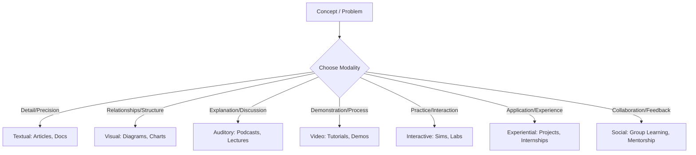

# mqd197f2kgdsut

# Learning Modalities

## Introduction

In our journey through professional development, understanding how we absorb and process information is fundamental. This page explores **Learning Modalities**, the diverse ways information can be presented and consumed, and how they shape our learning experiences.

Learning modalities are the channels through which information is delivered and perceived. They dictate the *form* in which knowledge is represented (e.g., text, image, sound) and the *means* by which a learner interacts with it. Mastering modalities is crucial because it directly impacts engagement, comprehension, and the long-term retention of knowledge.

It's vital to immediately distinguish Learning Modalities from the popular, but largely debunked, concept of "Learning Styles." **Learning Modalities** refer to the methods of presenting information (e.g., a video, a lecture, a book). They are about the *information itself* and how it's conveyed. **Learning Styles**, conversely, incorrectly suggest that individuals have a fixed, inherent "style" (like "visual learner" or "auditory learner") and learn best only when taught in that specific style. Research has consistently shown that tailoring instruction to supposed "learning styles" does not improve learning outcomes. Instead, effective learners are adaptable, choosing and combining modalities based on the subject, context, and their specific learning goals, rather than adhering to a single, preferred style.

The role of modalities in learning and communication is to provide diverse pathways for knowledge acquisition. By understanding and strategically utilizing different modalities, we can optimize our learning strategies, make information more accessible, and build a more robust understanding of complex topics.

## What Are Learning Modalities

**Learning Modalities** are the sensory or experiential channels through which information is received, processed, and encoded by a learner. They define *how* information is packaged and delivered, and *how* a learner interacts with that package.

*   **Definition**: A learning modality is a specific method or channel used to represent, transmit, and consume information. It describes the format of the learning material.
*   **Information Representation**: This refers to how knowledge is encoded in the learning material itself. For example, text uses linguistic symbols, while a diagram uses spatial relationships and shapes.
*   **Information Consumption**: This is how the learner perceives and interacts with the represented information. Reading text, watching a video, listening to a podcast, or engaging in a hands-on experiment are all different ways of consuming information via different modalities.
*   **Learning Experiences**: Modalities fundamentally shape the nature of a learning experience. A lecture offers a different experience than a simulation, even if they cover the same content.
*   **Communication Channels**: From a broader perspective, modalities are also communication channels. They determine how a message (the learning content) is sent from the source (e.g., instructor, book, software) to the receiver (the learner).

**Intuitive Examples:**

*   **Learning about the human heart:**
    *   **Textual:** Reading a chapter in an anatomy textbook.
    *   **Visual:** Examining a detailed diagram of the heart's chambers and vessels.
    *   **Auditory:** Listening to a cardiologist explain heart function in a podcast.
    *   **Video:** Watching an animated video demonstrating blood flow through the heart.
    *   **Interactive:** Using an online 3D heart model where you can rotate and dissect layers.
    *   **Experiential:** Dissecting a pig heart in a lab.
    *   **Social:** Discussing heart conditions and treatments with a study group.

Each of these examples uses a different modality to convey information about the same topic, offering unique perspectives and engagement opportunities.

## Why Learning Modalities Matter

Understanding and leveraging learning modalities significantly enhances the learning process due to several key factors:

*   **Engagement**: Different modalities appeal to different cognitive processes and sensory preferences, helping to capture and sustain a learner's interest. A dynamic video can be more engaging than dense text for some topics, while a deep dive into an article might be more engaging for others.
*   **Comprehension**: Complex concepts can often be better understood when presented through multiple modalities. For instance, combining a textual description with a visual diagram can clarify intricate relationships that text alone might obscure.
*   **Retention**: Information encoded through various sensory pathways tends to be more robustly stored in memory. The more connections made during encoding (e.g., seeing, hearing, doing), the more retrieval cues are available later, leading to better long-term recall.
*   **Accessibility**: Diverse modalities cater to a wider range of learners, including those with specific accessibility needs (e.g., visual impairments requiring auditory descriptions, hearing impairments benefiting from captions or visual aids). Universal design for learning inherently promotes multi-modal approaches.
*   **Knowledge Transfer**: Presenting information in various forms helps learners build a more flexible and adaptable understanding. This allows them to apply knowledge to different contexts and problems, fostering true mastery rather than rote memorization.
*   **Adaptability**: Effective learners aren't confined to a single "style." They consciously choose and combine modalities based on the subject matter, their learning goals, and the context, leading to more efficient and deeper learning.

## Common Learning Modalities

Let's explore the primary learning modalities, their characteristics, and their optimal applications.

### Textual Modality

This modality relies on written language to convey information.

*   **Covers:** Books, articles, documentation, notes, written explanations, reports, emails, code comments.
*   **Advantages:**
    *   **Detail and Precision:** Excellent for conveying complex, nuanced information with high accuracy.
    *   **Self-Paced:** Learners can read at their own speed, re-read sections, and pause for reflection.
    *   **Portability:** Text-based materials are often easy to carry and access.
    *   **Searchable:** Digital text is easily searchable for specific keywords or concepts.
    *   **Foundation:** Forms the basis for many academic and professional disciplines.
*   **Limitations:**
    *   **Passive for some:** Can be less engaging for learners who prefer active or dynamic content.
    *   **Cognitive Load:** Dense text can lead to cognitive overload if not well-structured or if the topic is entirely new.
    *   **Abstract:** May struggle to convey spatial, dynamic, or emotional information effectively without supplementary visuals.
*   **Ideal Use Cases:** Deep dives into theoretical concepts, legal documents, coding documentation, scientific papers, philosophy, detailed instructions, historical accounts.

### Visual Modality

This modality uses images, graphics, and spatial arrangements to represent information.

*   **Covers:** Images, diagrams, charts (bar, pie, line), graphs, mind maps, infographics, flowcharts, visual models, slides with minimal text.
*   **Advantages:**
    *   **Clarity for Relationships:** Excellent for showing relationships, structures, processes, and comparisons at a glance.
    *   **Reduces Cognitive Load:** Can often convey complex information more efficiently than text, leveraging our strong visual processing capabilities.
    *   **Memory Aid:** Visuals are often highly memorable and can act as powerful retrieval cues.
    *   **Engagement:** Can make abstract data or concepts more concrete and appealing.
*   **Limitations:**
    *   **Lack of Nuance:** May oversimplify complex topics or lack the precise detail possible with text.
    *   **Interpretation:** Requires clear labels and explanations to avoid misinterpretation.
    *   **Accessibility:** Can be challenging for visually impaired learners without alternative descriptions.
*   **Ideal Use Cases:** Explaining system architectures, data trends, organizational structures, geographical information, biological processes, step-by-step instructions, concept mapping.

### Auditory Modality

This modality delivers information through sound, primarily spoken language.

*   **Covers:** Lectures, podcasts, audiobooks, discussions, verbal instructions, interviews, audio explanations.
*   **Advantages:**
    *   **Hands-Free:** Allows for learning while engaged in other activities (e.g., commuting, exercising).
    *   **Intonation and Emotion:** Conveys nuance, emphasis, and emotion through voice, which text often lacks.
    *   **Personal Connection:** A speaker's voice can create a stronger sense of connection or presence.
    *   **Accessibility:** Essential for learners with visual impairments.
*   **Limitations:**
    *   **Linear:** Difficult to skim, jump around, or easily re-visit specific points without rewind.
    *   **Distraction:** Can be easily disrupted by external noise or internal thoughts.
    *   **Pacing:** Learner's processing speed must match speaker's delivery speed.
    *   **Abstract:** May struggle with complex visual or spatial concepts.
*   **Ideal Use Cases:** Learning languages, listening to expert interviews, philosophical discussions, news analysis, historical narratives, catching up on industry trends, reviewing concepts.

### Video Modality

This modality combines visual and auditory elements, often with motion.

*   **Covers:** Recorded lessons, demonstrations, tutorials, webinars, visual storytelling, screencasts, documentaries.
*   **Advantages:**
    *   **Dynamic Visuals:** Shows processes, actions, and transformations over time, which static images cannot.
    *   **Rich Context:** Combines spoken explanations with corresponding visuals, enhancing comprehension.
    *   **Engagement:** Can be highly engaging due to its dynamic nature and narrative potential.
    *   **Demonstration:** Ideal for showing *how* to do something.
*   **Limitations:**
    *   **Passive Consumption Risk:** Learners might watch without actively processing the information.
    *   **Production Cost:** High-quality video can be expensive and time-consuming to produce.
    *   **Bandwidth:** Requires significant bandwidth for streaming.
    *   **Searchability:** Content within a video is harder to search than text without transcripts.
*   **Ideal Use Cases:** Software tutorials, lab experiment demonstrations, surgical procedures, historical reenactments, skill-based training, visual explanations of complex systems (e.g., engine function).

### Interactive Modality

This modality involves direct engagement and manipulation of learning environments.

*   **Covers:** Simulations, interactive exercises, labs, educational software, quizzes with immediate feedback, virtual reality (VR), augmented reality (AR) experiences.
*   **Advantages:**
    *   **Active Learning:** Promotes active engagement, decision-making, and problem-solving.
    *   **Immediate Feedback:** Allows learners to test understanding and correct misconceptions in real-time.
    *   **Safe Experimentation:** Provides a risk-free environment to practice complex or dangerous tasks.
    *   **Deep Understanding:** Fosters a deeper, experiential understanding of concepts.
*   **Limitations:**
    *   **Resource Intensive:** Often requires specialized software, hardware, or development.
    *   **Guided Use:** Requires clear instructions and sometimes supervision to be effective.
    *   **Over-reliance:** Can be less effective if interaction is superficial or replaces genuine intellectual effort.
*   **Ideal Use Cases:** Flight simulations, medical procedure training, coding sandboxes, language learning apps, physics simulations, financial modeling tools, virtual lab experiments.

### Experiential Modality

This modality emphasizes direct, hands-on experience and real-world application.

*   **Covers:** Hands-on practice, real-world projects, experiments, internships, apprenticeships, field trips, practical application of skills.
*   **Advantages:**
    *   **Deepest Learning:** Often leads to the most profound and durable learning as knowledge is constructed through direct action.
    *   **Skill Development:** Crucial for developing practical skills and competencies.
    *   **Contextual Understanding:** Helps learners understand the practical implications and nuances of theoretical knowledge.
    *   **Problem-Solving:** Fosters adaptive problem-solving skills in authentic contexts.
*   **Limitations:**
    *   **Time and Resource Intensive:** Can be very demanding in terms of time, materials, and supervision.
    *   **Risk:** Some experiences carry inherent risks or costs.
    *   **Scarcity:** Opportunities for true experiential learning can be limited.
*   **Ideal Use Cases:** Engineering projects, medical residencies, artistic creation, cooking, sports training, scientific research, building software, entrepreneurial ventures.

### Social Modality

This modality involves learning through interaction with others.

*   **Covers:** Group learning, peer learning, mentorship, communities of practice, collaborative projects, discussions, debates, teaching others.
*   **Advantages:**
    *   **Multiple Perspectives:** Exposes learners to diverse viewpoints and problem-solving approaches.
    *   **Motivation and Accountability:** Group dynamics can increase motivation and mutual accountability.
    *   **Communication Skills:** Develops essential communication, negotiation, and teamwork skills.
    *   **Feedback:** Provides opportunities for constructive feedback from peers and mentors.
    *   **Deepens Understanding:** Explaining concepts to others significantly strengthens one's own understanding.
*   **Limitations:**
    *   **Coordination Challenges:** Requires effective group management and communication.
    *   **Social Loafing:** Risk of unequal participation in group tasks.
    *   **Conflict:** Potential for interpersonal conflicts.
    *   **Pacing:** Group pace might not suit individual learning speeds.
*   **Ideal Use Cases:** Brainstorming sessions, code reviews, design critiques, study groups, peer teaching, professional communities (e.g., developer forums), collaborative research.

## Comparing Different Modalities

Each modality has distinct strengths and weaknesses, making them suitable for different learning objectives and contexts.

| Modality         | Strengths                                                 | Weaknesses                                                    | Best Use Cases                                         | When it Outperforms Others                                                                  |
| :--------------- | :-------------------------------------------------------- | :------------------------------------------------------------ | :----------------------------------------------------- | :------------------------------------------------------------------------------------------ |
| **Textual**      | Detail, precision, self-paced, searchable, foundational   | Passive for some, cognitive overload, abstract               | Theoretical concepts, documentation, legal texts       | When absolute precision and self-paced deep dives are paramount.                             |
| **Visual**       | Relationships, structures, reduces load, memorable, engaging | Lacks nuance, misinterpretation risk, accessibility           | Data trends, system architectures, processes, concept mapping | When explaining complex relationships, patterns, or spatial information quickly and clearly. |
| **Auditory**     | Hands-free, intonation/emotion, personal, accessibility   | Linear, easily distracted, pacing issues, abstract            | Language learning, interviews, discussions, commuting learning | When hands-free consumption is needed, or for conveying tone and nuance.                     |
| **Video**        | Dynamic visuals, rich context, engaging, demonstrations   | Passive risk, production cost, bandwidth, searchability      | Tutorials, demonstrations, dynamic processes, skill-based training | When showing *how* something moves or changes over time, or demonstrating actions.         |
| **Interactive**  | Active learning, immediate feedback, safe experimentation, deep understanding | Resource intensive, guided use, superficial interaction risk | Simulations, virtual labs, coding sandboxes, skill practice | When hands-on practice, immediate feedback, and risk-free experimentation are critical.     |
| **Experiential** | Deepest learning, skill development, contextual, problem-solving | Time/resource intensive, risk, scarcity                       | Real-world projects, internships, scientific experiments, apprenticeships | For developing practical skills, fostering deep understanding through application, and true mastery. |
| **Social**       | Multiple perspectives, motivation, communication skills, feedback | Coordination, social loafing, conflict, pacing                | Group projects, peer reviews, mentorship, brainstorming, debates | When diverse perspectives, collaborative problem-solving, and interpersonal skill development are key. |

## Multi-Modal Learning

**Multi-modal learning** involves intentionally combining two or more learning modalities to enhance understanding, retention, and application of knowledge. It is a powerful, evidence-based approach that recognizes the limitations of any single modality and leverages the strengths of diverse channels.

*   **Combining Modalities**: Instead of just reading about a topic, a multi-modal approach might involve reading (textual), watching a video demonstration (video), discussing it with peers (social), and then practicing it (experiential/interactive).
*   **Why Multiple Modalities Often Improve Understanding**:
    *   **Dual Coding**: As explained by cognitive science, our brains process information through two distinct channels: verbal and non-verbal (visual). When information is presented in both text (verbal) and images (visual), these two channels work in parallel, creating redundant representations that are stronger and more easily retrieved.
    *   **Multiple Entry Points**: Different modalities offer different perspectives and emphasize different aspects of the same information. If one modality doesn't quite "click," another might.
    *   **Knowledge Reinforcement**: Encountering information in various formats reinforces the core concepts, building a more robust and interconnected mental model. Each modality acts as a retrieval cue for the others.
    *   **Learning Efficiency**: While it might seem like more work, multi-modal learning can actually be more efficient in the long run by deepening understanding and reducing the need for repeated re-learning.
    *   **Engagement and Motivation**: Shifting between modalities can keep learners more engaged and prevent fatigue that might arise from prolonged exposure to a single type of content.

**Examples of Multi-Modal Learning:**

*   **Learning a new programming language:**
    *   Read a textbook chapter on object-oriented programming (textual).
    *   Watch a video tutorial demonstrating how to implement a class (video).
    *   Work through interactive coding exercises in an online sandbox (interactive).
    *   Discuss common design patterns with a study group (social).
    *   Build a small personal project using the new language (experiential).
*   **Understanding complex historical events:**
    *   Read primary source documents and historical analyses (textual).
    *   Examine maps and timelines of the period (visual).
    *   Listen to historical podcasts or lectures from experts (auditory).
    *   Watch documentary films (video).
    *   Debate interpretations of events with peers (social).

By intentionally layering modalities, learners construct richer, more interconnected knowledge structures that are more resilient to forgetting and more flexible for application.

## Learning Modalities Across Different Domains

The effectiveness of specific modalities can vary significantly based on the subject matter.

### Programming

*   **Textual**: Core for understanding syntax, API documentation, design patterns, algorithms (e.g., reading a book on data structures).
*   **Video**: Excellent for "walkthroughs," explaining IDE features, demonstrating debugging steps, or showing a project build from scratch.
*   **Interactive**: Crucial for hands-on coding exercises, online sandboxes, code challenges, and immediate feedback on syntax and logic.
*   **Experiential**: Building real-world projects, contributing to open source, debugging complex systems, pair programming.
*   **Social**: Code reviews, peer programming, collaborating on projects, online communities (Stack Overflow).
*   **Why**: Programming is fundamentally about *doing* and *problem-solving*. While theoretical understanding is key (textual), applying that theory and getting immediate feedback (interactive/experiential) is paramount. Seeing code in action (video) and collaborating (social) further cement understanding.

### Mathematics

*   **Textual**: Definitions, theorems, proofs, problem statements.
*   **Visual**: Graphs, geometric diagrams, charts (e.g., visualizing functions, Venn diagrams, flowcharts for proofs).
*   **Auditory**: Lectures explaining concepts, derivations, and problem-solving strategies.
*   **Interactive**: Online calculators, geometry software (e.g., GeoGebra), simulations, step-by-step problem solvers.
*   **Experiential**: Working through countless practice problems, deriving proofs independently.
*   **Why**: Math often involves abstract concepts that benefit greatly from visualization (visual) to make them concrete. Repeated practice (experiential/interactive) is essential for mastering procedures and problem-solving. Explanations (textual/auditory) provide the underlying logic.

### Science

*   **Textual**: Scientific papers, textbooks, lab reports, theoretical explanations.
*   **Visual**: Diagrams of biological systems, chemical structures, physical forces, data visualizations.
*   **Video**: Demonstrating experiments, microscopic views, animated processes (e.g., cell division, chemical reactions).
*   **Interactive**: Virtual labs, simulations of physical phenomena, interactive models (e.g., molecular viewers).
*   **Experiential**: Conducting actual lab experiments, field research, observations.
*   **Why**: Science thrives on observation, experimentation, and understanding complex processes. Visuals and video help make abstract processes concrete, while interactive and experiential modalities provide direct engagement with scientific inquiry.

### Business

*   **Textual**: Case studies, business reports, market analyses, strategic plans, legal documents.
*   **Visual**: Flowcharts of business processes, organizational charts, financial dashboards, marketing infographics, data visualizations.
*   **Auditory**: Podcasts on business trends, expert interviews, executive briefings.
*   **Video**: Company presentations, product demonstrations, customer testimonials, training videos.
*   **Interactive**: Business simulations, financial modeling software, interactive dashboards.
*   **Social**: Networking, mentorship, team meetings, collaborative strategy sessions, presentations.
*   **Why**: Business requires understanding complex systems, market dynamics, and human behavior. A blend of data analysis (textual/visual), strategic communication (auditory/social), and practical application (interactive/experiential) is key.

### Design

*   **Visual**: Central to understanding aesthetics, composition, color theory, typography, mockups, prototypes.
*   **Textual**: Design principles, user research reports, style guides, rationale for design choices.
*   **Interactive**: Using design software (e.g., Figma, Adobe XD), interactive prototypes, user testing.
*   **Experiential**: Creating actual designs, iterating on feedback, working on client projects.
*   **Social**: Design critiques, peer feedback sessions, client presentations, collaborating with developers.
*   **Why**: Design is inherently visual. Practical application and critique (interactive/experiential/social) are essential for developing taste, skill, and the ability to articulate design decisions.

### Language Learning

*   **Textual**: Reading books, articles, flashcards, grammar explanations, written exercises.
*   **Auditory**: Listening to native speakers (podcasts, music, movies), conversations, pronunciation drills.
*   **Interactive**: Language learning apps (Duolingo, Anki), interactive grammar exercises.
*   **Social**: Conversation partners, language exchange groups, talking with native speakers, online forums.
*   **Why**: Language acquisition is multi-faceted. Auditory input and social interaction are crucial for listening comprehension and speaking fluency, while textual components build vocabulary and grammar, and interactive elements provide practice.

### Research

*   **Textual**: Reading scholarly articles, books, writing research proposals, papers, literature reviews.
*   **Visual**: Data visualizations, conceptual models, diagrams of experimental setups.
*   **Auditory**: Attending conferences, listening to presentations, interviews with experts.
*   **Social**: Collaborating with co-authors, peer review, presenting at conferences, discussing findings.
*   **Why**: Research demands critical analysis of existing knowledge (textual), clear communication of findings (textual/visual/auditory), and collaborative inquiry (social).

## Learning Modalities And Cognitive Load

**Cognitive load** refers to the total amount of mental effort being used in working memory. Our working memory has limited capacity, and exceeding this capacity can hinder learning. Learning modalities play a significant role in managing cognitive load.

*   **Cognitive Processing**: Different modalities leverage different processing channels (e.g., visual-spatial vs. verbal-auditory). Effective use of modalities can distribute the processing burden, preventing overload in a single channel.
*   **Information Overload**: If too much information is presented simultaneously, or if it's presented in a confusing way within a single modality (e.g., dense text without headings), cognitive load increases, making it difficult to process and understand.
*   **Modality Effects**: Research shows that when presenting complex information, combining visuals with spoken words (auditory + visual) is often more effective than combining visuals with written words (textual + visual) or spoken words alone. This is because spoken words and visuals can be processed in parallel by different working memory channels, whereas written words and visuals both compete for the visual channel, potentially causing overload. This is a core principle of Mayer's [Multimedia Learning Theory](https://www.google.com/search?q=Mayer%27s+Multimedia+Learning+Theory), which highlights the **modality principle**.
*   **Efficient Information Presentation**:
    *   **Less is More**: Avoid extraneous information. Keep visuals clean and text concise.
    *   **Align Modalities**: Ensure that visuals complement rather than duplicate text or audio. If a speaker is describing a diagram, the diagram should be visible.
    *   **Segment Information**: Break down complex content into smaller, manageable chunks, especially in video or audio formats.
    *   **Use Visuals Strategically**: Employ diagrams, charts, and images to illustrate concepts that are difficult to explain solely with text, thereby reducing the load on verbal working memory.

For a deeper dive, refer to the [Cognitive Load](?topic=Cognitive%20Load) page. Understanding how modalities interact with cognitive load is key to designing effective learning materials.

## Learning Modalities And Working Memory

**Working memory** is the cognitive system responsible for holding and manipulating information temporarily. It's where active thinking, problem-solving, and comprehension happen. Modalities directly influence how information enters and is managed within working memory.

*   **Processing Limitations**: Working memory has a very limited capacity (typically 4-7 chunks of information) and duration. Overloading it, regardless of modality, leads to forgetting and reduced comprehension.
*   **Visual and Verbal Processing**: Working memory has separate, but interacting, channels for processing visual-spatial information (visuospatial sketchpad) and verbal-auditory information (phonological loop).
    *   When you see an image, it uses the visual channel.
    *   When you hear someone speak, it uses the verbal channel.
    *   When you read text, it primarily uses the visual channel (though it also engages the verbal channel for inner speech).
    *   The power of multi-modal learning often comes from distributing information across these two channels, allowing more information to be processed simultaneously without overloading either one (e.g., seeing a diagram while hearing an explanation).
*   **Attention Management**: Effective use of modalities can guide attention. A well-designed visual can highlight key information, directing the learner's focus. Poorly designed multi-modal content (e.g., distracting animations, text that doesn't match audio) can divide attention and increase cognitive load.

For a more comprehensive understanding of this critical cognitive function, visit the [Working Memory](?topic=Working%20Memory) page.

## Learning Modalities And Long-Term Memory

**Long-term memory** is the system responsible for storing information for extended periods, from days to a lifetime. The goal of all learning is to transfer knowledge from working memory into long-term memory in a way that is robust and accessible. Learning modalities significantly impact this process.

*   **Encoding**: This is the process of converting information into a form that can be stored in long-term memory.
    *   **Elaborative Encoding**: When information is processed through multiple modalities, it creates more connections and associations in the brain. For example, learning about photosynthesis by reading text, seeing a diagram, watching an animation, and discussing it, creates a richer, more elaborate memory trace than just reading.
    *   **Dual Coding**: As mentioned earlier, presenting information both visually and verbally leads to two distinct mental representations that are linked. This redundancy strengthens the memory and provides more pathways for retrieval.
*   **Retrieval**: This is the process of accessing stored information from long-term memory. The more pathways and cues associated with a memory, the easier it is to retrieve. Multi-modal learning creates these multiple cues. If you can't recall a concept from its textual description, a mental image or the sound of a lecture might trigger its retrieval.
*   **Memory Formation**: Deep and durable learning, which leads to strong long-term memories, is often characterized by:
    *   **Meaningful Connections**: Multi-modal approaches help learners build deeper meaning by connecting new information to existing knowledge from various angles.
    *   **Active Processing**: Modalities like interactive and experiential learning inherently require active processing, which is far more effective for memory formation than passive consumption.
    *   **Spaced Repetition**: Reviewing content in different modalities over time (e.g., reading a concept, then watching a video, then doing practice problems) can strengthen long-term memory consolidation.
*   **Durable Learning**: Information learned through multiple, well-integrated modalities is typically more resistant to forgetting because it is represented in a richer, more interconnected network in the brain.

To delve further into how memories are formed and retained, explore the [Long-Term Memory](?topic=Long-Term%20Memory) page.

## Learning Modalities And Learning Science

Learning modalities are not just about personal preference; they are deeply rooted in cognitive science principles that describe how humans learn most effectively. Understanding these connections helps us move beyond myths and embrace evidence-based strategies.

*   **Evidence-Based Learning**: Learning science emphasizes that effective learning strategies are those supported by robust empirical research, not anecdotal evidence or intuition. The strategic use of modalities falls squarely within this domain.
*   **Dual Coding**: This is perhaps the most significant principle related to modalities. Developed by Allan Paivio and later expanded by others, dual coding theory posits that we have two distinct mental systems for processing information: one for verbal information (words, text, speech) and one for non-verbal information (images, diagrams, sounds). When information is presented in both verbal and visual forms and these are meaningfully linked, learning is enhanced because we create two separate, yet interconnected, mental representations. This strengthens comprehension and retrieval.
*   **Retrieval Practice**: This principle states that actively retrieving information from memory strengthens memory and improves long-term retention. Modalities can support retrieval practice in various ways:
    *   **Interactive Quizzes**: An interactive modality provides immediate feedback for retrieval practice.
    *   **Flashcards**: Textual and visual flashcards are a classic retrieval practice tool.
    *   **Explaining to Others**: A social modality encourages retrieval and articulation.
*   **Active Recall**: A powerful form of retrieval practice, active recall involves trying to retrieve information without looking at the material. Modalities can facilitate this: after watching a video (video), try to summarize its key points in writing (textual) or draw a diagram (visual) from memory.
*   **Deliberate Practice**: This involves focused, intentional practice aimed at improving specific skills, often outside one's comfort zone. Modalities like experiential and interactive learning are central to deliberate practice (e.g., practicing specific coding challenges, performing a surgical simulation repeatedly).

By understanding how modalities align with these scientific principles, we can move from simply consuming content to actively engaging with it in ways that optimize our brain's natural learning mechanisms. For more on these topics, refer to [Learning Science](?topic=Learning%20Science), [Active Recall](?topic=Active%20Recall), and [Study Techniques](?topic=Study%20Techniques).

## Accessibility And Inclusive Learning

Learning modalities are fundamental to creating accessible and inclusive learning environments. Diverse learners have diverse needs, and providing information in multiple formats ensures that everyone has an equitable opportunity to learn.

*   **Accessibility Needs**: Learners may have various needs that impact their ability to access information through certain modalities:
    *   **Visual Impairments**: Require content presented audibly (auditory) or tactilely. Visuals need descriptive alternative text.
    *   **Hearing Impairments**: Benefit from captions, transcripts (textual), sign language interpretation, and strong visual cues (visual, video).
    *   **Cognitive Differences (e.g., ADHD, Dyslexia)**: May benefit from well-structured text, audio options, interactive elements that allow self-pacing, and reduced cognitive load through clear visuals.
    *   **Motor Impairments**: May require alternative input methods for interactive modalities.
*   **Diverse Learners**: Beyond diagnosed impairments, all learners have preferences and varying strengths in processing different types of information. Offering choice empowers learners to engage with content in ways that best suit their current needs.
*   **Alternative Formats**: Providing content in alternative formats is a cornerstone of accessibility:
    *   **Textual**: Transcripts for audio/video, descriptions for images.
    *   **Auditory**: Audio versions of text documents (text-to-speech), audio descriptions for video.
    *   **Visual**: Sign language interpreters in videos, visual cues for auditory alerts.
*   **Universal Design Principles**: The concept of Universal Design for Learning (UDL) advocates for designing learning experiences from the outset to be accessible to the broadest range of learners. UDL guidelines explicitly recommend providing:
    *   **Multiple Means of Representation**: Presenting information and content in different ways (e.g., visual, auditory, textual).
    *   **Multiple Means of Action & Expression**: Offering learners different ways to demonstrate what they know (e.g., written essays, oral presentations, projects).
    *   **Multiple Means of Engagement**: Stimulating interest and motivation for learning in varied ways.

By embracing multi-modal design, educators and content creators can ensure that learning is not a barrier but an opportunity for all.

## Choosing The Right Modality

Effective learners and content creators don't rely on a single modality; they strategically choose and combine them based on specific factors.

*   **Based on Subject Matter**:
    *   **Highly Abstract Concepts (e.g., Philosophy, Advanced Physics)**: Often benefit from textual (for precision), auditory (for expert explanations), and potentially visual (for conceptual models).
    *   **Procedural Skills (e.g., Software Installation, Cooking)**: Video and interactive modalities are often superior for demonstrating steps. Experiential learning is crucial for practice.
    *   **Data-Heavy Information (e.g., Economics, Statistics)**: Visual modalities (charts, graphs) are essential for pattern recognition, complemented by textual analysis.
    *   **Creative Skills (e.g., Design, Music)**: Experiential (practice), social (critique/collaboration), and visual (examples) are highly effective.
*   **Based on Learning Goals**:
    *   **Memorization of Facts**: Textual (flashcards), auditory (repetition), and active recall techniques work well.
    *   **Deep Conceptual Understanding**: Multi-modal approaches, combining textual explanations with visuals, discussions, and interactive elements.
    *   **Skill Acquisition**: Experiential and interactive modalities are non-negotiable, supported by video demonstrations.
    *   **Problem-Solving**: Interactive simulations, case studies (textual), and social discussions are invaluable.
*   **Based on Learner Experience Level**:
    *   **Beginners**: May benefit from more guided, highly visual, and video-based content to build foundational understanding, then gradually introduce more textual depth and interactive challenges.
    *   **Intermediate Learners**: Can handle more textual detail and abstract concepts, benefiting from interactive practice and social learning.
    *   **Advanced Professionals**: May prefer dense textual resources (research papers), deep auditory dives (expert panels), and complex experiential projects, leveraging their strong foundational knowledge.
*   **Based on Available Resources**:
    *   **Time Constraints**: Audio (podcasts) for hands-free learning, or concise textual summaries.
    *   **Limited Bandwidth**: Textual content is more accessible than high-definition video.
    *   **Budget**: Free online articles (textual), public lectures (auditory), or open-source interactive tools.
    *   **Access to Experts/Peers**: Leverages social modalities like mentorship or group discussions.

The key is flexibility. There is no "one-size-fits-all" modality; the optimal approach is always adaptive and context-dependent.

## Common Mistakes

Even with an understanding of modalities, learners and content creators can fall into common traps.

*   **Relying on a Single Modality**: This is the most prevalent mistake. Whether it's always reading textbooks, always watching videos, or only ever doing hands-on work, limiting oneself to a single modality means missing out on the complementary strengths of others, leading to shallower understanding and weaker retention.
*   **Passive Consumption**: Mistaking exposure for learning. Simply watching a video or listening to a lecture without actively engaging with the content (e.g., taking notes, summarizing, questioning, discussing) is largely ineffective, regardless of the modality. The brain needs to *work* to learn.
*   **Mistaking Preference for Effectiveness**: Believing that because you "prefer" visual content, it's always the *most effective* way for you to learn *everything*. As established, the "learning styles" myth is debunked. While preferences exist, effective learning often requires stepping outside one's comfort zone and using the modality best suited for the content and goal, even if it's not a personal favorite.
*   **Ignoring Practice and Application**: Focusing solely on input modalities (reading, watching, listening) without engaging in output modalities (writing, discussing, building, solving). True learning and skill acquisition require active practice, application, and retrieval.
*   **Poorly Integrated Multi-modal Content**: Simply throwing multiple modalities together without thoughtful integration. For example, a video that just shows text on screen while someone reads it aloud is redundant and can even increase cognitive load, violating the principles of effective multimedia design. Each modality should contribute uniquely to the learning experience.

Avoiding these pitfalls requires conscious effort, self-awareness, and an understanding of how our brains truly learn.

## Learning Modalities In The AI Era

The rapid advancements in Artificial Intelligence (AI) are revolutionizing how learning content is created, delivered, and consumed, significantly impacting the landscape of learning modalities.

*   **AI-Generated Text**: AI can now generate highly coherent and informative articles, summaries, explanations, and even entire textbooks. This dramatically increases the availability of textual content, allowing for rapid content creation and personalization.
*   **AI-Generated Visuals**: AI tools can produce images, diagrams, infographics, and even short animations from textual prompts. This democratizes the creation of visual learning aids, making complex concepts more accessible.
*   **AI Tutoring**: AI-powered chatbots and virtual assistants can provide personalized explanations, answer questions, and guide learners through complex topics in a conversational, interactive modality. They can adapt their responses based on learner understanding.
*   **Interactive AI Learning**: AI can create dynamic simulations, adaptive quizzes, and personalized learning paths. These interactive experiences provide immediate feedback and adjust difficulty, offering highly tailored experiential learning.
*   **Personalized Learning Experiences**: AI can analyze a learner's performance, preferences (what modalities they tend to engage with more, not "style"), and progress to recommend the most effective sequence and combination of modalities for a given topic. This moves beyond fixed curricula to truly adaptive learning.
*   **AI for Accessibility**: AI can instantly translate text to speech, generate captions for videos, create audio descriptions for images, and even adjust reading levels of text, vastly improving accessibility across modalities.

While AI enhances the production and delivery of modalities, the core principles of effective learning still apply. The challenge for learners will be to critically evaluate AI-generated content and leverage AI tools for *active* and *multi-modal* engagement rather than passive consumption.

## Real-World Applications

The strategic use of learning modalities is pervasive across various domains, often in subtle yet powerful ways.

*   **Education (K-12 & Higher Ed)**:
    *   **Classroom Teaching**: Lectures (auditory), whiteboards/slides (visual), group work (social), lab experiments (experiential), online quizzes (interactive), textbooks (textual).
    *   **Online Courses**: Pre-recorded video lectures (video), discussion forums (social), written assignments (textual), interactive simulations (interactive).
*   **Software Engineering**:
    *   **Onboarding New Hires**: Reading documentation (textual), watching coding demos (video), pair programming (social/experiential), working on starter tasks (experiential/interactive).
    *   **Learning New Frameworks**: Official documentation (textual), online tutorials (video/interactive), building a small project (experiential), contributing to community forums (social).
*   **Business**:
    *   **Employee Training**: Online modules with text, video, and quizzes (multi-modal), role-playing exercises (experiential), mentor programs (social).
    *   **Strategy Sessions**: Whiteboard brainstorming (visual), presentations (visual/auditory), facilitated discussions (social), case studies (textual).
*   **Research**:
    *   **Literature Review**: Reading scholarly articles (textual), creating concept maps (visual), discussing findings with colleagues (social).
    *   **Data Analysis**: Using statistical software (interactive), generating charts and graphs (visual), writing research papers (textual), presenting findings (auditory/visual).
*   **Professional Development**:
    *   **Conferences**: Keynote speeches (auditory/visual), workshops (interactive/experiential), networking (social), printed handouts (textual).
    *   **Certifications**: Online courses combining videos, readings, and practice exams (multi-modal), potentially hands-on labs (experiential).
*   **Lifelong Learning**:
    *   **Learning a New Skill/Hobby**: Watching YouTube tutorials (video), reading instructional books (textual), practicing hands-on (experiential), joining a local club (social).
    *   **Staying Current in an Industry**: Subscribing to industry newsletters (textual), listening to podcasts (auditory), attending webinars (video/interactive), participating in professional communities (social).

In each case, a combination of modalities is typically employed to provide a rich, comprehensive, and effective learning experience, moving beyond the limitations of any single approach.

## Practical Framework For Using Learning Modalities Effectively

Here's a step-by-step framework to guide you or your learners in leveraging modalities for optimal learning:

1.  **Define Your Learning Goal**:
    *   What exactly do you need to learn? (e.g., understand a theory, master a skill, solve a problem).
    *   What level of understanding or proficiency do you aim for? (e.g., basic recall, deep comprehension, expert application).

2.  **Analyze the Subject Matter**:
    *   Is it highly abstract, procedural, data-driven, creative, or language-based?
    *   What are the inherent characteristics of the content? (e.g., highly visual concepts, complex narratives, step-by-step instructions).

3.  **Identify Relevant Modalities**:
    *   Based on your goal and the subject, brainstorm which modalities would be most suitable.
        *   *For a complex theory:* Textual (detailed explanation), Visual (conceptual diagram), Auditory (expert lecture), Social (discussion).
        *   *For a practical skill:* Video (demonstration), Interactive (simulated practice), Experiential (real-world application), Social (feedback).

4.  **Plan for Multi-Modal Integration (The 3 Cs)**:
    *   **Complement**: How can modalities complement each other? (e.g., text explains the *why*, video shows the *how*). Avoid redundancy unless for deliberate reinforcement.
    *   **Chunk**: Break down content into manageable segments. How will each modality contribute to a chunk?
    *   **Connect**: Ensure smooth transitions and clear links between different modality experiences. Use one modality to introduce, another to elaborate, another to practice.

5.  **Prioritize Active Engagement**:
    *   For *every* modality chosen, ask: "How can I make this active?"
        *   Textual: Note-taking, summarizing, questioning, active recall.
        *   Visual: Drawing diagrams from memory, explaining to others, analyzing.
        *   Auditory: Listening for key points, summarizing aloud, discussing.
        *   Video: Pausing to explain, predicting next steps, taking notes.
        *   Interactive/Experiential: Crucially, reflect on outcomes, identify improvements.
        *   Social: Actively participating, giving/receiving feedback.

6.  **Schedule for Spaced Practice & Retrieval**:
    *   Plan to revisit content in different modalities over time. This strengthens long-term memory.
    *   Incorporate retrieval practice across modalities (e.g., read, then try to explain orally, then draw, then do a quiz).

7.  **Evaluate and Adapt**:
    *   Regularly assess your learning progress. Are you meeting your goals?
    *   If a chosen modality isn't working, don't be afraid to switch or combine differently. Be flexible and experimental.
    *   Seek feedback (social) on your understanding and approach.

This framework encourages a deliberate, strategic approach to learning that moves beyond passive consumption and optimizes for deep understanding and retention.

## Practical Action Plan

Here's how to integrate an understanding of learning modalities into your own learning journey, catering to different experience levels.

### Beginner Implementation Plan

1.  **Identify Your Current Default**: For your next learning task, notice which modality you *automatically* gravitate towards. Is it always reading? Always watching videos?
2.  **Add One New Modality**: Consciously decide to add just one *different* modality to your usual approach.
    *   *If you usually read:* Find a related video or podcast.
    *   *If you usually watch videos:* Take notes from the video, or try to summarize it in writing.
    *   *If you usually listen:* Find a diagram or infographic related to the topic.
3.  **Ask "Why" and "How"**: When you encounter a new piece of information, ask: "Why is this presented this way?" and "How else could this be presented?" (e.g., "This text explains *what*; how could I see the *process*?").
4.  **Summarize Actively**: After consuming content in any modality, try to explain it aloud to an imaginary friend or write a short summary. This activates retrieval.
5.  **Experiment with Multi-Modal Pairs**: Try pairing text with diagrams, or a lecture with note-taking. Notice if it helps your understanding.

### Intermediate Implementation Plan

1.  **Strategic Modality Selection**: Before starting a new topic, proactively choose 2-3 modalities you'll use based on the subject matter and your learning goals (using the framework above).
2.  **Deliberate Multi-Modal Integration**: Don't just consume. Actively *connect* the modalities.
    *   Read a concept (textual), then draw your own diagram (visual) based on it.
    *   Watch a tutorial (video), then immediately try to implement it (experiential/interactive).
    *   Listen to a podcast (auditory), then discuss it with a peer (social).
3.  **Prioritize Output Modalities**: Make sure a significant portion of your learning time involves active output. This could be writing explanations, solving problems, building projects, or teaching others.
4.  **Leverage Interactive Tools**: Actively seek out simulations, online labs, or educational software relevant to your field. These are powerful for cementing understanding.
5.  **Reflection and Adjustment**: After completing a learning block, reflect: "Which modalities worked best for *this specific content* and *my goal*? Why? What could I do differently next time?"

### Advanced Implementation Plan

1.  **Master Content Creation for Others**: The best way to learn is to teach. Create multi-modal content (e.g., a tutorial video, a blog post with diagrams, a presentation) to explain complex topics to others. This forces deep understanding across modalities.
2.  **Design Learning Paths**: For your own continuous learning or for your team, design comprehensive multi-modal learning paths for new skills or knowledge domains. Consider the flow from one modality to the next.
3.  **Utilize Experiential Learning (Mentorship/Projects)**: Seek out opportunities for deep experiential learning, such as leading projects, mentoring junior colleagues, or taking on stretch assignments that require real-world application.
4.  **Critically Evaluate Modality Effectiveness**: Go beyond anecdotal evidence. If you're creating content, use data (e.g., completion rates, quiz scores, feedback) to assess the actual effectiveness of different modality choices.
5.  **Stay Current with AI Tools**: Explore how new AI tools can enhance your multi-modal learning. Use AI to generate summaries, create visuals, or provide interactive tutoring for subjects you're tackling.

By progressively integrating these strategies, you'll evolve from a passive consumer to an agile, strategic, and highly effective learner.

## Summary

Learning Modalities refer to the diverse channels through which information is presented and consumed – such as textual, visual, auditory, video, interactive, experiential, and social. They are distinct from the debunked concept of "Learning Styles" because modalities describe the *format of information*, not fixed individual preferences.

Understanding and strategically combining modalities is crucial for:
*   **Enhanced Engagement**: Keeping learners interested.
*   **Deeper Comprehension**: Providing multiple pathways to understanding complex ideas.
*   **Improved Retention**: Leveraging cognitive principles like Dual Coding for robust long-term memory formation.
*   **Greater Accessibility**: Catering to diverse needs and preferences.

Effective learners adapt their choice of modalities based on the subject matter, learning goals, and context. By embracing multi-modal learning, integrating different formats, and prioritizing active engagement and practice, individuals can significantly optimize their learning outcomes. The rise of AI further amplifies the potential for personalized and diverse multi-modal learning experiences, making this understanding more critical than ever.

## Key Takeaways

*   **Modalities ≠ Styles**: Learning modalities are about how *information is presented* (e.g., text, video), not fixed categories of "visual" or "auditory" learners.
*   **Adaptability is Key**: Effective learners adapt their modality use based on the content, goal, and context, rather than relying on a single "preference."
*   **Multi-Modal Power**: Combining different modalities (e.g., reading text + seeing diagrams + discussing) significantly enhances comprehension, engagement, and long-term retention due to principles like Dual Coding.
*   **Active Over Passive**: Regardless of modality, active engagement (summarizing, questioning, practicing) is far more effective than passive consumption.
*   **Cognitive Load Aware**: Strategic use of modalities can help manage cognitive load, preventing overwhelm and facilitating processing by distributing information across different working memory channels.
*   **Accessibility Imperative**: Providing content in multiple modalities is fundamental to creating inclusive learning environments for all.
*   **AI's Role**: AI is rapidly expanding the possibilities for creating and personalizing multi-modal learning experiences, making it even more important to understand their effective application.
*   **Practice and Application**: Interactive and experiential modalities are crucial for skill development and transferring theoretical knowledge into practical competence.

## Further Reading

*   Mayer, R. E. (2021). *Multimedia Learning* (3rd ed.). Cambridge University Press.
*   Brown, P. C., Roediger III, H. L., & McDaniel, M. A. (2014). *Make It Stick: The Science of Successful Learning*. Belknap Press.
*   Clark, R. C., & Mayer, R. E. (2016). *e-Learning and the Science of Instruction: Proven Guidelines for Consumers and Designers of Multimedia Learning* (4th ed.). Wiley.

## Related KnowHub Pages

*   [Learning Preferences](?topic=Learning%20Preferences)
*   [Learning Science](?topic=Learning%20Science)
*   [Cognitive Load](?topic=Cognitive%20Load)
*   [Working Memory](?topic=Working%20Memory)
*   [Long-Term Memory](?topic=Long-Term%20Memory)
*   [Study Techniques](?topic=Study%20Techniques)
*   [Active Recall](?topic=Active%20Recall)
*   [Deep Learning](?topic=Deep%20Learning)
*   [Knowledge Management](?topic=Knowledge%20Management)