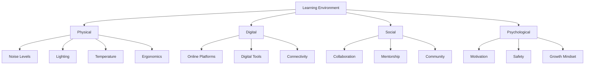
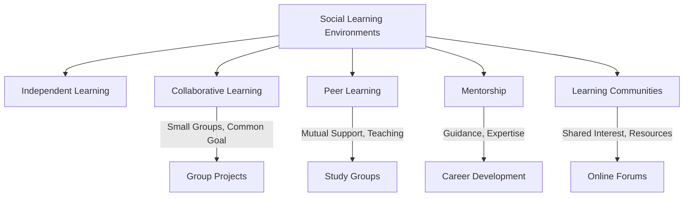
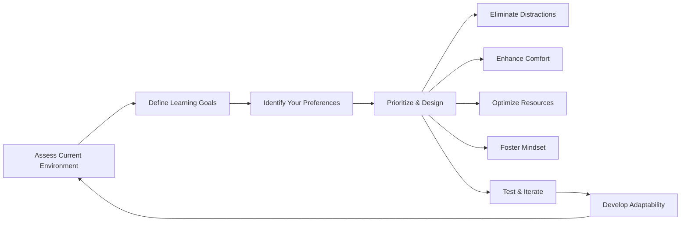

# mqd197f2oznblr

# Learning Environment Preferences

**Hierarchy:** Professional Career Development → Universal Foundations → Learning Foundation → Learning Strategies → Learning Preferences → Learning Environment Preferences

## Introduction

Have you ever noticed how much easier it is to focus on a complex task in a quiet room versus a noisy one? Or how your motivation to learn might increase when you're in a stimulating environment? This observation points to the profound impact of **Learning Environment Preferences**.

Learning environment preferences refer to the specific conditions—physical, digital, social, and psychological—that an individual finds most conducive to effective learning. These preferences aren't just about comfort; they significantly influence your attention, memory, motivation, and overall performance. Intentionally designing and adapting your learning environment is a powerful strategy to maximize focus, improve retention, boost productivity, and foster long-term growth.

It's crucial to understand from the outset that **there is no universally perfect learning environment**. What works for one person might be a distraction for another. The goal isn't to find an ideal, rigid setup, but rather to understand your own needs, design environments that support your learning goals, and most importantly, cultivate **adaptability**. Effective learners learn to optimize their primary learning spaces while also developing the resilience to perform across various conditions.

## What Is A Learning Environment

At its core, a learning environment is the holistic set of conditions and influences surrounding a learner that impact their ability to acquire, process, and retain information and skills. It's more than just a physical room; it's a dynamic interplay of various components:

*   **Physical Environment:** The tangible space and its elements. This includes your workspace, lighting, noise levels, temperature, and ergonomic setup.
    *   **Example:** A quiet desk in a library, a cozy corner in your home, a bustling cafe.
*   **Digital Environment:** The technological tools, platforms, and infrastructure you use. This encompasses online learning platforms, digital workspaces, communication tools, and even your internet connection.
    *   **Example:** An online course on Coursera, your note-taking app (Evernote, Obsidian), video conferencing software for team meetings.
*   **Social Environment:** The people and interactions that shape your learning experience. This can range from independent study to collaborative group work, mentorship, or participating in learning communities.
    *   **Example:** Studying alone, working on a group project, attending a lecture, discussing concepts with a mentor.
*   **Psychological Environment:** Your internal state, mindset, and emotional landscape during learning. This includes feelings of safety, confidence, curiosity, motivation, and whether you embrace a growth mindset.
    *   **Example:** Feeling confident to ask questions, being genuinely curious about a topic, having the resilience to overcome challenges.

Understanding these components allows you to deconstruct any learning situation and identify how different aspects might be aiding or hindering your progress.

## Why Learning Environments Matter

The environment is not just a backdrop; it's an active participant in your learning process. An optimized environment can dramatically enhance your effectiveness:

*   **Focus:** A well-designed environment minimizes distractions, allowing you to sustain concentrated effort on your learning tasks.
*   **Cognitive Performance:** Optimal conditions reduce extraneous cognitive load, freeing up mental resources for deeper information processing and retention.
*   **Motivation:** A comfortable, stimulating, and supportive environment can boost your enthusiasm, engagement, and willingness to tackle challenging material.
*   **Consistency:** A predictable and dedicated learning space helps establish routines, making it easier to show up and start learning regularly.
*   **Habit Formation:** Environmental cues can act as triggers, making it easier to initiate and stick to positive learning habits.
*   **Learning Efficiency:** By reducing wasted effort on managing distractions or discomfort, an effective environment maximizes the productive time you spend learning.

## Physical Learning Environments

Your physical surroundings play a significant role in setting the stage for learning. Different physical spaces offer distinct advantages and challenges.

### Home Learning Spaces

*   **Advantages:** Ultimate comfort and personalization, flexibility in scheduling, no commute, direct control over your immediate surroundings.
*   **Challenges:** Home distractions (family, pets, chores), blurred boundaries between work/study and personal life, potential for isolation.
*   **Best practices:** Designate a specific, consistent area solely for learning (even if it's just a corner of a room), establish clear boundaries with housemates/family, minimize clutter, and optimize lighting and noise.

### Library Environments

*   **Advantages:** Quiet, focused atmosphere, access to extensive resources (books, databases), a subtle sense of community without direct interaction, clear separation from home distractions.
*   **Challenges:** Fixed operating hours, potential for minor distractions from other patrons (rustling, typing), travel time, limited personalization.
*   **Best practices:** Find a preferred zone (silent, quiet, group study), utilize available research resources, and bring essentials to minimize movement.

### Classroom Environments

*   **Advantages:** Structured learning path, direct interaction with instructors, opportunities for peer engagement and immediate feedback, dedicated learning resources.
*   **Challenges:** Fixed pace and schedule, potential for distractions from classmates, less personalization of the immediate space.
*   **Best practices:** Engage actively, choose strategic seating to minimize distractions, arrive prepared, and minimize personal digital distractions.

### Workplace Learning Environments

*   **Advantages:** Direct application of learning to real-world problems, on-the-job training, mentorship from experienced colleagues, access to relevant industry resources.
*   **Challenges:** Frequent interruptions, performance pressure, balancing formal learning with daily job duties, potential for open-plan office noise.
*   **Best practices:** Schedule dedicated learning blocks, utilize internal subject matter experts, seek opportunities for experiential learning, and apply new skills immediately.

### Public Learning Spaces

*   **Cafes:**
    *   **Advantages:** Ambient background noise (can be stimulating for some), access to refreshments, a change of scenery, and low commitment.
    *   **Limitations:** High distraction potential, unpredictable noise levels, less privacy, often not suitable for deep, uninterrupted work.
*   **Co-working spaces:**
    *   **Advantages:** Professional atmosphere, networking opportunities, varied seating options, fewer home distractions, often good amenities.
    *   **Limitations:** Cost, potential for social distractions, travel time, less control over overall environment than a dedicated home office.
*   **Community learning spaces:**
    *   **Advantages:** Accessible, often free or low-cost, fosters community engagement, may offer diverse resources and programs.
    *   **Limitations:** Variable conditions, less dedicated quiet space, potentially less sophisticated tools or amenities.

## Environmental Factors

Beyond the type of location, specific factors within any physical environment significantly influence your learning:

### Noise Levels

*   **Silent environments:** Ideal for complex problem-solving, deep reading, writing, and learners who are highly sensitive to auditory distractions. However, some find complete silence unnerving or too stark.
*   **Moderate background noise:** For some individuals, ambient sounds (e.g., quiet chatter, instrumental music, white noise) can mask minor distractions and even enhance creativity or focus. This is often the "cafe effect."
*   **High-distraction environments:** Generally detrimental for most learning tasks, especially those requiring high cognitive load. Fragmented attention, reduced comprehension, and increased frustration are common. Solutions include noise-canceling headphones or seeking quieter spaces.

### Lighting

*   **Natural lighting:** Maximizing natural light is optimal for mood, energy levels, and reducing eye strain. Position your workspace near a window if possible.
*   **Artificial lighting:** Aim for bright, diffuse lighting that mimics natural light. Avoid harsh overhead lights that cause glare or dim, yellow lights that induce fatigue. Task lighting (e.g., a desk lamp) can focus light where it's needed.
*   **Screen-related considerations:** Use blue light filters, adjust screen brightness to match your surroundings, and take regular breaks to prevent eye strain.

### Temperature

The optimal temperature range for cognitive performance is generally between 68-72°F (20-22°C). Temperatures that are too hot can lead to sluggishness and drowsiness, while overly cold environments can cause physical discomfort and distraction. Personal preferences vary, but extremes hinder concentration.

### Ergonomics

Proper ergonomic setup is vital for sustained focus. An uncomfortable posture leads to physical pain, fatigue, and distraction.
*   Ensure your chair provides good lumbar support.
*   Your monitor should be at eye level, about an arm's length away.
*   Keep your keyboard and mouse within easy reach, maintaining neutral wrist positions.
*   Consider a standing desk to vary your posture throughout the day.

### Seating

Beyond ergonomics, the type of seating impacts comfort and focus. A comfortable, supportive chair is crucial for longer learning sessions. Some learners benefit from varying their seating, perhaps using a stability ball or switching between a traditional chair and a standing desk.

### Workspace Organization

A cluttered physical workspace often reflects a cluttered mental space. A clean, organized learning area reduces visual distractions and minimizes the mental load of searching for materials. Keep frequently used items within reach and put away anything not immediately relevant to your current learning task.

## Digital Learning Environments

In today's world, a significant portion of learning occurs digitally. Your digital environment is as important as your physical one.

*   **Online learning platforms:** Websites like Coursera, edX, Khan Academy, and specific university LMS (Learning Management Systems like Moodle, Canvas) provide structured courses, lectures, assignments, and peer interaction.
*   **Digital workspaces:** Tools like Notion, Asana, and Trello help manage projects, organize information, and facilitate collaboration, particularly for complex learning endeavors.
*   **Learning management systems (LMS):** Used by educational institutions and corporations to deliver, track, and manage learning content. They integrate various tools for quizzes, discussions, and grade tracking.
*   **Note-taking systems:** Digital tools such as Evernote, OneNote, Obsidian, or Roam Research allow you to capture, organize, and link your notes, creating a personal knowledge base.
*   **Knowledge management systems:** More advanced systems, like personal wikis or digital zettelkastens, help you synthesize, connect, and retrieve information for long-term retention and creative output.

## Digital Distractions

The digital world, while offering immense learning opportunities, is also a prime source of distraction.

*   **Notifications:** Pings, banners, and vibrations from apps, emails, and messages constantly interrupt your focus, requiring costly [Context Switching](?topic=Context%20Switching).
*   **Social media:** The endless scroll of platforms like Instagram, Twitter, or TikTok is designed to be addictive, consuming valuable study time and fragmenting attention.
*   **Multitasking:** The myth of multitasking leads to inefficient learning. For complex cognitive tasks, what appears as multitasking is often rapid context switching, which significantly reduces comprehension and retention.
*   **Context switching:** Each time you shift your attention from a learning task to an unrelated digital interruption, there's a mental cost involved in reorienting yourself back to the original task.

**Practical solutions:**
*   **Turn off non-essential notifications:** Set your phone to "Do Not Disturb" or silence alerts from non-critical apps during study times.
*   **Use website/app blockers:** Tools like Freedom, Cold Turkey, or even browser extensions can block distracting sites/apps for set periods.
*   **Dedicate specific times:** Allocate specific blocks in your day for checking emails, social media, and other communications, rather than allowing them to interrupt your flow.
*   **Implement "deep work" blocks:** Schedule uninterrupted periods where you commit to focused learning without digital distractions.

## Social Learning Environments

Learning is often a social endeavor. How you interact with others can profoundly influence your understanding and motivation.

### Independent Learning

*   **Definition:** Self-directed study where the learner works alone, processing information and practicing skills independently.
*   **Use cases:** Reading textbooks, practicing coding exercises, writing essays, memorizing facts, reflective journaling.

### Collaborative Learning

*   **Definition:** Learners work together in small groups towards a common learning goal, leveraging each other's strengths and perspectives.
*   **Use cases:** Group projects, problem-solving sessions, shared research, peer reviews of assignments.

### Group Learning

*   **Definition:** A broader term encompassing learning within a group context, which may or may not involve direct collaboration. Often involves a leader or instructor.
*   **Use cases:** Classroom lectures, workshops, large online discussion forums, seminars.

### Peer Learning

*   **Definition:** Learning from and with peers, often through teaching each other, discussing concepts, or sharing experiences and insights.
*   **Use cases:** Study groups, reciprocal teaching, peer tutoring, informal discussions with classmates.

### Mentorship

*   **Definition:** A relationship where an experienced individual (mentor) provides guidance, support, and wisdom to a less experienced individual (mentee) to foster their growth.
*   **Use cases:** Career development, skill acquisition (e.g., learning a new programming language from a senior developer), personal growth, navigating professional challenges.

### Learning Communities

*   **Definition:** Groups of people who share a common interest in learning and provide mutual support, resources, and opportunities for interaction over an extended period.
*   **Use cases:** Online forums (e.g., Reddit communities, Stack Exchange), professional associations, local meetups, open-source project communities, internal company learning groups.

## Psychological Learning Environment

Beyond the tangible, your internal mental and emotional state forms a crucial psychological learning environment. This internal landscape significantly dictates your capacity for learning.

*   **Safety:** Feeling secure enough to make mistakes, ask "stupid" questions, challenge assumptions, and express ideas without fear of judgment, ridicule, or negative consequences. Psychological safety is paramount for genuine inquiry.
*   **Confidence:** A belief in your own ability to learn, tackle challenges, and ultimately succeed. This isn't arrogance, but a realistic self-efficacy that fuels persistence.
*   **Curiosity:** An intrinsic drive to explore, question, and understand. When you are genuinely curious, learning feels less like a chore and more like an exciting discovery.
*   **Motivation:** The internal and external forces that initiate, direct, and sustain your learning behavior. Understanding your motivations (intrinsic or extrinsic) helps you design environments that feed them.
*   **Growth mindset:** The belief that your abilities and intelligence are not fixed traits but can be developed through dedication, hard work, and good strategies. This mindset fosters resilience and a willingness to embrace challenges as opportunities for growth.

## Learning Environment And Cognitive Load

The relationship between your learning environment and cognitive load is profound. Cognitive load refers to the total amount of mental effort being used in working memory.

*   **Environmental distractions:** Irrelevant stimuli in your physical or digital environment (e.g., excessive noise, visual clutter, notifications) significantly increase **extraneous cognitive load**. This means a substantial portion of your mental resources is spent filtering out noise rather than processing the actual learning material.
*   **Cognitive overload:** When the total mental effort required (intrinsic load of the material + extraneous load from the environment + germane load for schema formation) exceeds your working memory capacity, you experience cognitive overload. This leads to inefficient learning, poor comprehension, and frustration. A chaotic environment is a major contributor to this.
*   **Mental fatigue:** Prolonged effort to filter out distractions or manage a poorly organized learning environment rapidly depletes your mental resources, leading to quicker mental fatigue and reduced endurance for learning.

*For a deeper understanding of how your mind processes information, explore [Cognitive Load](?topic=Cognitive%20Load).*

## Learning Environment And Working Memory

Your working memory is the mental workspace where you temporarily hold and manipulate information. A conducive learning environment is vital for optimizing its use.

*   **Attention management:** An environment designed to minimize distractions allows for sustained attention, which is critical for encoding new information into your working memory effectively. If your attention is constantly pulled away, working memory struggles to hold and process information consistently.
*   **Focus preservation:** Each interruption or task switch forces your working memory to discard its current contents and load new ones. A stable, focused environment preserves the contents of your working memory, allowing for deeper processing.
*   **Processing efficiency:** When environmental factors (like noise, temperature, or digital interruptions) are optimized, your working memory can be fully dedicated to processing the learning material, rather than being burdened with managing extraneous stimuli. This leads to more efficient comprehension and retention.

*Learn more about how your mind handles information in [Working Memory](?topic=Working%20Memory).*

## Learning Environment And Deep Work

Deep work, a concept popularized by Cal Newport, refers to professional activities performed in a state of distraction-free concentration that push your cognitive capabilities to their limit. A well-crafted learning environment is essential for achieving this state.

*   **Focused learning:** An environment optimized for deep work is one where distractions are minimized, allowing for intense, uninterrupted focus on a single, cognitively demanding learning task.
*   **Flow states:** An ideal learning environment can facilitate entry into a "flow state" – a psychological state where you are completely immersed and absorbed in an activity, leading to heightened productivity, creativity, and enjoyment. This requires an environment free from interruptions and with just the right level of challenge.
*   **Concentration:** Sustained, high-quality concentration is the hallmark of deep work. This is achieved by intentionally designing physical, digital, and social boundaries that protect your attention.
*   **Sustained attention:** The ability to maintain focus over extended periods without succumbing to internal or external distractions is a critical skill fostered by an optimized learning environment.

## Learning Environment And Habit Formation

Our environments play a critical role in shaping our habits, including learning habits.

*   **Context-dependent habits:** Our brains are wired to associate actions with specific environments. Consistently learning in a dedicated space creates strong environmental cues that trigger "learning mode." For example, sitting at your study desk might automatically make you feel ready to learn.
*   **Environmental triggers:** Specific elements in your environment can act as triggers for learning behaviors. This could be a particular desk, a specific playlist, putting on noise-canceling headphones, or even a certain scent. When consistently paired with learning, these triggers become powerful cues.
*   **Learning routines:** Designing your environment to support specific routines reinforces positive learning habits. For instance, if your study space is always organized, it's easier to start learning without the initial hurdle of tidying up. Similarly, having all your digital resources neatly categorized facilitates easy access, encouraging more consistent engagement.

## Designing An Optimal Learning Environment

Designing an optimal learning environment is an iterative process of intentional setup and ongoing adjustment.

*   **Workspace design:**
    *   **Dedicated area:** Even if small, have a specific place you associate only with learning.
    *   **Clean and organized:** A clutter-free space reduces visual distractions.
    *   **Ergonomic setup:** Invest in a comfortable chair, ensure your monitor is at eye level, and maintain good posture to prevent discomfort.
*   **Resource organization:**
    *   **Physical:** Keep books, notebooks, and stationery neatly arranged and easily accessible.
    *   **Digital:** Use a consistent file naming convention, organize digital files into logical folders, and utilize a knowledge management system for notes and research.
*   **Technology setup:**
    *   **Reliable internet:** Essential for digital learning.
    *   **Appropriate hardware/software:** Ensure your computer and tools meet your learning needs.
    *   **Distraction-free settings:** Configure notifications, browser tabs, and app settings to minimize interruptions.
*   **Learning tools:**
    *   Identify and integrate tools that enhance your learning process: note-taking apps, mind mapping software, flashcard systems, reference managers, or coding IDEs.
*   **Scheduling considerations:**
    *   **Block out dedicated learning times:** Treat these as non-negotiable appointments.
    *   **Incorporate breaks:** Short, regular breaks (e.g., Pomodoro Technique) help maintain focus and prevent fatigue.
    *   **Align challenging tasks with peak energy times:** Work on complex material when you're most alert.

## Adapting To Different Learning Environments

While designing your optimal space is important, life often presents varied learning contexts. Developing adaptability is a hallmark of an advanced learner.

*   **Flexibility:** The ability to adjust your strategies and expectations when your ideal environment isn't available. This might mean being able to focus in a cafe if your library is closed.
*   **Resilience:** The capacity to maintain your learning effectiveness even in suboptimal or challenging conditions. This involves mentally preparing for potential distractions and having coping mechanisms.
*   **Portable learning systems:** Develop habits and utilize tools that can travel with you. This could include noise-canceling headphones, digital note-taking apps accessible on multiple devices, or a specific pre-learning routine that you can perform anywhere.
*   **Maintaining performance across environments:** Understand your core needs (e.g., minimal visual clutter, ability to play background music) and replicate them as much as possible, or develop specific strategies to mitigate the deficiencies of a less-than-ideal environment. For instance, if you need quiet but are in a noisy space, focus on tasks that require less intense concentration or use white noise.

## Learning Environments Across Different Domains

The ideal learning environment can vary significantly depending on the subject matter or skill being acquired.

### Programming

*   **Needs:** Multiple monitors, powerful computer, quiet for deep problem-solving, collaborative tools for code reviews, version control systems, access to online documentation.
*   **Environment:** Dedicated home office, quiet co-working space, pair programming stations in a team room.

### Mathematics

*   **Needs:** Quiet for intense focus and complex calculations, a whiteboard or ample scratchpad space, access to reference materials and problem sets.
*   **Environment:** Library carrel, personal study room, a quiet corner at home.

### Science

*   **Needs:** Laboratory for hands-on experiments, collaborative spaces for discussions, access to vast digital databases and academic journals, quiet zones for data analysis and scientific writing.
*   **Environment:** Research labs, university libraries, shared offices within research institutions.

### Business

*   **Needs:** Collaborative meeting rooms, presentation tools, robust digital communication platforms, networking opportunities, quiet spaces for strategic thinking and analysis.
*   **Environment:** Open-plan offices (with dedicated focus zones), client sites, coffee shops for informal meetings, professional conferences.

### Design

*   **Needs:** Large displays, specialized software, access to physical materials and tools, creative inspiration, peer feedback, space for prototyping and critiques.
*   **Environment:** Studio spaces, vibrant co-working hubs, creative agencies.

### Research

*   **Needs:** Extensive access to academic databases, quiet for deep reading and critical writing, opportunities for collaboration with fellow researchers and mentors.
*   **Environment:** University library archives, home office, specialized research centers, quiet cafes.

### Language Learning

*   **Needs:** Immersion opportunities (travel, cultural events), conversation partners, audio playback tools, structured lessons, quiet for memorization and grammar study.
*   **Environment:** Language schools, one-on-one sessions with native speakers, tandem partners, a quiet study area, immersive travel experiences.

## Learning Environment In Remote And Hybrid Learning

The rise of remote and hybrid learning models has brought new considerations for learning environments.

*   **Remote learning challenges:**
    *   **Isolation:** Lack of physical interaction can lead to decreased motivation and feelings of loneliness.
    *   **Digital distractions:** The line between personal and learning activities blurs on personal devices.
    *   **Blurring home/work boundaries:** It's harder to "switch off" when your learning space is also your living space.
    *   **Maintaining motivation:** Without direct oversight, self-discipline becomes paramount.
*   **Hybrid learning strategies:**
    *   Leverage in-person time for highly collaborative, interactive, or hands-on activities that benefit from physical presence.
    *   Utilize remote time for focused, individual study, deep work, and asynchronous learning that can be done at your own pace.
    *   Maintain clear communication channels for both remote and in-person interactions.
*   **Self-management techniques:**
    *   Establish strict schedules and stick to them.
    *   Designate a specific workspace, even if it's a small corner, to mentally separate learning from other activities.
    *   Take regular breaks and step away from your screen.
    *   Proactively communicate with instructors and peers to avoid feeling isolated.
    *   Set digital boundaries for notifications and social media.

## Learning Environments In The AI Era

Artificial intelligence is rapidly transforming how and where we learn, creating new dimensions for our learning environments.

*   **AI-powered learning platforms:** These platforms (e.g., adaptive learning software, intelligent tutoring systems) can personalize learning paths, offer real-time feedback, and provide tailored content. They form an intelligent layer within your digital learning environment, constantly adapting to your progress.
*   **Personalized learning spaces:** Future AI could potentially analyze biometric data (e.g., eye tracking, brainwaves) to suggest optimal environmental adjustments (lighting, soundscapes) to maximize focus and engagement for *your specific needs*.
*   **AI-assisted productivity:** Tools like AI-powered summarizers, writing assistants, research aggregators, and code generators can augment your digital workspace, streamlining tasks and allowing more time for critical thinking and problem-solving.
*   **Managing AI-related distractions:** As AI tools become more ubiquitous, new distractions emerge: over-reliance on AI for tasks that build critical skills, the constant "shiny new tool" syndrome, and the cognitive load of prompt engineering. Learners must integrate AI thoughtfully to enhance, not detract from, their learning.

## Common Mistakes

While striving for an optimal learning environment is beneficial, certain pitfalls can hinder rather than help your progress.

*   **Chasing the perfect environment:** Believing there's one ideal setup that will solve all your learning problems. This leads to endless tinkering instead of actual learning.
*   **Over-optimizing setup:** Spending excessive time and money on gadgets and tools, rather than focusing on the core learning tasks. The best environment is the one that allows you to *start and sustain* learning, not necessarily the most technologically advanced.
*   **Ignoring distractions:** Failing to proactively address known distractions, whether they are physical (noise, clutter) or digital (notifications, social media).
*   **Depending on ideal conditions:** Developing a rigid dependence on a perfectly quiet room or a specific coffee shop, becoming unable to learn effectively when those conditions aren't met.
*   **Neglecting adaptability:** Failing to develop the mental flexibility and practical strategies to learn effectively in varied contexts, which is crucial for lifelong learning in a dynamic world.

## Real-World Applications

Understanding and intentionally managing your learning environment preferences has broad applications across various domains:

*   **Education:** Students learn to optimize their study spaces, and educational institutions design diverse learning spaces (silent zones, collaborative hubs, tech-enabled classrooms) to cater to varied preferences.
*   **Software Engineering:** Developers create "flow-state" environments with multiple monitors, specific noise conditions, and minimal interruptions to achieve deep coding sessions. Teams set up collaborative coding stations and virtual environments for remote pair programming.
*   **Business:** Companies design office layouts (open-plan, quiet zones, huddle rooms) to foster both collaboration and focused work. Remote teams establish clear digital communication norms and tools to create effective virtual learning environments.
*   **Research:** Scientists set up laboratories for precision work and dedicated quiet zones for data analysis, writing, and literature review. Researchers actively seek out conferences and collaborative groups to enrich their social learning environments.
*   **Professional Development:** Individuals set up dedicated home offices for online certifications, attend workshops in focused settings, and cultivate mentorship relationships for continuous growth.
*   **Lifelong Learning:** As personal and professional circumstances change (e.g., raising a family, career transitions, retirement), individuals adapt their learning spaces and strategies to continue acquiring new skills and knowledge.

## Practical Framework For Designing Effective Learning Environments

Here's a step-by-step framework to intentionally design and adapt your learning environment:

1.  **Assess Your Current Environment:** Take an inventory. What are the strengths and weaknesses of your current physical, digital, social, and psychological environments for learning? Where do distractions most often come from?
2.  **Define Your Learning Goals:** What kind of learning are you doing? (e.g., deep focus for coding, collaborative brainstorming, rote memorization, creative problem-solving). Different goals require different environmental supports.
3.  **Identify Your Preferences:** Based on self-observation, what noise levels, lighting, social interaction, and digital tools work best for *you*? Be honest and willing to experiment, as these preferences can evolve.
4.  **Prioritize and Design:**
    *   **Eliminate distractions:** Actively reduce noise (headphones, quiet space), turn off non-essential notifications, clear physical and digital clutter.
    *   **Enhance comfort:** Ensure good ergonomics, appropriate temperature, and ample lighting.
    *   **Optimize resources:** Organize physical books and digital files, set up your technology for efficiency.
    *   **Foster a positive mindset:** Cultivate psychological safety, set clear intentions before starting, practice self-compassion.
5.  **Test and Iterate:** Implement one or two changes, then observe their impact on your focus, productivity, and enjoyment. Keep what works, adjust what doesn't. This is an ongoing process.
6.  **Develop Adaptability:** Intentionally practice learning in less-than-ideal environments. Identify your "portable" learning toolkit (e.g., noise-canceling headphones, specific app for notes, a ritual to enter "focus mode") that helps you maintain performance across varied conditions.

## Practical Action Plan

### Beginner Implementation Plan

1.  **Identify one major distraction:** Pinpoint the single biggest hindrance to your learning (e.g., phone notifications, a messy desk, background TV noise).
2.  **Take one action to mitigate it:** If it's your phone, put it in another room. If it's your desk, clear it completely before starting. If it's noise, try simple headphones or find a quieter spot.
3.  **Find a consistent study spot:** Even if it's just a specific chair at the kitchen table, try to learn there consistently.
4.  **Observe:** How did this small, single change affect your focus and learning session?

### Intermediate Implementation Plan

1.  **Conduct an environmental audit:** Spend a day or a week actively noting down physical, digital, social, and psychological factors that help or hinder your learning.
2.  **Design your primary learning zone:** Optimize your main study/work area with good lighting, ergonomics, and organization based on your audit.
3.  **Implement digital boundaries:** Use app blockers, set "Do Not Disturb" times for your devices, and dedicate specific blocks for checking email/social media.
4.  **Experiment with social learning:** Join a study group, find an accountability partner, or participate actively in an online learning community.
5.  **Reflect and refine:** Schedule a weekly review to assess what environmental changes are working well and what needs further adjustment.

### Advanced Implementation Plan

1.  **Master adaptability:** Intentionally practice learning effectively in 3-4 distinct environments (e.g., home office, public library, co-working space, on the go using a portable setup). Document your strategies for each.
2.  **Integrate knowledge management:** Build a robust digital knowledge management system (e.g., a Zettelkasten in Obsidian) that supports seamless note-taking, linking, and retrieval, enabling deep work anywhere.
3.  **Proactively manage cognitive load:** Beyond basic distraction reduction, employ techniques like information chunking, pre-organizing complex material, and taking strategic breaks to optimize your working memory, supported by your environment.
4.  **Cultivate a resilient psychological environment:** Practice mindfulness to manage internal distractions, actively cultivate a [Growth Mindset](?topic=Growth%20Mindset) towards challenges, and develop stress-management techniques to maintain optimal mental state.
5.  **Mentor others:** Share your insights and strategies for designing and adapting learning environments with peers or mentees, further solidifying your understanding.

## Summary

Learning environment preferences encompass the entire ecosystem—physical, digital, social, and psychological—that surrounds and profoundly influences a learner. Understanding these multifaceted preferences is key to optimizing focus, enhancing motivation, improving retention, and boosting overall learning effectiveness. Crucially, there is no single "perfect" environment; rather, effective learners engage in intentional design to cultivate spaces that align with their personal needs and learning goals. Beyond optimization, a hallmark of professional learners is their adaptability—the capacity to adjust strategies and maintain performance across diverse and sometimes suboptimal conditions. By proactively managing distractions and fostering a positive internal state, individuals can transform their learning environments into powerful catalysts for continuous growth and skill acquisition.

## Key Takeaways

*   Learning environments are a complex interplay of physical, digital, social, and psychological factors.
*   Intentional design of your learning environment directly impacts your focus, retention, motivation, and overall learning outcomes.
*   There is no universally ideal learning environment; personal preferences and specific learning goals should guide your choices.
*   Adaptability is a critical skill: effective learners can adjust their strategies and maintain performance even in varied or less-than-ideal environments.
*   Proactively managing both physical and digital distractions, as well as cultivating a positive psychological state, are essential for deep learning.
*   Regularly assess, design, test, and iterate on your learning environment to maximize your personal growth and productivity.

## Further Reading

*   Csikszentmihalyi, M. (1990). *Flow: The Psychology of Optimal Experience*. HarperPerennial.
*   Newport, C. (2016). *Deep Work: Rules for Focused Success in a Distracted World*. Grand Central Publishing.
*   Clear, J. (2018). *Atomic Habits: An Easy & Proven Way to Build Good Habits & Break Bad Ones*. Avery.

## Related KnowHub Pages

*   [Learning Preferences](?topic=Learning%20Preferences)
*   [Learning Modalities](?topic=Learning%20Modalities)
*   [Self-Regulated Learning](?topic=Self-Regulated%20Learning)
*   [Cognitive Load](?topic=Cognitive%20Load)
*   [Working Memory](?topic=Working%20Memory)
*   [Study Techniques](?topic=Study%20Techniques)
*   [Deep Learning](?topic=Deep%20Learning)
*   [Knowledge Management](?topic=Knowledge%20Management)
*   [Lifelong Learning](?topic=Lifelong%20Learning)
*   [Growth Mindset](?topic=Growth%20Mindset)