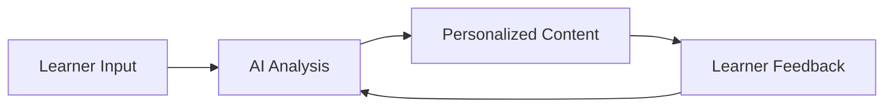
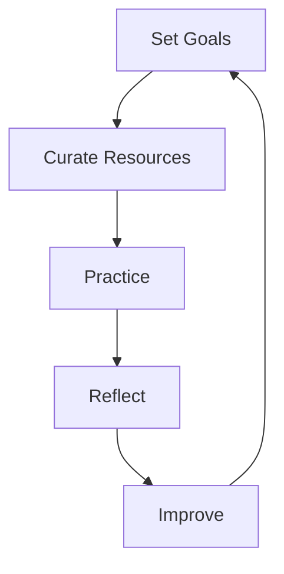

# mqd197f2u8oey0

# Personalization Strategies

## Introduction

**Personalization Strategies** are systematic approaches to tailoring learning experiences to individual needs, preferences, and goals. Unlike arbitrary customization, personalization is evidence-based, leveraging learning science to optimize effectiveness, efficiency, engagement, retention, and long-term mastery. It balances individual preferences with proven principles, ensuring adaptability and continuous improvement.

**Why Personalization Matters**: Personalization addresses unique learning styles, cognitive limitations, and motivations, making learning more engaging and effective. It bridges the gap between standardized systems and individual needs, fostering deeper understanding and skill development.

**Personalization vs. Customization**: Customization is learner-driven and often arbitrary, while personalization is informed by data, science, and goals. Personalization supports learning science rather than replacing it.

## What Is Personalized Learning

Personalized learning is a learner-centered approach that adapts content, pace, and methods to individual needs. It includes:

- **Adaptive Learning**: Systems adjust based on learner performance.
- **Individual Optimization**: Tailoring goals, resources, and workflows.
- **Learning System Design**: Creating flexible frameworks for growth.

**Example**: An AI-powered platform adjusts lesson difficulty based on quiz results, ensuring optimal challenge.

## Why Personalization Matters

- **Increased Engagement**: Learners stay motivated when content aligns with their interests.
- **Better Motivation**: Personalized goals and feedback drive persistence.
- **Improved Consistency**: Tailored workflows reduce procrastination.
- **Faster Skill Development**: Focused practice accelerates mastery.
- **Effective Learning Experiences**: Learners retain more by addressing their unique needs.

## The Science Behind Personalization

Personalization is rooted in learning science, considering:

- **Individual Differences**: Cognitive styles, prior knowledge, and motivation vary.
- **Cognitive Limitations**: Working memory and attention span differ.
- **Learning Goals**: Aligning strategies with specific outcomes.
- **Experience**: Leveraging past learning to inform new approaches.

**Relevant Concepts**: [Cognitive Load](?topic=Cognitive%20Load), [Working Memory](?topic=Working%20Memory), [Motivation](?topic=Motivation).

## What Should Be Personalized

Personalization applies to:

### Learning Goals
- **Example**: A programmer focuses on mastering Python for data analysis.

### Learning Paths
- **Example**: A self-paced course vs. a structured bootcamp.

### Learning Resources
- **Example**: Preferring interactive tutorials over textbooks.

### Learning Modalities
- **Example**: Visual learners use diagrams; auditory learners prefer podcasts.

### Learning Environments
- **Example**: Quiet libraries vs. collaborative coworking spaces.

### Practice Strategies
- **Example**: Deliberate practice for musicians; project-based learning for designers.

### Assessment Strategies
- **Example**: Self-testing for memorization; peer review for writing.

### Review Strategies
- **Example**: Spaced repetition for vocabulary; summarization for concepts.

### Productivity Systems
- **Example**: Pomodoro Technique for focus; time blocking for planning.

## Personalization vs Standardization

**Standardization** ensures consistency and scalability but lacks flexibility. **Personalization** enhances relevance but requires effort. The key is balancing both:

- **Benefits of Standardization**: Efficiency, clarity, and structure.
- **Benefits of Personalization**: Engagement, effectiveness, and mastery.

## Personalizing Learning Goals

Align goals with:

- **Career Goals**: Becoming a data scientist.
- **Academic Goals**: Completing a degree.
- **Skill Goals**: Learning a programming language.
- **Personal Development**: Improving time management.

## Personalizing Learning Resources

Choose resources based on preferences:

- **Books**: In-depth understanding.
- **Courses**: Structured learning.
- **Videos**: Visual and auditory learning.
- **Documentation**: Reference material.
- **Mentors**: Personalized guidance.
- **Communities**: Peer support.
- **AI Tools**: Adaptive learning and feedback.

## Personalizing Learning Modalities

Adapt to preferred styles:

- **Text**: Reading articles.
- **Visual**: Watching diagrams.
- **Audio**: Listening to podcasts.
- **Interactive**: Coding exercises.
- **Experiential**: Hands-on projects.

**Reference**: [Learning Modalities](?topic=Learning%20Modalities).

## Personalizing Learning Environments

Optimize physical, digital, and social spaces:

- **Physical**: Quiet room for focus.
- **Digital**: Minimalist interface for productivity.
- **Social**: Study groups for collaboration.

**Reference**: [Learning Environment Preferences](?topic=Learning%20Environment%20Preferences).

## Personalizing Study Workflows

Design routines for consistency:

- **Study Schedules**: Daily or weekly blocks.
- **Learning Routines**: Morning review sessions.
- **Review Cycles**: Weekly summaries.
- **Reflection Systems**: Journaling progress.

## Personalizing Practice Systems

Tailor practice methods:

- **Deliberate Practice**: Focused, goal-oriented repetition.
- **Project-Based Learning**: Real-world applications.
- **Problem-Based Learning**: Solving complex problems.
- **Skill Drills**: Repetitive exercises.
- **Simulations**: Immersive environments.

## Personalizing Knowledge Management

Organize learning effectively:

- **Note-Taking Systems**: Digital or physical notes.
- **Knowledge Bases**: Structured repositories.
- **Second Brain Systems**: Interconnected ideas.
- **Learning Journals**: Reflections and insights.
- **Digital Repositories**: Cloud-based storage.

## Personalizing Assessments

Evaluate progress with:

- **Self-Testing**: Flashcards or quizzes.
- **Quizzes**: Multiple-choice or short answers.
- **Projects**: Practical applications.
- **Peer Review**: Feedback from others.
- **Real-World Evaluation**: Applying skills in jobs.

## Data-Driven Personalization

Use data to optimize learning:

- **Learning Analytics**: Tracking progress.
- **Progress Tracking**: Visualizing milestones.
- **Performance Metrics**: Assessing skill levels.
- **Feedback Loops**: Continuous improvement.

## Adaptive Learning Systems

Systems that adjust in real-time:

- **Dynamic Learning Paths**: Based on performance.
- **Continuous Adjustment**: Personalized recommendations.
- **AI-Powered Adaptation**: Intelligent tutoring.

## Building A Personal Learning Operating System

A framework for holistic learning:

- **Goal Management**: Set and track objectives.
- **Resource Management**: Curate materials.
- **Practice Management**: Schedule deliberate practice.
- **Reflection Management**: Review progress.
- **Continuous Improvement**: Iterate based on feedback.

## Personalization Across Different Domains

**Examples**:

- **Programming**: Code challenges vs. documentation.
- **Data Science**: Interactive notebooks vs. lectures.
- **Business**: Case studies vs. theory.
- **Marketing**: Campaign simulations vs. textbooks.

## Personalization And Learning Science

Personalization aligns with:

- **Cognitive Load**: Avoiding overload.
- **Working Memory**: Chunking information.
- **Long-Term Memory**: Spaced repetition.
- **Schema Formation**: Building mental models.
- **Neuroplasticity**: Adapting to new learning.

## Personalization In The AI Era

AI enhances personalization:

- **AI Tutors**: Real-time feedback.
- **Adaptive Recommendations**: Tailored resources.
- **Personalized Feedback**: Specific guidance.
- **Risks**: Over-reliance on AI; loss of critical thinking.

## Risks Of Over-Personalization

- **Echo Chambers**: Limited exposure to diverse ideas.
- **Skill Gaps**: Avoiding challenging topics.
- **Reduced Adaptability**: Dependence on systems.

## Continuous Learning Optimization

- **Reflection**: Assess what works.
- **Feedback**: Seek external input.
- **Experimentation**: Test new strategies.
- **Iterative Improvement**: Refine systems.

## Common Mistakes

- **Constantly Changing Systems**: Lack of consistency.
- **Over-Customization**: Ignoring proven methods.
- **Chasing Productivity Hacks**: Focusing on tools, not learning.

## Real-World Applications

**Examples**:

- **Education**: Personalized curricula.
- **Software Engineering**: Tailored coding challenges.
- **Business**: Custom leadership programs.

## Practical Framework For Personalizing Learning

1. **Assess Needs**: Identify goals and preferences.
2. **Curate Resources**: Select relevant materials.
3. **Design Workflows**: Create routines.
4. **Implement Practice**: Focus on deliberate practice.
5. **Evaluate Progress**: Use assessments and feedback.
6. **Optimize Continuously**: Refine strategies.

## Practical Action Plan

- **Beginner**: Start with goal setting and resource curation.
- **Intermediate**: Add practice systems and assessments.
- **Advanced**: Integrate AI tools and data-driven optimization.

## Summary

Personalization strategies enhance learning by tailoring goals, resources, modalities, and workflows to individual needs. Balancing personalization with learning science ensures effective, efficient, and engaging experiences.

## Key Takeaways

- Personalization optimizes learning by addressing individual differences.
- It should support, not replace, learning science.
- Effective personalization requires adaptability and continuous optimization.
- Balance standardization and customization for optimal results.

## Further Reading

- [Learning Science](?topic=Learning%20Science)
- [Self-Regulated Learning](?topic=Self-Regulated%20Learning)

## Related KnowHub Pages

- [Learning Preferences](?topic=Learning%20Preferences)
- [Learning Modalities](?topic=Learning%20Modalities)
- [Learning Environment Preferences](?topic=Learning%20Environment%20Preferences)
- [Learning Resource Preferences](?topic=Learning%20Resource%20Preferences)
- [Knowledge Management](?topic=Knowledge%20Management)
- [Personal Knowledge Management](?topic=Personal%20Knowledge%20Management)
- [Lifelong Learning](?topic=Lifelong%20Learning)