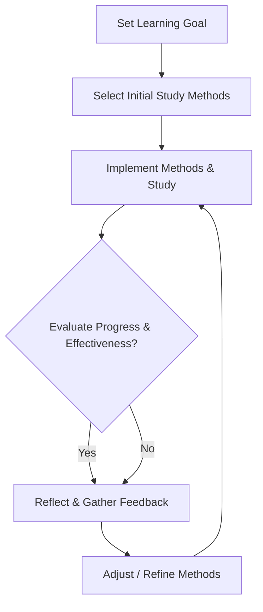
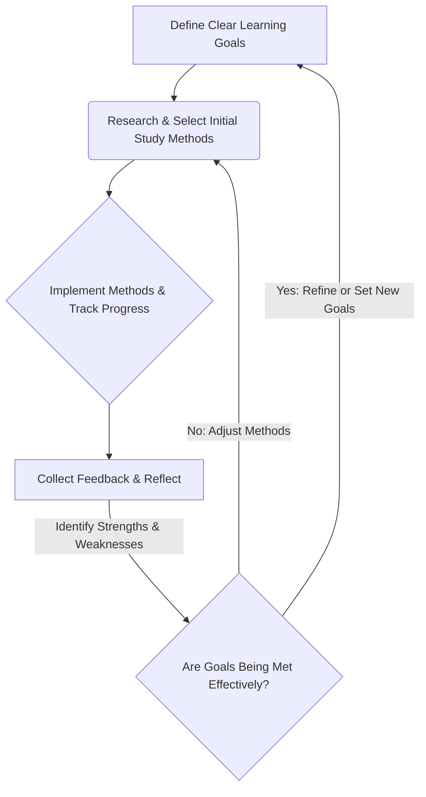

# mqd197f3sumykq

# Adapting Study Methods

Learning is not a static process. To truly excel and maintain a competitive edge in any field, from academic pursuits to professional development, the ability to adapt your study methods is paramount. This page explores why and how learners can adjust their approaches to maximize effectiveness, focusing on evidence-based strategies over rigid systems.

## Introduction

**Adapting Study Methods** refers to the dynamic process of consciously modifying your learning techniques, tools, and environments in response to changing goals, subjects, skill levels, contexts, and feedback. It's about moving beyond a one-size-fits-all approach to learning.

Why is this skill so critical?
*   **Flexibility in a Dynamic World:** The landscape of knowledge and skills is constantly evolving. What works for one subject or goal might be counterproductive for another.
*   **Optimal Resource Utilization:** Adapting methods ensures you're using your time, energy, and cognitive resources most effectively for the specific challenge at hand.
*   **Beyond Fixed Systems:** Rigid study systems, while sometimes offering a starting point, often fail because they don't account for individual differences, subject nuances, or the evolving nature of a learner's journey. Blindly following a generic system can lead to frustration and inefficiency.
*   **The Core of Lifelong Learning:** The capacity to adapt your learning strategies is fundamental to becoming a lifelong learner, enabling continuous growth and mastery throughout your personal and professional life. It fosters resilience and self-efficacy in the face of new challenges.

## What Are Study Methods?

**Study methods** are the specific strategies, techniques, and approaches individuals employ to acquire, process, understand, retain, and apply information and skills. They are essentially your toolkit for learning.

*   **Definition:** Organized procedures or techniques used to facilitate learning.
*   **Purpose:** To optimize the learning process, making it more efficient, effective, and often more enjoyable.
*   **Learning Workflows:** Study methods often form part of larger learning workflows, which encompass how you plan, execute, and review your learning activities.
*   **Study Systems:** A combination of several study methods, often structured around a particular philosophy or goal (e.g., "The Pomodoro Technique" is a time management method that can support various study activities).
*   **Knowledge Acquisition Strategies:** These include reading, listening, watching, active recall, note-taking, summarizing, and practicing.

**Examples:**
*   **Reading a textbook chapter:** A basic method.
*   **Creating flashcards for key terms:** A specific technique.
*   **Discussing a concept with a peer:** A collaborative method.
*   **Working through practice problems:** An application-focused method.
*   **Teaching a concept to someone else:** A high-level synthesis and explanation method.

## Why Study Methods Must Adapt

No single study method is universally optimal. Effective learners understand that tailoring their approach significantly impacts learning outcomes.

*   **Different Learning Goals:**
    *   **Goal:** Pass an exam vs. **Method:** Memorization via flashcards and practice tests.
    *   **Goal:** Master a complex skill vs. **Method:** Deliberate practice, guided mentorship, project-based application.
*   **Different Subjects:**
    *   **Subject:** History vs. **Method:** Reading, synthesizing, timeline creation, essay writing.
    *   **Subject:** Calculus vs. **Method:** Problem-solving, step-by-step derivation, visual aids for concepts.
*   **Different Skill Levels:**
    *   **Beginner:** Needs foundational understanding, simplified explanations, step-by-step guidance.
    *   **Advanced:** Benefits from nuanced analysis, independent research, tackling complex edge cases.
*   **Different Environments:**
    *   **Quiet Library:** Conducive to deep focus, reading, and writing.
    *   **Busy Commute:** Suited for audio lectures, reviewing flashcards on a mobile app.
*   **Different Constraints:**
    *   **Time-poor:** Focus on high-impact methods like active recall and spaced repetition.
    *   **Resource-limited:** Utilize open-source materials, peer study groups.

## The Adaptive Learner Mindset

The foundation of effective adaptation is a specific mindset characterized by openness and self-reflection.

*   **Experimentation:** Willingness to try new techniques and observe their effectiveness without judgment. View failed experiments as data points, not personal shortcomings.
*   **Reflection:** Regularly pausing to evaluate "What worked well? What didn't? Why?" This meta-cognitive skill is crucial for identifying areas for adjustment.
*   **Continuous Improvement:** Learning is an iterative process. Embrace the idea that your methods can always be refined and optimized.
*   **Feedback-Driven Adjustment:** Actively seeking and incorporating feedback from various sources (self-assessment, peers, instructors, performance metrics) to inform changes to your approach.

*Figure 1: The Adaptive Learning Cycle*

## Matching Methods To Learning Goals

Your overarching goal dictates the most effective study approach.

### Knowledge Acquisition
*   **Goal:** To absorb and recall a large volume of factual information.
*   **Methods:** Active recall (flashcards, self-quizzing), spaced repetition, summarizing, outlining, re-reading with a specific question in mind, watching explanatory videos.

### Conceptual Understanding
*   **Goal:** To grasp the underlying principles, relationships, and "why" behind information.
*   **Methods:** Elaboration (explaining concepts in your own words), Feynman Technique (teaching the concept to an imaginary beginner), concept mapping, analogy creation, drawing diagrams, connecting new ideas to existing knowledge.

### Skill Development
*   **Goal:** To develop proficiency in a practical ability (e.g., coding, playing an instrument, public speaking).
*   **Methods:** Deliberate practice (focused, repetitive practice with immediate feedback), project-based learning, problem-based learning, simulation exercises, peer coding, mentorship.

### Exam Preparation
*   **Goal:** To perform well on specific assessments, often under time pressure.
*   **Methods:** Practice tests (timed conditions), retrieval practice (recalling information without notes), interleaving different topics, reviewing past errors, identifying knowledge gaps, creating cheat sheets (for the process of creating them, not just using them).

### Professional Certification
*   **Goal:** To pass an industry-recognized exam that validates specific knowledge or skills.
*   **Methods:** Official study guides, practice exams from the certification body, focused review on exam objectives, scenario-based problem solving, study groups with other candidates.

### Career Development
*   **Goal:** To acquire new skills or knowledge relevant to career advancement or transition.
*   **Methods:** Online courses (MOOCs), industry workshops, mentorship, shadowing, portfolio projects, continuous learning journals, networking, applying new skills directly in work projects.

### Research
*   **Goal:** To explore a topic deeply, synthesize information, and contribute new knowledge.
*   **Methods:** Critical reading, literature review, systematic note-taking (e.g., Zettelkasten), analytical writing, data collection and analysis, peer review, presenting findings.

### Project-Based Learning
*   **Goal:** To learn by actively engaging with and completing a complex project.
*   **Methods:** Breaking down tasks, iterative development, problem-solving, collaboration, continuous self-assessment, documentation, seeking feedback on deliverables.

## Adapting Study Methods By Subject

Different domains of knowledge often necessitate distinct learning strategies.

### Programming
*   **Methods:** Hands-on coding (small projects, exercises), debugging, reading documentation, code reviews, pair programming, understanding algorithms, visualizing data structures, contributing to open source, watching coding tutorials.
*   **Adaptation:** Focus shifts from syntax memorization (beginner) to understanding design patterns and complex architectures (advanced).

### Computer Science
*   **Methods:** Understanding theoretical concepts, proofs, algorithms, data structures, discrete mathematics, pseudocode, drawing system diagrams, solving logic puzzles.
*   **Adaptation:** Requires a blend of abstract thinking (theorems) and concrete application (implementing algorithms).

### Mathematics
*   **Methods:** Working through problems step-by-step, understanding derivations, visualizing concepts (graphs, geometry), explaining solutions, identifying common error patterns, practicing a variety of problem types.
*   **Adaptation:** Emphasis on problem-solving over memorization. Progressive difficulty is key.

### Science (e.g., Biology, Physics, Chemistry)
*   **Methods:** Experimentation (lab work), conceptual understanding through analogies, diagramming processes, active recall of definitions and formulas, problem-solving, understanding scientific method, data interpretation.
*   **Adaptation:** Often requires connecting theoretical models with observational data.

### Business
*   **Methods:** Case study analysis, financial modeling, market research, understanding economic principles, strategic thinking, presentation skills, communication, negotiation simulations.
*   **Adaptation:** Blends analytical skills with interpersonal and strategic thinking.

### Design
*   **Methods:** Sketching, prototyping, user testing, design critiques, understanding principles (e.g., UX/UI, graphic design), studying exemplars, using design software.
*   **Adaptation:** Highly iterative, feedback-intensive, and visually oriented.

### Language Learning
*   **Methods:** Immersion (listening, speaking, reading, writing), spaced repetition for vocabulary and grammar, practicing with native speakers, cultural context understanding, flashcards, language exchange partners.
*   **Adaptation:** Requires consistent, daily engagement across multiple modalities.

### Research
*   **Methods:** Reading peer-reviewed articles, critical analysis, synthesizing information, formulating hypotheses, designing experiments, data analysis, academic writing, presentation skills.
*   **Adaptation:** Emphasizes critical thinking, information literacy, and clear communication of complex ideas.

## Adapting Study Methods By Experience Level

Learning strategies evolve significantly as you gain experience.

### Beginners
*   **Characteristics:** Lack foundational knowledge, prone to cognitive overload, need clear structure.
*   **Methods:** Focus on foundational concepts, step-by-step instructions, simplified explanations, guided practice, frequent checks for understanding, chunking information. Prioritize understanding before memorization.
*   **Example:** Learning to code, a beginner focuses on syntax, basic data types, and simple functions through guided tutorials and small exercises.

### Intermediate Learners
*   **Characteristics:** Have a grasp of basics, can connect some concepts, begin to self-regulate.
*   **Methods:** Transition to more independent learning, tackle moderately complex problems, start applying knowledge in small projects, seek connections between topics, identify and address knowledge gaps, use spaced repetition for longer-term retention.
*   **Example:** An intermediate coder moves beyond tutorials to build a small personal project, experimenting with different libraries and debugging their own code.

### Advanced Learners
*   **Characteristics:** Strong conceptual understanding, can learn independently, capable of critical analysis.
*   **Methods:** Deep dive into specialized topics, engage in advanced problem-solving, critically evaluate information, contribute to discussions, mentor others, conduct independent research, explore edge cases, optimize performance.
*   **Example:** An advanced coder might contribute to open-source projects, optimize complex algorithms, or design system architectures.

### Experts
*   **Characteristics:** Deep, intuitive understanding, highly integrated knowledge, capable of innovation, often define new problems.
*   **Methods:** Continuous learning (staying current with new developments), experimentation, teaching, writing, presenting, cross-domain synthesis, pushing boundaries of existing knowledge, strategic thinking.
*   **Example:** A software engineering expert might publish papers, lead major architectural decisions, or innovate new programming paradigms.

## Adapting Study Methods Based On Learning Challenges

Learning is rarely a smooth process. Challenges are opportunities to adapt.

*   **Difficulty understanding concepts:**
    *   **Solution:** Change modality (video explanation, different textbook), seek analogies, draw diagrams, explain it to someone else (Feynman Technique), ask specific questions, break down complexity using progressive learning.
*   **Difficulty remembering information:**
    *   **Solution:** Implement active recall (flashcards, self-quizzing), spaced repetition, elaborate on the meaning, create memory palaces or mnemonics, relate new info to existing knowledge, explain it aloud.
*   **Lack of focus:**
    *   **Solution:** Use time management techniques (Pomodoro), remove distractions, change study environment, incorporate short breaks, practice mindfulness, ensure adequate sleep and nutrition.
*   **Lack of motivation:**
    *   **Solution:** Reconnect with your "why," set smaller achievable goals, reward progress, find a study partner, vary your methods, make learning more engaging (gamification, real-world application), take a short break to recharge.
*   **Information overload:**
    *   **Solution:** Prioritize key information, use effective note-taking (summarizing, concept mapping), chunk information, focus on understanding core principles before details, utilize mind maps to organize.
*   **Time constraints:**
    *   **Solution:** Ruthless prioritization, focus on high-impact study methods (retrieval practice, spaced repetition), utilize micro-learning opportunities (short bursts of study), leverage commute time for audio/flashcards.

## Adapting Study Methods To Different Learning Modalities

Learning preferences are about how you best *receive* information, but effective learning often requires engaging multiple modalities, especially those that challenge your preferred mode. For a deeper dive into preferences, refer to [Learning Preferences](?topic=Learning%20Preferences).

*   **Text-based learning (Reading):**
    *   **Methods:** Highlighting (selectively), summarizing, outlining, taking linear notes, active recall questions derived from text, re-reading with a specific purpose.
*   **Visual learning materials (Diagrams, videos, infographics):**
    *   **Methods:** Drawing your own diagrams, concept mapping, mind mapping, pausing videos to explain concepts aloud, converting visual info into verbal summaries, dual coding (combining text and visuals).
*   **Audio learning materials (Podcasts, lectures):**
    *   **Methods:** Active listening, summarizing main points immediately after, converting audio to text notes, listening at faster speeds to maintain focus, using audio for review during commutes.
*   **Interactive learning (Simulations, quizzes, discussions):**
    *   **Methods:** Engaging actively, asking questions, explaining reasoning, trying different scenarios, collaborating with peers, immediate feedback analysis.
*   **Hands-on learning (Experiments, coding, building):**
    *   **Methods:** Deliberate practice, trial and error, troubleshooting, documenting steps, reflecting on outcomes, applying theoretical knowledge to practical problems.

For more on how to leverage different sensory channels, see [Learning Modalities](?topic=Learning%20Modalities).

## Adapting Study Methods To Different Learning Environments

Your physical and digital environment significantly impacts focus and method selection. For more on preferences, see [Learning Environment Preferences](?topic=Learning%20Environment%20Preferences).

*   **Home learning:**
    *   **Methods:** Create a dedicated study space, manage distractions, set a schedule, use noise-canceling headphones, utilize self-discipline, plan for breaks.
*   **School or university:**
    *   **Methods:** Attend lectures actively, take notes in class, participate in discussions, utilize library resources, form study groups, seek out professors during office hours.
*   **Workplace learning:**
    *   **Methods:** Integrate learning with daily tasks, identify mentors, leverage company training resources, apply new skills in projects, seek feedback from colleagues, use micro-learning during breaks.
*   **Online learning:**
    *   **Methods:** Structure your own schedule, actively engage with discussion forums, set clear goals, combat isolation through virtual study groups, practice self-discipline, utilize online tools (e.g., flashcard apps, collaborative documents).
*   **Mobile learning (on the go):**
    *   **Methods:** Focus on bite-sized content, audio lectures, flashcard apps, review notes, short quizzes. Maximize small pockets of time effectively.

## Adapting Study Methods Using Learning Science

While methods adapt, the underlying principles of how our brains learn effectively remain constant. Evidence-based learning strategies should be integrated into *any* adaptive system. See [Learning Science](?topic=Learning%20Science) for a deeper dive.

*   **Active Recall (Retrieval Practice):** Consistently testing yourself on material without looking at notes. This strengthens memory traces.
    *   **Why it's effective:** It simulates the retrieval process required during exams and deepens understanding.
    *   **Adaptation:** Can be applied to flashcards, self-quizzing, summarizing from memory, practice problems.
*   **Spaced Repetition:** Reviewing information at increasing intervals over time.
    *   **Why it's effective:** Capitalizes on the "spacing effect" to combat the forgetting curve.
    *   **Adaptation:** Integrated into flashcard apps (Anki), personal review schedules.
*   **Interleaving:** Mixing different subjects or topics during a study session.
    *   **Why it's effective:** Improves the ability to differentiate between problem types and apply correct solutions, rather than just memorizing a sequence.
    *   **Adaptation:** Studying Chapter 1 math, then Chapter 3 history, then Chapter 2 math, etc.
*   **Elaboration:** Explaining and describing a concept in your own words, connecting it to prior knowledge.
    *   **Why it's effective:** Creates richer, more interconnected memory networks.
    *   **Adaptation:** Feynman Technique, concept mapping, teaching others, asking "why" and "how."
*   **Dual Coding:** Combining words with relevant visuals.
    *   **Why it's effective:** Engages both verbal and visual working memory, leading to a deeper understanding and better recall.
    *   **Adaptation:** Drawing diagrams while reading, illustrating notes, creating infographics.
*   **Deliberate Practice:** Focused practice on specific skills, with immediate feedback and targeted adjustments.
    *   **Why it's effective:** Specifically targets areas of weakness and pushes you slightly beyond your current comfort zone.
    *   **Adaptation:** Crucial for skill-based learning (e.g., programming, music, sports).

These principles are not study methods themselves, but underlying cognitive mechanisms that make any *chosen* study method more effective.

## Adapting Study Methods Based On Cognitive Load

Cognitive load refers to the total amount of mental effort being used in working memory. Managing it is crucial for effective learning. See [Cognitive Load](?topic=Cognitive%20Load) for details.

*   **Managing Complexity:** Break down complex information into smaller, manageable chunks.
    *   **Adaptation:** Don't try to understand an entire system at once. Start with a single component, master it, then move to the next.
*   **Breaking Down Information:** Before engaging with new, complex material, take time to understand its structure and identify key components.
    *   **Adaptation:** Outline a chapter before reading, preview lecture topics, or skim an article for headings and summaries.
*   **Progressive Learning:** Gradually introduce new information and complexity. Build from foundational concepts to advanced applications.
    *   **Adaptation:** A beginner programmer starts with "Hello World" before attempting to build a complex web application.

## Adapting Study Methods Based On Working Memory Limitations

Working memory is a temporary storage system that holds and processes information. It has a limited capacity. See [Working Memory](?topic=Working%20Memory) for details.

*   **Chunking:** Grouping individual pieces of information into larger, meaningful units.
    *   **Adaptation:** Instead of memorizing 10 random numbers, chunk them into 3-4 digit groups (e.g., a phone number). In coding, understand a function's purpose rather than individual lines of code.
*   **External Memory Systems:** Offloading information from working memory to external tools.
    *   **Adaptation:** Taking detailed notes, using mind maps, writing down a plan before solving a problem, using sticky notes, creating digital knowledge bases.
*   **Structured Note-Taking:** Organizing notes in a way that reduces cognitive load and aids retrieval.
    *   **Adaptation:** Cornell notes, concept maps, outlining, using templates for specific types of information.

## Adapting Study Methods For Long-Term Retention

True mastery means retaining information and skills over extended periods. See [Long-Term Memory](?topic=Long-Term%20Memory) for details.

*   **Knowledge Reinforcement:** Regularly revisiting and re-engaging with learned material to strengthen memory traces.
    *   **Adaptation:** Scheduled reviews, explaining concepts to others, applying knowledge in new contexts.
*   **Retrieval Schedules:** Implementing a systematic approach to spaced repetition and active recall.
    *   **Adaptation:** Using spaced repetition software (e.g., Anki), maintaining a review calendar, creating personal quizzes.
*   **Application and Transfer:** Actively seeking opportunities to apply learned knowledge and skills in different contexts.
    *   **Adaptation:** Working on projects, solving real-world problems, teaching, writing about the subject. This helps transfer knowledge from inert facts to useful, adaptable understanding.

## Adaptive Note-Taking Strategies

Note-taking is not just about recording; it's about processing and organizing information for later retrieval and understanding.

*   **Linear notes:** Standard bullet points or numbered lists.
    *   **Best for:** Beginners, capturing details quickly, lectures with clear structure.
    *   **Adaptation:** Can be enhanced with symbols, colors, and later summarization.
*   **Cornell notes:** Divides the page into main notes, cues, and summary sections.
    *   **Best for:** Active recall, summarizing, class lectures, textbook reading.
    *   **Adaptation:** Promotes active engagement during and after the lecture.
*   **Concept maps / Mind maps:** Visual representations of relationships between ideas.
    *   **Best for:** Conceptual understanding, seeing the "big picture," connecting disparate ideas, brainstorming.
    *   **Adaptation:** Excellent for visual learners and when dealing with complex, interconnected topics.
*   **Knowledge bases / Digital note systems:** Tools like Notion, Obsidian, Roam Research, Evernote.
    *   **Best for:** Long-term organization, cross-referencing, linking ideas, building a personal wiki, handling large volumes of information.
    *   **Adaptation:** Highly customizable for different subjects and learning styles, supports various media types.
*   **Sketchnoting:** Combining drawings, symbols, and text.
    *   **Best for:** Visual processing, creative engagement, remembering complex information in an engaging way.
    *   **Adaptation:** Can be highly personalized and makes note-taking a more active process.

## Adaptive Practice Strategies

Practice makes permanent, but *deliberate* practice makes perfect.

*   **Deliberate Practice:** Focused, structured practice with specific goals, immediate feedback, and repeated effort to improve performance on specific weaknesses.
    *   **Adaptation:** Essential for skill development (e.g., coding, playing an instrument, public speaking). Requires a feedback loop.
*   **Project-Based Learning (PBL):** Learning by actively engaging with and solving a real-world problem or creating a product.
    *   **Adaptation:** Highly effective for deep understanding, application of knowledge, and developing problem-solving skills.
*   **Problem-Based Learning (PBL):** Similar to project-based but often more focused on solving theoretical or case-study problems rather than creating a tangible output.
    *   **Adaptation:** Good for developing critical thinking, analytical skills, and applying conceptual knowledge.
*   **Simulations:** Replicating real-world scenarios to practice skills in a safe environment.
    *   **Adaptation:** Useful for high-stakes professions (e.g., medicine, aviation, software deployment), allowing error-making without real-world consequences.
*   **Real-world application:** Immediately applying learned concepts or skills in practical situations.
    *   **Adaptation:** The ultimate test of understanding and retention; bridges the gap between theory and practice.

## Adaptive Review Systems

Review is not just re-reading; it's an active process to reinforce learning.

*   **Daily reviews:** Quick check of notes from the day.
    *   **Purpose:** Reinforce immediate learning, identify immediate questions.
    *   **Adaptation:** Takes 5-10 minutes, helps consolidate short-term memory.
*   **Weekly reviews:** Deeper dive into concepts covered during the week.
    *   **Purpose:** Connect ideas across days, identify emerging gaps, prepare for future topics.
    *   **Adaptation:** Can involve summarizing, self-quizzing, or working through practice problems.
*   **Monthly reviews:** Broader look at the entire month's material.
    *   **Purpose:** Consolidate long-term memory, connect distant topics, prepare for major assessments.
    *   **Adaptation:** Ideal for spaced repetition, conceptual mapping of large domains.
*   **Performance reviews:** Critically evaluating your actual performance on tasks or exams.
    *   **Purpose:** Learn from mistakes, refine strategies for future performance.
    **Adaptation:** Analyze wrong answers, identify patterns of errors, adjust study focus.

## Feedback-Driven Improvement

Feedback is the compass of adaptive learning, guiding you towards more effective strategies.

*   **Self-assessment:** Regularly evaluating your own understanding and performance through self-quizzing, practice problems, or attempting to explain concepts without notes.
    *   **Adaptation:** Develops meta-cognition and self-awareness of strengths and weaknesses.
*   **Peer feedback:** Engaging with classmates, colleagues, or study partners to review each other's work or explain concepts.
    *   **Adaptation:** Provides diverse perspectives, exposes blind spots, and strengthens communication skills.
*   **Mentor feedback:** Receiving guidance and constructive criticism from more experienced individuals.
    *   **Adaptation:** Invaluable for professional development and mastering complex skills. Mentors can offer tailored advice and insights.
*   **Performance analytics:** Using data from online platforms, quizzes, or project outcomes to track progress and identify areas for improvement.
    *   **Adaptation:** Objective data helps pinpoint specific weaknesses and the effectiveness of current methods.

## Creating A Personal Adaptive Learning System

An adaptive learning system is a personalized workflow that continuously optimizes your learning.

1.  **Goal Setting:** Clearly define *what* you want to learn and *why*.
2.  **Method Selection (Hypothesis):** Based on your goal, subject, and current level, choose an initial set of study methods.
3.  **Progress Tracking:** Implement ways to measure your learning progress (e.g., quiz scores, project completion, understanding metrics).
4.  **Reflection & Feedback:** Regularly pause to reflect on your progress. What's working? What's not? Gather feedback from various sources.
5.  **Continuous Optimization:** Based on reflection and feedback, adjust your methods. This is where adaptation truly happens.

*Figure 2: The Personal Adaptive Learning System Cycle*

## Adapting Study Methods In The AI Era

Artificial intelligence is transforming learning, offering powerful tools for adaptation and personalization.

*   **AI tutoring:** Intelligent systems that provide personalized explanations, answer questions, and adapt to your learning pace and style.
*   **AI-generated explanations:** Tools that can simplify complex topics, provide analogies, or offer different perspectives based on your queries.
*   **AI-assisted practice:** Adaptive quizzes and exercises that target your specific weaknesses, adjusting difficulty based on performance.
*   **AI-assisted review:** Systems that personalize spaced repetition schedules and suggest optimal review times based on your forgetting curve.
*   **AI-assisted planning:** Tools that can help structure your learning path, recommend resources, and even suggest study methods based on your profile and goals.

**Benefits:** Increased personalization, efficiency, targeted practice, and access to learning resources.
**Risks:** Over-reliance on AI without critical thinking, potential for algorithmic bias, data privacy concerns, and the loss of human connection in learning. The adaptive learner must still maintain agency and critical evaluation.

## Common Mistakes

Avoiding these pitfalls is crucial for effective adaptation.

*   **Copying others blindly:** While learning from others is good, adopting their entire system without considering your own context, goals, and preferences often fails.
*   **Constantly switching methods:** "Shiny object syndrome" can lead to superficial engagement with many methods but mastery of none. Give methods enough time to demonstrate their effectiveness.
*   **Chasing productivity hacks:** Focusing solely on "hacks" without understanding underlying learning principles or your own cognitive processes leads to short-term gains but not deep learning.
*   **Ignoring evidence-based learning:** Neglecting principles like active recall and spaced repetition in favor of less effective methods (e.g., passive re-reading, highlighting everything).
*   **Overcomplicating systems:** An overly complex system can become a burden, diverting energy from actual learning to managing the system itself. Simplicity and effectiveness should be prioritized.

## Real-World Applications

Adaptive study methods are not just for students; they are a universal skill.

*   **Education:** Students adjust methods for different courses (e.g., hands-on lab work vs. theoretical humanities essays).
*   **Software Engineering:** Engineers learn new programming languages or frameworks by adapting their coding practice, documentation review, and project application methods.
*   **Business:** Professionals adapt their learning to master new market trends, financial regulations, or management techniques, often through case studies, simulations, and real-world project application.
*   **Research:** Researchers constantly refine their literature review, data analysis, and writing strategies based on the specific research question and disciplinary norms.
*   **Professional Development:** Individuals pursuing certifications (e.g., PMP, CFA) adapt their study plans to the specific exam format, content domains, and personal knowledge gaps.
*   **Lifelong Learning:** An individual learning a new hobby (e.g., photography) will adapt methods from watching tutorials to hands-on practice, critiquing their own work, and seeking feedback from experts.

## Practical Framework For Adapting Study Methods

Use this step-by-step framework to become a more adaptive learner:

1.  **Define Your Current Learning Challenge:** What are you trying to learn? What's your specific goal? What subject? What's challenging you?
2.  **Assess Your Current Approach:** How are you studying *right now*? What methods are you using?
3.  **Identify Inefficiencies/Challenges:** Where are you struggling? (e.g., forgetting facts, not understanding concepts, low motivation).
4.  **Brainstorm Alternative Methods:** Based on your goal, subject, skill level, and identified challenges, research 1-3 new or modified methods. Consider the sections above (e.g., "Matching Methods To Learning Goals," "Adapting Study Methods By Subject").
5.  **Hypothesize & Plan:** Choose one new method or a minor adaptation. Formulate a hypothesis: "If I try [new method] for [specific duration/task], then I expect [specific outcome] because [reason]."
6.  **Implement & Experiment:** Apply the chosen method consistently for a defined period (e.g., one week, one chapter).
7.  **Evaluate & Reflect:** After the experiment, compare your actual outcome to your expected outcome. Did it work? Why or why not? What feedback did you get?
8.  **Adjust & Iterate:**
    *   If successful, integrate the method or refine it further.
    *   If not successful, discard it, modify it, or try another method from your brainstormed list.
    *   Repeat the cycle.

## Practical Action Plan

Here's how to start adapting your methods, tailored to your experience level.

### Beginner Implementation Plan
1.  **Choose One Goal:** Pick a single, specific learning goal (e.g., "Understand basic Python syntax" or "Memorize 20 new vocabulary words").
2.  **Start Simple:** Begin with 1-2 evidence-based methods like active recall (flashcards) and spaced repetition (using an app like Anki for vocab, or self-quizzing for Python).
3.  **Track & Observe:** Spend a week using these methods. At the end of each day, briefly note what felt effective or ineffective.
4.  **Ask "Why?":** If something didn't work, reflect briefly: Was it the method, my environment, or my motivation?
5.  **Make One Change:** Based on your observation, make *one* small adjustment (e.g., "I'll try explaining the Python code aloud next time" or "I'll use images on my flashcards").

### Intermediate Implementation Plan
1.  **Analyze a Current Course/Project:** Identify a current learning area where you feel your methods could be improved.
2.  **Define a Specific Challenge:** Is it conceptual understanding, retention, or application?
3.  **Research 2-3 Adaptive Methods:** Look into methods specific to your challenge (e.g., if struggling with concepts, try concept mapping or the Feynman Technique; if with retention, try interleaving).
4.  **Design a Focused Experiment:** "For the next two weeks, I will apply [Method A] to [Subject X] and [Method B] to [Subject Y]. I will track my performance via [metric, e.g., quiz scores, project progress]."
5.  **Seek Feedback:** In addition to self-assessment, ask a peer or mentor for feedback on your understanding or application of skills.
6.  **Iterate Systematically:** Based on your two-week results and feedback, decide which methods to keep, refine, or discard, then plan your next experiment.

### Advanced Implementation Plan
1.  **Identify a Complex Learning Domain:** Choose an area requiring deep expertise or cross-disciplinary understanding.
2.  **Evaluate Current System:** Conduct a thorough audit of your entire learning workflow. What are the bottlenecks? Where are you reaching plateaus?
3.  **Integrate Advanced Strategies:** Experiment with deliberate practice in areas of weakness, implement a comprehensive adaptive review system, or explore advanced note-taking like a Zettelkasten for knowledge synthesis.
4.  **Leverage AI (Critically):** Integrate AI tools to enhance specific aspects (e.g., AI for summarizing complex papers, generating practice questions, or personalized content recommendations). Always critically evaluate AI outputs.
5.  **Mentor & Teach:** Actively teach or mentor others to solidify your own understanding and identify gaps in your knowledge. This is a powerful adaptive strategy.
6.  **Refine Your "Why":** Continuously revisit and refine your learning goals to ensure your adaptive system remains aligned with your evolving career and intellectual aspirations.

## Summary

Adapting study methods is a dynamic and essential skill for all learners, from beginners to seasoned professionals. It moves beyond rigid, one-size-fits-all approaches, recognizing that effective learning requires tailoring strategies to specific goals, subjects, skill levels, environments, and individual challenges. By cultivating an adaptive mindset of experimentation, reflection, and feedback-driven adjustment, learners can continuously optimize their approach, incorporating evidence-based principles from learning science. This adaptability is the cornerstone of lifelong learning and mastery in an ever-changing world.

## Key Takeaways

*   **Adaptability is Key:** No single study method works best for all situations. Effective learners constantly adjust their strategies.
*   **Mindset Matters:** Embrace experimentation, reflection, continuous improvement, and feedback-driven adjustment.
*   **Goals Dictate Methods:** Your learning objective (e.g., knowledge acquisition, skill development, exam prep) should guide your choice of methods.
*   **Context Influences Strategy:** Subjects, experience levels, learning environments, and cognitive challenges all require different approaches.
*   **Leverage Learning Science:** Always integrate evidence-based principles like active recall, spaced repetition, interleaving, and elaboration into your chosen methods.
*   **Manage Cognitive Load:** Break down complexity and use external memory systems to support your working memory.
*   **Practice Deliberately:** For skill development, focus on targeted practice with immediate feedback.
*   **Build a Personal System:** Develop a cycle of goal-setting, method selection, tracking, reflection, and continuous optimization.
*   **Use Feedback:** Actively seek and incorporate self-assessment, peer, mentor, and performance feedback.
*   **AI as an Enabler:** Utilize AI tools to enhance personalization and efficiency, but always maintain critical oversight.
*   **Avoid Pitfalls:** Don't blindly copy others, switch constantly, chase mere hacks, ignore science, or overcomplicate your system.

## Further Reading

(Consider adding specific book recommendations or research papers here if available within KnowHub's scope.)

## Related KnowHub Pages

*   [Learning Preferences](?topic=Learning%20Preferences)
*   [Learning Modalities](?topic=Learning%20Modalities)
*   [Learning Environment Preferences](?topic=Learning%20Environment%20Preferences)
*   [Learning Resource Preferences](?topic=Learning%20Resource%20Preferences)
*   [Personalization Strategies](?topic=Personalization%20Strategies)
*   [Learning Science](?topic=Learning%20Science)
*   [Cognitive Load](?topic=Cognitive%20Load)
*   [Working Memory](?topic=Working%20Memory)
*   [Self-Regulated Learning](?topic=Self-Regulated%20Learning)
*   [Study Techniques](?topic=Study%20Techniques)
*   [Long-Term Memory](?topic=Long-Term%20Memory)