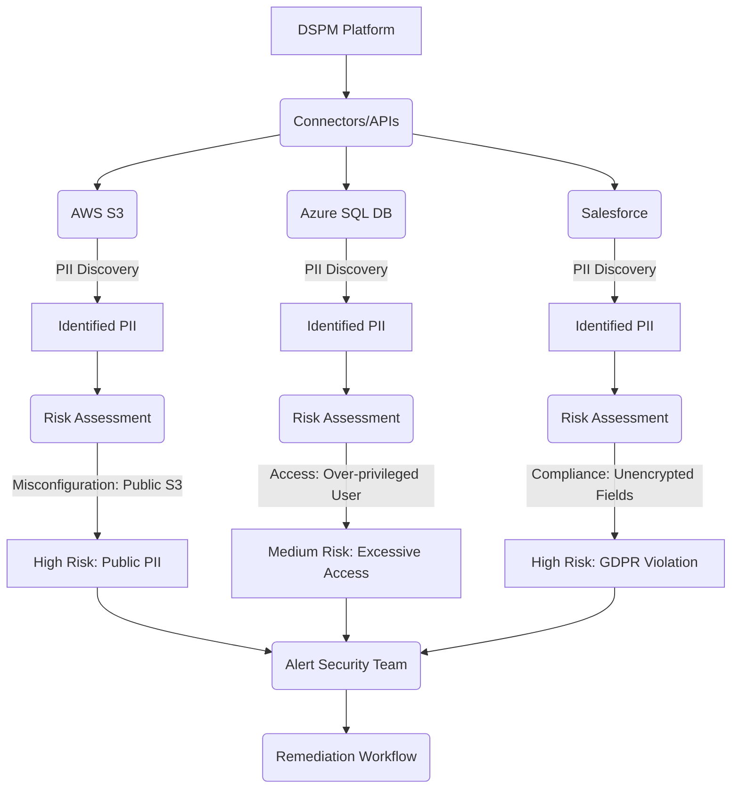

# DSPM (from Absolute Novice to Industry Standards level, style: Normal explanation)

# DSPM: From Novice to Industry Standards

In today's data-driven world, organizations collect, process, and store vast amounts of information across diverse environments – from on-premises databases to public cloud services and SaaS applications. While this data fuels innovation, it also introduces significant security and compliance risks. Enter Data Security Posture Management (DSPM).

This page will guide you from understanding what DSPM is and why it's crucial, through its core components and practical implementation, all the way to adopting industry-leading strategies and future trends.

## The Absolute Novice: Understanding the Basics

Let's start at ground zero. Imagine your organization's data as a massive, constantly growing library.

### What Problem Does DSPM Solve?

Without DSPM, your data landscape often looks like this:
*   **Unknown Books:** You don't know exactly what data you have, where it is, or how much of it is sensitive.
*   **Uncontrolled Access:** You're not sure who has access to which books, whether that access is appropriate, or if it's being used correctly.
*   **Hidden Risks:** Some books might be left out in the open, unencrypted, or have copies stored in insecure places you don't even know about.
*   **Compliance Headaches:** Auditors ask about specific types of books (e.g., "all books containing customer names and addresses"), and you have no quick way to tell them.

This "data sprawl" leads to an unmanageable security risk, potential data breaches, and non-compliance fines.

### What Does "DSPM" Stand For?

DSPM stands for **Data Security Posture Management**. It's a security discipline and a category of tools designed to help organizations gain visibility into their data assets, identify sensitive data, understand access patterns, detect misconfigurations, and assess data-related risks across their entire environment.

### Core Concepts

DSPM is built upon a few fundamental ideas:

1.  **Data Inventory:** You can't protect what you don't know you have. DSPM begins by discovering all data stores – databases, cloud buckets, SaaS apps, file shares – and the data within them.
2.  **Data Classification:** Not all data is equal. Sensitive data (like Personally Identifiable Information - PII, Payment Card Industry - PCI data, Protected Health Information - PHI, or intellectual property) requires stricter controls than public data. Classification tags data with its sensitivity level.
3.  **Data Risk Assessment:** Once you know what data you have and how sensitive it is, DSPM assesses the risks associated with it. This includes identifying misconfigurations, excessive permissions, unencrypted data, or data stored in unapproved locations.

## Stepping Up: Key Components and Functionality

Moving beyond the basics, let's explore the core capabilities of DSPM solutions.

### 1. Data Discovery & Classification

This is the foundation. DSPM tools automatically scan your data landscape to:
*   **Discover Data Stores:** Identify all data repositories across cloud platforms (AWS, Azure, GCP), SaaS applications (Salesforce, ServiceNow), and on-premises systems.
*   **Scan Data Content:** Dive into the actual data itself to identify specific types of sensitive information. This often involves:
    *   **Pattern Matching:** Regular expressions for credit card numbers, social security numbers.
    *   **Machine Learning (ML):** To understand context and identify complex data types like contracts or medical records.
    *   **Pre-built Classifiers:** For common regulatory categories (GDPR, HIPAA, CCPA).

**Example:** A DSPM solution identifies an unencrypted AWS S3 bucket containing files with customer email addresses, phone numbers, and home addresses, automatically classifying this as "Highly Sensitive PII."

### 2. Data Access Governance

Who can access your sensitive data, and under what conditions? DSPM provides answers by:
*   **Mapping Data Access Paths:** Understanding how users, roles, applications, and services interact with data.
*   **Identifying Excessive Permissions:** Flagging instances where users or roles have more access than they need (violating the principle of [Least Privilege](?topic=Principle%20of%20Least%20Privilege)).
*   **Monitoring Access Patterns:** Detecting unusual or unauthorized access attempts.

**Example:** Your DSPM tool alerts you that a developer account, usually only accessing non-production databases, suddenly has read/write access to a production database containing financial records.

### 3. Data Risk Assessment & Prioritization

DSPM goes beyond simply finding issues; it helps you understand their impact and urgency.
*   **Contextual Risk Scoring:** Combining data sensitivity with vulnerability severity, access exposure, and compliance relevance to provide a prioritized risk score.
*   **Misconfiguration Detection:** Identifying insecure settings in data stores (e.g., publicly accessible S3 buckets, unencrypted databases, weak authentication policies).
*   **Shadow Data Detection:** Finding data stores or copies of data that are unmanaged and unknown to IT/security teams.

**Example:** A publicly exposed S3 bucket containing "Highly Sensitive PII" would receive a much higher risk score than an internal share containing non-sensitive marketing materials, even if both had misconfigurations.

### 4. Compliance & Reporting

Meeting regulatory mandates like GDPR, CCPA, HIPAA, and PCI DSS requires specific controls around sensitive data. DSPM helps by:
*   **Automated Policy Enforcement:** Ensuring data adheres to defined security policies and regulatory requirements.
*   **Audit Readiness:** Generating reports that demonstrate compliance with various standards, detailing data classification, access controls, and risk remediation efforts.
*   **Data Subject Rights (DSR) Support:** While not directly executing DSR requests, DSPM's discovery capabilities are invaluable for locating all instances of a data subject's information.

### 5. Threat Detection & Response

DSPM continuously monitors your data environment for anomalous activities.
*   **Behavioral Anomaly Detection:** Identifying deviations from normal data access or usage patterns (e.g., a user downloading an unusually large volume of data).
*   **Integration with SIEM/SOAR:** Sending alerts to existing security operations tools for faster investigation and automated response.

## Practical Implementation: Getting Hands-On

Implementing DSPM involves a strategic approach.

### Deployment Models

DSPM solutions typically deploy in one or more ways:
*   **API-based:** Connects directly to cloud provider APIs, SaaS APIs, and database APIs to discover and classify data without agents. (Most common for cloud/SaaS.)
*   **Agent-based:** Installs lightweight agents on servers or endpoints to monitor file systems and databases. (More common for on-premise.)
*   **Network-based:** Monitors network traffic to identify data flows and sensitive data in transit. (Less common as primary DSPM, more for DLP integration.)

Most modern DSPM solutions rely heavily on API integration for comprehensive coverage across multi-cloud and SaaS environments.

### Integration with Existing Tools

For maximum effectiveness, DSPM integrates with your existing security ecosystem:
*   **[SIEM](?topic=SIEM%20-%20Security%20Information%20and%20Event%20Management):** Feeds security events and alerts for centralized monitoring and correlation.
*   **[IAM](?topic=IAM%20-%20Identity%20and%20Access%20Management):** Leverages identity data to understand who has access to what, and helps enforce policies.
*   **[DLP](?topic=DLP%20-%20Data%20Loss%20Prevention):** While DSPM focuses on posture, DLP focuses on preventing data from *leaving* controlled environments. They are complementary; DSPM identifies where DLP needs to be applied.
*   **[CSPM](?topic=CSPM%20-%20Cloud%20Security%20Posture%20Management):** DSPM is often seen as a specialized extension of CSPM, focusing specifically on data risks within cloud infrastructure.

### Defining Your Data Landscape

Before deploying, map out where your data resides:
*   **Cloud:** AWS S3, RDS, DynamoDB, Azure Blob Storage, SQL Database, Google Cloud Storage, BigQuery.
*   **SaaS:** Salesforce, Microsoft 365, ServiceNow, Workday.
*   **On-premises:** SQL Server, Oracle DB, file servers, SharePoint.

### Establishing Data Classification Policies

This is a critical step. Work with legal, compliance, and business owners to define:
*   What constitutes PII, PCI, PHI, confidential, internal, public data for *your* organization.
*   Which data stores are approved for certain types of data.
*   Retention policies for different data types.

### Setting Up Alerts and Automation

Configure DSPM to notify relevant teams immediately when critical risks are detected. Automation can include:
*   Automatically triggering a workflow to revoke excessive permissions.
*   Creating a ticket in your ITSM system for remediation.
*   Integrating with cloud security services to quarantine or encrypt data.

### Walkthrough Example: Protecting Customer Data in a Multi-Cloud Environment

Imagine a company, "TechCo," which stores customer PII in:
*   AWS S3 buckets (for customer uploads and backups)
*   Azure SQL Database (for core application data)
*   Salesforce (for CRM information)

Here's how DSPM would help TechCo:

**DSPM's Actions:**
1.  **Discover & Classify:** Scans all three platforms, identifies and tags customer names, emails, and payment info as "Sensitive PII."
2.  **Risk Assessment:**
    *   Finds an S3 bucket with PII that is accidentally public.
    *   Detects that a generic "Admin" role in Azure SQL has access to customer PII, but only a few specific users truly need it.
    *   Identifies unencrypted PII fields within Salesforce custom objects.
3.  **Prioritization:** Ranks the public S3 bucket and unencrypted Salesforce PII as high priority due to immediate exposure and compliance implications.
4.  **Alerting & Reporting:** Notifies the security team via SIEM, generates a compliance report for GDPR, and creates tickets for the cloud ops and Salesforce admin teams.
5.  **Continuous Monitoring:** Watches for new PII popping up in unapproved locations or any new over-privileged access grants.

## Industry Standards & Best Practices

To reach an industry-standards level, organizations must adopt advanced practices.

### Continuous Monitoring and Auditing

DSPM is not a one-time scan. Your data landscape is dynamic. Implement continuous monitoring to:
*   Track changes in data location, classification, and access.
*   Detect new data stores or shadow IT instances.
*   Ensure that remediation actions have been effectively implemented and maintained.
*   Regularly audit DSPM reports against your internal policies and external regulations.

### Shift-Left Security for Data

Integrate DSPM principles earlier in the development lifecycle.
*   **[DevSecOps](?topic=DevSecOps):** Incorporate data security checks into CI/CD pipelines. For example, scan infrastructure-as-code (IaC) templates to prevent the deployment of misconfigured data stores before they go live.
*   **Data by Design:** Ensure that data protection measures (encryption, access controls, classification) are considered from the initial design phase of applications and data services.

### Zero Trust Principles Applied to Data

Extend [Zero Trust](?topic=Zero%20Trust%20Architecture) beyond networks and identities to your data itself.
*   **Never Trust, Always Verify:** Assume no user, device, or application is inherently trustworthy, even within your network.
*   **Least Privilege Access:** Ensure users and applications only have the minimum necessary access to data for the shortest possible time. DSPM continuously validates this.
*   **Micro-segmentation:** Isolate sensitive data stores from broader network access.
*   **Continuous Authentication & Authorization:** Constantly re-evaluate access requests based on context (user, device, location, data sensitivity).

### Data Lifecycle Management with DSPM

DSPM should inform and support your organization's entire data lifecycle:
*   **Creation:** Ensure data is born into secure, classified environments.
*   **Storage:** Verify secure storage configurations and encryption.
*   **Usage:** Monitor access patterns and identify potential misuse.
*   **Sharing:** Ensure secure data transfer and appropriate permissions for shared data.
*   **Archiving/Deletion:** Confirm sensitive data is securely archived or properly disposed of according to retention policies.

### Measuring DSPM Effectiveness: KPIs

To demonstrate value and drive improvements, track key performance indicators:
*   **Number of Discovered Sensitive Data Stores:** Shows visibility.
*   **Percentage of Classified Sensitive Data:** Measures understanding of your data.
*   **Number of High-Risk Data Misconfigurations Remedied:** Tracks reduction in exposure.
*   **Time to Detect and Remediate Critical Data Risks:** Measures efficiency.
*   **Compliance Score Improvement:** Demonstrates regulatory adherence.
*   **Reduction in Data Access Violations:** Shows better access control.

### Choosing a DSPM Solution

When evaluating DSPM tools, consider:
*   **Coverage:** Does it support all your data environments (multi-cloud, SaaS, on-prem)?
*   **Discovery & Classification Accuracy:** How robust are its scanning and ML capabilities?
*   **Access Governance Depth:** Can it map complex access permissions across different platforms?
*   **Risk Contextualization:** Does it provide actionable, prioritized risks?
*   **Automation & Remediation:** How much can it automate policy enforcement and incident response?
*   **Integration:** How well does it integrate with your existing security and IT tools?
*   **Scalability:** Can it handle your current and future data volumes?

## Advanced Concepts and Future Trends

The DSPM landscape is evolving rapidly. Stay ahead by understanding these advanced areas:

*   **AI/ML for Smarter Data Intelligence:** Beyond basic pattern matching, AI/ML will provide deeper insights into data relationships, predict potential risks, and identify nuanced data types with greater accuracy. This includes understanding the *context* and *intent* behind data usage.
*   **Graph-based Data Relationships:** Visualize and analyze complex data dependencies and access paths in a graph database. This allows for identifying indirect access risks and understanding the blast radius of a data breach more effectively.
*   **Automated Remediation Workflows:** Moving beyond alerts, DSPM solutions will increasingly offer automated, policy-driven remediation actions (e.g., auto-encrypting an unencrypted bucket, revoking temporary excessive permissions).
*   **Consolidating Security Domains:** Expect DSPM to converge further with other security posture management solutions like [CSPM](?topic=CSPM%20-%20Cloud%20Security%20Posture%20Management) (Cloud Security Posture Management) and [CIEM](?topic=CIEM%20-%20Cloud%20Infrastructure%20Entitlement%20Management) (Cloud Infrastructure Entitlement Management) to provide a unified view of cloud and data risk.
*   **Data Sovereignty and Residency Enforcement:** With increasing global regulations, DSPM will play a larger role in ensuring data is stored and processed according to specific geographical requirements.

## Key Takeaways

*   **Visibility is Key:** DSPM's core value is providing comprehensive visibility into your entire data estate.
*   **Risk Prioritization:** It moves you from a reactive, overwhelming list of alerts to a prioritized, actionable list of data risks.
*   **Proactive Security:** DSPM is about managing your data security posture proactively, rather than reacting to breaches.
*   **Compliance Enabler:** It's an indispensable tool for meeting complex regulatory requirements related to data.
*   **Continuous Journey:** DSPM is not a one-time project but an ongoing process of monitoring, assessment, and improvement.
*   **Integrate and Automate:** For maximum effectiveness, DSPM should be integrated into your existing security tools and workflows, with automation for faster response.