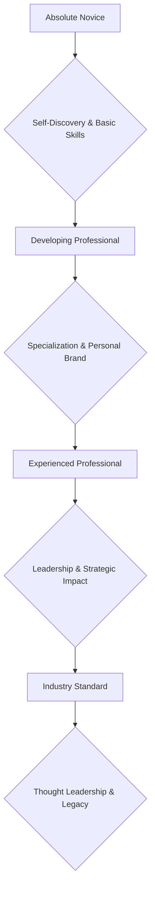

# Professional Career Development

# Professional Career Development

Professional career development is an ongoing process of improving your skills, knowledge, and experience to advance in your chosen field. It's about taking intentional steps to grow, adapt, and achieve your career aspirations. This journey is crucial for staying relevant, finding fulfillment, and maximizing your potential in the ever-evolving professional landscape.

---

## Absolute Novice: Starting Your Journey

At this stage, the focus is on self-discovery and laying the groundwork for future growth. You're exploring possibilities and understanding your foundational strengths.

### Key Actions:

*   **Self-Assessment:** Understand your interests, values, strengths, and weaknesses. What do you enjoy doing? What are you naturally good at? What causes or problems are you passionate about?
    *   *Example:* Creating a list of subjects you excelled at in school or hobbies you enjoy.
*   **Basic Goal Setting:** Define what success means to you, both personally and professionally. Set simple, achievable short-term goals.
    *   *Example:* "Complete an online course in a new software" or "Shadow someone in a role I'm interested in."
*   **Foundational Skill Building:** Identify essential skills for entry-level roles in your areas of interest (e.g., communication, basic software proficiency).
    *   *Example:* Practicing public speaking or improving your writing skills.
*   **Information Gathering:** Research different career paths, industries, and job roles. Talk to people already in those fields.
    *   *Example:* Conducting informational interviews with professionals.

---

## Developing Professional: Building Momentum

As a developing professional, you're actively seeking to expand your capabilities and establish your presence. This stage involves strategic learning and active engagement.

### Key Actions:

*   **Skill Specialization:** Move beyond foundational skills to develop expertise in specific areas relevant to your career path. This might involve advanced training or certifications.
    *   *Example:* Becoming proficient in a specific programming language, project management methodology, or marketing analytics tool.
*   **Networking:** Start building professional relationships. Attend industry events, join professional groups, and connect with peers and potential mentors.
    *   *Example:* Actively participating in LinkedIn discussions or attending local meetups related to your industry.
*   **Personal Brand Development:** Begin to define and project your professional identity. This includes optimizing your resume, LinkedIn profile, and developing an elevator pitch.
    *   *Example:* Consistently updating your LinkedIn profile with achievements and endorsements.
*   **Seeking Feedback:** Actively solicit constructive criticism from supervisors, peers, and mentors to understand areas for improvement.
    *   *Example:* Asking your manager, "What's one thing I could do differently to improve my performance on X project?"
*   **Mentorship:** Seek out a mentor who can provide guidance, advice, and support based on their experience.
    *   *Example:* Identifying an experienced professional whose career path you admire and asking them if they would be willing to offer advice occasionally.

---

## Experienced Professional: Leading and Contributing

At this level, you are making significant contributions to your organization and possibly taking on leadership roles. Your focus shifts towards strategic impact and guiding others.

### Key Actions:

*   **Leadership Development:** Cultivate skills in leading teams, managing projects, and influencing stakeholders. This often involves formal leadership training.
    *   *Example:* Taking on a team lead role or chairing a committee.
*   **Strategic Thinking:** Learn to connect your daily tasks to broader organizational goals. Contribute to strategic planning and problem-solving beyond your immediate responsibilities.
    *   *Example:* Proposing process improvements that align with the company's long-term objectives.
*   **Continuous Learning & Adaptation:** Stay abreast of industry trends, emerging technologies, and best practices. Be proactive in learning new skills that will be valuable in the future.
    *   *Example:* Attending advanced workshops, subscribing to industry journals, or pursuing a higher degree.
*   **Mentoring Others:** Share your knowledge and experience by mentoring junior colleagues. This refines your leadership and communication skills.
    *   *Example:* Guiding a new hire through their first major project.
*   **Conflict Resolution & Negotiation:** Develop advanced interpersonal skills to navigate complex situations and achieve mutually beneficial outcomes.
    *   *Example:* Mediating a disagreement between team members or successfully negotiating project resources.

---

## Industry Standard: Shaping the Future

Reaching industry standard means you are recognized as an expert and an innovator. You're not just participating in your field; you're helping to define its direction.

### Key Actions:

*   **Thought Leadership:** Share your expertise through presentations at conferences, publishing articles, or contributing to industry standards and best practices.
    *   *Example:* Speaking at a national conference on a specialized topic or authoring a white paper.
*   **Executive Presence:** Cultivate a strong executive presence, demonstrating confidence, clear communication, and gravitas in high-stakes situations.
    *   *Example:* Confidently presenting a strategic vision to senior leadership or a board of directors.
*   **Global Perspective:** Understand diverse markets, cultural nuances, and international business practices if relevant to your field.
    *   *Example:* Collaborating with international teams or advising on global market entry strategies.
*   **Strategic Impact & Innovation:** Drive significant organizational change, develop new products/services, or pioneer innovative solutions that have a broad impact.
    *   *Example:* Leading the development of a groundbreaking product line or implementing a new company-wide operational framework.
*   **Legacy Building:** Focus on how your contributions will leave a lasting positive impact on your organization, industry, or community.
    *   *Example:* Establishing a mentorship program, contributing to industry-wide initiatives, or developing future leaders.

---

## Career Development Journey

Here's a visual representation of the progression:

---

## Key Takeaways

*   **It's a Journey:** Career development is not a one-time event but a continuous process of learning and adaptation.
*   **Self-Awareness is Key:** Understanding your strengths, weaknesses, values, and interests is the foundation for effective development.
*   **Active Participation:** Don't wait for opportunities; seek them out. Actively pursue learning, networking, and new challenges.
*   **Feedback is a Gift:** Embrace constructive criticism as a tool for growth and improvement.
*   **Give Back:** Mentoring others and contributing to your industry are crucial steps in reaching higher levels of professional development.
*   **Stay Relevant:** The professional world evolves rapidly. Continuous learning is essential to remain valuable and effective.