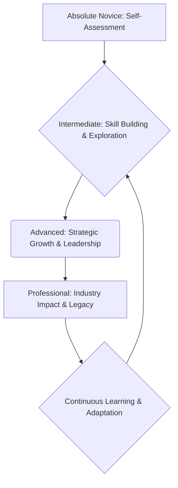

# Professional Career Development

# Professional Career Development

Professional career development is the ongoing process of improving your skills, knowledge, and experience to advance in your chosen field. It's not a one-time event, but a continuous journey that helps you achieve your career goals and adapt to a changing professional world.

## Why is Professional Career Development Important?

*   **Growth:** Helps you learn new things and take on bigger challenges.
*   **Adaptability:** Keeps your skills current in fast-changing industries.
*   **Opportunity:** Opens doors to promotions and new roles.
*   **Satisfaction:** Leads to greater job satisfaction and personal fulfillment.

---

## 1. The Foundation: Self-Assessment & Goal Setting (Novice)

Before you can develop your career, you need to understand yourself and what you want.

### Know Thyself

*   **Strengths:** What are you good at? What comes easily to you?
*   **Weaknesses (Areas for Development):** What skills could you improve? Where do you struggle?
*   **Interests:** What topics or activities genuinely excite you?
*   **Values:** What's important to you in a job or workplace (e.g., work-life balance, impact, creativity)?

**Tool:** A simple way to start is a personal SWOT analysis (Strengths, Weaknesses, Opportunities, Threats).

### Set Clear Goals

Once you understand yourself, define where you want to go. Use the SMART framework for goal setting:
*   **S**pecific: Clearly defined.
*   **M**easurable: You can track progress.
*   **A**chievable: Realistic and possible.
*   **R**elevant: Aligned with your overall career path.
*   **T**ime-bound: Has a deadline.

**Example:** Instead of "I want a better job," try "I will complete an online certification in data analytics by December 31st to qualify for junior analyst roles."

---

## 2. Exploring Paths & Building Skills (Intermediate)

With your foundation set, it's time to explore options and start building.

### Research Your Path

*   **Industries:** What industries align with your interests and values?
*   **Roles:** What specific job titles exist in those industries? What do they do daily?
*   **Requirements:** What skills, education, or experience do these roles typically require? Use job boards and informational interviews to find this out.

### Identify Key Skills

Look at your target roles and identify the most important skills. These usually fall into two categories:
1.  **Technical Skills:** Specific to a job (e.g., coding, financial modeling, graphic design).
2.  **Soft Skills:** Applicable to almost any job (e.g., Effective Communication, problem-solving, teamwork, Active Listening).

### Strategies for Skill Building

*   **Formal Education:** Degrees, certifications.
*   **Online Courses:** Platforms like Coursera, edX, Udemy.
*   **Workshops & Seminars:** Often offered by professional organizations.
*   **Mentoring:** Find someone experienced who can guide you.
*   **Personal Projects:** Apply what you learn by building something.
*   **Volunteer Work:** Gain experience in a lower-stakes environment.

### Build Your Professional Presence

*   **Resume/CV:** Tailor it to each job application.
*   **LinkedIn Profile:** A professional online presence is crucial. Connect with peers and industry leaders.
*   **Portfolio:** If applicable (e.g., design, writing, coding), showcase your work.

### Start Networking

Networking is about building genuine relationships.
*   Attend industry events (online or in-person).
*   Connect with people on LinkedIn.
*   Ask for informational interviews to learn about careers.

---

## 3. Strategic Growth & Advancement (Advanced)

Now you're actively working, and it's time to strategically plan your next moves.

### Continuous Learning & Adaptation

The professional world evolves. Staying relevant means continuous learning.
*   **Industry Trends:** Read publications, follow thought leaders.
*   **Upskilling/Reskilling:** Always be learning new tools and techniques.
*   **Seek Feedback:** Regularly ask colleagues and managers for feedback on your performance and areas for improvement.

### Performance & Feedback Loop

*   **Performance Reviews:** Use these to understand expectations and identify growth areas.
*   **Self-Reflection:** Regularly assess your own performance against your goals.
*   **Act on Feedback:** Make a plan to address constructive criticism.

### Mentorship & Sponsorship

*   **Mentors:** Offer advice, share experiences, and provide guidance.
*   **Sponsors:** Actively advocate for you, open doors, and champion your career. They are often more senior than mentors.

### Develop Leadership Skills

As you advance, leadership becomes more critical.
*   Take initiative on projects.
*   Volunteer to lead small teams.
*   Practice Time Management and delegation.
*   Focus on influence rather than authority.

### Navigate Career Challenges

*   **Plateauing:** If your career feels stuck, consider new projects, a different role within your company, or even a different company.
*   **Career Change:** It's never too late to pivot. Leverage transferable skills and be prepared to learn.

---

## 4. Becoming an Industry Leader (Professional)

Reaching the top tier involves more than just personal growth; it's about making a broader impact.

### Thought Leadership

*   **Share Expertise:** Write articles, give presentations, speak at conferences.
*   **Innovate:** Be at the forefront of new ideas and solutions in your field.
*   **Shape the Future:** Influence industry standards, best practices, and future direction.

### Impact & Influence

*   **Strategic Vision:** Contribute to the long-term direction of your organization or industry.
*   **Problem Solver:** Tackle complex, high-stakes challenges.
*   **Build Coalitions:** Collaborate effectively across different groups.

### Giving Back

*   **Mentor Others:** Share your knowledge and experience with emerging talent.
*   **Community Involvement:** Contribute to professional associations or broader community initiatives.
*   **Leave a Legacy:** Think about the lasting impact you want to make in your career and beyond.

---

## Career Development Journey

---

## Key Takeaways

*   **It's a Journey:** Professional career development is an ongoing, lifelong process.
*   **Start with Self:** Understand your strengths, weaknesses, interests, and values before anything else.
*   **Set SMART Goals:** Define clear, actionable objectives for your career.
*   **Continuous Learning:** Always be learning new skills, whether technical or soft.
*   **Network Strategically:** Build genuine professional relationships.
*   **Seek Feedback:** Actively solicit and act on feedback to improve.
*   **Give Back:** As you grow, help others rise.
*   **Adaptability is Key:** The professional landscape changes, so must you.