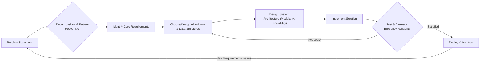

# 1. Universal Foundations

# 1. Universal Foundations

Every complex system, from a simple mobile app to a global network, is built upon a set of fundamental ideas. These are the "Universal Foundations" – core concepts that transcend specific programming languages, frameworks, or technologies. Understanding them makes you a more effective problem-solver, a faster learner, and a better engineer, no matter your specialization.

---

## What are Universal Foundations?

Think of Universal Foundations as the bedrock beneath any house. While the house itself might be a bungalow, a skyscraper, or a mansion (your specific tech field), the strength of its foundation determines its stability and longevity. These concepts equip you with the essential mental models to design, build, and understand any technical system.

---

## The Pillars of Computation (Beginner)

At the most basic level, computation revolves around a few key ideas:

### 1. Abstraction

Abstraction is the process of hiding complex details and showing only the essential information. It allows us to manage complexity by breaking down a system into simpler, more understandable parts.

*   **Example:** When you drive a car, you use the steering wheel and pedals without needing to understand the intricate mechanics of the engine, transmission, or braking system. The car provides an "abstracted" interface.
*   **In Tech:** A function in programming is an abstraction. You call it to perform a task (e.g., `print()`) without needing to know *how* it internally displays text on a screen.

### 2. Algorithms

An algorithm is a precise, step-by-step procedure or a set of rules used to solve a specific problem or perform a task. It's like a recipe for a computer.

*   **Example:** A recipe for baking a cake is an algorithm. It has defined steps, inputs (ingredients), and an expected output (a cake).
*   **In Tech:** Sorting a list of numbers, searching for an item in a database, or compressing a file all use specific algorithms. Learning about [Algorithms](?topic=Algorithms) is crucial.

### 3. Data Structures

Data structures are specialized ways of organizing and storing data in a computer so that it can be accessed and modified efficiently. The choice of data structure can significantly impact performance.

*   **Example:** A simple shopping list is a linear data structure. A family tree is a hierarchical (tree) data structure.
*   **In Tech:** Arrays, linked lists, trees, graphs, and hash tables are common [Data Structures](?topic=Data%20Structures). Each has strengths and weaknesses for different tasks.

### 4. Computational Thinking

This is a problem-solving process that involves expressing problems and their solutions in a way that a computer can execute. It involves four key elements:

*   **Decomposition:** Breaking down a complex problem into smaller, more manageable parts.
*   **Pattern Recognition:** Identifying similarities or trends among smaller problems to solve them more efficiently.
*   **Abstraction:** Focusing on the important information and ignoring irrelevant details.
*   **Algorithms:** Developing a step-by-step solution.

---

## Expanding Your Toolkit (Intermediate)

As you progress, these foundations take on deeper meaning, leading to more robust and efficient solutions.

### 1. Efficiency (Time and Space Complexity)

Not all algorithms or data structures are created equal. Efficiency refers to how fast an algorithm runs (time complexity) and how much memory it uses (space complexity).

*   **Why it matters:** An inefficient algorithm might take days to process data that an efficient one handles in seconds.
*   **Concept:** [Big O Notation](?topic=Big%20O%20Notation) is a mathematical notation that describes the limiting behavior of a function when the argument tends towards a particular value or infinity. It's used to classify algorithms according to how their run time or space requirements grow as the input size grows.

### 2. Modularity & Reusability

*   **Modularity:** Designing a system as independent, interchangeable components. Each module performs a specific, well-defined function.
*   **Reusability:** Building components or solutions that can be used again in different parts of the same system, or even in entirely different projects. This saves time and reduces errors.

### 3. Scalability & Reliability

*   **Scalability:** The ability of a system to handle a growing amount of work or its potential to be enlarged to accommodate that growth.
*   **Reliability:** The probability that a system will perform its intended function correctly and consistently over a specified period without failure. These are crucial considerations in [System Design](?topic=System%20Design).

---

## Crafting Professional Systems (Industry Standards)

At a professional level, you're not just applying these foundations; you're using them to make informed decisions and build maintainable, high-quality systems.

### 1. System Thinking

Understanding how individual components interact within a larger system. It involves looking beyond individual parts to see how they contribute to the overall function and behavior of the whole. This holistic view is vital for designing robust architectures.

### 2. Trade-offs

Every design decision involves compromises. You might trade:

*   **Performance for Simplicity:** A simpler solution might be slower but easier to maintain.
*   **Security for Convenience:** More stringent security measures often make a system less convenient to use.
*   **Development Speed for Future Scalability:** Rushing a solution might make it harder to scale later.
*   **Cost for Reliability:** Using cheaper infrastructure might lead to more downtime.

Recognizing and articulating these trade-offs is a hallmark of professional engineering.

### 3. Software Engineering Principles

These include widely accepted guidelines and best practices for building software, often incorporating the foundations mentioned above. Concepts like DRY (Don't Repeat Yourself), KISS (Keep It Simple, Stupid), and YAGNI (You Aren't Gonna Need It) are expressions of these principles, guiding you towards maintainable, efficient, and effective codebases. Explore more in [Software Engineering Principles](?topic=Software%20Engineering%20Principles).

### Problem-Solving Flow

---

## Key Takeaways

*   **Abstraction** simplifies complexity, making systems manageable.
*   **Algorithms** provide step-by-step solutions to problems.
*   **Data Structures** organize data for efficient access and modification.
*   **Computational Thinking** is the mental model for problem-solving.
*   **Efficiency (Big O)**, **Modularity**, **Scalability**, and **Reliability** are critical for robust systems.
*   **System Thinking** and understanding **Trade-offs** are essential for professional design.

Mastering these universal foundations will empower you to tackle any technical challenge, adapt to new technologies quickly, and build high-quality, sustainable solutions throughout your career.