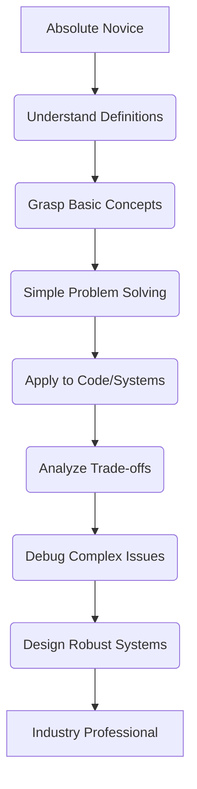

# 1. Universal Foundations

### 1. Universal Foundations

Every complex system, from a towering skyscraper to the most sophisticated software, relies on a strong, fundamental base. In the world of technology, this base is what we call **Universal Foundations**. These are the core concepts and principles that underpin almost everything we do, regardless of the specific tools, languages, or frameworks we use.

Understanding these foundations isn't just about memorizing facts; it's about developing a way of thinking that allows you to truly understand *how* technology works, *why* problems occur, and *how* to build robust, efficient solutions.

### Why Universal Foundations Matter

Without a solid grasp of these principles, you might find yourself:

*   **Struggling with new technologies:** Each new tool feels like starting from scratch.
*   **Debugging blindly:** Fixing symptoms without understanding the root cause.
*   **Building fragile systems:** Solutions that work only under specific, narrow conditions.
*   **Limited in problem-solving:** Unable to adapt existing knowledge to novel challenges.

With a strong foundation, you gain:

*   **Adaptability:** Quickly learn new languages, frameworks, and tools because you understand the underlying concepts.
*   **Deeper Insight:** Diagnose and solve complex problems more effectively.
*   **Innovation:** Design better, more efficient, and more scalable systems.
*   **Longevity:** Your skills remain relevant even as specific technologies change.

### The Pillars of Foundation

While the specific areas can vary, these are some of the most critical universal foundations:

#### 1. Logic & Computational Thinking

At its heart, technology is about solving problems through logical steps. This foundation teaches you how to:

*   **Break down complex problems:** Decompose a big challenge into smaller, manageable parts.
*   **Identify patterns:** Recognize similarities and structures in problems.
*   **Design algorithms:** Create step-by-step instructions to achieve a goal.
*   **Think abstractly:** Focus on the essential details and ignore irrelevant ones.
*   **Understand cause and effect:** Predict the outcome of a sequence of actions.

This is the mindset needed before writing a single line of code.

#### 2. Data Representation & Storage

Computers only understand electricity – on or off, 0 or 1. This foundation explores:

*   **Binary System:** How all information (numbers, text, images, sounds) is ultimately represented using just 0s and 1s.
*   **Data Types:** How different kinds of information (integers, floating-point numbers, characters) are stored and manipulated.
*   **Memory vs. Storage:** The difference between volatile (RAM) and non-volatile (hard drive, SSD) storage and their roles.
*   **Encoding:** How characters are mapped to binary values (e.g., ASCII, Unicode).

**Example:** When you see the letter 'A' on screen, the computer sees a specific binary sequence like `01000001` (in ASCII).

#### 3. Computer Architecture Basics

You don't need to be an electrical engineer, but a high-level understanding of how a computer's components interact is crucial:

*   **CPU (Central Processing Unit):** The "brain" that executes instructions.
*   **RAM (Random Access Memory):** Where the CPU stores data it's actively working on for quick access.
*   **Storage (Hard Drives/SSDs):** Where data is kept permanently.
*   **Input/Output (I/O) Devices:** How computers interact with the outside world (keyboard, mouse, screen, network card).
*   **The Bus:** The communication pathway between these components.

Understanding this helps you grasp concepts like performance bottlenecks or why some operations are faster than others.

#### 4. Networking Essentials

Modern systems are rarely isolated. This foundation covers how computers communicate:

*   **IP Addresses:** Unique identifiers for devices on a network.
*   **Ports:** Specific entry points for different services on a device.
*   **Protocols (e.g., HTTP, TCP/IP):** Rules that govern how data is exchanged.
*   **Client-Server Model:** The fundamental way many applications communicate.
*   **DNS (Domain Name System):** How human-readable website names (like `knowhub.com`) are translated into IP addresses.

This is critical for anything involving the internet, web applications, or distributed systems. You can learn more about this in [Networking Fundamentals](?topic=Networking%20Fundamentals).

#### 5. Operating System Fundamentals

The operating system (OS) is the software that manages computer hardware and software resources. Key concepts include:

*   **Process Management:** How the OS runs and manages multiple programs simultaneously.
*   **Memory Management:** How the OS allocates and deallocates RAM to different programs.
*   **File Systems:** How the OS organizes and stores files on storage devices.
*   **Resource Scheduling:** How the OS decides which program gets to use the CPU or other resources when.

Understanding the OS helps you optimize application performance and troubleshoot system-level issues. You can explore this further in [Operating Systems](?topic=Operating%20Systems).

### Bridging the Gap: Novice to Professional

Your journey through Universal Foundations evolves with your experience:

*   **Absolute Novice:** You can define what each foundation is and why it exists. You understand binary is 0s and 1s, an IP address identifies a device, and the CPU executes instructions.
*   **Intermediate:** You can explain these concepts in your own words, give simple examples, and see how they apply to basic problems. You can trace how data moves through a simple network or identify why a program might be slow due to memory access.
*   **Advanced:** You understand the trade-offs involved (e.g., speed vs. memory, local vs. network communication). You can debug issues by applying foundational knowledge and critically evaluate different approaches to a problem.
*   **Industry Professional:** You leverage deep foundational understanding to design scalable, efficient, and resilient systems. You can troubleshoot obscure issues, innovate solutions, and mentor others in core principles. You see the interconnectedness of all these foundations and can anticipate problems before they arise.

### Key Takeaways

*   **Universal Foundations are the bedrock:** They are the unchanging principles behind all technology.
*   **They empower adaptability:** Understanding *why* things work allows you to learn *how* new things work faster.
*   **Critical areas include:** Logic, Data Representation, Computer Architecture, Networking, and Operating Systems.
*   **Your understanding deepens with practice:** Move from definitions to application, analysis, and system design.
*   **Don't skip the "boring" parts:** These fundamentals are your long-term career investment.

Embrace these foundations, and you'll build a career that is resilient, adaptable, and truly impactful.