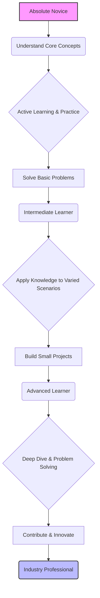

# 1.1. Learning Foundation

# 1.1. Learning Foundation

Welcome to KnowHub! This page is your first step on a journey from an absolute beginner to an industry-standard professional. Learning any new skill, especially in technology, requires a solid foundation. This isn't just about memorizing facts; it's about understanding *how* to learn effectively, building good habits, and developing the right mindset.

A strong learning foundation acts as the bedrock for all future knowledge. It ensures that when you encounter complex topics, you have the fundamental principles and learning strategies to tackle them successfully.

## Why a Strong Foundation Matters

Without a strong foundation, learning can feel like building a house on sand. You might grasp individual concepts, but connecting them, solving real-world problems, and adapting to new challenges becomes much harder. A solid foundation helps you to:

*   **Grasp complex topics faster:** By understanding core principles, new information slots into place more easily.
*   **Solve problems effectively:** You learn *how* to think, not just *what* to think.
*   **Retain knowledge long-term:** Effective learning strategies embed information deeper.
*   **Adapt to change:** Technology evolves rapidly; a strong foundation helps you pivot and learn new tools or languages efficiently.

## Core Principles of Effective Learning

These principles are universal, regardless of what you're trying to learn.

1.  **Active Learning:** Don't just passively consume information. Engage with it.
    *   **Example:** Instead of just watching a coding tutorial, type out the code yourself, experiment with changes, and try to break it to understand its limits. To delve deeper, explore [Active Learning Strategies](?topic=Active%20Learning%20Strategies).
2.  **Spaced Repetition:** Reviewing material at increasing intervals over time. This counteracts the "forgetting curve" and moves information from short-term to long-term memory.
    *   **Tip:** Briefly revisit key concepts after a day, then a few days, then a week, and so on.
3.  **Feedback Loops:** Actively seek feedback on your understanding and work. This helps you identify misunderstandings and areas for improvement.
    *   **Sources:** Peers, mentors, automated tests (for coding), self-reflection.
4.  **Practice and Application:** Knowledge is inert without practice. Apply what you learn in real-world scenarios, no matter how small.
    *   **Example:** If you learn about loops in programming, write a program that uses loops to solve a simple problem, like printing numbers from 1 to 10.
5.  **Understanding Over Memorization:** Focus on the *why* and *how* behind concepts, not just rote memorization of facts. When you understand the underlying principles, you can apply them in new situations.
    *   **Benefit:** This fosters true problem-solving ability rather than just recalling information.

## Building Your Learning Toolkit

Beyond principles, practical tools and habits enhance your learning journey.

*   **Effective Note-Taking:** Don't just copy. Summarize in your own words, connect ideas, and highlight key concepts. This active processing aids retention.
*   **Resource Utilization:** Learn to effectively use various resources:
    *   **Official Documentation:** The authoritative source for many technologies.
    *   **Tutorials and Courses:** Guided learning paths.
    *   **Forums and Communities:** Great for asking questions and seeing how others solve problems.
    *   **Books:** Often provide deeper, more structured knowledge.
*   **Setting Clear Goals:** Define what you want to achieve. Use the SMART criteria:
    *   **S**pecific: What exactly do you want to learn/do?
    *   **M**easurable: How will you know when you've achieved it?
    *   **A**chievable: Is it realistic?
    *   **R**elevant: Does it align with your larger goals?
    *   **T**ime-bound: When will you achieve it by?
    *   **Example:** Instead of "Learn Python," try "Complete the first 5 modules of the 'Python Basics' course and build a small calculator program by the end of the month."

## The Learning Journey: Novice to Professional

Your learning path will evolve as you progress. This diagram illustrates a common progression:

*   **Novice Stage:** Focus on foundational knowledge. Embrace active learning, make mistakes freely, and don't be afraid to ask basic questions. Your goal is broad understanding of core concepts.
*   **Intermediate Stage:** Start connecting different concepts, solving problems independently, and working on small projects. Seek constructive feedback and begin to identify your strengths and weaknesses.
*   **Professional Stage:** Master complex topics, contribute to larger projects, and potentially mentor others. Continuous learning becomes a habit, and you actively stay updated with industry trends and best practices. You can not only solve problems but also design solutions and innovate.

## Mindset for Success

Your attitude towards learning significantly impacts your success.

*   **Growth Mindset:** Believe that your abilities can be developed through dedication and hard work. See challenges as opportunities to grow, not as fixed limitations.
*   **Patience and Persistence:** Learning takes time. There will be frustrating moments and plateaus. Persistence through these challenges is key.
*   **Embrace Failure:** View mistakes and failures as valuable learning opportunities, not as setbacks. Debugging code is a form of learning from "failures."
*   **Self-Reflection:** Regularly assess your learning progress. What's working? What's not? Adjust your strategies as needed.

## Key Takeaways

*   A strong learning foundation is crucial for long-term success and adaptability in any field.
*   Prioritize **active learning, spaced repetition, feedback, practice, and understanding over memorization**.
*   Develop an effective learning toolkit: good note-taking, diverse resource utilization, and clear goal setting.
*   Your learning journey progresses from grasping basics (Novice) to applying knowledge (Intermediate) to mastering and innovating (Professional).
*   Cultivate a **growth mindset**, be **patient and persistent**, **embrace failure**, and practice **self-reflection**.