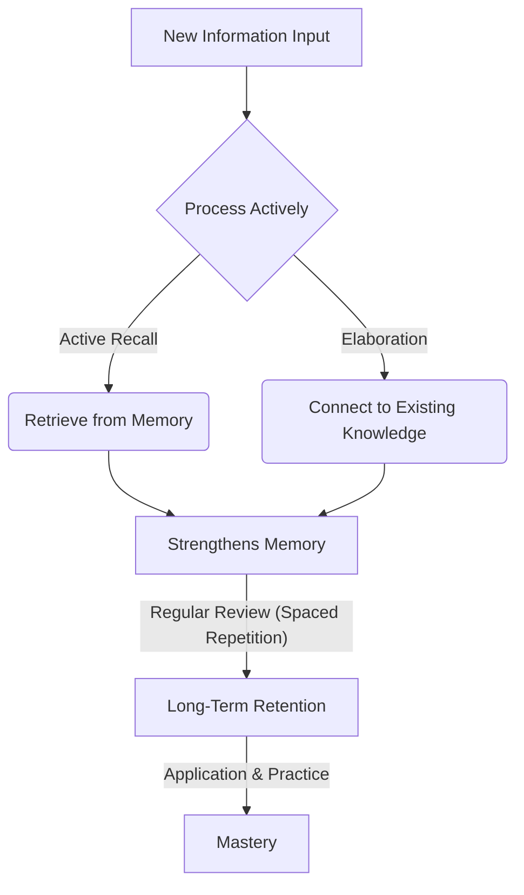

# A.2. The Science of Learning

# A.2. The Science of Learning

Welcome to the Science of Learning! This page will guide you through understanding how our brains learn best, from fundamental principles to advanced strategies for optimizing your continuous professional development.

## What is the Science of Learning?

The Science of Learning combines insights from psychology, cognitive science, and education to understand how people acquire, process, and retain information effectively. It's about moving beyond simply "studying" to "learning smart." Understanding these principles can transform your learning journey, making it more efficient, enjoyable, and enduring.

## Beginner: Core Principles for Effective Learning

At its heart, effective learning isn't just about how much time you put in, but *how* you use that time.

### 1. Active Recall

Instead of passively re-reading or highlighting, active recall involves retrieving information from your memory. This process strengthens neural connections, making it easier to remember the information later.

*   **How it works:** When you try to remember something, your brain works harder, reinforcing the memory trace.
*   **Examples:**
    *   After reading a paragraph, close the book and try to summarize it in your own words.
    *   Use flashcards to test yourself (without looking at the answer first).
    *   Explain a concept out loud to an imaginary listener or a pet.

### 2. Spaced Repetition

Our brains naturally forget information over time. Spaced repetition combats this by scheduling reviews of learned material at increasing intervals.

*   **How it works:** You review information just as you're about to forget it, which signals to your brain that this information is important to retain.
*   **Examples:**
    *   After learning a new concept, review it tomorrow, then in 3 days, then a week, then a month.
    *   Use digital tools like Anki or Quizlet, which automatically manage review schedules.

### 3. Elaboration

Elaboration means connecting new information to what you already know, forming a richer and more meaningful understanding.

*   **How it works:** When you elaborate, you're not just memorizing facts; you're building a network of interconnected ideas in your mind.
*   **Examples:**
    *   Ask "why" and "how" questions about the material.
    *   Create analogies or metaphors to explain a concept.
    *   Think about how new information relates to a real-world problem you've encountered.

## Intermediate: Deepening Your Learning Strategy

Once you've grasped the core principles, you can start optimizing your learning environment and mindset.

### 1. Cognitive Load Management

Cognitive load refers to the total amount of mental effort being used in your working memory. Too much load hinders learning.

*   **Intrinsic Load:** The inherent difficulty of the material itself.
*   **Extraneous Load:** Distractions or poor instructional design.
*   **Germane Load:** Mental effort directed at learning and schema formation (the "good" load).
*   **Strategy:** Minimize extraneous load (reduce distractions, break down complex topics) to maximize germane load. Focus on one task at a time.

### 2. Metacognition: Learning About Learning

Metacognition is "thinking about your thinking." It's your ability to monitor and regulate your own learning process.

*   **How to develop it:**
    *   **Plan:** Before starting, ask "What do I need to learn? What's the best strategy?"
    *   **Monitor:** During learning, ask "Am I understanding this? Is my current strategy working?"
    *   **Evaluate:** After learning, ask "How well did I learn this? What could I do differently next time?"
*   This skill helps you adapt and refine your learning approaches. You can learn more about this on our [Metacognition](?topic=Metacognition) page.

### 3. Growth Mindset

Embrace the belief that your abilities and intelligence can grow through dedication and hard work. A fixed mindset believes abilities are static.

*   **Impact:** A growth mindset encourages resilience in the face of challenges and promotes a love of learning. It transforms mistakes into learning opportunities.
*   This is a powerful concept for continuous improvement, detailed further in [Growth Mindset](?topic=Growth%20Mindset).

### 4. Interleaving

Instead of studying one topic extensively before moving to the next, interleaving involves mixing different but related topics during study sessions.

*   **Benefits:** It helps you discriminate between different concepts and choose the correct strategy for each problem, rather than just applying the same strategy repeatedly.
*   **Example:** When learning different programming paradigms, switch between practicing object-oriented, functional, and procedural approaches within the same study session, rather than spending a whole day on just one.

## Professional: Optimizing for Lifelong Learning

As you move towards professional expertise, the science of learning becomes crucial for not just personal development, but also for leading and designing learning experiences for others.

### 1. Designing Effective Training and Documentation

Apply these principles when creating learning materials, documentation, or training programs for your team or organization.

*   **For Instructors/Content Creators:**
    *   **Active Engagement:** Design activities that require active recall (quizzes, problem-solving, discussions).
    *   **Structured Repetition:** Suggest review schedules or provide mechanisms for spaced practice.
    *   **Clear Elaboration:** Use analogies, case studies, and real-world examples to help learners connect new concepts.
    *   **Manage Cognitive Load:** Break down complex topics into digestible chunks, use clear visuals, and minimize distractions in presentation.

### 2. Cultivating Learning Agility

In fast-paced professional environments, the ability to rapidly learn, unlearn, and relearn is paramount. This is often called learning agility.

*   **Components:**
    *   **People Agility:** Learning from others.
    *   **Mental Agility:** Handling complexity and new ideas.
    *   **Change Agility:** Being curious and proactive about change.
    *   **Results Agility:** Delivering results in new situations.
*   **Application:** Actively seek new challenges, reflect on failures, and continuously adapt your strategies based on what you learn.

### 3. Leveraging Tools and Systems

Integrate learning science principles into your daily workflow using technology.

*   **Knowledge Management Systems:** Tools like Notion, Obsidian, or dedicated wikis can be structured to support active recall and elaboration by linking ideas.
*   **Spaced Repetition Software:** Continue using tools like Anki for retaining technical facts, vocabulary, or important concepts.
*   **Mind Mapping/Concept Mapping:** Visually organize information to promote elaboration and understanding of relationships.

## Key Takeaways

*   **Active Learning is Key:** Don't just consume information; interact with it through active recall, elaboration, and interleaving.
*   **Space Out Your Study:** Combat forgetting with spaced repetition.
*   **Understand How You Learn:** Use metacognition to plan, monitor, and evaluate your learning strategies.
*   **Embrace Challenges:** A growth mindset turns obstacles into opportunities for deeper learning.
*   **Manage Your Mental Effort:** Break down complex tasks and minimize distractions to optimize cognitive load.
*   **Apply and Share:** The ultimate test of learning is your ability to apply knowledge and teach it to others.