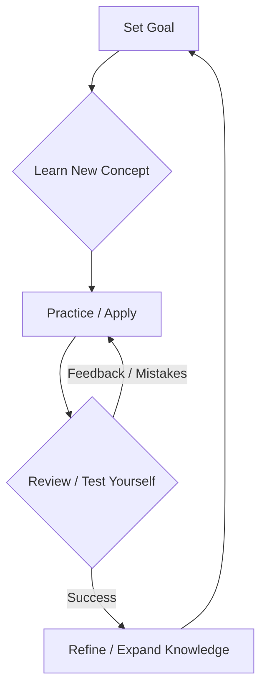

# 1.1. Learning Foundation

# 1.1. Learning Foundation

Welcome to KnowHub! This page is your starting point, designed to help you build a strong foundation for effective learning. Whether you're an absolute beginner or looking to sharpen your skills, understanding *how* to learn effectively is crucial for reaching industry standards.

## Why a Learning Foundation Matters

Learning isn't just about reading books or watching videos. It's an active process. A solid learning foundation helps you:
*   Learn faster and more efficiently.
*   Retain information longer.
*   Apply what you've learned in real-world situations.
*   Stay motivated and overcome challenges.

## 1. Set Clear Goals

Before you start, know where you're going. Goals act as your roadmap.

### SMART Goals
A common and effective way to set goals is using the SMART framework:
*   **S**pecific: What exactly do you want to achieve?
*   **M**easurable: How will you know when you've achieved it?
*   **A**chievable: Is it realistic to reach this goal?
*   **R**elevant: Does this goal align with your bigger objectives (e.g., reaching industry standards)?
*   **T**ime-bound: When do you want to achieve this by?

**Example:**
Instead of "Learn programming," try "Complete the 'Introduction to Python' course, including all exercises, by the end of next month."

## 2. Understand Effective Learning Strategies

Learning isn't just about repetition. These strategies will help you truly understand and remember.

### Active Recall
Instead of just re-reading notes, try to recall information from memory.
*   **How:** After reading a section, close your book and try to explain the main ideas in your own words. Use flashcards or create your own quiz questions.

### Spaced Repetition
Reviewing information at increasing intervals helps move knowledge from short-term to long-term memory.
*   **How:** Review a topic shortly after learning it, then a day later, then a few days later, a week later, and so on.

### Elaboration
Connect new information to what you already know, or explain it in detail.
*   **How:** Ask "why" and "how." Relate a new concept to an analogy or a personal experience. Try to teach the concept to someone else.

### Practical Application (Learning by Doing)
The best way to solidify your learning is to apply it.
*   **How:** If you're learning to code, write code. If you're learning a language, speak it. Build projects, solve problems, and get hands-on experience. This is critical for moving from novice to professional.

Here's a simplified view of the learning process:

## 3. Build a Consistent Routine

Consistency is more important than intensity when learning new skills.

*   **Schedule Learning Time:** Dedicate specific blocks in your day or week for learning. Treat these like important appointments.
*   **Pomodoro Technique:** Work intensely for 25 minutes, then take a 5-minute break. After four "Pomodoros," take a longer break. This helps maintain focus and prevent burnout.
*   **Create a Dedicated Space:** A quiet, organized learning environment can minimize distractions.
*   **Minimize Distractions:** Turn off notifications, close unnecessary tabs, and inform others of your learning time.

## 4. Seek Feedback and Adapt

Learning is an iterative process. You won't get everything right the first time, and that's okay!

*   **Ask for Feedback:** Share your work with peers, mentors, or online communities. Constructive criticism helps you identify blind spots and improve.
*   **Learn from Mistakes:** View errors as learning opportunities, not failures. Understand *why* something went wrong and how to correct it next time.
*   **Adjust Your Approach:** If a learning strategy isn't working, don't be afraid to try a new one. Be flexible and adapt based on your progress and challenges.

## 5. Maintain Motivation and Resilience

The path from novice to professional can be long and challenging.

*   **Celebrate Small Wins:** Acknowledge your progress, no matter how small. This boosts morale and keeps you going.
*   **Understand Plateaus:** There will be times when you feel stuck or like you're not progressing. This is normal. Push through with consistent effort.
*   **Take Breaks:** Rest is crucial for cognitive function and preventing burnout. Step away from your learning for a bit to recharge.
*   **Connect with Others:** A supportive community can provide encouragement and new perspectives. You can find more on this in [Community and Collaboration](?topic=Community%20and%20Collaboration).

---

## Key Takeaways

*   **Goals are your compass:** Set clear, SMART goals to guide your learning journey.
*   **Learn actively:** Use strategies like active recall, spaced repetition, and elaboration to truly understand.
*   **Practice makes perfect:** Apply what you learn through hands-on exercises and projects.
*   **Be consistent:** Regular, focused effort trumps sporadic, intense sessions.
*   **Embrace feedback:** See mistakes as learning opportunities and adjust your approach.
*   **Stay resilient:** Motivation waxes and wanes; consistency and self-care are key to long-term success.