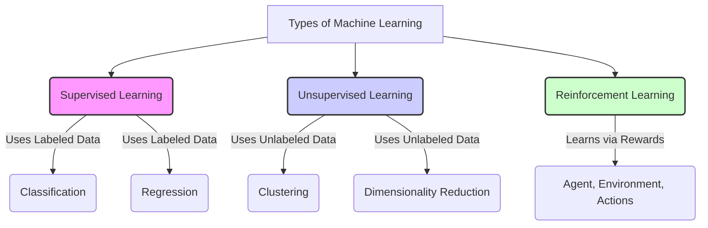

# A.4. Types of Learning

# A.4. Types of Learning

Machine Learning, a core field of [AI Concepts](?topic=AI%20Concepts), involves teaching computers to learn from data. But just as humans learn in different ways, machines also employ various learning paradigms. Understanding these different "types of learning" is fundamental to knowing which approach to use for a given problem.

This page will guide you through the primary categories of machine learning, from the most common to more advanced techniques, helping you understand their core principles, applications, and when to apply them.

## The Core Three Learning Types

Most machine learning tasks fall into one of three main categories, distinguished by how the model interacts with and learns from data.

### 1. Supervised Learning

**Concept:** In [Supervised Learning](?topic=Supervised%20Learning), the model learns from a dataset that is already "labeled." This means each piece of input data is paired with the correct output or "answer." Imagine a student learning from flashcards where each card has a question on one side and the answer on the other.

**How it Works:**
*   You provide the model with a large set of input-output pairs.
*   The model analyzes these pairs to find patterns and map inputs to outputs.
*   Once trained, it can predict outputs for new, unseen inputs.

**Examples:**
*   **[Classification](?topic=Classification):** Predicting a discrete category.
    *   *Example:* Identifying if an email is "spam" or "not spam."
    *   *Example:* Classifying an image as containing a "cat," "dog," or "bird."
*   **[Regression](?topic=Regression):** Predicting a continuous numerical value.
    *   *Example:* Predicting house prices based on features like size and location.
    *   *Example:* Forecasting stock prices based on historical data.

**Pros:** Highly accurate for well-defined problems with plenty of labeled data.
**Cons:** Requires large amounts of accurately labeled data, which can be expensive and time-consuming to obtain.

### 2. Unsupervised Learning

**Concept:** [Unsupervised Learning](?topic=Unsupervised%20Learning) deals with unlabeled data. The model is given raw input data and must find hidden patterns, structures, or relationships within it on its own. It's like a child exploring a new toy without instructions, trying to figure out how it works.

**How it Works:**
*   The model analyzes the intrinsic structure of the input data.
*   It groups similar data points, reduces complexity, or identifies underlying factors.
*   There's no "correct answer" for the model to learn from; it discovers inherent organization.

**Examples:**
*   **[Clustering](?topic=Clustering):** Grouping similar data points together.
    *   *Example:* Segmenting customers into different groups based on their purchasing behavior.
    *   *Example:* Identifying different types of news articles in a large corpus.
*   **[Dimensionality Reduction](?topic=Dimensionality%20Reduction):** Reducing the number of features in a dataset while retaining important information.
    *   *Example:* Simplifying complex gene expression data for visualization.
    *   *Example:* Compressing images without losing too much quality.

**Pros:** Can find hidden patterns that humans might miss, useful when labeling data is impractical or impossible.
**Cons:** Results can be harder to interpret and evaluate, and there's no clear "right" answer.

### 3. Reinforcement Learning

**Concept:** [Reinforcement Learning](?topic=Reinforcement%20Learning) is inspired by how humans and animals learn through trial and error. An "agent" learns to make decisions by performing actions in an "environment" and receiving "rewards" or "penalties" for those actions. The goal is to maximize cumulative reward over time.

**How it Works:**
*   An agent observes its environment and takes an action.
*   The environment changes state and provides a reward (or penalty) to the agent.
*   The agent uses this feedback to learn an optimal policy – a strategy for choosing actions that maximize future rewards.

**Examples:**
*   **Game Playing:** An AI agent learning to play Chess or Go by trying different moves and receiving rewards for winning.
*   **Robotics:** A robot learning to navigate a maze or pick up objects through trial and error.
*   **Self-driving Cars:** Learning optimal driving policies by interacting with a simulated environment.

**Pros:** Can solve complex sequential decision-making problems, learns without explicit supervision.
**Cons:** Requires a well-defined environment and reward function, often needs vast amounts of simulation or real-world interaction, which can be computationally intensive or risky.

### Visualizing the Core Types

## Advanced and Hybrid Learning Approaches

Beyond the core three, several other learning paradigms combine elements or address specific challenges, pushing machine learning closer to industry standards.

### 4. Semi-Supervised Learning

**Concept:** This approach bridges supervised and unsupervised learning. It uses a small amount of labeled data combined with a large amount of unlabeled data during training.

**Use Case:** When obtaining extensive labeled data is difficult or costly, but plenty of unlabeled data is available. The model can learn from the labeled data and then infer labels or patterns from the unlabeled data to improve its overall performance.

### 5. Self-Supervised Learning

**Concept:** A special form of unsupervised learning where the data itself generates the supervision signal (labels) for training. A model is trained on a "pretext" task where labels can be automatically derived from the input data.

**Use Case:** Pre-training large models, especially in Natural Language Processing (NLP) or computer vision. For example, predicting a masked word in a sentence (like in BERT) or predicting missing parts of an image. This allows models to learn powerful representations from vast amounts of unlabeled data, which can then be fine-tuned for downstream supervised tasks.

### 6. Transfer Learning

**Concept:** [Transfer Learning](?topic=Transfer%20Learning) involves reusing a pre-trained model (trained on a large dataset for a similar task) as a starting point for a new, related task.

**How it Works:** Instead of training a model from scratch, you take a model that has already learned general features (e.g., recognizing edges, shapes, or language patterns) and adapt it to your specific problem with a smaller dataset.

**Use Case:** Common in image recognition (e.g., using a model pre-trained on ImageNet to classify specific types of plants) or NLP (e.g., using a pre-trained language model for sentiment analysis). It saves computational resources and often achieves better performance with less data.

### 7. Active Learning

**Concept:** In [Active Learning](?topic=Active%20Learning), the learning algorithm can interactively query a human "oracle" (expert) to label new data points. The algorithm strategically selects the most informative unlabeled data points to ask for labels, aiming to achieve high accuracy with minimal labeling effort.

**Use Case:** Reducing the cost and time of data labeling when human expertise is required. For example, in medical imaging, where a doctor's input is needed to label rare conditions.

### 8. Online Learning

**Concept:** [Online Learning](?topic=Online%20Learning) (also known as incremental learning) involves training a model by processing data points one at a time or in small batches, updating the model incrementally as new data arrives.

**Use Case:** When dealing with streaming data, real-time systems, or datasets too large to fit into memory. It allows models to adapt to changes in data distribution over time (concept drift) without retraining the entire model.

### 9. Federated Learning

**Concept:** [Federated Learning](?topic=Federated%20Learning) is a decentralized machine learning approach that trains models on distributed datasets located on local devices (e.g., smartphones, hospitals) without needing to centralize the raw data. Only model updates (weights) are sent to a central server, ensuring data privacy and security.

**Use Case:** Training models on sensitive user data (e.g., predictive text on mobile keyboards, medical records) where privacy is paramount and data cannot be shared.

## Choosing the Right Learning Type (Industry Standards)

Selecting the appropriate type of learning is a critical first step in any machine learning project and often dictates the success of your solution. Professionals consider several factors:

1.  **Data Availability:**
    *   **Labeled Data:** If you have abundant, high-quality labeled data, [Supervised Learning](?topic=Supervised%20Learning) is usually the go-to.
    *   **Unlabeled Data:** If labels are scarce or non-existent, [Unsupervised Learning](?topic=Unsupervised%20Learning) or [Self-Supervised Learning](?topic=Self-Supervision) becomes necessary.
    *   **Mixed Data:** [Semi-Supervised Learning](?topic=Semi-Supervised%20Learning) can leverage both.
2.  **Problem Type:**
    *   **Prediction (known outcomes):** [Classification](?topic=Classification), [Regression](?topic=Regression) (supervised).
    *   **Pattern Discovery (unknown outcomes):** [Clustering](?topic=Clustering), [Dimensionality Reduction](?topic=Dimensionality%20Reduction) (unsupervised).
    *   **Sequential Decision-Making:** [Reinforcement Learning](?topic=Reinforcement%20Learning).
3.  **Computational Resources:** Some methods (like deep reinforcement learning) are very resource-intensive.
4.  **Privacy and Security:** For sensitive data spread across devices, [Federated Learning](?topic=Federated%20Learning) is essential.
5.  **Adaptability:** For evolving data streams, [Online Learning](?topic=Online%20Learning) is preferable.
6.  **Existing Models:** [Transfer Learning](?topic=Transfer%20Learning) can significantly speed up development and improve performance if pre-trained models are available for related tasks.

## Key Takeaways

*   **Supervised Learning** uses labeled data to predict outcomes (classification, regression).
*   **Unsupervised Learning** discovers patterns in unlabeled data (clustering, dimensionality reduction).
*   **Reinforcement Learning** agents learn through trial, error, and rewards in an environment.
*   **Hybrid methods** like Semi-Supervised and Self-Supervised Learning combine aspects to tackle specific data challenges.
*   **Advanced techniques** such as Transfer, Active, Online, and Federated Learning address efficiency, data scarcity, privacy, and adaptability.
*   Choosing the right learning type depends on your data, problem, and available resources.