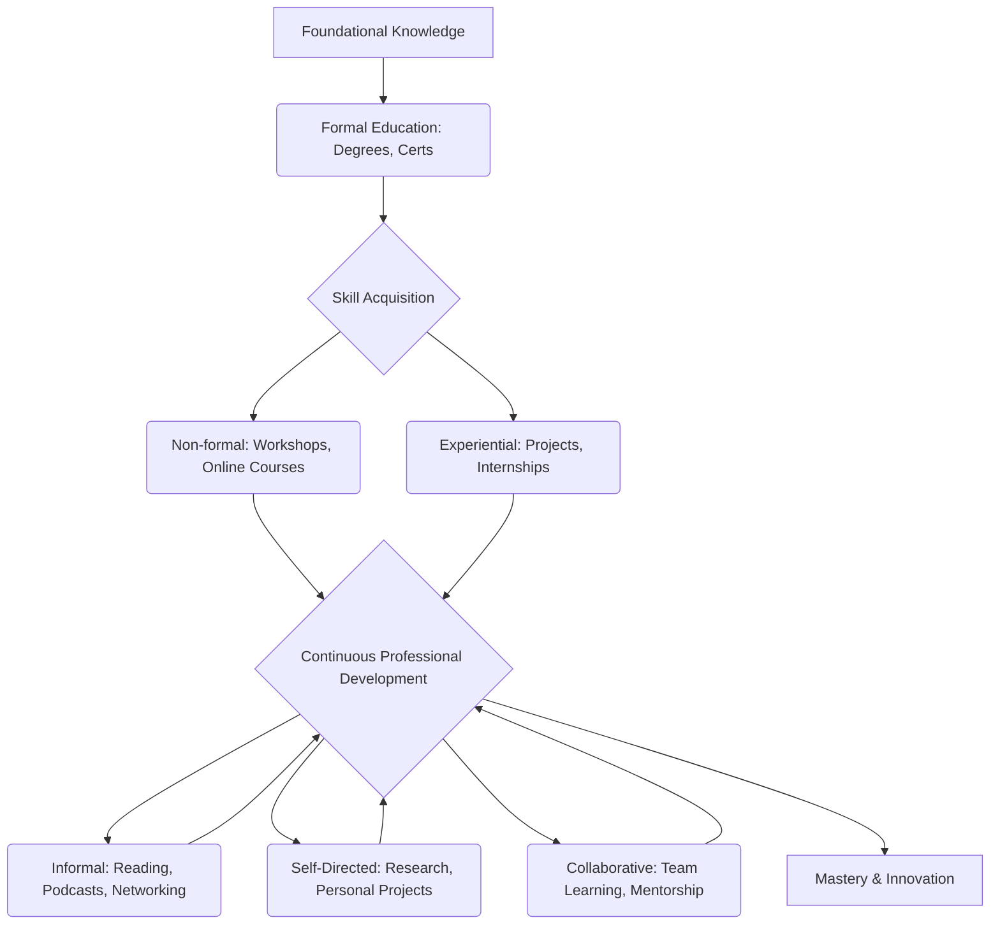

# A.4. Types of Learning

# A.4. Types of Learning

Understanding the different ways people learn is crucial for effective personal development and professional growth. This page will introduce you to the primary types of learning, helping you recognize how you acquire knowledge and skills, and how you can strategically leverage various methods throughout your life and career.

---

## 1. Formal Learning

Formal learning is structured and takes place within an organized institution, following a defined curriculum. It often leads to recognized qualifications or certifications.

*   **Characteristics:**
    *   Structured curriculum and syllabus.
    *   Taught by qualified instructors.
    *   Takes place in institutions (schools, universities, training centers).
    *   Often involves assessment and leads to official degrees, diplomas, or certificates.
*   **Examples:**
    *   Attending a university for a bachelor's degree.
    *   Enrolling in a vocational college for a trade certification.
    *   Completing a certified professional development course (e.g., Project Management Professional - PMP).
*   **Pros:** Provides foundational knowledge, structured progression, widely recognized credentials.
*   **Cons:** Can be rigid, expensive, and time-consuming.

## 2. Non-formal Learning

Non-formal learning is structured but happens outside the traditional formal education system. It's often voluntary and focuses on practical skills or specific knowledge.

*   **Characteristics:**
    *   Organized and structured but not tied to formal institutions or degrees.
    *   Often shorter in duration and focused on specific skills or topics.
    *   No formal curriculum or strict assessment, but may offer certificates of completion.
    *   Voluntary and learner-driven.
*   **Examples:**
    *   Attending a coding bootcamp.
    *   Taking an online course on platforms like Coursera or Udemy (without seeking formal credit).
    *   Participating in a community workshop on public speaking.
    *   Signing up for a company-provided training session on new software.
*   **Pros:** Flexible, often less expensive, skill-focused, quicker to implement.
*   **Cons:** Credentials may not be universally recognized, quality can vary.

## 3. Informal Learning

Informal learning is unstructured and often unintentional. It occurs naturally through daily activities, experiences, and interactions. It's how we learn most of what we know in life.

*   **Characteristics:**
    *   Unplanned and spontaneous.
    *   Occurs through daily experiences, observations, and interactions.
    *   No set curriculum, teacher, or assessment.
    *   Highly personal and contextual.
*   **Examples:**
    *   Reading articles, blogs, or books out of personal interest.
    *   Watching documentaries or educational videos on YouTube.
    *   Learning a new recipe by trial and error in the kitchen.
    *   Observing a colleague solve a problem and applying that knowledge later.
    *   Participating in online forums or discussion groups.
*   **Pros:** Continuous, highly relevant to personal needs, often free, integrated into daily life.
*   **Cons:** Knowledge acquisition can be fragmented, difficult to track or demonstrate, potential for misinformation.

---

## 4. Experiential Learning

Experiential learning is the process of learning through "doing" and then reflecting on that experience. It's often considered a cycle: experience, reflect, conceptualize, experiment.

*   **Characteristics:**
    *   Involves direct engagement with an activity or task.
    *   Emphasizes reflection on the experience to draw insights.
    *   Focuses on practical application of knowledge.
    *   Highly effective for developing skills and understanding complex situations.
*   **Examples:**
    *   An internship where you apply classroom knowledge to real-world tasks.
    *   Leading a project at work and learning from successes and failures.
    *   Practicing a new skill (e.g., playing an instrument, coding) and refining it based on feedback.
    *   Volunteering for a cause and understanding community dynamics firsthand.
*   **Pros:** Deep understanding, skill development, increased retention, builds confidence.
*   **Cons:** Can be time-consuming, potential for mistakes, requires an environment where experimentation is possible.

## 5. Self-Directed Learning

Self-directed learning (SDL) is when individuals take the initiative and responsibility for their own learning. They diagnose their learning needs, formulate learning goals, identify resources, choose and implement learning strategies, and evaluate learning outcomes.

*   **Characteristics:**
    *   Learner-initiated and controlled.
    *   High degree of autonomy and motivation.
    *   Can incorporate elements of formal, non-formal, and informal learning.
    *   Crucial for lifelong learning and professional adaptability.
*   **Examples:**
    *   Deciding to learn a new language using apps and online resources.
    *   Researching a complex topic independently to solve a work problem.
    *   Creating a personal reading list to deepen knowledge in a specific field.
    *   Practicing interview skills using mock scenarios you design.
*   **Pros:** Highly personalized, efficient, fosters independence and critical thinking.
*   **Cons:** Requires strong self-discipline, can be isolating, may lack external validation or structured feedback.

## 6. Collaborative Learning

Collaborative learning involves individuals working together in groups to achieve a common learning goal. It leverages diverse perspectives and shared problem-solving.

*   **Characteristics:**
    *   Interaction and cooperation among learners.
    *   Shared responsibility for learning outcomes.
    *   Benefits from diverse viewpoints and skills.
    *   Often involves discussion, debate, and peer teaching.
*   **Examples:**
    *   Participating in a study group for an exam.
    *   Working on a team project at university or in a professional setting.
    *   Joining a professional community of practice or a mastermind group.
    *   Mentoring or being mentored by a colleague.
*   **Pros:** Develops communication and teamwork skills, exposes learners to new perspectives, fosters deeper understanding, builds professional networks.
*   **Cons:** Can be challenging to manage group dynamics, unequal participation, potential for "groupthink."

---

## The Holistic Learning Journey: Beginner to Professional

As a beginner, your learning journey often starts with a heavy reliance on formal education to build foundational knowledge. As you progress into a professional role, the blend of learning types shifts dramatically.

*   **Beginner Stage:** Heavily reliant on **Formal Learning** (e.g., degrees, certifications) and initial **Non-formal Learning** (e.g., introductory workshops) to establish core competencies.
*   **Intermediate Stage:** Increased use of **Experiential Learning** (e.g., projects, internships) and **Self-Directed Learning** (e.g., personal research, online courses) to specialize and solve real-world problems. **Collaborative Learning** becomes essential in team settings.
*   **Professional Stage:** Continuous **Informal Learning** (e.g., staying updated with industry news, peer discussions) and **Self-Directed Learning** are paramount for staying relevant. **Experiential Learning** through challenging assignments and **Collaborative Learning** in leadership or mentorship roles drive advanced development.

These types are not mutually exclusive; they often overlap and complement each other. A successful learner strategically combines them to meet their goals.

## Choosing the Right Learning Type

The best learning approach depends on your specific goals, learning style, available resources, and the nature of what you want to learn.

*   **For foundational knowledge or recognized credentials:** Prioritize Formal Learning.
*   **For specific skills or quick updates:** Non-formal or Self-Directed Learning is often ideal.
*   **For practical application and deep understanding:** Focus on Experiential Learning.
*   **For continuous growth and adaptability:** Embrace Informal and Self-Directed Learning.
*   **For problem-solving, teamwork, and diverse perspectives:** Leverage Collaborative Learning.

Professionals often adopt a "blended learning" approach, intelligently combining various types to create a comprehensive and effective learning strategy.

---

## Key Takeaways

*   **Formal Learning** provides structured foundational knowledge and credentials.
*   **Non-formal Learning** offers structured skill development outside traditional institutions.
*   **Informal Learning** is continuous, often unintentional, and deeply integrated into daily life.
*   **Experiential Learning** focuses on learning by doing and reflecting on direct experiences.
*   **Self-Directed Learning** puts the learner in control of their own learning journey.
*   **Collaborative Learning** leverages group interaction for shared knowledge acquisition.
*   Effective learning, especially for professionals, involves strategically combining these different types to achieve diverse learning goals and adapt to changing environments.