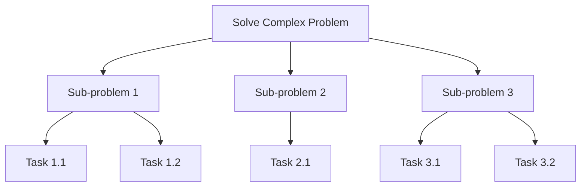

# 1. Universal Foundations

# 1. Universal Foundations

Welcome to "Universal Foundations"! This page is your starting point, designed to equip you with fundamental concepts and mindsets that are crucial for success in **any** technical field, from software development to data science, cybersecurity, and beyond.

Think of these foundations as the bedrock upon which all advanced knowledge is built. Mastering them will not only make learning new skills easier but also enable you to approach complex problems with clarity and confidence, moving you from an absolute beginner to someone ready for industry challenges.

## What Are Universal Foundations?

Universal foundations are the core, evergreen principles and approaches that transcend specific technologies or programming languages. They are about *how* we think, *how* we solve problems, and *how* we structure information, rather than specific syntax or tools.

## Core Conceptual Tools

These conceptual tools are essential for breaking down complexity and understanding systems.

### 1. Abstraction

Abstraction is the process of hiding complex details and showing only the essential features of an object or system. It allows us to manage complexity by focusing on the "what" rather than the "how."

*   **Novice Level:** Think about driving a car. You use the steering wheel and pedals without needing to understand the intricate combustion engine or braking system. The car abstracts away those complexities.
*   **Industry Standards Level:** In software, a function or API (Application Programming Interface) is an abstraction. You call `sort_list()` and trust it will sort the list, without needing to know the specific sorting algorithm implemented underneath.
*   **Why it matters:** Abstraction simplifies systems, making them easier to understand, design, and maintain.

### 2. Decomposition

Decomposition is the practice of breaking down a large, complex problem or system into smaller, more manageable sub-problems or components.

*   **Novice Level:** Building a Lego model involves following steps to assemble smaller sections before combining them into the final structure.
*   **Industry Standards Level:** When developing a large software application, you don't build it all at once. You decompose it into modules like "user authentication," "database management," and "user interface," each handled separately.
*   **Why it matters:** Decomposition makes daunting tasks approachable and allows for parallel work and clearer responsibility.

Here’s a simple illustration of decomposition:

### 3. Pattern Recognition

Pattern recognition is the ability to identify recurring structures, behaviors, or solutions within different contexts.

*   **Novice Level:** Noticing that many games have a "save" feature that works similarly, regardless of the game.
*   **Industry Standards Level:** Recognizing that a common solution for managing configuration settings in an application is to use a specific design pattern like "Singleton," or that certain types of data processing often require a "MapReduce" approach.
*   **Why it matters:** Recognizing patterns allows you to reuse proven solutions, save time, and avoid reinventing the wheel.

### 4. Algorithms

An algorithm is a finite, unambiguous set of step-by-step instructions for solving a problem or performing a computation.

*   **Novice Level:** A cooking recipe is an algorithm. You follow specific steps (mix ingredients, bake for X minutes) to achieve a desired outcome (a cake).
*   **Industry Standards Level:** Sorting a list of names, searching for an item in a database, or compressing a file all rely on specific algorithms that are optimized for efficiency.
*   **Why it matters:** Algorithms are the heart of computation. Understanding their basic principles helps you design efficient and effective solutions. Learn more: [Introduction to Algorithms](?topic=Introduction%20to%20Algorithms)

### 5. Data Structures

Data structures are specialized ways of organizing and storing data in a computer so that it can be accessed and modified efficiently.

*   **Novice Level:** A shopping list is like a simple list (or array) of items. A phone book is like a dictionary or map, where names (keys) map to phone numbers (values).
*   **Industry Standards Level:** Choosing the right data structure (e.g., using a hash table for fast lookups, or a tree for hierarchical data) can drastically impact the performance and scalability of an application.
*   **Why it matters:** Efficient data organization is fundamental to building performant and scalable systems. Learn more: [Understanding Data Structures](?topic=Understanding%20Data%20Structures)

## Problem-Solving Methodology

Beyond individual concepts, a structured approach to problem-solving is invaluable.

### 1. Understand the Problem

*   What is the goal?
*   What are the inputs and outputs?
*   What are the constraints or edge cases?
*   What defines a successful solution?

### 2. Plan the Solution

*   Break it down (decomposition).
*   Consider different approaches (algorithms, data structures).
*   Sketch out the steps, pseudo-code, or a flowchart.
*   Think about potential issues or alternative solutions.

### 3. Execute the Plan

*   Implement your solution based on the plan.
*   Write tests to verify correctness.

### 4. Review and Refine

*   Does the solution work correctly for all cases, including edge cases?
*   Is it efficient? Could it be improved?
*   Is it readable and maintainable?

This iterative process helps ensure robust and well-thought-out solutions.

## Critical Thinking and Logic

At the core of all technical work is the ability to think critically and apply logical reasoning.

*   **Logical Reasoning:** The ability to follow and construct sound arguments, identify fallacies, and infer conclusions from premises.
*   **Identifying Assumptions:** Recognizing what you are taking for granted, which can lead to unexpected issues if those assumptions are false.
*   **Evaluating Solutions:** Objectively assessing the pros and cons of different approaches based on criteria like efficiency, maintainability, and correctness.
*   **Why it matters:** Critical thinking helps you debug problems, design robust systems, and make informed decisions, transforming you from a task-follower to an innovative problem-solver.

## Learning How to Learn

The technical landscape is constantly evolving. Your ability to learn new things efficiently is perhaps the most universal and critical foundation.

*   **Active Learning:** Don't just read or watch; actively engage with the material. Experiment, build, explain it to others.
*   **Experimentation:** Try new tools, break existing things, and explore different configurations. Hands-on experience solidifies understanding.
*   **Documentation and Reflection:** Take notes, create your own summaries, and reflect on what worked, what didn't, and why. This reinforces learning and builds your personal knowledge base.
*   **Leverage Resources:** Understand how to effectively use official documentation, online tutorials, forums, and communities.
*   **Why it matters:** This meta-skill ensures you remain adaptable and continually grow your capabilities throughout your career. Learn more: [Effective Learning Strategies](?topic=Effective%20Learning%20Strategies)

## Communication

Technical expertise is amplified by clear communication, especially when working in teams or explaining your work to non-technical stakeholders.

*   **Explaining Technical Concepts:** Simplifying complex ideas for diverse audiences, tailoring your language to their understanding.
*   **Asking Good Questions:** Formulating precise questions that elicit the information you need, demonstrating an understanding of the problem space.
*   **Active Listening:** Truly understanding others' needs and feedback to avoid misunderstandings and build better solutions.
*   **Documenting Work:** Creating clear, concise documentation for your code, designs, and processes for the benefit of others (and your future self).
*   **Why it matters:** Effective communication is crucial for collaboration, project success, and career advancement.

## Key Takeaways

*   **Abstraction and Decomposition** help manage complexity by focusing on essentials and breaking down large problems.
*   **Pattern Recognition** enables you to reuse proven solutions and speed up development.
*   **Algorithms and Data Structures** are fundamental to efficient computation and data organization.
*   A structured **Problem-Solving Methodology** provides a reliable path to robust solutions.
*   **Critical Thinking and Logic** are essential for effective decision-making and debugging.
*   **Learning How to Learn** is your most powerful tool for continuous growth in an evolving field.
*   **Clear Communication** is vital for successful collaboration and translating technical work into business value.

By focusing on these universal foundations, you are building a resilient and adaptable skillset that will serve you well, no matter which specific technologies you choose to master next.