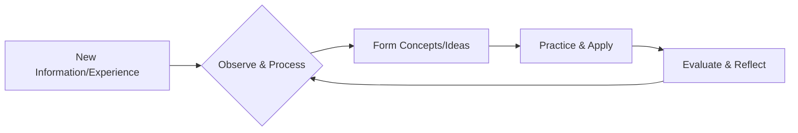

# A.1. What is Learning?

# A.1. What is Learning?

Learning is a fundamental process that allows us to acquire new knowledge, skills, behaviors, values, or preferences. It's how we grow, adapt, and make sense of the world around us. From simple reflexes to complex problem-solving, learning is essential for personal development and professional success.

## The Basics: What Does Learning Mean?

At its simplest, learning means gaining something new. This "something" can be:

*   **Knowledge:** Facts, information, understanding about a subject (e.g., knowing the capital of France).
*   **Skills:** The ability to do something well (e.g., riding a bicycle, coding a program).
*   **Behaviors:** New ways of acting or reacting (e.g., improving communication habits).
*   **Understanding:** A deeper grasp of how things work or why they happen.

Think about a child learning to tie shoelaces. They start without the skill, observe, try, fail, try again, and eventually master it. That entire process is learning.

### Why Do We Learn?

We learn for many reasons, often without even realizing it:

*   **Adaptation:** To adjust to new situations or environments.
*   **Growth:** To develop our potential and capabilities.
*   **Problem-solving:** To find solutions to challenges we face.
*   **Curiosity:** To satisfy our innate desire to explore and understand.
*   **Survival:** To avoid danger and thrive in our surroundings.

## How Learning Happens: The Process

Learning isn't always a linear path; it often involves a cycle of experience, reflection, conceptualization, and active experimentation.

The core steps generally involve:

1.  **Input/Experience:** Encountering new information or having a new experience.
2.  **Processing:** Making sense of the input, connecting it to what you already know, and forming new ideas.
3.  **Storage:** Committing the processed information or skill to memory.
4.  **Application:** Using the new knowledge or skill in a practical situation.
5.  **Feedback/Reflection:** Evaluating the outcome of your application and refining your understanding or skill.

This process is explored in more detail in [A.3. The Learning Cycle](?topic=A.3.%20The%20Learning%20Cycle).

### A Simple Learning Flow

Here's a basic model of how new information or skills are typically acquired:

*   **Example:** Learning a new software tool. You first **experience** it by seeing a demo or reading a guide. You **process** how it works. You **form concepts** about its functions. You then **practice** using it, and **reflect** on what worked and what didn't to improve next time.

Different individuals also learn best through different methods. You can learn more about this in [A.2. Learning Styles](?topic=A.2.%20Learning%20Styles).

## Learning in a Professional Context

In professional life, learning moves beyond individual acquisition to encompass continuous growth and organizational knowledge.

### Continuous Learning (Lifelong Learning)

For professionals, learning is not confined to formal education. It's a continuous journey:

*   **Upskilling:** Learning new skills to improve in your current role.
*   **Reskilling:** Learning entirely new skills to change roles or adapt to industry changes.
*   **Adapting to Change:** Staying current with new technologies, methodologies, and market demands.

*   **Example:** A software developer continuously learning new programming languages or frameworks to stay relevant in a fast-evolving tech landscape.

### Organizational Learning

Organizations also learn. This happens when groups of people share knowledge, insights, and best practices:

*   **Knowledge Sharing:** Documenting processes, conducting post-mortems, and mentoring.
*   **Innovation:** Learning from experiments and failures to create new products or services.
*   **Cultural Adaptation:** Evolving company culture based on feedback and experience.

*   **Example:** A marketing team analyzing the performance of a campaign, identifying key learnings, and applying those insights to future campaigns across the organization.

### Learning Agility and Metacognition

At the highest professional levels, two concepts become critical:

*   **Learning Agility:** The ability to quickly learn from experience, adapt to new situations, and perform effectively under new conditions. This means being comfortable with ambiguity and change.
*   **Metacognition:** "Thinking about thinking" or "learning about learning." This involves understanding your own learning processes, strengths, and weaknesses, and strategically adjusting your approach to maximize learning effectiveness.

Professionals with high learning agility and strong metacognitive skills are often leaders in their fields, able to navigate complex challenges and drive innovation.

## Key Takeaways

*   **Learning is acquiring new knowledge, skills, or behaviors.** It's how we grow and adapt.
*   **The learning process involves experience, processing, storage, application, and reflection.**
*   **In a professional context, learning is continuous and critical for career growth.** This includes upskilling and reskilling.
*   **Organizations also learn** through knowledge sharing and adapting to new insights.
*   **Learning agility and metacognition** are advanced skills that empower professionals to learn more effectively and quickly adapt to change.