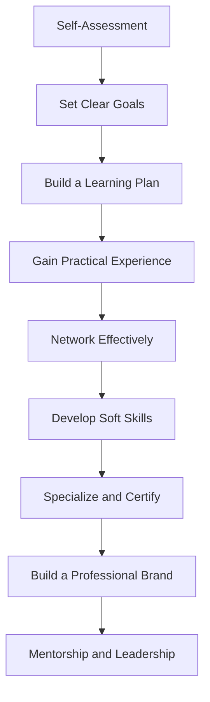

# Professional Career Development

# Professional Career Development

## Introduction
Professional career development is the process of enhancing your skills, knowledge, and experiences to advance in your chosen field. Whether you're just starting out or looking to grow, this guide will help you build a solid foundation and reach industry standards.

## Getting Started: Absolute Novice Level

### 1. **Self-Assessment**
   - **Identify Strengths and Weaknesses**: Reflect on what you’re good at and areas that need improvement.
   - **Career Interests**: Explore industries and roles that align with your passions and values.
   - **Example**: Use tools like [StrengthsFinder](https://www.gallup.com/cliftonstrengths/en/252137/strengthsfinder.aspx) or [Myers-Briggs](https://www.myersbriggs.org/).

### 2. **Set Clear Goals**
   - **Short-Term Goals**: Achievable milestones within 3-6 months (e.g., complete a certification).
   - **Long-Term Goals**: Broader objectives like landing a specific job or role in 2-5 years.
   - **Example**: "Complete a digital marketing course within 6 months to transition into a marketing role."

### 3. **Build a Learning Plan**
   - **Online Courses**: Platforms like [Coursera](https://www.coursera.org/) or [LinkedIn Learning](https://www.linkedin.com/learning/).
   - **Books and Articles**: Read industry-specific literature to gain foundational knowledge.
   - **Example**: Enroll in "Introduction to Data Analysis" on Coursera.

## Intermediate Level: Building Skills

### 1. **Gain Practical Experience**
   - **Internships**: Apply for internships to get hands-on experience.
   - **Volunteering**: Offer your skills to non-profits or startups to build a portfolio.
   - **Example**: Volunteer as a social media manager for a local charity.

### 2. **Network Effectively**
   - **Attend Events**: Join industry conferences, meetups, and webinars.
   - **Online Networking**: Engage on platforms like LinkedIn and industry forums.
   - **Example**: Attend a local tech meetup to connect with professionals.

### 3. **Develop Soft Skills**
   - **Communication**: Practice clear and concise communication.
   - **Time Management**: Learn to prioritize tasks and meet deadlines.
   - **Example**: Take a workshop on "Effective Communication in the Workplace."

## Advanced Level: Reaching Industry Standards

### 1. **Specialize and Certify**
   - **Advanced Courses**: Pursue specialized certifications (e.g., PMP, Google Analytics).
   - **Stay Updated**: Follow industry trends and updates through blogs, podcasts, and journals.
   - **Example**: Obtain a Project Management Professional (PMP) certification.

### 2. **Build a Professional Brand**
   - **Portfolio**: Showcase your work through a website or LinkedIn profile.
   - **Personal Branding**: Establish yourself as an expert in your field.
   - **Example**: Create a portfolio website highlighting your data analysis projects.

### 3. **Mentorship and Leadership**
   - **Find a Mentor**: Seek guidance from experienced professionals.
   - **Lead Projects**: Take on leadership roles to demonstrate your capabilities.
   - **Example**: Lead a cross-functional team on a high-impact project.

## Key Takeaways
- **Self-Assessment**: Understand your strengths and interests to guide your career path.
- **Goal Setting**: Define clear, achievable goals to stay focused.
- **Continuous Learning**: Invest in ongoing education and skill development.
- **Networking**: Build relationships to open doors to opportunities.
- **Specialization**: Become an expert in your field through certifications and experience.

## Related Topics
- [Effective Networking Strategies](?topic=Effective%20Networking%20Strategies)
- [Building a Professional Portfolio](?topic=Building%20a%20Professional%20Portfolio)
- [Leadership Skills for Career Growth](?topic=Leadership%20Skills%20for%20Career%20Growth)

