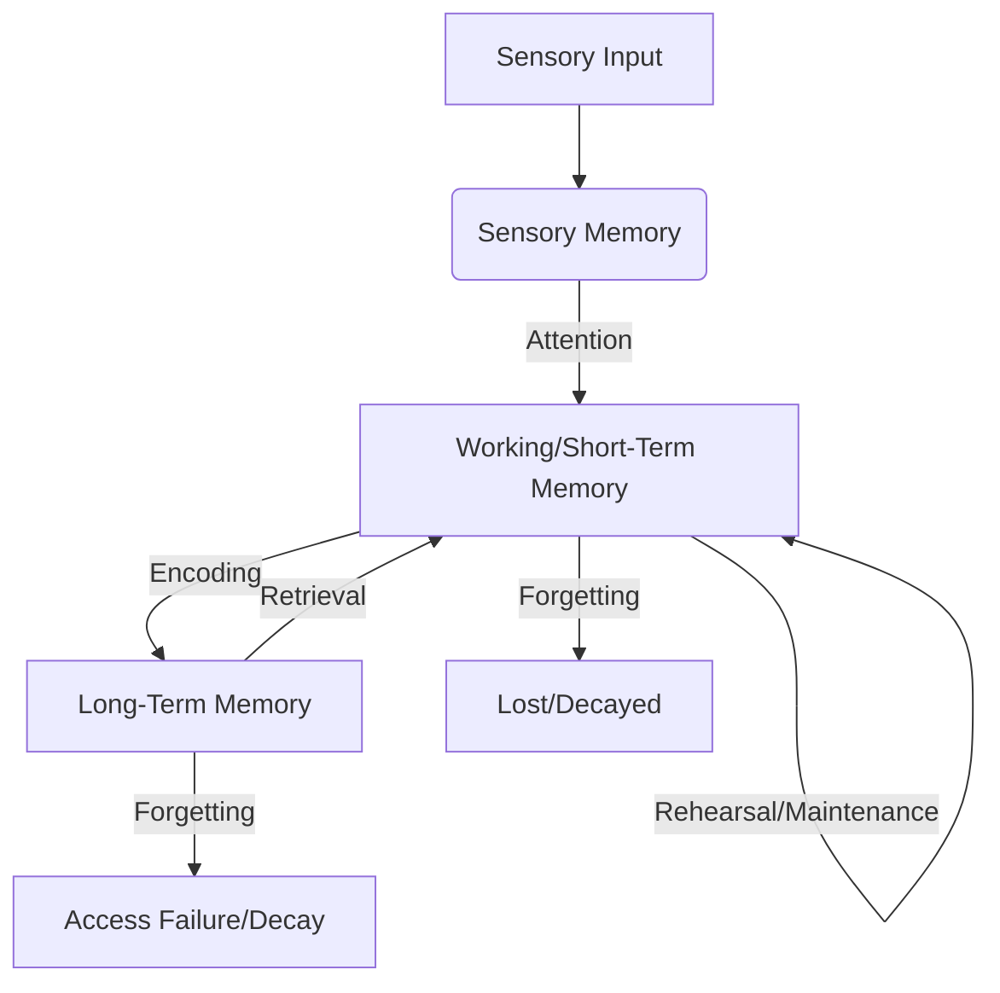

# A.3. How the Brain Acquires Knowledge

# A.3. How the Brain Acquires Knowledge

Understanding how our brain learns is fundamental to effective education, personal development, and even artificial intelligence. This page will guide you from the basic building blocks of brain function to advanced concepts of knowledge acquisition, helping you grasp the intricate mechanisms behind learning and memory.

## Absolute Novice Level: The Basics of Brain Learning

At its simplest, acquiring knowledge means **learning new things** and remembering them. Think about learning to ride a bike or remembering someone's name.

### What is Knowledge Acquisition?

Knowledge acquisition is the process by which the brain gathers, processes, stores, and later retrieves information from our experiences and environment. It's how we build our understanding of the world.

### How Do We Learn New Things?

*   **Experience:** We interact with the world through our senses (sight, sound, touch, taste, smell).
*   **Attention:** We focus on certain aspects of our experience.
*   **Repetition:** Doing or seeing something multiple times helps it stick.

### The Brain's "Building Blocks": Neurons

Your brain is made of billions of tiny cells called **neurons**. These neurons communicate with each other through electrical and chemical signals. This communication is the foundation of all brain activity, including learning. Think of them like tiny switches that can turn on or off, and connect to other switches.

## Beginner Level: From Senses to Memory

Now let's explore how information begins its journey into your brain's memory system.

### Sensory Input to Memory

Every piece of information starts as sensory input. When you see a new face, hear a new word, or feel a new texture, your sensory organs send signals to your brain. This initial input is held very briefly in **sensory memory**. If you pay attention to it, it moves to the next stage.

### Short-Term vs. Long-Term Memory

The brain has different ways to store information:

*   **Short-Term Memory (STM):** This is like your brain's temporary workspace. It holds a small amount of information for a short period (seconds to a minute) while you're actively thinking about it. For example, remembering a phone number just long enough to dial it. This is often part of what's called [Working Memory](?topic=Working%20Memory).
*   **Long-Term Memory (LTM):** This is where information is stored for much longer – hours, days, years, or even a lifetime. It has a vast capacity. When you remember your childhood home or how to speak your native language, you're accessing long-term memory.

### Synaptic Plasticity: The Foundation of Learning

Neurons connect at tiny gaps called **synapses**. When neurons communicate, signals cross these synapses. The amazing thing about synapses is their **plasticity** – they can change!

*   **Strengthening Synapses:** When two neurons repeatedly communicate, the connection between them (the synapse) gets stronger. This makes it easier for them to communicate in the future.
*   **Weakening Synapses:** If communication is rare, the synapse might weaken.

This strengthening or weakening of connections is the fundamental way your brain physically changes as you learn.

### Types of Learning

Broadly, we can categorize learning into:

*   **Explicit (Declarative) Learning:** Learning facts, events, and concepts that you can consciously recall and describe. Examples: remembering historical dates, knowing the capital of France.
*   **Implicit (Non-Declarative) Learning:** Learning skills or habits that you perform without conscious thought. Examples: riding a bicycle, typing, classical conditioning.

## Intermediate Level: Deeper Dive into Memory Processes

Let's expand on how memories are formed, maintained, and retrieved.

### Encoding, Storage, Retrieval

These are the three core processes of memory:

1.  **Encoding:** The initial process of converting sensory information into a form the brain can store. This involves attention, processing meaning, and linking new information to existing knowledge.
    *   *Example:* Reading a new word and associating its sound and meaning with its written form.
2.  **Storage:** Maintaining the encoded information in memory over time. This involves the physical changes in the brain, primarily at the synapses.
    *   *Example:* The neural changes that allow you to remember that word days or weeks later.
3.  **Retrieval:** Accessing and bringing stored information back into conscious awareness.
    *   *Example:* Recalling the definition of that word when someone asks you.

### Role of Key Brain Regions

Different parts of the brain specialize in various aspects of knowledge acquisition:

*   **Hippocampus:** Crucial for forming new explicit long-term memories. It acts like a "save button" for facts and events. Damage to the hippocampus can lead to inability to form new memories.
*   **Prefrontal Cortex:** Involved in working memory, planning, decision-making, and conscious thought. It helps you manage and manipulate information in your short-term memory.
*   **Amygdala:** Processes emotions and emotional memories. Strong emotions can enhance memory formation (e.g., remembering a traumatic event very clearly).
*   **Cerebellum:** Essential for motor learning and implicit memories, such as learning to play an instrument or coordinate movements.

### Consolidation: Making Memories Permanent

**Consolidation** is the process where unstable short-term memories are transformed into more stable long-term memories. This often involves structural changes in neurons and strengthening of synaptic connections.

*   **Sleep's Role:** Sleep is critical for consolidation. During sleep, the brain replays and reorganizes newly acquired information, transferring it from the hippocampus to other cortical areas for long-term storage.
*   **Reconsolidation:** Even established long-term memories can become temporarily unstable when retrieved. This allows them to be updated or modified before being re-stored.

### Neurotransmitters in Learning

Chemical messengers called **neurotransmitters** play vital roles:

*   **Glutamate:** The primary excitatory neurotransmitter, crucial for strengthening synaptic connections (LTP) and memory formation.
*   **Acetylcholine:** Important for attention, arousal, and memory consolidation, particularly in the hippocampus.
*   **Dopamine:** Involved in reward, motivation, and reinforcing learning. When learning is rewarding, dopamine helps solidify the memory.

## Advanced Level: Mechanisms and Theories

Now we delve into the cellular and theoretical underpinnings of how the brain learns.

### Hebbian Learning: "Neurons That Fire Together, Wire Together"

Coined by Donald Hebb, this principle states that if neuron A repeatedly excites neuron B, the connection between them becomes stronger. This is the cornerstone of synaptic plasticity and the neural basis for associative learning. It explains how connections are strengthened through simultaneous activity.

### Long-Term Potentiation (LTP) and Depression (LTD)

These are the cellular mechanisms underlying Hebbian learning:

*   **Long-Term Potentiation (LTP):** A persistent strengthening of synapses based on recent patterns of activity. It's considered a primary cellular mechanism for learning and memory storage. It makes subsequent signals more effective.
*   **Long-Term Depression (LTD):** A persistent weakening of synapses. This is equally important for learning, allowing the brain to prune unnecessary connections and "forget" irrelevant information, making space for new learning.

### Neural Networks and Pattern Recognition

The brain doesn't just store isolated facts; it forms vast **neural networks**. These networks allow for:

*   **Pattern Recognition:** Identifying recurring features or structures in sensory input (e.g., recognizing faces, understanding speech).
*   **Generalization:** Applying learned rules or concepts to new, similar situations.
*   **Association:** Linking different pieces of information together (e.g., seeing a dog and associating it with "bark," "fur," "pet").
This is a complex topic, further explored in [Neural Networks](?topic=Neural%20Networks).

### Cognitive Load Theory

This theory suggests that our working memory has a limited capacity. Learning is most effective when the cognitive load (the amount of mental effort required) is managed appropriately.

*   **Intrinsic Load:** Inherent difficulty of the material itself.
*   **Extraneous Load:** Unnecessary mental effort caused by poor instructional design.
*   **Germane Load:** Mental effort contributing directly to learning and schema construction.

Effective knowledge acquisition minimizes extraneous load and optimizes intrinsic and germane loads.

### Metacognition: Learning About Learning

**Metacognition** is "cognition about cognition" – thinking about your own thinking. It involves:

*   **Monitoring:** Assessing your understanding and progress.
*   **Regulating:** Adjusting your learning strategies based on your monitoring.

Developing metacognitive skills is crucial for becoming an efficient and lifelong learner.

## Industry Standards Level: Applying Knowledge Acquisition Principles

At this level, we apply our understanding of brain function to optimize learning and memory in real-world contexts.

### Applying Principles of Brain-Based Learning

*   **Spaced Repetition:** Instead of cramming, review information at increasing intervals. This leverages consolidation and strengthens memories over time.
*   **Active Recall:** Test yourself frequently without looking at notes. This strengthens retrieval pathways, rather than just re-exposure.
*   **Interleaving:** Mix different subjects or topics during study sessions. This improves discrimination between concepts and promotes flexible retrieval.
*   **Elaboration:** Connect new information to what you already know, create analogies, and explain concepts in your own words. This deepens encoding and builds robust neural networks.
*   **Minimize Cognitive Load:** Design learning materials clearly, break down complex tasks, and avoid distractions to optimize working memory use.
*   **Embrace Sleep:** Prioritize good sleep hygiene, as it's essential for memory consolidation and cognitive function.
*   **Physical Activity:** Regular exercise boosts brain health, neurogenesis (creation of new neurons), and cognitive function, supporting learning.

### Challenges and Future Directions

*   **Individual Differences:** Brains acquire knowledge differently based on genetics, prior experience, and cognitive styles. Personalizing learning is a key challenge.
*   **Neurodegenerative Diseases:** Understanding how the brain acquires knowledge helps us understand what goes wrong in conditions like Alzheimer's disease, offering avenues for research into prevention and treatment.
*   **AI and Machine Learning:** Human brain learning inspires advanced AI models like deep neural networks, which can learn patterns and acquire "knowledge" from data. Comparing biological and artificial learning provides mutual insights.
*   **Enhancing Learning:** Research continues into pharmacological and non-pharmacological methods to enhance cognitive function and memory, raising ethical considerations.

### Ethical Considerations

As we understand more about how the brain acquires knowledge, ethical questions arise:

*   Should we use drugs or technologies to enhance memory or learning?
*   How do we ensure equitable access to effective learning strategies or technologies?
*   What are the implications of AI that "learns" like a human brain?

## Key Takeaways

*   Knowledge acquisition is the process of encoding, storing, and retrieving information.
*   **Neurons** and their connections (synapses) are the fundamental units of learning.
*   **Synaptic plasticity** (strengthening or weakening of synapses) is the physical basis of memory.
*   **Short-term memory** is temporary workspace; **long-term memory** is for lasting storage.
*   Key brain regions like the **hippocampus** and **prefrontal cortex** play specific roles.
*   **Consolidation**, especially during sleep, transforms temporary memories into lasting ones.
*   **Hebbian learning**, **LTP**, and **LTD** describe how synapses change at a cellular level.
*   Effective learning strategies leverage principles like **spaced repetition**, **active recall**, and **metacognition**.
*   Understanding brain learning informs education, AI, and medical research.

## Related KnowHub Pages

*   [Neurons](?topic=Neurons)
*   [Memory](?topic=Memory)
*   [Working Memory](?topic=Working%20Memory)
*   [Neural Networks](?topic=Neural%20Networks)
*   [Neurotransmitters](?topic=Neurotransmitters)
*   [Neuroplasticity](?topic=Neuroplasticity)