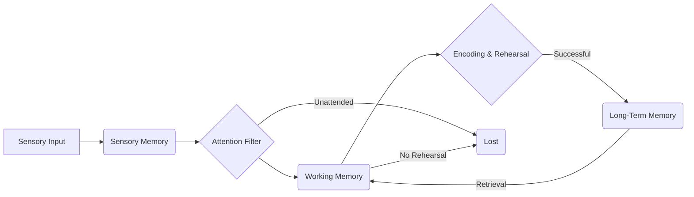

# 1.1.1. Learning Science & Cognition

# 1.1.1. Learning Science & Cognition

Learning isn't just about memorizing facts; it's a complex process involving how our brains perceive, process, store, and retrieve information. Understanding Learning Science and Cognition gives you powerful tools to learn more effectively and design better learning experiences for others.

## What is Learning Science & Cognition?

**Learning Science** is an interdisciplinary field that studies how people learn. It draws on psychology, education, computer science, and neuroscience to discover evidence-based principles for effective learning and teaching.

**Cognition** refers to the mental processes involved in acquiring knowledge and understanding. This includes thinking, knowing, remembering, judging, and problem-solving.

Together, they help us understand the "why" and "how" behind successful learning.

## Beginner: The Basics of How We Think & Remember

At its core, learning is about changing our brains. Let's look at the fundamental components of cognition.

### Your Brain's Information Flow

Imagine your brain as an information processor. It takes in sensory input, processes it, and stores what's important.

#### 1. Attention
Before you can learn anything, you need to pay attention. Your attention is limited, like a spotlight. What you focus on determines what gets processed further.
*   **Example:** You can't effectively listen to a lecture and simultaneously scroll social media.

#### 2. Memory Systems
We have different types of memory working together:

*   **Sensory Memory:** Very brief, holds raw sensory information (e.g., what you just saw or heard) for a fraction of a second. Most of it is immediately lost.
*   **Working Memory (Short-Term Memory):** This is your mental workspace. It holds a small amount of information (around 4-7 items) for a short period (about 15-30 seconds) while you're actively thinking about it.
*   **Long-Term Memory:** The vast storage where information is kept indefinitely. For learning to be effective, information needs to move from working memory into long-term memory.

Here's a simplified view of information flow:

#### 3. Basic Learning Principles

To move information into long-term memory, these techniques are crucial:

*   **Active Recall:** Retrieving information from your memory, rather than just rereading it.
    *   **Example:** Instead of re-reading a chapter, try to explain the main points out loud or answer practice questions. See: [Active Recall](?topic=Active%20Recall)
*   **Spaced Repetition:** Reviewing information at increasing intervals over time.
    *   **Example:** Don't cram! Review today, then in 3 days, then a week, then a month. See: [Spaced Repetition](?topic=Spaced%20Repetition)
*   **Elaboration:** Connecting new information to what you already know, forming deeper meanings.
    *   **Example:** When learning a new concept, think about how it relates to something similar you already understand, or how you might apply it in real life.

## Intermediate: Deeper Insights into Learning Efficiency

As you progress, you'll want to understand *how* to optimize these processes and avoid common pitfalls.

### 1. Metacognition: Thinking About Your Thinking

Metacognition is your awareness and understanding of your own thought processes. It's about monitoring and controlling your learning.
*   **Example:** Realizing that a particular study method isn't working for you and adjusting your approach. Asking yourself: "Do I really understand this, or am I just familiar with it?" See: [Metacognition](?topic=Metacognition)

### 2. Cognitive Load Theory

This theory suggests that our working memory has a limited capacity (the "load" it can handle). Too much load hinders learning. There are three types of cognitive load:

*   **Intrinsic Load:** The inherent difficulty of the material itself (e.g., learning complex calculus vs. simple addition).
*   **Extraneous Load:** Unnecessary load imposed by poorly designed instruction or distractions (e.g., confusing slides, irrelevant animations).
*   **Germane Load:** The "good" load, involved in actively processing and constructing schemas in long-term memory (e.g., making connections, problem-solving).

**Goal:** Reduce extraneous load and manage intrinsic load to maximize germane load. See: [Cognitive Load Theory](?topic=Cognitive%20Load%20Theory)

### 3. Desirable Difficulties

Counter-intuitively, making learning slightly harder can lead to better long-term retention. These are "difficulties" that, while slowing down initial learning, improve memory and transfer.
*   **Example:** Using active recall (which feels harder than rereading) or interleaving (mixing different subjects, which feels less efficient than massing practice).

### 4. Growth Mindset

Developed by Carol Dweck, this concept differentiates between:
*   **Fixed Mindset:** Believing your intelligence and abilities are fixed traits. Leads to avoiding challenges.
*   **Growth Mindset:** Believing your abilities can be developed through dedication and hard work. Leads to embracing challenges and learning from failures.
*   **Impact:** A growth mindset significantly impacts your persistence and ultimate success in learning. See: [Growth Mindset](?topic=Growth%20Mindset)

## Professional: Applying Learning Science to Design & Evaluate

At this level, you're not just a learner; you're often designing learning experiences for yourself or others. You use these principles systematically.

### 1. Instructional Design Principles

These are practical guidelines derived from learning science to create effective learning materials:

*   **Multimedia Principle:** Use words and relevant pictures rather than words alone.
*   **Coherence Principle:** Avoid extraneous words, pictures, and sounds.
*   **Redundancy Principle:** Don't present the same information in multiple formats if one is sufficient (e.g., don't read text aloud that's already on the screen).
*   **Signaling Principle:** Highlight essential material (e.g., bolding, arrows).
*   **Personalization Principle:** Use conversational tone and virtual coaches (rather than formal).

### 2. Formative vs. Summative Assessment

*   **Formative Assessment:** Assessments *for* learning. They provide feedback to guide ongoing learning and instruction, often using principles like active recall.
    *   **Example:** Quizzes throughout a course, peer reviews, quick checks for understanding.
*   **Summative Assessment:** Assessments *of* learning. They evaluate overall learning at the end of a unit or course.
    *   **Example:** Final exams, major projects.
Understanding their cognitive impact helps design better evaluation strategies.

### 3. Neuroscience and Individual Differences

*   **Brief Neuroscience:** Learning involves changes in brain structure and function, particularly at synapses (connections between neurons). Repeated activation strengthens these connections (long-term potentiation).
*   **Individual Differences:** While "learning styles" (e.g., visual, auditory, kinesthetic) lack strong scientific evidence, recognizing differences in prior knowledge, motivation, and cognitive abilities is crucial. Effective design accounts for these without pigeonholing learners into ineffective "styles."

### 4. Measuring Learning Effectiveness

Professionals apply learning science to develop robust evaluation methods, using data to:
*   Identify which learning strategies are most effective.
*   Measure knowledge retention and transfer to real-world tasks.
*   Continuously improve learning programs based on evidence.

## Key Takeaways

*   **Learning is active, not passive:** Your brain must actively process information to move it to long-term memory.
*   **Attention and Working Memory are limited:** Design your learning environment and materials to respect these limitations.
*   **Retrieval is key to retention:** Practice recalling information frequently and at spaced intervals.
*   **Meaningful connections matter:** Elaboration helps integrate new knowledge with existing understanding.
*   **Struggle can be good:** Desirable difficulties strengthen learning and memory.
*   **Understand your own learning:** Metacognition empowers you to be a more effective learner.
*   **Design for the brain:** Apply principles like Cognitive Load Theory and multimedia design to create effective learning experiences for yourself and others.
*   **Embrace a Growth Mindset:** Your abilities are not fixed; consistent effort leads to growth and mastery.